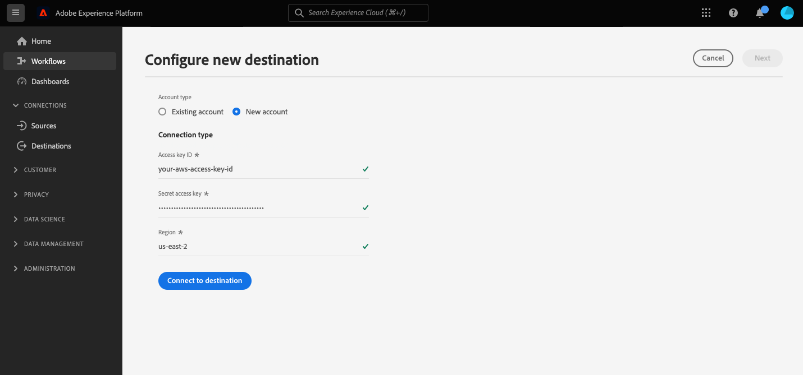

# Connessione [!DNL Amazon Kinesis]

## Panoramica {#overview}

>[!IMPORTANT]
>
> Questa destinazione è disponibile solo per [Adobe Real-time Customer Data Platform Ultimate](https://helpx.adobe.com/it/legal/product-descriptions/real-time-customer-data-platform.html) clienti.

Il [!DNL Kinesis Data Streams] servizio di [!DNL Amazon Web Services] consente di raccogliere ed elaborare in tempo reale flussi di dati di grandi dimensioni.

Puoi creare una connessione in uscita in tempo reale al tuo [!DNL Amazon Kinesis] archiviazione per lo streaming dei dati da Adobe Experience Platform.

* Per ulteriori informazioni su [!DNL Amazon Kinesis], vedere [Documentazione di Amazon](https://docs.aws.amazon.com/streams/latest/dev/introduction.html).
* Per connettersi a [!DNL Amazon Kinesis] a livello di programmazione, vedere [Tutorial sull’API per Streaming Destinations](../../api/streaming-destinations.md).
* Per connettersi a [!DNL Amazon Kinesis] utilizzando l’interfaccia utente di Platform, consulta le sezioni seguenti.


## Casi d’uso {#use-cases}

Utilizzando destinazioni di streaming come [!DNL Amazon Kinesis], puoi inserire facilmente eventi di segmentazione di alto valore e attributi di profilo associati nei sistemi preferiti.

Ad esempio, un potenziale cliente ha scaricato un white paper che li qualifica come segmenti ad &quot;alta propensione alla conversione&quot;. Mediante la mappatura del pubblico in cui rientra il potenziale cliente su [!DNL Amazon Kinesis] destinazione, riceverai questo evento in [!DNL Amazon Kinesis]. In questo caso, è possibile utilizzare un approccio fai-da-te e descrivere la logica di business oltre all&#39;evento, in base al principio che si potrebbe utilizzare al meglio con i sistemi IT aziendali.

## Tipi di pubblico supportati {#supported-audiences}

Questa sezione descrive il tipo di pubblico che puoi esportare in questa destinazione.

| Origine pubblico | Supportati | Descrizione |
---------|----------|----------|
| [!DNL Segmentation Service] | ✓ | Tipi di pubblico generati dall’Experience Platform [Servizio di segmentazione](../../../segmentation/home.md). |
| Caricamenti personalizzati | ✓ | Tipi di pubblico [importato](../../../segmentation/ui/overview.md#import-audience) in Experienci Platform da file CSV. |

{style="table-layout:auto"}

## Tipo e frequenza di esportazione {#export-type-frequency}

Per informazioni sul tipo e sulla frequenza di esportazione della destinazione, consulta la tabella seguente.

| Elemento | Tipo | Note |
---------|----------|---------|
| Tipo di esportazione | **[!UICONTROL Basato su profilo]** | Stai esportando tutti i membri di un segmento, insieme ai campi dello schema desiderati (ad esempio: indirizzo e-mail, numero di telefono, cognome), come scelto nella schermata seleziona attributi profilo del [flusso di lavoro di attivazione della destinazione](../../ui/activate-batch-profile-destinations.md#select-attributes). |
| Frequenza di esportazione | **[!UICONTROL Streaming]** | Le destinazioni di streaming sono connessioni &quot;sempre attive&quot; basate su API. Non appena un profilo viene aggiornato in Experienci Platform in base alla valutazione del pubblico, il connettore invia l’aggiornamento a valle alla piattaforma di destinazione. Ulteriori informazioni su [destinazioni di streaming](/help/destinations/destination-types.md#streaming-destinations). |

{style="table-layout:auto"}

## Indirizzo IP inserito nell&#39;elenco Consentiti {#ip-address-allowlist}

Per soddisfare i requisiti di sicurezza e conformità dei clienti, Experienci Platform fornisce un elenco di IP statici che è possibile inserire nell&#39;elenco Consentiti per l interfaccia [!DNL Amazon Kinesis] destinazione. Fai riferimento a [ELENCO CONSENTITI di indirizzo IP per destinazioni di streaming](/help/destinations/catalog/streaming/ip-address-allow-list.md) inserire nell&#39;elenco Consentiti per l’elenco completo degli IP da.

## Obbligatorio [!DNL Amazon Kinesis] autorizzazioni {#required-kinesis-permission}

Per connettere ed esportare correttamente i dati nel [!DNL Amazon Kinesis] Streams, Experienci Platform necessita delle autorizzazioni per le azioni seguenti:

* `kinesis:ListStreams`
* `kinesis:PutRecord`
* `kinesis:PutRecords`

Queste autorizzazioni sono organizzate tramite [!DNL Kinesis] e sono controllati da Platform dopo che hai configurato la destinazione Kinesis nell’interfaccia utente di Platform.

L’esempio seguente mostra i diritti di accesso minimi necessari per esportare correttamente i dati in una [!DNL Kinesis] destinazione.

```json
{
    "Version": "2012-10-17",
    "Statement": [
        {
            "Effect": "Allow",
            "Action": [
                "kinesis:ListStreams",
                "kinesis:PutRecord",
                "kinesis:PutRecords"
            ],
            "Resource": [
                "arn:aws:kinesis:us-east-2:901341027596:stream/*"
            ]
        }
    ]
}
```

| Proprietà | Descrizione |
| -------- | ----------- |
| `kinesis:ListStreams` | Azione che elenca i flussi di dati di Amazon Kinesis. |
| `kinesis:PutRecord` | Azione che scrive un singolo record di dati in un flusso di dati Kinesis. |
| `kinesis:PutRecords` | Azione che scrive più record di dati in un flusso di dati Kinesis in una singola chiamata. |

{style="table-layout:auto"}

Per ulteriori informazioni sul controllo dell&#39;accesso per [!DNL Kinesis] flussi di dati, leggi quanto segue [[!DNL Kinesis] documento](https://docs.aws.amazon.com/streams/latest/dev/controlling-access.html).

## Connettersi alla destinazione {#connect}

>[!IMPORTANT]
> 
>Per connettersi alla destinazione, è necessario **[!UICONTROL Gestire le destinazioni]** [autorizzazione per il controllo degli accessi](/help/access-control/home.md#permissions). Leggi le [panoramica sul controllo degli accessi](/help/access-control/ui/overview.md) oppure contatta l’amministratore del prodotto per ottenere le autorizzazioni necessarie.

Per connettersi a questa destinazione, seguire i passaggi descritti in [esercitazione sulla configurazione della destinazione](../../ui/connect-destination.md). Quando ti connetti a questa destinazione, devi fornire le seguenti informazioni:

### Informazioni di autenticazione {#authentication-information}

Inserisci i campi qui sotto e seleziona **[!UICONTROL Connetti alla destinazione]**:



* **[!DNL Amazon Web Services]chiave di accesso e chiave segreta**: In [!DNL Amazon Web Services], genera un `access key - secret access key` coppia per concedere a Platform l’accesso al tuo [!DNL Amazon Kinesis] account. Per ulteriori informazioni, consulta [Documentazione di Amazon Web Services](https://docs.aws.amazon.com/IAM/latest/UserGuide/id_credentials_access-keys.html).
* **[!UICONTROL Regione]**: indica quale [!DNL Amazon Web Services] area a cui inviare i dati.

### Inserire i dettagli della destinazione {#destination-details}

>[!CONTEXTUALHELP]
>id="platform_destinations_connect_kinesis_includesegmentnames"
>title="Includi nomi dei segmenti"
>abstract="Attiva o disattiva questa opzione se desideri che l’esportazione dei dati includa i nomi dei tipi di pubblico che stai esportando. Consulta la documentazione per vedere un esempio di esportazione dei dati con questa opzione selezionata."

>[!CONTEXTUALHELP]
>id="platform_destinations_connect_kinesis_includesegmenttimestamps"
>title="Includi timestamp dei segmenti"
>abstract="Attiva o disattiva questa opzione se desideri che l’esportazione dei dati includa il timestamp UNIX al momento della creazione e dell’aggiornamento dei tipi di pubblico, nonché il timestamp UNIX al momento della mappatura dei tipi di pubblico sulla destinazione per l’attivazione. Consulta la documentazione per vedere un esempio di esportazione dei dati con questa opzione selezionata."

Per configurare i dettagli per la destinazione, compila i campi obbligatori e facoltativi seguenti. Un asterisco accanto a un campo nell’interfaccia utente indica che il campo è obbligatorio.


* **[!UICONTROL Nome]**: specifica un nome per la connessione a [!DNL Amazon Kinesis]
* **[!UICONTROL Descrizione]**: fornisci una descrizione della connessione a [!DNL Amazon Kinesis].
* **[!UICONTROL Flusso]**: fornisci il nome di un flusso di dati esistente nel [!DNL Amazon Kinesis] account. Platform esporterà i dati in questo flusso.
* **[!UICONTROL Includi nomi segmento]**: attiva questa opzione se desideri che l’esportazione dei dati includa i nomi dei tipi di pubblico che stai esportando. Per un esempio di esportazione di dati con questa opzione selezionata, fai riferimento al [Dati esportati](#exported-data) più avanti.
* **[!UICONTROL Includi marche temporali segmento]**: attiva questa opzione se desideri che l’esportazione dei dati includa la marca temporale UNIX di quando i tipi di pubblico sono stati creati e aggiornati, nonché la marca temporale UNIX di quando i tipi di pubblico sono stati mappati sulla destinazione per l’attivazione. Per un esempio di esportazione di dati con questa opzione selezionata, fai riferimento al [Dati esportati](#exported-data) più avanti.

<!--

>[!IMPORTANT]
>
>Platform needs `write` permissions on the bucket object where the export files will be delivered.

-->

### Abilita avvisi {#enable-alerts}

Puoi abilitare gli avvisi per ricevere notifiche sullo stato del flusso di dati verso la tua destinazione. Seleziona un avviso dall’elenco per abbonarti e ricevere notifiche sullo stato del flusso di dati. Per ulteriori informazioni sugli avvisi, consulta la guida su [abbonamento agli avvisi sulle destinazioni tramite l’interfaccia utente](../../ui/alerts.md).

Una volta completate le informazioni sulla connessione di destinazione, seleziona **[!UICONTROL Successivo]**.

## Attivare tipi di pubblico in questa destinazione {#activate}

>[!IMPORTANT]
> 
>* Per attivare i dati, è necessario **[!UICONTROL Gestire le destinazioni]**, **[!UICONTROL Attivare le destinazioni]**, **[!UICONTROL Visualizza profili]**, e **[!UICONTROL Visualizzare segmenti]** [autorizzazioni di controllo degli accessi](/help/access-control/home.md#permissions). Leggi le [panoramica sul controllo degli accessi](/help/access-control/ui/overview.md) oppure contatta l’amministratore del prodotto per ottenere le autorizzazioni necessarie.
>* [Valutazione dei criteri di consenso](/help/data-governance/enforcement/auto-enforcement.md#consent-policy-evaluation) non è attualmente supportato nelle esportazioni nella destinazione Amazon Kinesis. [Ulteriori informazioni](/help/destinations/ui/activate-streaming-profile-destinations.md#consent-policy-evaluation).

Consulta [Attivare i dati del pubblico nelle destinazioni di esportazione del profilo di streaming](../../ui/activate-streaming-profile-destinations.md) per istruzioni sull’attivazione dei tipi di pubblico in questa destinazione.

## Comportamento di esportazione del profilo {#profile-export-behavior}

Experience Platform ottimizza il comportamento di esportazione del profilo in [!DNL Amazon Kinesis] destinazione, per esportare i dati nella destinazione solo quando si sono verificati aggiornamenti rilevanti di un profilo in seguito alla qualifica di un pubblico o altri eventi significativi. I profili vengono esportati nella destinazione nelle seguenti situazioni:

* L’aggiornamento del profilo è stato determinato da una modifica nell’appartenenza al pubblico per almeno uno dei tipi di pubblico mappati alla destinazione. Ad esempio, il profilo è idoneo per uno dei tipi di pubblico mappati sulla destinazione o è uscito da uno dei tipi di pubblico mappati sulla destinazione.
* L’aggiornamento del profilo è stato determinato da una modifica nella [mappa identità](/help/xdm/field-groups/profile/identitymap.md). Ad esempio, a un profilo che si era già qualificato per uno dei tipi di pubblico mappati sulla destinazione è stata aggiunta una nuova identità nell’attributo identity map.
* L’aggiornamento del profilo è stato determinato da una modifica degli attributi per almeno uno degli attributi mappati alla destinazione. Ad esempio, uno degli attributi mappati sulla destinazione nel passaggio di mappatura viene aggiunto a un profilo.

In tutti i casi descritti sopra, solo i profili in cui si sono verificati aggiornamenti rilevanti vengono esportati nella destinazione. Ad esempio, se un pubblico mappato al flusso di destinazione ha un centinaio di membri e cinque nuovi profili sono idonei per il segmento, l’esportazione nella destinazione è incrementale e include solo i cinque nuovi profili.

Tieni presente che tutti gli attributi mappati vengono esportati per un profilo, indipendentemente da dove si trovano le modifiche. Quindi, nell’esempio precedente, tutti gli attributi mappati per questi cinque nuovi profili verranno esportati anche se gli attributi stessi non sono stati modificati.

### Che cosa determina un’esportazione di dati e cosa è incluso nell’esportazione {#what-determines-export-what-is-included}

Per quanto riguarda i dati esportati per un determinato profilo, è importante comprendere i due diversi concetti di *cosa determina un’esportazione di dati nel [!DNL Amazon Kinesis] destinazione* e *quali dati sono inclusi nell’esportazione*.

| Cosa determina un’esportazione di destinazione | Cosa è incluso nell’esportazione di destinazione |
|---------|----------|
| <ul><li>Gli attributi e i tipi di pubblico mappati fungono da spunto per un’esportazione di destinazione. Ciò significa che se un pubblico mappato cambia stato (da `null` a `realized` o da `realized` a `exiting`) o se vengono aggiornati eventuali attributi mappati, viene avviata un’esportazione di destinazione.</li><li>Poiché al momento non è possibile mappare le identità su [!DNL Amazon Kinesis] le destinazioni, le modifiche di qualsiasi identità su un determinato profilo determinano anche le esportazioni di destinazione.</li><li>Per modifica di un attributo si intende qualsiasi aggiornamento dell&#39;attributo, indipendentemente dal fatto che si tratti o meno dello stesso valore. Ciò significa che una sovrascrittura su un attributo è considerata una modifica anche se il valore stesso non è cambiato.</li></ul> | <ul><li>Il `segmentMembership` L’oggetto include il pubblico mappato nel flusso di dati di attivazione, per il quale lo stato del profilo è cambiato a seguito di un evento di qualificazione o uscita dal pubblico. Tieni presente che altri tipi di pubblico non mappati per i quali il profilo si è qualificato possono far parte dell’esportazione di destinazione, se tali tipi di pubblico appartengono allo stesso [criterio di unione](/help/profile/merge-policies/overview.md) come il pubblico mappato nel flusso di dati di attivazione. </li><li>Tutte le identità in `identityMap` sono inclusi anche gli oggetti (l&#39;Experience Platform attualmente non supporta la mappatura delle identità [!DNL Amazon Kinesis] destinazione).</li><li>Nell’esportazione della destinazione sono inclusi solo gli attributi mappati.</li></ul> |

{style="table-layout:fixed"}

Ad esempio, considera questo flusso di dati come un [!DNL Amazon Kinesis] destinazione in cui tre tipi di pubblico sono selezionati nel flusso di dati e quattro attributi sono mappati alla destinazione.


Un’esportazione di profilo verso la destinazione può essere determinata da un profilo idoneo o in uscita da uno dei *tre segmenti mappati*. Tuttavia, nell’esportazione dei dati, nella `segmentMembership` oggetto (vedere [Dati esportati](#exported-data) sezione seguente), potrebbero essere visualizzati altri tipi di pubblico non mappati, se quel particolare profilo è un membro di essi e se questi condividono lo stesso criterio di unione del pubblico che ha attivato l’esportazione. Se un profilo è idoneo per **Cliente con auto DeLorean** ma è anche membro del gruppo **Guarda &quot;Ritorno al futuro&quot;** film e **Fantascienza** tipi di pubblico, allora anche questi altri due tipi di pubblico saranno presenti nel `segmentMembership` oggetto dell’esportazione di dati, anche se non sono mappati nel flusso di dati, se condividono lo stesso criterio di unione con **Cliente con auto DeLorean** segmento.

Dal punto di vista degli attributi di profilo, eventuali modifiche ai quattro attributi mappati in precedenza determineranno un’esportazione di destinazione e uno qualsiasi dei quattro attributi mappati presenti nel profilo sarà presente nell’esportazione di dati.

## Recupero dati storici {#historical-data-backfill}

Quando aggiungi un nuovo pubblico a una destinazione esistente o quando crei una nuova destinazione e mappi i tipi di pubblico a essa, Experienci Platform esporta i dati storici di qualificazione del pubblico nella destinazione. Profili qualificati per il pubblico *prima di* il pubblico aggiunto alla destinazione viene esportato nella destinazione entro circa un&#39;ora.

## Dati esportati {#exported-data}

Il tuo esportato [!DNL Experience Platform] i dati vengono inseriti nel [!DNL Amazon Kinesis] destinazione in formato JSON. Ad esempio, l’esportazione seguente contiene un profilo idoneo per un determinato segmento, è membro di altri due segmenti ed è uscito da un altro segmento. L’esportazione include anche l’attributo del profilo nome, cognome, data di nascita e indirizzo e-mail personale. Le identità per questo profilo sono ECID e e-mail.

```json
{
  "person": {
    "birthDate": "YYYY-MM-DD",
    "name": {
      "firstName": "John",
      "lastName": "Doe"
    }
  },
  "personalEmail": {
    "address": "john.doe@acme.com"
  },
  "segmentMembership": {
   "ups":{
      "7841ba61-23c1-4bb3-a495-00d3g5fe1e93":{
         "lastQualificationTime":"2022-01-11T21:24:39Z",
         "status":"exited"
      },
      "59bd2fkd-3c48-4b18-bf56-4f5c5e6967ae":{
         "lastQualificationTime":"2022-01-02T23:37:33Z",
         "status":"realized"
      },
      "947c1c46-008d-40b0-92ec-3af86eaf41c1":{
         "lastQualificationTime":"2021-08-25T23:37:33Z",
         "status":"realized"
      },
      "5114d758-ce71-43ba-b53e-e2a91d67b67f":{
         "lastQualificationTime":"2022-01-11T23:37:33Z",
         "status":"realized"
      }
   }
},
  "identityMap": {
    "ecid": [
      {
        "id": "14575006536349286404619648085736425115"
      },
      {
        "id": "66478888669296734530114754794777368480"
      }
    ],
    "email_lc_sha256": [
      {
        "id": "655332b5fa2aea4498bf7a290cff017cb4"
      },
      {
        "id": "66baf76ef9de8b42df8903f00e0e3dc0b7"
      }
    ]
  }
}
```

Di seguito sono riportati ulteriori esempi di dati esportati, a seconda delle impostazioni dell’interfaccia utente selezionate nel flusso di destinazione della connessione per **[!UICONTROL Includi nomi segmento]** e **[!UICONTROL Includi marche temporali segmento]** opzioni:

+++ L’esempio di esportazione dei dati riportato di seguito include i nomi dei tipi di pubblico nel `segmentMembership` sezione

```json
"segmentMembership": {
        "ups": {
          "5b998cb9-9488-4ec3-8d95-fa8338ced490": {
            "lastQualificationTime": "2019-04-15T02:41:50+0000",
            "status": "realized",
            "createdAt": 1648553325000,
            "updatedAt": 1648553330000,
            "mappingCreatedAt": 1649856570000,
            "mappingUpdatedAt": 1649856570000,
            "name": "First name equals John"
          }
        }
      }
```

+++

+++ L’esempio di esportazione dei dati seguente include i timestamp del pubblico in `segmentMembership` sezione

```json
"segmentMembership": {
        "ups": {
          "5b998cb9-9488-4ec3-8d95-fa8338ced490": {
            "lastQualificationTime": "2019-04-15T02:41:50+0000",
            "status": "realized",
            "createdAt": 1648553325000,
            "updatedAt": 1648553330000,
            "mappingCreatedAt": 1649856570000,
            "mappingUpdatedAt": 1649856570000,
          }
        }
      }
```

+++

## Limiti e criteri per nuovi tentativi {#limits-retry-policy}

Nel 95% del tempo, Experienci Platform tenta di offrire una latenza di velocità effettiva inferiore a 10 minuti per i messaggi inviati correttamente con una frequenza inferiore a 10.000 richieste al secondo per ogni flusso di dati a una destinazione HTTP.

In caso di richieste non riuscite alla destinazione API HTTP, Experienci Platform memorizza le richieste non riuscite e tenta di inviarle all’endpoint due volte.

>[!MORELIKETHIS]
>
>* [Connessione ad Amazon Kinesis e attivazione dei dati tramite l’API del servizio Flusso](../../api/streaming-destinations.md)
>* [Destinazione di Azure Event Hubs](./azure-event-hubs.md)
>* [Tipi e categorie di destinazione](../../destination-types.md)
