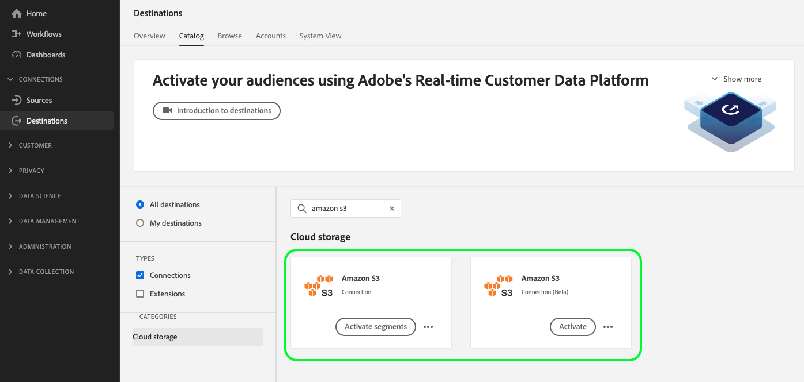

# [!DNL Amazon S3] connessione {#s3-connection}

## Registro modifiche destinazione {#changelog}

>[!IMPORTANT]
>
>Con la versione beta della funzionalità di esportazione dei set di dati e la migliorata funzionalità di esportazione dei file, ora potresti vedere due [!DNL Amazon S3] nel catalogo delle destinazioni.
>* Se si stanno già esportando file in **[!UICONTROL Amazon S3]** destinazione, crea nuovi flussi di dati per il nuovo **[!UICONTROL Amazon S3 beta]** destinazione.
>* Se non hai ancora creato flussi di dati per **[!UICONTROL Amazon S3]** destinazione, utilizza il nuovo **[!UICONTROL Amazon S3 beta]** scheda in cui esportare i file **[!UICONTROL Amazon S3]**.

Miglioramenti nel nuovo [!DNL Amazon S3] la scheda di destinazione include:

* [Supporto per l’esportazione del set di dati](/help/destinations/ui/export-datasets.md).
* Aggiuntivo [opzioni di denominazione file](/help/destinations/ui/activate-batch-profile-destinations.md#scheduling).
* Possibilità di impostare intestazioni di file personalizzate nei file esportati tramite [passaggio di mappatura migliorato](/help/destinations/ui/activate-batch-profile-destinations.md#mapping).
* [Possibilità di personalizzare la formattazione dei file di dati CSV esportati](/help/destinations/ui/batch-destinations-file-formatting-options.md).

## Panoramica {#overview}

Crea una connessione in uscita al tuo [!DNL Amazon S3] archiviazione per esportare periodicamente i file di dati da Adobe Experience Platform nei bucket S3.

## Tipo e frequenza di esportazione {#export-type-frequency}

Per informazioni sul tipo e sulla frequenza di esportazione della destinazione, consulta la tabella seguente.

| Elemento | Tipo | Note |
---------|----------|---------|
| Tipo di esportazione | **[!UICONTROL Basato su profilo]** | Stai esportando tutti i membri di un segmento, insieme ai campi dello schema desiderati (ad esempio: indirizzo e-mail, numero di telefono, cognome), come scelto nella schermata seleziona attributi profilo del [flusso di lavoro di attivazione della destinazione](../../ui/activate-batch-profile-destinations.md#select-attributes). |
| Frequenza di esportazione | **[!UICONTROL Batch]** | Le destinazioni batch esportano i file sulle piattaforme a valle con incrementi di tre, sei, otto, dodici o ventiquattro ore. Ulteriori informazioni su [destinazioni basate su file batch](/help/destinations/destination-types.md#file-based). |

{style="table-layout:auto"}

## Connetti alla destinazione {#connect}

>[!IMPORTANT]
> 
>Per connettersi alla destinazione, è necessario **[!UICONTROL Gestire le destinazioni]** [autorizzazione per il controllo degli accessi](/help/access-control/home.md#permissions). Leggi le [panoramica sul controllo degli accessi](/help/access-control/ui/overview.md) oppure contatta l’amministratore del prodotto per ottenere le autorizzazioni necessarie.

Per connettersi a questa destinazione, seguire i passaggi descritti in [esercitazione sulla configurazione della destinazione](../../ui/connect-destination.md). Nel flusso di lavoro di configurazione della destinazione, compila i campi elencati nelle due sezioni seguenti.

### Autentica nella destinazione {#authenticate}

>[!CONTEXTUALHELP]
>id="platform_destinations_connect_s3_rsa"
>title="Chiave pubblica RSA"
>abstract="In alternativa, è possibile allegare la chiave pubblica in formato RSA per aggiungere la crittografia ai file esportati. Puoi trovare un esempio di chiave formattata correttamente nel collegamento alla documentazione qui sotto."

Per autenticare nella destinazione, compila i campi obbligatori e seleziona **[!UICONTROL Connetti alla destinazione]**.

* **[!DNL Amazon S3]chiave di accesso** e **[!DNL Amazon S3]chiave segreta**: In [!DNL Amazon S3], genera un `access key - secret access key` coppia per concedere a Platform l’accesso al tuo [!DNL Amazon S3] account. Per ulteriori informazioni, consulta [Documentazione di Amazon Web Services](https://docs.aws.amazon.com/IAM/latest/UserGuide/id_credentials_access-keys.html).
* **[!UICONTROL Chiave di crittografia]**: in alternativa, puoi allegare la chiave pubblica in formato RSA per aggiungere la crittografia ai file esportati. Visualizza un esempio di chiave di crittografia formattata correttamente nell’immagine seguente.

   

### Inserisci i dettagli della destinazione {#destination-details}

>[!CONTEXTUALHELP]
>id="platform_destinations_connect_s3_bucket"
>title="Nome bucket"
>abstract="Deve contenere tra 3 e 63 caratteri. Deve iniziare e terminare con una lettera o un numero. Deve contenere solo lettere minuscole, numeri o trattini ( - ). Non deve essere formattato come indirizzo IP (ad esempio, 192.100.1.1)."

>[!CONTEXTUALHELP]
>id="platform_destinations_connect_s3_folderpath"
>title="Percorso cartella"
>abstract="Deve contenere solo i caratteri A-Z, a-z, 0-9 e può includere i seguenti caratteri speciali: `/!-_.'()"^[]+$%.*"`. Per creare una cartella per file di segmento, inserire la macro `/%SEGMENT_NAME%` o `/%SEGMENT_ID%` o `/%SEGMENT_NAME%/%SEGMENT_ID%` nel campo di testo. Le macro possono essere inserite solo alla fine del percorso della cartella. Visualizzare gli esempi di macro nella documentazione."
>additional-url="https://experienceleague.adobe.com/docs/experience-platform/destinations/catalog/cloud-storage/overview.html#use-macros" text="Utilizzare le macro per creare una cartella nel percorso di archiviazione"

Per configurare i dettagli per la destinazione, compila i campi obbligatori e facoltativi seguenti. Un asterisco accanto a un campo nell’interfaccia utente indica che il campo è obbligatorio.

* **[!UICONTROL Nome]**: inserisci un nome che ti aiuterà a identificare questa destinazione.
* **[!UICONTROL Descrizione]**: inserisci una descrizione di questa destinazione.
* **[!UICONTROL Nome bucket]**: immetti il nome del [!DNL Amazon S3] bucket da utilizzare per questa destinazione.
* **[!UICONTROL Percorso cartella]**: immetti il percorso della cartella di destinazione che ospiterà i file esportati.
* **[!UICONTROL Tipo di file]**: seleziona l’Experience Platform di formato da utilizzare per i file esportati. Questa opzione è disponibile solo per **[!UICONTROL Amazon S3 beta]** destinazione. Quando si seleziona [!UICONTROL CSV] , è inoltre possibile [configurare le opzioni di formattazione del file](../../ui/batch-destinations-file-formatting-options.md).
* **[!UICONTROL Formato di compressione]**: seleziona il tipo di compressione che Experience Platform deve utilizzare per i file esportati. Questa opzione è disponibile solo per **[!UICONTROL Amazon S3 beta]** destinazione.

>[!TIP]
>
>Nel flusso di lavoro della destinazione di connessione, puoi creare una cartella personalizzata nell’archiviazione Amazon S3 per ogni file di segmento esportato. Letto [Utilizzare le macro per creare una cartella nel percorso di archiviazione](overview.md#use-macros) per istruzioni.

### Abilita avvisi {#enable-alerts}

Puoi abilitare gli avvisi per ricevere notifiche sullo stato del flusso di dati verso la tua destinazione. Seleziona un avviso dall’elenco per abbonarti e ricevere notifiche sullo stato del flusso di dati. Per ulteriori informazioni sugli avvisi, consulta la guida su [abbonamento agli avvisi sulle destinazioni tramite l’interfaccia utente](../../ui/alerts.md).

Una volta completate le informazioni sulla connessione di destinazione, seleziona **[!UICONTROL Successivo]**.

### Obbligatorio [!DNL Amazon S3] autorizzazioni {#required-s3-permission}

Per connettere ed esportare correttamente i dati nel [!DNL Amazon S3] percorso di archiviazione, creare un utente di gestione delle identità e degli accessi (IAM) per [!DNL Platform] in [!DNL Amazon S3] e assegna le autorizzazioni per le azioni seguenti:

* `s3:DeleteObject`
* `s3:GetBucketLocation`
* `s3:GetObject`
* `s3:ListBucket`
* `s3:PutObject`
* `s3:ListMultipartUploadParts`

<!--

Commenting out this note, as write permissions are assigned through the s3:PutObject permission.

>[!IMPORTANT]
>
>Platform needs `write` permissions on the bucket object where the export files will be delivered.

-->

## Attiva i segmenti in questa destinazione {#activate}

>[!IMPORTANT]
> 
>Per attivare i dati, è necessario **[!UICONTROL Gestire le destinazioni]**, **[!UICONTROL Attivare le destinazioni]**, **[!UICONTROL Visualizza profili]**, e **[!UICONTROL Visualizzare segmenti]** [autorizzazioni di controllo degli accessi](/help/access-control/home.md#permissions). Leggi le [panoramica sul controllo degli accessi](/help/access-control/ui/overview.md) oppure contatta l’amministratore del prodotto per ottenere le autorizzazioni necessarie.

Consulta [Attivare i dati del pubblico nelle destinazioni di esportazione del profilo batch](../../ui/activate-batch-profile-destinations.md) per istruzioni sull’attivazione dei segmenti di pubblico in questa destinazione.

## (Beta) Esportare i set di dati {#export-datasets}

Questa destinazione supporta le esportazioni di set di dati. Per informazioni complete su come impostare le esportazioni dei set di dati, leggi [tutorial sull’esportazione dei set di dati](/help/destinations/ui/export-datasets.md).

## Dati esportati {#exported-data}

Per [!DNL Amazon S3] destinazioni, [!DNL Platform] crea un file di dati nel percorso di archiviazione fornito. Per ulteriori informazioni sui file, consulta [Attivare i dati del pubblico nelle destinazioni di esportazione del profilo batch](../../ui/activate-batch-profile-destinations.md) nell’esercitazione di attivazione dei segmenti.
