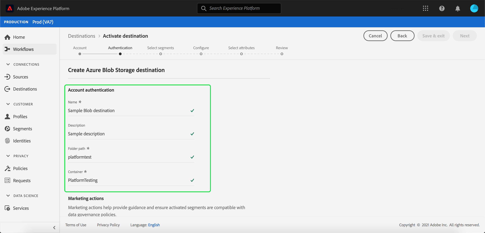

# Creare una destinazione [!DNL Azure Blob] nell&#39;interfaccia utente

[!DNL Azure Blob] (di seguito &quot;[!DNL Blob]&quot;) è la soluzione di archiviazione oggetti di Microsoft per il cloud. Questa esercitazione fornisce i passaggi necessari per creare una destinazione [!DNL Blob] utilizzando l&#39;interfaccia utente [!DNL Platform].

## Introduzione

Questa esercitazione richiede una buona conoscenza dei seguenti componenti di Adobe Experience Platform:

- [[!DNL Experience Data Model (XDM)] Sistema](../../../xdm/home.md): Il framework standard con cui  Experience Platform organizza i dati sull&#39;esperienza dei clienti.
   - [Nozioni di base sulla composizione](../../../xdm/schema/composition.md) dello schema: Scoprite i componenti di base degli schemi XDM, inclusi i principi chiave e le procedure ottimali nella composizione dello schema.
   - [Esercitazione](../../../xdm/tutorials/create-schema-ui.md) sull&#39;Editor di schema: Scoprite come creare schemi personalizzati utilizzando l&#39;interfaccia utente dell&#39;Editor di schema.
- [[!DNL Real-time Customer Profile]](../../../profile/home.md): Fornisce un profilo di consumo unificato e in tempo reale basato su dati aggregati provenienti da più origini.

Se disponi già di una destinazione Blob valida, puoi saltare il resto del documento e continuare l&#39;esercitazione su [attivazione dei segmenti nella destinazione](../../ui/activate-destinations.md).

### Formati di file supportati

[!DNL Experience Platform] supporta il seguente formato di file da esportare in  [!DNL Blob]:

- Valori separati da delimitatore (DSV): Il supporto per i file di dati in formato DSV è attualmente limitato ai valori separati da virgole. In futuro verrà fornito il supporto per i file DSV generali. Per ulteriori informazioni sui file supportati, consulta la sezione relativa all&#39;archiviazione cloud nell&#39;esercitazione sull&#39;attivazione delle destinazioni](../../ui/activate-destinations.md#esp-and-cloud-storage)[

## Collegare l&#39;account Blob {#connect-destination}

Accedete a [Adobe Experience Platform](https://platform.adobe.com), quindi selezionate **[!UICONTROL Destinations]** dalla barra di navigazione a sinistra per accedere all&#39;area di lavoro **[!UICONTROL Destinations]**. Nella schermata **[!UICONTROL Catalog]** sono visualizzate diverse destinazioni con le quali è possibile creare un account.

Potete selezionare la categoria appropriata dal catalogo sul lato sinistro dello schermo. In alternativa, potete trovare la destinazione specifica con cui desiderate lavorare utilizzando l&#39;opzione di ricerca.

Sotto la categoria **[!UICONTROL Cloud Storage]**, selezionare **[!UICONTROL Azure Blob Storage]**, seguito da **[!UICONTROL Activate]**.

Viene visualizzata la pagina **[!UICONTROL Connect to Azure Blob Storage]**. In questa pagina è possibile utilizzare credenziali nuove o già esistenti.

### Nuovo account {#new-account}

Se si utilizzano nuove credenziali, selezionare **[!UICONTROL New account]**. Nel modulo di input visualizzato, specificare la stringa di connessione. Stringa di connessione necessaria per accedere ai dati nell&#39;archivio Blob. Il pattern della stringa di connessione [!DNL Blob] inizia con: `DefaultEndpointsProtocol=https;AccountName={ACCOUNT_NAME};AccountKey={ACCOUNT_KEY}`.

Facoltativamente, puoi allegare la chiave pubblica in formato RSA per aggiungere la crittografia ai file esportati. Questa chiave pubblica **deve essere scritta come una stringa codificata Base64.**

### Account esistente

Per collegare un account esistente, selezionate l&#39;account [!DNL Blob] con cui desiderate connettervi, quindi selezionate **Next** per continuare.

## Autenticazione {#authentication}

Viene visualizzata la pagina **Authentication**. Nel modulo di input visualizzato, specificare un nome, una descrizione facoltativa, il percorso della cartella e il contenitore dei file. Al termine, selezionare **[!UICONTROL Create destination]**.

## Passaggi successivi {#activate-segments}

Seguendo questa esercitazione, è stata stabilita una connessione all&#39;account [!DNL Blob]. Ora puoi continuare con l&#39;esercitazione successiva e [attivare i segmenti nella tua destinazione](../../ui/activate-destinations.md).
