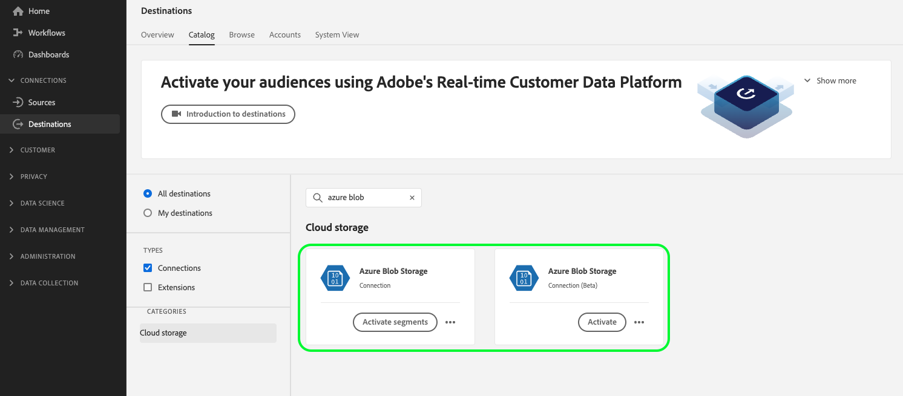

# [!DNL Azure Blob] connessione

## Registro modifiche destinazione {#changelog}

>[!IMPORTANT]
>
>Con la versione beta della funzionalità di esportazione dei set di dati e la migliorata funzionalità di esportazione dei file, ora potresti vedere due [!DNL Azure Blob] nel catalogo delle destinazioni.
>* Se si stanno già esportando file in **[!UICONTROL BLOB di Azure]** destinazione: crea nuovi flussi di dati per il nuovo **[!UICONTROL Azure Blob beta]** destinazione.
>* Se non hai ancora creato flussi di dati per **[!UICONTROL BLOB di Azure]** destinazione, utilizza il nuovo **[!UICONTROL Azure Blob beta]** scheda in cui esportare i file **[!UICONTROL BLOB di Azure]**.

Miglioramenti nel nuovo [!DNL Azure Blob] la scheda di destinazione include:

* [Supporto per l’esportazione del set di dati](/help/destinations/ui/export-datasets.md).
* Aggiuntivo [opzioni di denominazione file](/help/destinations/ui/activate-batch-profile-destinations.md#scheduling).
* Possibilità di impostare intestazioni di file personalizzate nei file esportati tramite [passaggio di mappatura migliorato](/help/destinations/ui/activate-batch-profile-destinations.md#mapping).
* [Possibilità di personalizzare la formattazione dei file di dati CSV esportati](/help/destinations/ui/batch-destinations-file-formatting-options.md).

## Panoramica {#overview}

[!DNL Azure Blob] (in appresso: [!DNL Blob]) è la soluzione di archiviazione di oggetti di Microsoft per il cloud. Questo tutorial descrive i passaggi necessari per creare [!DNL Blob] destinazione utilizzando [!DNL Platform] dell&#39;utente.

## Introduzione

Questo tutorial richiede una buona conoscenza dei seguenti componenti di Adobe Experience Platform:

* [[!DNL Experience Data Model (XDM)] Sistema](../../../xdm/home.md): framework standardizzato tramite il quale Experience Platform organizza i dati sull’esperienza del cliente.
   * [Nozioni di base sulla composizione dello schema](../../../xdm/schema/composition.md): scopri gli elementi di base degli schemi XDM, compresi i principi chiave e le best practice nella composizione dello schema.
   * [Esercitazione sull’editor di schemi](../../../xdm/tutorials/create-schema-ui.md): scopri come creare schemi personalizzati utilizzando l’interfaccia utente dell’Editor di schema.
* [[!DNL Real-Time Customer Profile]](../../../profile/home.md): fornisce un profilo consumer unificato e in tempo reale basato su dati aggregati provenienti da più origini.

Se disponi già di un [!DNL Blob] destinazione, è possibile saltare il resto del documento e passare all&#39;esercitazione su [attivazione dei segmenti nella destinazione](../../ui/activate-batch-profile-destinations.md).

## Tipo e frequenza di esportazione {#export-type-frequency}

Per informazioni sul tipo e sulla frequenza di esportazione della destinazione, consulta la tabella seguente.

| Elemento | Tipo | Note |
---------|----------|---------|
| Tipo di esportazione | **[!UICONTROL Basato su profilo]** | Stai esportando tutti i membri di un segmento, insieme ai campi dello schema desiderati (ad esempio: indirizzo e-mail, numero di telefono, cognome), come scelto nella schermata seleziona attributi profilo del [flusso di lavoro di attivazione della destinazione](../../ui/activate-batch-profile-destinations.md#select-attributes). |
| Frequenza di esportazione | **[!UICONTROL Batch]** | Le destinazioni batch esportano i file sulle piattaforme a valle con incrementi di tre, sei, otto, dodici o ventiquattro ore. Ulteriori informazioni su [destinazioni basate su file batch](/help/destinations/destination-types.md#file-based). |

{style="table-layout:auto"}

## Formati di file supportati {#file-formats}

[!DNL Experience Platform] supporta il seguente formato di file da esportare in [!DNL Azure Blob]:

* Valori separati da virgole (CSV): il supporto per i file di dati esportati è attualmente limitato a valori separati da virgole.

## Connetti alla destinazione {#connect}

>[!IMPORTANT]
> 
>Per connettersi alla destinazione, è necessario **[!UICONTROL Gestire le destinazioni]** [autorizzazione per il controllo degli accessi](/help/access-control/home.md#permissions). Leggi le [panoramica sul controllo degli accessi](/help/access-control/ui/overview.md) oppure contatta l’amministratore del prodotto per ottenere le autorizzazioni necessarie.

Per connettersi a questa destinazione, seguire i passaggi descritti in [esercitazione sulla configurazione della destinazione](../../ui/connect-destination.md). Nel flusso di lavoro di configurazione della destinazione, compila i campi elencati nelle due sezioni seguenti.

### Autentica nella destinazione {#authenticate}

>[!CONTEXTUALHELP]
>id="platform_destinations_connect_blob_rsa"
>title="Chiave pubblica RSA"
>abstract="Facoltativamente, puoi collegare la chiave pubblica in formato RSA per aggiungere la crittografia ai file esportati. Nel collegamento alla documentazione qui di seguito, trovi un esempio di chiave formattata correttamente."

Per autenticare nella destinazione, compila i campi obbligatori e seleziona **[!UICONTROL Connetti alla destinazione]**.

* **[!UICONTROL Stringa di connessione]**: la stringa di connessione è necessaria per accedere ai dati nell’archiviazione BLOB. Il [!DNL Blob] il modello di stringa di connessione inizia con: `DefaultEndpointsProtocol=https;AccountName={ACCOUNT_NAME};AccountKey={ACCOUNT_KEY}`.
   * Per ulteriori informazioni sulla configurazione di [!DNL Blob] stringa di connessione, vedi [Configurare una stringa di connessione per un account di archiviazione Azure](https://docs.microsoft.com/en-us/azure/storage/common/storage-configure-connection-string#configure-a-connection-string-for-an-azure-storage-account) nella documentazione di Microsoft.
* **[!UICONTROL Chiave di crittografia]**: in alternativa, puoi allegare la chiave pubblica in formato RSA per aggiungere la crittografia ai file esportati. Visualizza un esempio di chiave di crittografia formattata correttamente nell’immagine seguente.

   

### Inserisci i dettagli della destinazione {#destination-details}

Per configurare i dettagli per la destinazione, compila i campi obbligatori e facoltativi seguenti. Un asterisco accanto a un campo nell’interfaccia utente indica che il campo è obbligatorio.

* **[!UICONTROL Nome]**: inserisci un nome che ti aiuterà a identificare questa destinazione.
* **[!UICONTROL Descrizione]**: inserisci una descrizione di questa destinazione.
* **[!UICONTROL Percorso cartella]**: immetti il percorso della cartella di destinazione che ospiterà i file esportati.
* **[!UICONTROL Contenitore]**: immetti il nome del [!DNL Azure Blob Storage] contenitore utilizzato da questa destinazione.
* **[!UICONTROL Tipo di file]**: seleziona l’Experience Platform di formato da utilizzare per i file esportati. Questa opzione è disponibile solo per **[!UICONTROL Azure Blob beta]** destinazione. Quando si seleziona [!UICONTROL CSV] , è inoltre possibile [configurare le opzioni di formattazione del file](../../ui/batch-destinations-file-formatting-options.md).
* **[!UICONTROL Formato di compressione]**: seleziona il tipo di compressione che Experience Platform deve utilizzare per i file esportati. Questa opzione è disponibile solo per **[!UICONTROL Azure Blob beta]** destinazione.

### Abilita avvisi {#enable-alerts}

Puoi abilitare gli avvisi per ricevere notifiche sullo stato del flusso di dati verso la tua destinazione. Seleziona un avviso dall’elenco per abbonarti e ricevere notifiche sullo stato del flusso di dati. Per ulteriori informazioni sugli avvisi, consulta la guida su [abbonamento agli avvisi sulle destinazioni tramite l’interfaccia utente](../../ui/alerts.md).

Una volta completate le informazioni sulla connessione di destinazione, seleziona **[!UICONTROL Successivo]**.

## Attiva i segmenti in questa destinazione {#activate}

>[!IMPORTANT]
> 
>Per attivare i dati, è necessario **[!UICONTROL Gestire le destinazioni]**, **[!UICONTROL Attivare le destinazioni]**, **[!UICONTROL Visualizza profili]**, e **[!UICONTROL Visualizzare segmenti]** [autorizzazioni di controllo degli accessi](/help/access-control/home.md#permissions). Leggi le [panoramica sul controllo degli accessi](/help/access-control/ui/overview.md) oppure contatta l’amministratore del prodotto per ottenere le autorizzazioni necessarie.

Consulta [Attivare i dati del pubblico nelle destinazioni di esportazione del profilo batch](../../ui/activate-batch-profile-destinations.md) per istruzioni sull’attivazione dei segmenti di pubblico in questa destinazione.

## (Beta) Esportare i set di dati {#export-datasets}

Questa destinazione supporta le esportazioni di set di dati. Per informazioni complete su come impostare le esportazioni dei set di dati, leggi [tutorial sull’esportazione dei set di dati](/help/destinations/ui/export-datasets.md).

## Dati esportati {#exported-data}

Per [!DNL Azure Blob Storage] destinazioni, [!DNL Platform] crea un `.csv` nel percorso di archiviazione fornito. Per ulteriori informazioni sui file, consulta [Attivare i dati del pubblico nelle destinazioni di esportazione del profilo batch](../../ui/activate-batch-profile-destinations.md) nell’esercitazione di attivazione dei segmenti.