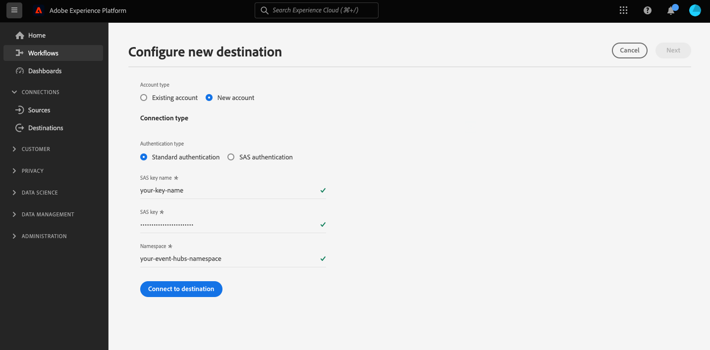

# [!DNL Azure Event Hubs] connessione

## Panoramica {#overview}

>[!IMPORTANT]
>
> Questa destinazione è disponibile solo per [Adobe Real-time Customer Data Platform Ultimate](https://helpx.adobe.com/legal/product-descriptions/real-time-customer-data-platform.html) clienti.

[!DNL Azure Event Hubs] è una piattaforma di streaming di big data e un servizio di acquisizione di eventi. Può ricevere ed elaborare milioni di eventi al secondo. I dati inviati a un hub eventi possono essere trasformati e memorizzati utilizzando qualsiasi provider di analisi in tempo reale o adattatori di batch/archiviazione.

Puoi creare una connessione in uscita in tempo reale al tuo [!DNL Azure Event Hubs] archiviazione per lo streaming dei dati da Adobe Experience Platform.

* Per ulteriori informazioni su [!DNL Azure Event Hubs], vedere [Documentazione di Microsoft](https://docs.microsoft.com/en-us/azure/event-hubs/event-hubs-about).
* Per connettersi a [!DNL Azure Event Hubs] a livello di programmazione, vedere [Tutorial sull’API per Streaming Destinations](../../api/streaming-destinations.md).
* Per connettersi a [!DNL Azure Event Hubs] utilizzando l’interfaccia utente di Platform, consulta le sezioni seguenti.


## Casi di utilizzo {#use-cases}

Utilizzando destinazioni di streaming come [!DNL Azure Event Hubs], puoi inserire facilmente eventi di segmentazione di alto valore e attributi di profilo associati nei sistemi preferiti.

Ad esempio, un potenziale cliente ha scaricato un white paper che li qualifica come segmenti ad &quot;alta propensione alla conversione&quot;. Mediante la mappatura del segmento in cui rientra il potenziale cliente su [!DNL Azure Event Hubs] destinazione, riceverai questo evento in [!DNL Azure Event Hubs]. In questo caso, è possibile utilizzare un approccio fai-da-te e descrivere la logica di business oltre all&#39;evento, in base al principio che si potrebbe utilizzare al meglio con i sistemi IT aziendali.

## Tipo e frequenza di esportazione {#export-type-frequency}

Per informazioni sul tipo e sulla frequenza di esportazione della destinazione, consulta la tabella seguente.

| Elemento | Tipo | Note |
---------|----------|---------|
| Tipo di esportazione | **[!UICONTROL Basato su profilo]** | Stai esportando tutti i membri di un segmento, insieme ai campi dello schema desiderati (ad esempio: indirizzo e-mail, numero di telefono, cognome), come scelto nella schermata seleziona attributi profilo del [flusso di lavoro di attivazione della destinazione](../../ui/activate-batch-profile-destinations.md#select-attributes). |
| Frequenza di esportazione | **[!UICONTROL Streaming]** | Le destinazioni di streaming sono connessioni &quot;sempre attive&quot; basate su API. Non appena un profilo viene aggiornato in Experience Platform in base alla valutazione dei segmenti, il connettore invia l’aggiornamento a valle alla piattaforma di destinazione. Ulteriori informazioni su [destinazioni di streaming](/help/destinations/destination-types.md#streaming-destinations). |

{style="table-layout:auto"}

## Indirizzo IP inserito nell&#39;elenco Consentiti {#ip-address-allowlist}

Per soddisfare i requisiti di sicurezza e conformità dei clienti, Experience Platform fornisce un elenco di IP statici che è possibile inserire nell&#39;elenco Consentiti per l interfaccia [!DNL Azure Event Hubs] destinazione. Fai riferimento a [ELENCO CONSENTITI di indirizzo IP per destinazioni di streaming](/help/destinations/catalog/streaming/ip-address-allow-list.md) inserire nell&#39;elenco Consentiti per l’elenco completo degli IP da.

## Connetti alla destinazione {#connect}

>[!IMPORTANT]
> 
>Per connettersi alla destinazione, è necessario **[!UICONTROL Gestire le destinazioni]** [autorizzazione per il controllo degli accessi](/help/access-control/home.md#permissions). Leggi le [panoramica sul controllo degli accessi](/help/access-control/ui/overview.md) oppure contatta l’amministratore del prodotto per ottenere le autorizzazioni necessarie.

Per connettersi a questa destinazione, seguire i passaggi descritti in [esercitazione sulla configurazione della destinazione](../../ui/connect-destination.md). Quando ti connetti a questa destinazione, devi fornire le seguenti informazioni:

### Informazioni di autenticazione {#authentication-information}

#### Autenticazione standard {#standard-authentication}



Se si seleziona la **[!UICONTROL Autenticazione standard]** digita per connetterti all’endpoint HTTP, inserisci i campi seguenti e seleziona **[!UICONTROL Connetti alla destinazione]**:

* **[!UICONTROL Nome chiave SAS]**: nome della regola di autorizzazione, noto anche come nome della chiave SAS.
* **[!UICONTROL Chiave SAS]**: chiave primaria dello spazio dei nomi degli hub eventi. Il `sasPolicy` che il `sasKey` corrisponde a deve avere **gestire** diritti configurati per il popolamento dell’elenco Hub eventi. Scopri come eseguire l’autenticazione in [!DNL Azure Event Hubs] con le chiavi SAS nel [Documentazione di Microsoft](https://docs.microsoft.com/en-us/azure/event-hubs/authenticate-shared-access-signature).
* **[!UICONTROL Namespace]**: compila il [!DNL Azure Event Hubs] spazio dei nomi. Informazioni su [!DNL Azure Event Hubs] spazi dei nomi in [Documentazione di Microsoft](https://docs.microsoft.com/en-us/azure/event-hubs/event-hubs-create#create-an-event-hubs-namespace).

#### Autenticazione con firma di accesso condiviso (SAS) {#sas-authentication}


Se si seleziona la **[!UICONTROL Autenticazione standard]** digita per connetterti all’endpoint HTTP, inserisci i campi seguenti e seleziona **[!UICONTROL Connetti alla destinazione]**:

* **[!UICONTROL Nome chiave SAS]**: nome della regola di autorizzazione, noto anche come nome della chiave SAS.
* **[!UICONTROL Chiave SAS]**: chiave primaria dello spazio dei nomi degli hub eventi. Il `sasPolicy` che il `sasKey` corrisponde a deve avere **gestire** diritti configurati per il popolamento dell’elenco Hub eventi. Scopri come eseguire l’autenticazione in [!DNL Azure Event Hubs] con le chiavi SAS nel [Documentazione di Microsoft](https://docs.microsoft.com/en-us/azure/event-hubs/authenticate-shared-access-signature).
* **[!UICONTROL Namespace]**: compila il [!DNL Azure Event Hubs] spazio dei nomi. Informazioni su [!DNL Azure Event Hubs] spazi dei nomi in [Documentazione di Microsoft](https://docs.microsoft.com/en-us/azure/event-hubs/event-hubs-create#create-an-event-hubs-namespace).
* **[!UICONTROL Nome hub eventi]**: compila il [!DNL Azure Event Hub] nome . Informazioni su [!DNL Azure Event Hubs] nomi in [Documentazione di Microsoft](https://learn.microsoft.com/en-us/azure/event-hubs/event-hubs-create#create-an-event-hub).

### Inserisci i dettagli della destinazione {#destination-details}

>[!CONTEXTUALHELP]
>id="platform_destinations_connect_eventhubs_includesegmentnames"
>title="Includi nomi segmento"
>abstract="Attiva questa opzione se desideri che l’esportazione dei dati includa i nomi dei segmenti che stai esportando. Visualizza la documentazione di un esempio di esportazione di dati con questa opzione selezionata."

>[!CONTEXTUALHELP]
>id="platform_destinations_connect_eventhubs_includesegmenttimestamps"
>title="Includi marche temporali segmento"
>abstract="Attiva questa opzione se desideri che l’esportazione dei dati includa la marca temporale UNIX di quando i segmenti sono stati creati e aggiornati, nonché la marca temporale UNIX di quando i segmenti sono stati mappati alla destinazione per l’attivazione. Visualizza la documentazione di un esempio di esportazione di dati con questa opzione selezionata."

Per configurare i dettagli per la destinazione, compila i campi obbligatori e facoltativi seguenti. Un asterisco accanto a un campo nell’interfaccia utente indica che il campo è obbligatorio.


* **[!UICONTROL Nome]**: specifica un nome per la connessione a [!DNL Azure Event Hubs].
* **[!UICONTROL Descrizione]**: fornisci una descrizione della connessione.  Esempi: &quot;Clienti di livello Premium&quot;, &quot;Clienti interessati al kitesurfing&quot;.
* **[!UICONTROL eventHubName]**: specifica un nome per il flusso nel [!DNL Azure Event Hubs] destinazione.
* **[!UICONTROL Includi nomi segmento]**: attiva questa opzione se desideri che l’esportazione dei dati includa i nomi dei segmenti che stai esportando. Per un esempio di esportazione di dati con questa opzione selezionata, fai riferimento al [Dati esportati](#exported-data) più avanti.
* **[!UICONTROL Includi marche temporali segmento]**: attiva questa opzione se desideri che l’esportazione dei dati includa la marca temporale UNIX di quando i segmenti sono stati creati e aggiornati, nonché la marca temporale UNIX di quando i segmenti sono stati mappati alla destinazione per l’attivazione. Per un esempio di esportazione di dati con questa opzione selezionata, fai riferimento al [Dati esportati](#exported-data) più avanti.

### Abilita avvisi {#enable-alerts}

Puoi abilitare gli avvisi per ricevere notifiche sullo stato del flusso di dati verso la tua destinazione. Seleziona un avviso dall’elenco per abbonarti e ricevere notifiche sullo stato del flusso di dati. Per ulteriori informazioni sugli avvisi, consulta la guida su [abbonamento agli avvisi sulle destinazioni tramite l’interfaccia utente](../../ui/alerts.md).

Una volta completate le informazioni sulla connessione di destinazione, seleziona **[!UICONTROL Successivo]**.

## Attiva i segmenti in questa destinazione {#activate}

>[!IMPORTANT]
> 
>Per attivare i dati, è necessario **[!UICONTROL Gestire le destinazioni]**, **[!UICONTROL Attivare le destinazioni]**, **[!UICONTROL Visualizza profili]**, e **[!UICONTROL Visualizzare segmenti]** [autorizzazioni di controllo degli accessi](/help/access-control/home.md#permissions). Leggi le [panoramica sul controllo degli accessi](/help/access-control/ui/overview.md) oppure contatta l’amministratore del prodotto per ottenere le autorizzazioni necessarie.

Consulta [Attivare i dati del pubblico nelle destinazioni di esportazione del profilo di streaming](../../ui/activate-streaming-profile-destinations.md) per istruzioni sull’attivazione dei segmenti di pubblico in questa destinazione.

## Comportamento di esportazione del profilo {#profile-export-behavior}

Experience Platform ottimizza il comportamento di esportazione del profilo in [!DNL Azure Event Hubs] destinazione, per esportare i dati nella destinazione solo quando si sono verificati aggiornamenti rilevanti di un profilo in seguito alla qualificazione di un segmento o ad altri eventi significativi. I profili vengono esportati nella destinazione nelle seguenti situazioni:

* L’aggiornamento del profilo è stato determinato da una modifica nell’appartenenza al segmento per almeno uno dei segmenti mappati sulla destinazione. Ad esempio, il profilo è qualificato per uno dei segmenti mappati sulla destinazione o è uscito da uno dei segmenti mappati sulla destinazione.
* L’aggiornamento del profilo è stato determinato da una modifica nella [mappa identità](/help/xdm/field-groups/profile/identitymap.md). Ad esempio, a un profilo che si era già qualificato per uno dei segmenti mappati sulla destinazione è stata aggiunta una nuova identità nell’attributo di mappa identità.
* L’aggiornamento del profilo è stato determinato da una modifica degli attributi per almeno uno degli attributi mappati alla destinazione. Ad esempio, uno degli attributi mappati sulla destinazione nel passaggio di mappatura viene aggiunto a un profilo.

In tutti i casi descritti sopra, solo i profili in cui si sono verificati aggiornamenti rilevanti vengono esportati nella destinazione. Ad esempio, se un segmento mappato al flusso di destinazione ha cento membri e cinque nuovi profili sono idonei per il segmento, l’esportazione nella destinazione è incrementale e include solo i cinque nuovi profili.

Tieni presente che tutti gli attributi mappati vengono esportati per un profilo, indipendentemente da dove si trovano le modifiche. Quindi, nell’esempio precedente, tutti gli attributi mappati per questi cinque nuovi profili verranno esportati anche se gli attributi stessi non sono stati modificati.

### Che cosa determina un’esportazione di dati e cosa è incluso nell’esportazione {#what-determines-export-what-is-included}

Per quanto riguarda i dati esportati per un determinato profilo, è importante comprendere i due diversi concetti di *cosa determina un’esportazione di dati nel [!DNL Azure Event Hubs] destinazione* e *quali dati sono inclusi nell’esportazione*.

| Cosa determina un’esportazione di destinazione | Cosa è incluso nell’esportazione di destinazione |
|---------|----------|
| <ul><li>Gli attributi e i segmenti mappati fungono da spunto per un’esportazione di destinazione. Ciò significa che se uno qualsiasi dei segmenti mappati cambia stato (da nullo a realizzato o da realizzato/esistente a esistente) o se uno qualsiasi degli attributi mappati viene aggiornato, viene avviata un’esportazione di destinazione.</li><li>Poiché al momento non è possibile mappare le identità su [!DNL Azure Event Hubs] le destinazioni, le modifiche di qualsiasi identità su un determinato profilo determinano anche le esportazioni di destinazione.</li><li>Per modifica di un attributo si intende qualsiasi aggiornamento dell&#39;attributo, indipendentemente dal fatto che si tratti o meno dello stesso valore. Ciò significa che una sovrascrittura su un attributo è considerata una modifica anche se il valore stesso non è cambiato.</li></ul> | <ul><li>Il `segmentMembership` L’oggetto include il segmento mappato nel flusso di dati di attivazione, per il quale lo stato del profilo è cambiato a seguito di un evento di qualificazione o uscita da un segmento. Tieni presente che altri segmenti non mappati per i quali il profilo si è qualificato possono far parte dell’esportazione di destinazione, se tali segmenti appartengono allo stesso [criterio di unione](/help/profile/merge-policies/overview.md) come segmento mappato nel flusso di dati di attivazione. </li><li>Tutte le identità in `identityMap` sono inclusi anche gli oggetti (l&#39;Experience Platform attualmente non supporta la mappatura delle identità [!DNL Azure Event Hubs] destinazione).</li><li>Nell’esportazione della destinazione sono inclusi solo gli attributi mappati.</li></ul> |

{style="table-layout:fixed"}

Ad esempio, considera questo flusso di dati come un [!DNL Azure Event Hubs] destinazione in cui tre segmenti sono selezionati nel flusso di dati e quattro attributi sono mappati alla destinazione.


Un’esportazione di profilo verso la destinazione può essere determinata da un profilo idoneo o in uscita da uno dei *tre segmenti mappati*. Tuttavia, nell’esportazione dei dati, nella `segmentMembership` oggetto (vedere [Dati esportati](#exported-data) sezione seguente), potrebbero essere visualizzati altri segmenti non mappati, se quel particolare profilo è un membro di essi e se questi condividono lo stesso criterio di unione del segmento che ha attivato l’esportazione. Se un profilo è idoneo per **Cliente con auto DeLorean** ma è anche un membro del **Guarda &quot;Ritorno al futuro&quot;** film e **Fantascienza** , quindi anche questi altri due segmenti saranno presenti nel `segmentMembership` oggetto dell’esportazione di dati, anche se non sono mappati nel flusso di dati, se condividono lo stesso criterio di unione con **Cliente con auto DeLorean** segmento.

Dal punto di vista degli attributi di profilo, eventuali modifiche ai quattro attributi mappati in precedenza determineranno un’esportazione di destinazione e uno qualsiasi dei quattro attributi mappati presenti nel profilo sarà presente nell’esportazione di dati.

## Recupero dati storici {#historical-data-backfill}

Quando aggiungi un nuovo segmento a una destinazione esistente o quando crei una nuova destinazione e mappi i segmenti su di essa, Experience Platform esporta i dati storici di qualificazione dei segmenti nella destinazione. Profili qualificati per il segmento *prima di* il segmento aggiunto alla destinazione viene esportato nella destinazione entro circa un’ora.

## Dati esportati {#exported-data}

Il tuo esportato [!DNL Experience Platform] i dati vengono inseriti nel [!DNL Azure Event Hubs] destinazione in formato JSON. Ad esempio, l’esportazione seguente contiene un profilo idoneo per un determinato segmento, è membro di altri due segmenti ed è uscito da un altro segmento. L’esportazione include anche l’attributo del profilo nome, cognome, data di nascita e indirizzo e-mail personale. Le identità per questo profilo sono ECID e e-mail.

```json
{
  "person": {
    "birthDate": "YYYY-MM-DD",
    "name": {
      "firstName": "John",
      "lastName": "Doe"
    }
  },
  "personalEmail": {
    "address": "john.doe@acme.com"
  },
  "segmentMembership": {
   "ups":{
      "7841ba61-23c1-4bb3-a495-00d3g5fe1e93":{
         "lastQualificationTime":"2022-01-11T21:24:39Z",
         "status":"exited"
      },
      "59bd2fkd-3c48-4b18-bf56-4f5c5e6967ae":{
         "lastQualificationTime":"2022-01-02T23:37:33Z",
         "status":"existing"
      },
      "947c1c46-008d-40b0-92ec-3af86eaf41c1":{
         "lastQualificationTime":"2021-08-25T23:37:33Z",
         "status":"existing"
      },
      "5114d758-ce71-43ba-b53e-e2a91d67b67f":{
         "lastQualificationTime":"2022-01-11T23:37:33Z",
         "status":"realized"
      }
   }
},
  "identityMap": {
    "ecid": [
      {
        "id": "14575006536349286404619648085736425115"
      },
      {
        "id": "66478888669296734530114754794777368480"
      }
    ],
    "email_lc_sha256": [
      {
        "id": "655332b5fa2aea4498bf7a290cff017cb4"
      },
      {
        "id": "66baf76ef9de8b42df8903f00e0e3dc0b7"
      }
    ]
  }
}
```

Di seguito sono riportati ulteriori esempi di dati esportati, a seconda delle impostazioni dell’interfaccia utente selezionate nel flusso di destinazione della connessione per **[!UICONTROL Includi nomi segmento]** e **[!UICONTROL Includi marche temporali segmento]** opzioni:

+++ L’esempio di esportazione dei dati riportato di seguito include i nomi dei segmenti nel `segmentMembership` sezione

```json
"segmentMembership": {
        "ups": {
          "5b998cb9-9488-4ec3-8d95-fa8338ced490": {
            "lastQualificationTime": "2019-04-15T02:41:50+0000",
            "status": "existing",
            "createdAt": 1648553325000,
            "updatedAt": 1648553330000,
            "mappingCreatedAt": 1649856570000,
            "mappingUpdatedAt": 1649856570000,
            "name": "First name equals John"
          }
        }
      }
```

+++

+++ L’esempio di esportazione dei dati riportato di seguito include i timestamp del segmento nel `segmentMembership` sezione

```json
"segmentMembership": {
        "ups": {
          "5b998cb9-9488-4ec3-8d95-fa8338ced490": {
            "lastQualificationTime": "2019-04-15T02:41:50+0000",
            "status": "existing",
            "createdAt": 1648553325000,
            "updatedAt": 1648553330000,
            "mappingCreatedAt": 1649856570000,
            "mappingUpdatedAt": 1649856570000,
          }
        }
      }
```

+++

## Limiti e criteri per nuovi tentativi {#limits-retry-policy}

Nel 95% del tempo, Experience Platform tenta di offrire una latenza di velocità effettiva inferiore a 10 minuti per i messaggi inviati correttamente con una frequenza inferiore a 10.000 richieste al secondo per ogni flusso di dati a una destinazione HTTP.

In caso di richieste non riuscite alla destinazione API HTTP, Experience Platform memorizza le richieste non riuscite e tenta di inviarle all’endpoint due volte.

>[!MORELIKETHIS]
>
>* [Connettiti ad Azure Event Hub e attiva i dati utilizzando l’API del servizio Flusso](../../api/streaming-destinations.md)
>* [Destinazione AWS Kinesis](./amazon-kinesis.md)
>* [Tipi e categorie di destinazione](../../destination-types.md)

