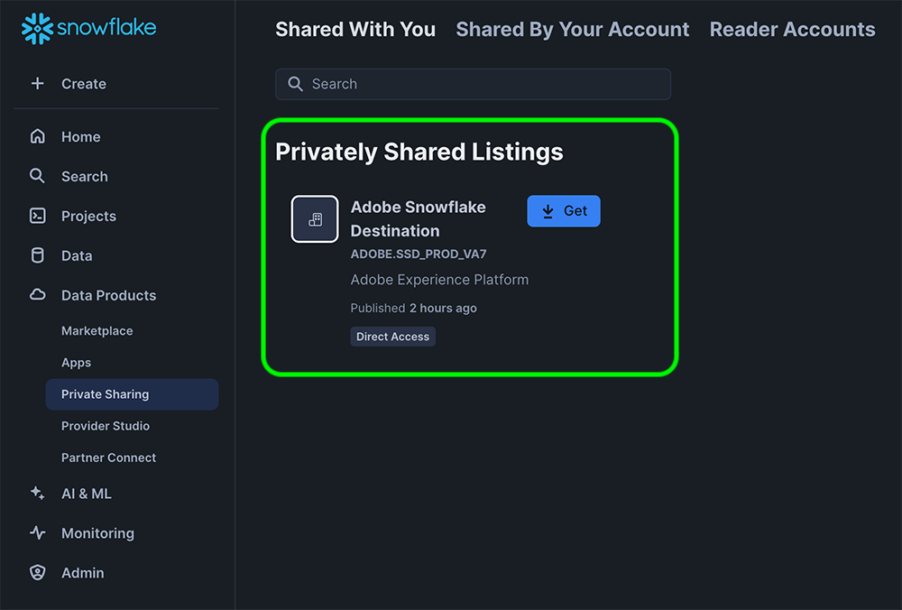

# Connessione batch Snowflake {#snowflake-destination}

>[!IMPORTANT]
>
>Questo connettore di destinazione è in versione beta ed è disponibile solo per i clienti Real-Time CDP Ultimate. La funzionalità e la documentazione sono soggette a modifiche.

## Panoramica {#overview}

Utilizza questa destinazione per inviare dati sul pubblico a tabelle dinamiche nel tuo account Snowflake. Le tabelle dinamiche consentono di accedere ai dati senza richiedere copie fisiche dei dati.

Leggi le sezioni seguenti per scoprire come funziona la destinazione Snowflake e come i dati vengono trasferiti tra Adobe e Snowflake.

### Funzionamento della condivisione dei dati in Snowflake {#data-sharing}

Questa destinazione utilizza una condivisione dati [!DNL Snowflake], il che significa che nessun dato viene fisicamente esportato o trasferito alla tua istanza di Snowflake. Al contrario, Adobe ti consente di accedere in sola lettura a una live table ospitata nell’ambiente Snowflake di Adobe. Puoi eseguire query su questa tabella condivisa direttamente dal tuo account Snowflake, ma non sei il proprietario della tabella e non puoi modificarla o conservarla oltre il periodo di conservazione specificato. Adobe gestisce completamente il ciclo di vita e la struttura della tabella condivisa.

La prima volta che configuri un flusso di dati da Adobe all’account Snowflake, ti viene richiesto di accettare l’inserzione privata da Adobe.

### Conservazione dei dati e Time-to-Live (TTL) {#ttl}

Tutti i dati condivisi tramite questa integrazione hanno un TTL (Time-to-Live) fisso di sette giorni. Sette giorni dopo l’ultima esportazione, la tabella dinamica scade automaticamente e diventa inaccessibile, indipendentemente dal fatto che il flusso di dati sia ancora attivo. Se devi conservare i dati per più di sette giorni, devi copiare il contenuto in una tabella di tua proprietà nella tua istanza di Snowflake prima della scadenza del TTL.

>[!IMPORTANT]
>
>L’eliminazione di un flusso di dati in Experience Platform fa scomparire la tabella dinamica dal tuo account Snowflake.

### Comportamento aggiornamento pubblico {#audience-update-behavior}

Se il pubblico viene valutato in [modalità batch](../../../segmentation/methods/batch-segmentation.md), i dati nella tabella condivisa vengono aggiornati ogni 24 ore. Ciò significa che può trascorrere un ritardo di 24 ore tra le modifiche nell’appartenenza al pubblico e il momento in cui tali modifiche vengono riportate nella tabella condivisa.

### Logica di condivisione dei dati in batch {#batch-data-sharing}

Quando un flusso di dati viene eseguito per un pubblico per la prima volta, esegue una retrocompilazione e condivide tutti i profili attualmente qualificati. Dopo questa retrocompilazione iniziale, la destinazione fornisce istantanee periodiche dell’iscrizione completa al pubblico. Ogni istantanea sostituisce i dati precedenti nella tabella condivisa, garantendo di visualizzare sempre la visualizzazione completa più recente del pubblico senza dati storici.

## Condivisione di dati in streaming e in batch {#batch-vs-streaming}

Experience Platform fornisce due tipi di destinazioni Snowflake: [Snowflake Streaming](/help/destinations/catalog/cloud-storage/snowflake.md) e [Snowflake Batch](snowflake-batch.md).

Sebbene entrambe le destinazioni ti consentano l’accesso ai dati in Snowflake in modalità zero-copy, esistono alcune best practice consigliate in termini di casi d’uso per ciascun connettore.

La tabella seguente ti aiuterà a decidere quale connettore utilizzare, delineando gli scenari in cui ogni metodo di condivisione dei dati è più appropriato.

|  | Scegli [Batch Snowflake](snowflake-batch.md) quando è necessario | Scegli [Snowflake Streaming](/help/destinations/catalog/cloud-storage/snowflake.md) quando è necessario |
|--------|-------------------|----------------------|
| **Frequenza aggiornamento** | Snapshot periodici | Aggiornamenti continui in tempo reale |
| **Presentazione dati** | Snapshot completo del pubblico che sostituisce i dati precedenti | Aggiornamenti incrementali basati su modifiche del profilo |
| **Caso d&#39;uso** | Carichi di lavoro analitici/ML in cui la latenza non è critica | Scenari di azione immediata che richiedono aggiornamenti in tempo reale |
| **Gestione dati** | Visualizza sempre l&#39;ultima istantanea completa | Aggiornamenti incrementali in base alle modifiche di iscrizione al pubblico |
| **Scenari di esempio** | Reporting aziendale, analisi dei dati, formazione sui modelli ML | Eliminazione di campagne di marketing, personalizzazione in tempo reale |

Per ulteriori informazioni sulla condivisione di dati in streaming, vedere la documentazione di [Snowflake Streaming connection](../cloud-storage/snowflake.md).

## Casi d’uso {#use-cases}

La condivisione di dati in batch è ideale per gli scenari in cui è necessaria un’istantanea completa del pubblico e non sono necessari aggiornamenti in tempo reale, ad esempio:

* **Carichi di lavoro analitici**: quando si eseguono attività di analisi dei dati, reporting o business intelligence che richiedono una visualizzazione completa dell&#39;appartenenza al pubblico
* **Flussi di lavoro di apprendimento automatico**: per la formazione di modelli ML o l&#39;esecuzione di analisi predittive che beneficiano di istantanee complete del pubblico
* **Data warehousing**: quando è necessario mantenere una copia corrente dei dati del pubblico nella propria istanza di Snowflake
* **Rapporti periodici**: per rapporti aziendali regolari in cui è necessario il più recente stato del pubblico senza rilevamento delle modifiche cronologiche
* **Processi ETL**: quando devi trasformare o elaborare i dati del pubblico in batch

La condivisione dei dati in batch semplifica la gestione dei dati fornendo istantanee complete, eliminando la necessità di gestire gli aggiornamenti incrementali o di unire le modifiche manualmente.

## Tipi di pubblico supportati {#supported-audiences}

Questa sezione descrive quali tipi di pubblico puoi esportare in questa destinazione. Le due tabelle seguenti indicano i tipi di pubblico supportati dal connettore, per _origine pubblico_ e _tipi di profilo inclusi nel pubblico_:

| Origine pubblico | Supportato | Descrizione |
|---------|----------|----------|
| [!DNL Segmentation Service] | ✓ | Tipi di pubblico generati tramite Experience Platform [Segmentation Service](../../../segmentation/home.md). |
| Tutte le altre origini del pubblico | ✓ | Questa categoria include tutte le origini del pubblico al di fuori dei tipi di pubblico generati tramite [!DNL Segmentation Service]. Leggi informazioni sulle [diverse origini del pubblico](/help/segmentation/ui/audience-portal.md#customize). Alcuni esempi includono: <ul><li> i tipi di pubblico per caricamento personalizzati [importati](../../../segmentation/ui/audience-portal.md#import-audience) in Experience Platform da file CSV,</li><li> pubblico simile, </li><li> pubblico federato, </li><li> tipi di pubblico generati in altre app di Experience Platform come Adobe Journey Optimizer, </li><li> e altro ancora. </li></ul> |

{style="table-layout:auto"}

Tipi di pubblico supportati per tipo di dati sul pubblico:

| Tipo di dati del pubblico | Supportato | Descrizione | Casi d’uso |
|--------------------|-----------|-------------|-----------|
| [Tipi di pubblico per persone](/help/segmentation/types/people-audiences.md) | ✓ | In base ai profili dei clienti, consente di eseguire il targeting di gruppi specifici di persone per campagne di marketing. | Acquirenti frequenti, abbandoni del carrello |
| [Pubblico dell&#39;account](/help/segmentation/types/account-audiences.md) | No | Puoi indirizzare l’attività a singoli utenti all’interno di organizzazioni specifiche per strategie di marketing basate sull’account. | Marketing B2B |
| [Pubblico potenziale](/help/segmentation/types/prospect-audiences.md) | No | Puoi indirizzare l’attività a singoli utenti che non sono ancora clienti, ma che condividono alcune caratteristiche con il tuo pubblico di destinazione. | Ricerca di dati di terze parti |
| [Esportazioni set di dati](/help/catalog/datasets/overview.md) | No | Raccolte di dati strutturati archiviati nel Data Lake di Adobe Experience Platform. | Reporting, flussi di lavoro di data science |

{style="table-layout:auto"}

## Tipo e frequenza di esportazione {#export-type-frequency}

Per informazioni sul tipo e sulla frequenza di esportazione della destinazione, consulta la tabella seguente.

| Elemento | Tipo | Note |
---------|----------|---------|
| Tipo di esportazione | **[!UICONTROL Esportazione pubblico]** | Stai esportando tutti i membri di un pubblico con gli identificatori (nome, numero di telefono o altri) utilizzati nella destinazione [!DNL Snowflake]. |
| Frequenza di esportazione | **[!UICONTROL Batch]** | Questa destinazione fornisce istantanee periodiche dell’iscrizione completa al pubblico tramite la condivisione dei dati di Snowflake. Ogni istantanea sostituisce i dati precedenti, garantendo sempre la visualizzazione completa più recente del pubblico. |

{style="table-layout:auto"}

## Connettersi alla destinazione {#connect}

>[!IMPORTANT]
> 
>Per connettersi alla destinazione, sono necessarie le **[!UICONTROL Destinazioni visualizzazione]** e le **[!UICONTROL Autorizzazioni di gestione delle destinazioni]** [per il controllo degli accessi](/help/access-control/home.md#permissions). Leggi la [panoramica sul controllo degli accessi](/help/access-control/ui/overview.md) o contatta l&#39;amministratore del prodotto per ottenere le autorizzazioni necessarie.

Per connettersi a questa destinazione, seguire i passaggi descritti nell&#39;esercitazione [sulla configurazione della destinazione](../../ui/connect-destination.md). Nel flusso di lavoro di configurazione della destinazione, compila i campi elencati nelle due sezioni seguenti.

### Autenticarsi nella destinazione {#authenticate}

Per eseguire l&#39;autenticazione nella destinazione, selezionare **[!UICONTROL Connetti alla destinazione]** e specificare un nome account e, facoltativamente, una descrizione account.

### Inserire i dettagli della destinazione {#destination-details}

>[!CONTEXTUALHELP]
>id="platform_destinations_snowflake_batch_accountID"
>title="Immetti il tuo ID account Snowflake"
>abstract="Se l’account è collegato a un’organizzazione, utilizza questo formato: `OrganizationName.AccountName`   Se invece l’account non è collegato a un’organizzazione, utilizza questo formato: `AccountName`"

Per configurare i dettagli per la destinazione, compila i campi obbligatori e facoltativi seguenti. Un asterisco accanto a un campo nell’interfaccia utente indica che il campo è obbligatorio.

* **[!UICONTROL Nome]**: un nome con cui riconoscerai questa destinazione in futuro.
* **[!UICONTROL Descrizione]**: una descrizione che ti aiuterà a identificare questa destinazione in futuro.
* **[!UICONTROL ID account Snowflake]**: ID account Snowflake. Utilizza il seguente formato ID account, a seconda che l’account sia collegato o meno a un’organizzazione:
   * Se l&#39;account è collegato a un&#39;organizzazione:`OrganizationName.AccountName`.
   * Se l&#39;account non è collegato a un&#39;organizzazione:`AccountName`.
* **[!UICONTROL Conferma account]**: attiva la conferma ID account Snowflake per confermare che l&#39;ID account è corretto e appartiene a te.

>[!IMPORTANT]
>
> I caratteri speciali utilizzati nel nome della destinazione e nel nome della sandbox di Experience Platform vengono automaticamente convertiti in caratteri di sottolineatura (`_`) in Snowflake. Per evitare confusione, non utilizzare caratteri speciali nel nome della destinazione e della sandbox.

### Abilita avvisi {#enable-alerts}

Puoi abilitare gli avvisi per ricevere notifiche sullo stato del flusso di dati verso la tua destinazione. Seleziona un avviso dall’elenco per abbonarti e ricevere notifiche sullo stato del flusso di dati. Per ulteriori informazioni sugli avvisi, consulta la guida su [abbonamento a destinazioni avvisi tramite l&#39;interfaccia utente](../../ui/alerts.md).

Dopo aver fornito i dettagli per la connessione di destinazione, seleziona **[!UICONTROL Avanti]**.

## Attivare tipi di pubblico in questa destinazione {#activate}

>[!IMPORTANT]
> 
>* Per attivare i dati, è necessario **[!UICONTROL Visualizza destinazioni]**, **[!UICONTROL Attiva destinazioni]**, **[!UICONTROL Visualizza profili]** e **[!UICONTROL Visualizza segmenti]** [Autorizzazioni di controllo di accesso](/help/access-control/home.md#permissions). Leggi la [panoramica sul controllo degli accessi](/help/access-control/ui/overview.md) o contatta l&#39;amministratore del prodotto per ottenere le autorizzazioni necessarie.
>* Per esportare *identità*, è necessario disporre dell&#39;autorizzazione **[!UICONTROL Visualizza grafo identità]** [Controllo di accesso](/help/access-control/home.md#permissions).   {width="100" zoomable="yes"}

Per istruzioni sull&#39;attivazione dei tipi di pubblico in questa destinazione, leggi [Attiva dati pubblico per esportare i profili in batch](/help/destinations/ui/activate-batch-profile-destinations.md).

### Mappa attributi {#map}

Puoi esportare le identità e gli attributi del profilo in questa destinazione.

È possibile utilizzare il [controllo campi calcolati](../../ui/data-transformations-calculated-fields.md) per esportare ed eseguire operazioni sulle matrici.

Gli attributi di destinazione vengono creati automaticamente in Snowflake utilizzando il nome di attributo specificato nel campo **[!UICONTROL Nome attributo]**.

## Dati esportati / Convalida esportazione dati {#exported-data}

I dati vengono inseriti nell’account Snowflake tramite una tabella dinamica. Controlla il tuo account Snowflake per verificare che i dati siano stati esportati correttamente.

### Struttura dei dati {#data-structure}

La tabella dinamica contiene le colonne riportate di seguito.

* **TS**: colonna timestamp che rappresenta l&#39;ultimo aggiornamento di ogni riga
* **Attributi di mappatura**: ogni attributo di mappatura selezionato durante il flusso di lavoro di attivazione viene rappresentato come intestazione di colonna in Snowflake
* **Appartenenza al pubblico**: l&#39;appartenenza a qualsiasi pubblico mappato al flusso di dati è indicata tramite una voce `active` nella cella corrispondente

## Limitazioni note {#known-limitations}

### Più criteri di unione

I tipi di pubblico con più criteri di unione non sono supportati in un singolo flusso di dati. Criteri di unione diversi producono istantanee diverse e, in pratica, i dati relativi a un pubblico vengono sovrascritti dai dati dell’altro pubblico, anziché dai dati di entrambi, esportati come previsto.

## Utilizzo dei dati e governance {#data-usage-governance}

Tutte le destinazioni [!DNL Adobe Experience Platform] sono conformi ai criteri di utilizzo dei dati durante la gestione dei dati. Per informazioni dettagliate su come [!DNL Adobe Experience Platform] applica la governance dei dati, leggere la [Panoramica sulla governance dei dati](/help/data-governance/home.md).
