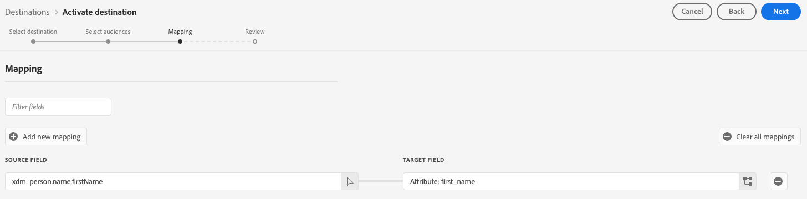

# Connessione Snowflake {#snowflake-destination}

>[!IMPORTANT]
>
>Al momento il connettore destinazione è in versione Beta ed è disponibile solo per una clientela selezionata. Per richiedere l’accesso, contatta il tuo rappresentante Adobe.

## Panoramica {#overview}

Esporta dati nel tuo account Snowflake utilizzando inserzioni private.

## Prerequisiti {#prerequisites}

Prima di configurare la connessione Snowflake, accertati di soddisfare i seguenti prerequisiti:

* Si dispone dell&#39;accesso a un account [!DNL Snowflake].
* Il tuo account Snowflake è abbonato a inserzioni private. Puoi configurare questa proprietà tu o un utente della tua azienda che dispone dei privilegi di amministratore dell’account su Snowflake.

## Tipi di pubblico supportati {#supported-audiences}

Questa sezione descrive quali tipi di pubblico puoi esportare in questa destinazione.

| Origine pubblico | Supportato | Descrizione |
|---------|----------|----------|
| [!DNL Segmentation Service] | ✓ | Tipi di pubblico generati tramite Experience Platform [Segmentation Service](../../../segmentation/home.md). |
| Caricamenti personalizzati | ✓ | Tipi di pubblico [importati](../../../segmentation/ui/audience-portal.md#import-audience) in Experience Platform da file CSV. |

{style="table-layout:auto"}

## Tipo e frequenza di esportazione {#export-type-frequency}

Per informazioni sul tipo e sulla frequenza di esportazione della destinazione, consulta la tabella seguente.

| Elemento | Tipo | Note |
---------|----------|---------|
| Tipo di esportazione | **[!UICONTROL Esportazione pubblico]** | Stai esportando tutti i membri di un pubblico con gli identificatori (nome, numero di telefono o altri) utilizzati nella destinazione [!DNL Snowflake]. |
| Frequenza di esportazione | **[!UICONTROL Streaming]** | Le destinazioni di streaming sono connessioni &quot;sempre attive&quot; basate su API. Non appena un profilo viene aggiornato in Experience Platform in base alla valutazione del pubblico, il connettore invia l’aggiornamento a valle alla piattaforma di destinazione. Ulteriori informazioni sulle [destinazioni di streaming](/help/destinations/destination-types.md#streaming-destinations). |

{style="table-layout:auto"}

## Connettersi alla destinazione {#connect}

>[!IMPORTANT]
> 
>Per connettersi alla destinazione, sono necessarie le **[!UICONTROL Destinazioni visualizzazione]** e le **[!UICONTROL Autorizzazioni di gestione delle destinazioni]** [per il controllo degli accessi](/help/access-control/home.md#permissions). Leggi la [panoramica sul controllo degli accessi](/help/access-control/ui/overview.md) o contatta l&#39;amministratore del prodotto per ottenere le autorizzazioni necessarie.

Per connettersi a questa destinazione, seguire i passaggi descritti nell&#39;esercitazione [sulla configurazione della destinazione](../../ui/connect-destination.md). Nel flusso di lavoro di configurazione della destinazione, compila i campi elencati nelle due sezioni seguenti.

### Autenticarsi nella destinazione {#authenticate}

Per eseguire l&#39;autenticazione nella destinazione, selezionare **[!UICONTROL Connetti alla destinazione]**.

### Inserire i dettagli della destinazione {#destination-details}

Per configurare i dettagli per la destinazione, compila i campi obbligatori e facoltativi seguenti. Un asterisco accanto a un campo nell’interfaccia utente indica che il campo è obbligatorio.

* **[!UICONTROL Nome]**: un nome con cui riconoscerai questa destinazione in futuro.
* **[!UICONTROL Descrizione]**: una descrizione che ti aiuterà a identificare questa destinazione in futuro.
* **[!UICONTROL ID account Snowflake]**: ID account Snowflake. Esempio: `adobe-123456`.
* **[!UICONTROL Conferma account]**: attiva la conferma ID account Snowflake per confermare che l&#39;ID account è corretto e appartiene a te.

>[!IMPORTANT]
>
> I caratteri speciali utilizzati nel nome della destinazione e nel nome della sandbox di Experience Platform vengono automaticamente convertiti in caratteri di sottolineatura (`_`) in Snowflake. Per evitare confusione, non utilizzare caratteri speciali nel nome della destinazione e della sandbox.

### Abilita avvisi {#enable-alerts}

Puoi abilitare gli avvisi per ricevere notifiche sullo stato del flusso di dati verso la tua destinazione. Seleziona un avviso dall’elenco per abbonarti e ricevere notifiche sullo stato del flusso di dati. Per ulteriori informazioni sugli avvisi, consulta la guida su [abbonamento a destinazioni avvisi tramite l&#39;interfaccia utente](../../ui/alerts.md).

Dopo aver fornito i dettagli per la connessione di destinazione, seleziona **[!UICONTROL Avanti]**.

## Attivare tipi di pubblico in questa destinazione {#activate}

>[!IMPORTANT]
> 
>* Per attivare i dati, è necessario **[!UICONTROL Visualizza destinazioni]**, **[!UICONTROL Attiva destinazioni]**, **[!UICONTROL Visualizza profili]** e **[!UICONTROL Visualizza segmenti]** [Autorizzazioni di controllo di accesso](/help/access-control/home.md#permissions). Leggi la [panoramica sul controllo degli accessi](/help/access-control/ui/overview.md) o contatta l&#39;amministratore del prodotto per ottenere le autorizzazioni necessarie.
>* Per esportare *identità*, è necessario disporre dell&#39;autorizzazione **[!UICONTROL Visualizza grafo identità]** [Controllo di accesso](/help/access-control/home.md#permissions).   {width="100" zoomable="yes"}

Leggi [Attivare profili e tipi di pubblico nelle destinazioni di esportazione del pubblico di streaming](/help/destinations/ui/activate-segment-streaming-destinations.md) per le istruzioni sull&#39;attivazione dei tipi di pubblico in questa destinazione.

### Mappa attributi {#map}

La destinazione Snowflake supporta la mappatura degli attributi del profilo agli attributi personalizzati.

Gli attributi di destinazione vengono creati automaticamente in Snowflake utilizzando il nome di attributo specificato nel campo **[!UICONTROL Nome attributo]**.

## Dati esportati / Convalida esportazione dati {#exported-data}

Controlla il tuo account Snowflake per verificare che i dati siano stati esportati correttamente.

## Utilizzo dei dati e governance {#data-usage-governance}

Tutte le destinazioni [!DNL Adobe Experience Platform] sono conformi ai criteri di utilizzo dei dati durante la gestione dei dati. Per informazioni dettagliate su come [!DNL Adobe Experience Platform] applica la governance dei dati, leggere la [Panoramica sulla governance dei dati](/help/data-governance/home.md).