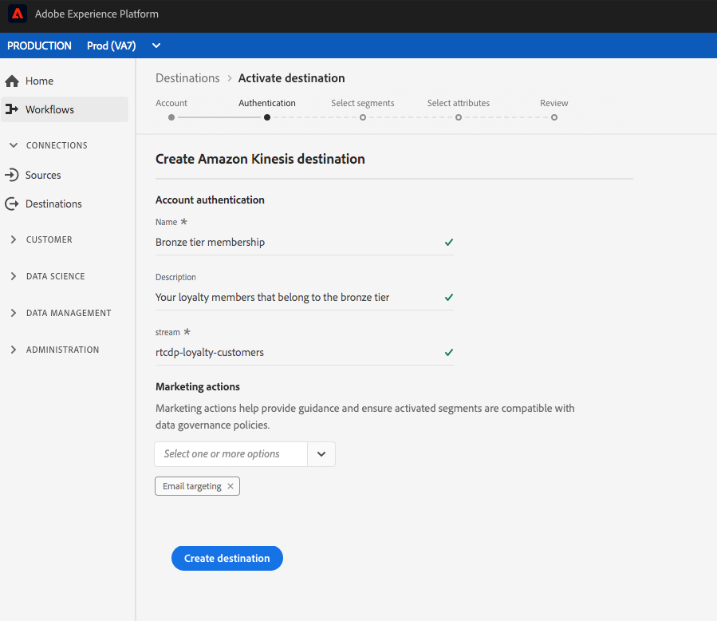

# Creare una destinazione di archiviazione cloud

In questa pagina viene illustrato come connettersi alle posizioni di archiviazione cloud in Adobe Experience Platform.

In **[!UICONTROL Connections]** > **[!UICONTROL Destinations]**, selezionare la destinazione di archiviazione cloud desiderata, quindi selezionare **[!UICONTROL Configure]**.

>[!NOTE]
>
>Se esiste già una connessione con questa destinazione, è possibile visualizzare un pulsante **[!UICONTROL Activate]** sulla scheda di destinazione. Per ulteriori informazioni sulla differenza tra **[!UICONTROL Activate]** e **[!UICONTROL Configure]**, fare riferimento alla sezione [Catalog](../../ui/destinations-workspace.md#catalog) della documentazione relativa all&#39;area di lavoro di destinazione.

Nel passaggio **[!UICONTROL Authentication]**, se in precedenza è stata impostata una connessione alla destinazione di archiviazione cloud, selezionare **[!UICONTROL Existing Account]** e selezionare la connessione esistente. In alternativa, è possibile selezionare **[!UICONTROL New Account]** per impostare una nuova connessione alla destinazione di archiviazione cloud. Compilate le credenziali di autenticazione dell&#39;account e selezionate **[!UICONTROL Connect to destination]**. Facoltativamente, puoi allegare la chiave pubblica in formato RSA per aggiungere la crittografia ai file esportati. Questa chiave pubblica **deve essere scritta come una stringa codificata Base64.**

Vedere [ destinazione Amazon S3](./amazon-s3.md), [[!DNL Amazon Kinesis]](./amazon-kinesis.md) destinazione, [[!DNL Azure Event Hubs]](./azure-event-hubs.md) destinazione e [SFTP](./sftp.md) destinazione per informazioni specifiche sulle credenziali immesse nel passaggio **Authentication**.

>[!NOTE]
>
>La piattaforma supporta la convalida delle credenziali nel processo di autenticazione e visualizza un messaggio di errore se vengono inserite credenziali non corrette nel percorso di archiviazione cloud. In questo modo si evita di completare il flusso di lavoro con credenziali non corrette.

Nel passaggio **[!UICONTROL Setup]**, immettete un **[!UICONTROL Name]** e un **[!UICONTROL Description]** per il flusso di attivazione.

Inoltre in questo passaggio, è possibile selezionare qualsiasi **[!UICONTROL Marketing action]** da applicare a questa destinazione. Le azioni di marketing indicano l&#39;intento per il quale i dati verranno esportati nella destinazione. Puoi selezionare  azioni di marketing definite dal Adobe o creare azioni di marketing personalizzate. Per ulteriori informazioni sulle azioni di marketing, consulta la [Panoramica sulle politiche di utilizzo dei dati](../../../data-governance/policies/overview.md).

Per  destinazioni Amazon S3, inserire i **[!UICONTROL Bucket name]** e **[!UICONTROL Folder path]** nella destinazione di archiviazione cloud in cui verranno inviati i file. Selezionare **[!UICONTROL Create Destination]** dopo aver compilato i campi riportati sopra.

Per le destinazioni SFTP, inserire la **[!UICONTROL Folder path]** in cui verranno inviati i file. Selezionare **[!UICONTROL Create Destination]** dopo aver compilato i campi riportati sopra.

Per le destinazioni [!DNL Amazon Kinesis], specifica il nome del flusso di dati esistente nel tuo account [!DNL Amazon Kinesis]. La piattaforma esporterà i dati in questo flusso. Selezionare **[!UICONTROL Create Destination]** dopo aver compilato i campi riportati sopra.

Per le destinazioni [!DNL Azure Event Hubs], specifica il nome del flusso di dati esistente nel tuo account [!DNL Amazon Event Hubs]. La piattaforma esporterà i dati in questo flusso. Selezionare **[!UICONTROL Create Destination]** dopo aver compilato i campi riportati sopra.

La destinazione è stata creata. È possibile selezionare **[!UICONTROL Save & Exit]** se si desidera attivare i segmenti in un secondo momento oppure selezionare **[!UICONTROL Next]** per continuare il flusso di lavoro e selezionare i segmenti da attivare. In entrambi i casi, vedere la sezione successiva, [Attiva segmenti](#activate-segments), per il resto del flusso di lavoro per l&#39;esportazione dei dati.

## Attivare i segmenti {#activate-segments}

Per informazioni sul flusso di lavoro di attivazione dei segmenti, vedere [Attivare profili e segmenti in una destinazione](../../ui/activate-destinations.md).