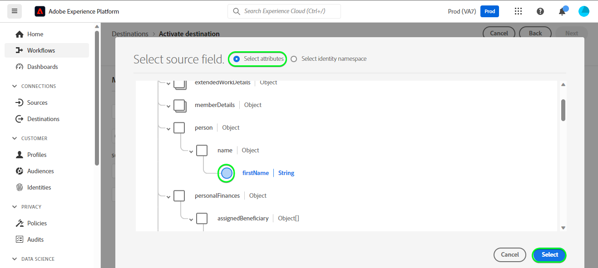

# Connessione [!DNL HubSpot]

[[!DNL HubSpot]](https://www.hubspot.com) è una piattaforma CRM con tutti i software, le integrazioni e le risorse necessarie per collegare marketing, vendite, content management e servizio clienti. Ti consente di collegare dati, team e clienti su un’unica piattaforma di gestione delle relazioni con i clienti.

Questo [!DNL Adobe Experience Platform] [destinazione](/help/destinations/home.md) sfrutta [[!DNL HubSpot] API Contatti](https://developers.hubspot.com/docs/api/crm/contacts), per aggiornare i contatti in [!DNL HubSpot] da un pubblico Experience Platform esistente dopo l’attivazione.

Istruzioni per l’autenticazione [!DNL HubSpot] sono riportati di seguito, nella [Autentica nella destinazione](#authenticate) sezione.

## Casi d’uso {#use-cases}

Per aiutarti a capire meglio come e quando utilizzare il [!DNL HubSpot] destinazione: ecco un caso d’uso di esempio che i clienti di Adobe Experience Platform possono risolvere utilizzando questa destinazione.

[!DNL HubSpot] I contatti memorizzano informazioni sulle persone che interagiscono con la tua azienda. Il tuo team utilizza i contatti esistenti in [!DNL HubSpot] per generare il pubblico Experienci Platform. Dopo aver inviato questi tipi di pubblico a [!DNL HubSpot], le loro informazioni vengono aggiornate e a ogni contatto viene assegnata una proprietà il cui valore è il nome del pubblico che indica a quale pubblico appartiene il contatto.

## Prerequisiti {#prerequisites}

Consulta le sezioni seguenti per eventuali prerequisiti da impostare in Experienci Platform e [!DNL HubSpot] e per le informazioni che è necessario raccogliere prima di lavorare con [!DNL HubSpot] destinazione.

### Experience Platform prerequisiti {#prerequisites-in-experience-platform}

Prima di attivare i dati in [!DNL HubSpot] destinazione, è necessario disporre di un [schema](/help/xdm/schema/composition.md), a [set di dati](https://experienceleague.adobe.com/docs/platform-learn/tutorials/data-ingestion/create-datasets-and-ingest-data.html?lang=en), e [audience](https://experienceleague.adobe.com/docs/platform-learn/tutorials/audiences/create-audiences.html?lang=en) creato in [!DNL Experience Platform].

Consulta la documentazione di Experienci Platform per [Gruppo di campi schema Dettagli appartenenza pubblico](/help/xdm/field-groups/profile/segmentation.md) per informazioni sugli stati del pubblico.

### Prerequisiti per [!DNL HubSpot] destinazione {#prerequisites-destination}

Prendi nota dei seguenti prerequisiti per esportare i dati da Platform al tuo [!DNL HubSpot] account:

#### È necessario disporre di [!DNL HubSpot] account {#prerequisites-account}

Per esportare i dati da Platform al tuo [!DNL Hubspot] account necessario disporre di [!DNL HubSpot] account. Se non ne hai già uno, visita il [Configurare l’account HubSpot](https://knowledge.hubspot.com/get-started/set-up-your-account) e seguire le istruzioni per registrarsi e creare il proprio account.

#### Raccogliere il [!DNL HubSpot] token di accesso all’app privata {#gather-credentials}

Hai bisogno del tuo [!DNL HubSpot] `Access token` per consentire [!DNL HubSpot] destinazione per effettuare chiamate API tramite il [!DNL HubSpot] app privata all’interno del tuo [!DNL HubSpot] account. Il `Access token` funge da `Bearer token` quando [autentica la destinazione](#authenticate).

Se non disponi di un’app privata, consulta la documentazione per [Creare un’app privata in [!DNL HubSpot]](https://developers.hubspot.com/docs/api/private-apps).

>[!IMPORTANT]
>
> All&#39;app privata devono essere assegnati gli ambiti seguenti:
> `crm.objects.contacts.write`, `crm.objects.contacts.read`
> `crm.schemas.contacts.write`, `crm.schemas.contacts.read`

| Credenziali | Descrizione | Esempio |
| --- | --- | --- |
| `Bearer token` | Il `Access token` del tuo [!DNL HubSpot] app privata.  Per ottenere [!DNL HubSpot] `Access token` seguire la [!DNL HubSpot] documentazione per [effettuare chiamate API con il token di accesso dell&#39;app](https://developers.hubspot.com/docs/api/private-apps#make-api-calls-with-your-app-s-access-token). | `pat-na1-11223344-abcde-12345-9876-1234a1b23456` |

## Guardrail {#guardrails}

[!DNL HubSpot] le app private sono soggette a [Limiti di velocità](https://developers.hubspot.com/docs/api/usage-details). Il numero di chiamate che l’app privata può effettuare è basato sul tuo [!DNL HubSpot] l’abbonamento all’account e se hai acquistato il componente aggiuntivo API. Inoltre, fai riferimento a [Altri limiti](https://developers.hubspot.com/docs/api/usage-details#other-limits).

## Identità supportate {#supported-identities}

[!DNL HubSpot] supporta l’aggiornamento delle identità descritte nella tabella seguente. Ulteriori informazioni su [identità](/help/identity-service/namespaces.md).

| Identità di destinazione | Esempio | Descrizione | Considerazioni |
|---|---|---|---|
| `email` | `test@test.com` | Indirizzo e-mail del contatto. | Obbligatorio |

## Tipi di pubblico supportati {#supported-audiences}

Questa sezione descrive tutti i tipi di pubblico che puoi esportare in questa destinazione.

Questa destinazione supporta l’attivazione di tutti i tipi di pubblico generati tramite l’Experience Platform [Servizio di segmentazione](../../../segmentation/home.md).

Questa destinazione supporta anche l’attivazione dei tipi di pubblico descritti nella tabella seguente.

| Tipo di pubblico | Descrizione |
---------|----------|
| Caricamenti personalizzati | Tipi di pubblico [importato](../../../segmentation/ui/overview.md#import-audience) in Experienci Platform da file CSV. |

{style="table-layout:auto"}

## Tipo e frequenza di esportazione {#export-type-frequency}

Per informazioni sul tipo e sulla frequenza di esportazione della destinazione, consulta la tabella seguente.

| Elemento | Tipo | Note |
---------|----------|---------|
| Tipo di esportazione | **[!UICONTROL Basato su profilo]** | <ul><li>Stai esportando tutti i membri di un pubblico, insieme ai campi di schema desiderati *ad esempio: indirizzo e-mail, numero di telefono, cognome*, in base alla mappatura del campo.</li><li> Inoltre, viene creata una nuova proprietà in [!DNL HubSpot] l’utilizzo del nome e del valore del pubblico avviene con il corrispondente stato del pubblico da Platform, per ciascuno dei tipi di pubblico selezionati.</li></ul> |
| Frequenza di esportazione | **[!UICONTROL Streaming]** | <ul><li>Le destinazioni di streaming sono connessioni &quot;sempre attive&quot; basate su API. Non appena un profilo viene aggiornato in Experienci Platform in base alla valutazione del pubblico, il connettore invia l’aggiornamento a valle alla piattaforma di destinazione. Ulteriori informazioni su [destinazioni di streaming](/help/destinations/destination-types.md#streaming-destinations).</li></ul> |

{style="table-layout:auto"}

## Connetti alla destinazione {#connect}

>[!IMPORTANT]
>
>Per connettersi alla destinazione, è necessario **[!UICONTROL Gestire le destinazioni]** [autorizzazione per il controllo degli accessi](/help/access-control/home.md#permissions). Leggi le [panoramica sul controllo degli accessi](/help/access-control/ui/overview.md) oppure contatta l’amministratore del prodotto per ottenere le autorizzazioni necessarie.

Per connettersi a questa destinazione, seguire i passaggi descritti in [esercitazione sulla configurazione della destinazione](../../ui/connect-destination.md). Nel flusso di lavoro di configurazione della destinazione, compila i campi elencati nelle due sezioni seguenti.

Entro **[!UICONTROL Destinazioni]** > **[!UICONTROL Catalogo]** cerca [!DNL HubSpot]. In alternativa, è possibile posizionarlo sotto il **[!UICONTROL CRM]** categoria.

### Autentica nella destinazione {#authenticate}

Compila i campi obbligatori di seguito. Consulta la sezione [Raccogliere il [!DNL HubSpot] token di accesso all’app privata](#gather-credentials) sezione per eventuali indicazioni.
* **[!UICONTROL Token Bearer]**: token di accesso per [!DNL HubSpot] app privata.

Per eseguire l’autenticazione nella destinazione, seleziona **[!UICONTROL Connetti alla destinazione]**.

Se i dettagli forniti sono validi, nell’interfaccia utente viene visualizzato un **[!UICONTROL Connesso]** con un segno di spunta verde. A questo punto è possibile procedere al passaggio successivo.

### Inserisci i dettagli della destinazione {#destination-details}

Per configurare i dettagli per la destinazione, compila i campi obbligatori e facoltativi seguenti. Un asterisco accanto a un campo nell’interfaccia utente indica che il campo è obbligatorio.

* **[!UICONTROL Nome]**: nome con cui riconoscerai questa destinazione in futuro.
* **[!UICONTROL Descrizione]**: descrizione che ti aiuterà a identificare questa destinazione in futuro.

### Abilita avvisi {#enable-alerts}

Puoi abilitare gli avvisi per ricevere notifiche sullo stato del flusso di dati verso la tua destinazione. Seleziona un avviso dall’elenco per abbonarti e ricevere notifiche sullo stato del flusso di dati. Per ulteriori informazioni sugli avvisi, consulta la guida su [abbonamento agli avvisi sulle destinazioni tramite l’interfaccia utente](../../ui/alerts.md).

Una volta completate le informazioni sulla connessione di destinazione, seleziona **[!UICONTROL Successivo]**.

## Attiva il pubblico in questa destinazione {#activate}

>[!IMPORTANT]
>
>Per attivare i dati, è necessario **[!UICONTROL Gestire le destinazioni]**, **[!UICONTROL Attivare le destinazioni]**, **[!UICONTROL Visualizza profili]**, e **[!UICONTROL Visualizzare segmenti]** [autorizzazioni di controllo degli accessi](/help/access-control/home.md#permissions). Leggi le [panoramica sul controllo degli accessi](/help/access-control/ui/overview.md) oppure contatta l’amministratore del prodotto per ottenere le autorizzazioni necessarie.

Letto [Attiva profili e tipi di pubblico nelle destinazioni di esportazione del pubblico in streaming](/help/destinations/ui/activate-segment-streaming-destinations.md) per istruzioni sull’attivazione dei tipi di pubblico in questa destinazione.

### Mappare attributi e identità {#map}

Per inviare correttamente i dati sul pubblico da Adobe Experience Platform a [!DNL HubSpot] destinazione, devi passare attraverso il passaggio di mappatura campo. La mappatura consiste nella creazione di un collegamento tra i campi dello schema Experience Data Model (XDM) nell’account Platform e i corrispondenti equivalenti dalla destinazione.

Per mappare correttamente i campi XDM su [!DNL HubSpot] campi di destinazione, segui i passaggi seguenti:

#### Mappatura di `Email` identità

Il `Email` identity è una mappatura obbligatoria per questa destinazione. Segui i passaggi seguenti per mapparla:
1. In **[!UICONTROL Mappatura]** passaggio, seleziona **[!UICONTROL Aggiungi nuova mappatura]**. Ora è possibile visualizzare una nuova riga di mappatura sullo schermo.
   
1. In **[!UICONTROL Seleziona campo di origine]** finestra, scegli la **[!UICONTROL Seleziona lo spazio dei nomi dell’identità]** e seleziona un’identità.
   
1. In **[!UICONTROL Seleziona campo di destinazione]** finestra, scegli la **[!UICONTROL Seleziona attributi]** e seleziona `email`.
   

| Campo di origine | Campo di destinazione | Obbligatorio |
| --- | --- | --- |
| `IdentityMap: Email` | `Identity: email` | Sì |

Di seguito è riportato un esempio con la mappatura di identità:

#### Mappatura **facoltativo** attributi

Per aggiungere altri attributi che desideri aggiornare tra lo schema del profilo XDM e il [!DNL HubSpot] ripeti i passaggi seguenti:
1. In **[!UICONTROL Mappatura]** passaggio, seleziona **[!UICONTROL Aggiungi nuova mappatura]**. Ora è possibile visualizzare una nuova riga di mappatura sullo schermo.
   
1. In **[!UICONTROL Seleziona campo di origine]** finestra, scegli la **[!UICONTROL Seleziona attributi]** e selezionare l&#39;attributo XDM.
   
1. In **[!UICONTROL Seleziona campo di destinazione]** finestra, scegli **[!UICONTROL Seleziona attributi]** e selezionarli dall&#39;elenco di attributi che vengono compilati automaticamente [!DNL HubSpot] account. La destinazione utilizza [[!DNL HubSpot] Proprietà](https://developers.hubspot.com/docs/api/crm/properties) API per recuperare queste informazioni. Entrambi [!DNL HubSpot] [proprietà predefinite](https://knowledge.hubspot.com/contacts/hubspots-default-contact-properties) ed eventuali proprietà personalizzate vengono recuperate per la selezione come campi di destinazione.
   

Alcune mappature disponibili tra lo schema del profilo XDM e [!DNL Hubspot] sono mostrati di seguito:

| Campo di origine | Campo di destinazione |
| --- | --- |
| `xdm: person.name.firstName` | `Attribute: firstname` |
| `xdm: person.name.lastName` | `Attribute: lastname` |
| `xdm: workAddress.street1` | `Attribute: address` |
| `xdm: workAddress.city` | `Attribute: city` |
| `xdm: workAddress.country` | `Attribute: country` |

Di seguito è riportato un esempio che utilizza queste mappature di attributi:

Una volta completate le mappature per la connessione di destinazione, seleziona **[!UICONTROL Successivo]**.

## Convalidare l’esportazione dei dati {#exported-data}

Per verificare di aver impostato correttamente la destinazione, segui i passaggi seguenti:

1. Accedi a [!DNL HubSpot] , quindi passare al **[!UICONTROL Contatti]** per verificare gli stati del pubblico. Questo elenco può essere configurato in modo da visualizzare le colonne per le proprietà personalizzate create con il nome del pubblico, il cui valore corrisponde agli stati del pubblico.
   

1. In alternativa, puoi eseguire un drill-down in un singolo **[!UICONTROL Persona]** e passa alle proprietà che visualizzano il nome e gli stati del pubblico.
   

## Utilizzo dei dati e governance {#data-usage-governance}

Tutti [!DNL Adobe Experience Platform] le destinazioni sono conformi ai criteri di utilizzo dei dati durante la gestione dei dati. Per informazioni dettagliate su come [!DNL Adobe Experience Platform] applica la governance dei dati, consulta la sezione [Panoramica sulla governance dei dati](/help/data-governance/home.md).

## Risorse aggiuntive {#additional-resources}

Ulteriori informazioni utili da [!DNL HubSpot] la documentazione è riportata di seguito:
* [Metodi di autenticazione in HubSpot](https://developers.hubspot.com/docs/api/intro-to-auth)
* [!DNL HubSpot] Riferimenti API per [Contatti](https://developers.hubspot.com/docs/api/crm/contacts) e [Proprietà](https://developers.hubspot.com/docs/api/crm/properties) API.

### Changelog

Questa sezione acquisisce le funzionalità e i significativi aggiornamenti alla documentazione apportati al connettore di destinazione.

+++ Visualizza changelog

| Mese di rilascio | Tipo di aggiornamento | Descrizione |
|---|---|---|
| Settembre 2023 | Versione iniziale | Versione di destinazione iniziale e pubblicazione della documentazione. |

{style="table-layout:auto"}

+++