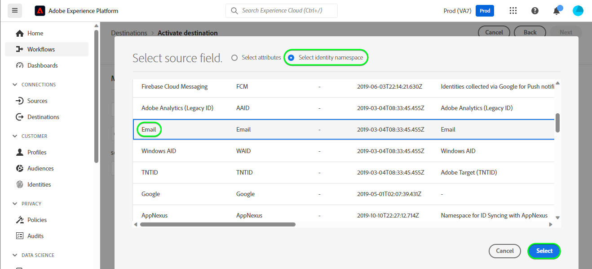

# Connessione [!DNL HubSpot]

[[!DNL HubSpot]](https://www.hubspot.com) è una piattaforma CRM con tutti i software, le integrazioni e le risorse necessarie per collegare marketing, vendite, content management e servizio clienti. Ti consente di collegare dati, team e clienti su un’unica piattaforma di gestione delle relazioni con i clienti.

Questa [!DNL Adobe Experience Platform] [destinazione](/help/destinations/home.md) sfrutta l&#39;API [[!DNL HubSpot] Contatti](https://developers.hubspot.com/docs/api/crm/contacts) per aggiornare i contatti in [!DNL HubSpot] da un pubblico Experience Platform esistente dopo l&#39;attivazione.

Le istruzioni per l&#39;autenticazione nell&#39;istanza [!DNL HubSpot] sono riportate di seguito, nella sezione [Autentica nella destinazione](#authenticate).

## Casi d’uso {#use-cases}

Per aiutarti a capire meglio come e quando utilizzare la destinazione [!DNL HubSpot], ecco un esempio di caso d&#39;uso che i clienti Adobe Experience Platform possono risolvere utilizzando questa destinazione.

I contatti di [!DNL HubSpot] memorizzano informazioni sulle persone che interagiscono con la tua azienda. Il tuo team utilizza i contatti esistenti in [!DNL HubSpot] per generare i tipi di pubblico Experienci Platform. Dopo aver inviato questi tipi di pubblico a [!DNL HubSpot], le informazioni vengono aggiornate e a ogni contatto viene assegnata una proprietà con il relativo valore come nome del pubblico che indica a quale pubblico appartiene il contatto.

## Prerequisiti {#prerequisites}

Consultare le sezioni seguenti per eventuali prerequisiti da impostare in Experience Platform e [!DNL HubSpot] e per informazioni da raccogliere prima di utilizzare la destinazione [!DNL HubSpot].

### Experience Platform prerequisiti {#prerequisites-in-experience-platform}

Prima di attivare i dati nella destinazione [!DNL HubSpot], è necessario disporre di uno [schema](/help/xdm/schema/composition.md), un [set di dati](https://experienceleague.adobe.com/docs/platform-learn/tutorials/data-ingestion/create-datasets-and-ingest-data.html) e [tipi di pubblico](https://experienceleague.adobe.com/docs/platform-learn/tutorials/audiences/create-audiences.html) creati in [!DNL Experience Platform].

Se hai bisogno di indicazioni sugli stati del pubblico, consulta la documentazione di Experience Platform per il gruppo di campi dello schema [Dettagli appartenenza pubblico](/help/xdm/field-groups/profile/segmentation.md).

### Prerequisiti per la destinazione [!DNL HubSpot] {#prerequisites-destination}

Per esportare i dati da Platform al tuo account [!DNL HubSpot], tieni presente i seguenti prerequisiti:

#### Devi avere un account [!DNL HubSpot] {#prerequisites-account}

Per esportare i dati da Platform all&#39;account [!DNL Hubspot], è necessario disporre di un account [!DNL HubSpot]. Se non ne hai già uno, visita la pagina [Configura il tuo account HubSpot](https://knowledge.hubspot.com/get-started/set-up-your-account) e segui le indicazioni per registrarti e creare il tuo account.

#### Raccogli il token di accesso all&#39;app privata [!DNL HubSpot] {#gather-credentials}

È necessario [!DNL HubSpot] `Access token` per consentire alla destinazione [!DNL HubSpot] di effettuare chiamate API tramite l&#39;app privata [!DNL HubSpot] all&#39;interno dell&#39;account [!DNL HubSpot]. `Access token` funge da `Bearer token` quando [autentichi la destinazione](#authenticate).

Se non hai un&#39;app privata, segui la documentazione per [creare un&#39;app privata in [!DNL HubSpot]](https://developers.hubspot.com/docs/api/private-apps).

>[!IMPORTANT]
>
> All&#39;app privata devono essere assegnati gli ambiti seguenti:
> `crm.objects.contacts.write`, `crm.objects.contacts.read`
> `crm.schemas.contacts.write`, `crm.schemas.contacts.read`

| Credenziali | Descrizione | Esempio |
| --- | --- | --- |
| `Bearer token` | `Access token` dell&#39;app privata [!DNL HubSpot].  Per ottenere [!DNL HubSpot] `Access token`, segui la documentazione di [!DNL HubSpot] per [effettuare chiamate API con il token di accesso dell&#39;app](https://developers.hubspot.com/docs/api/private-apps#make-api-calls-with-your-app-s-access-token). | `pat-na1-11223344-abcde-12345-9876-1234a1b23456` |

## Guardrail {#guardrails}

[!DNL HubSpot] app private sono soggette a [Limiti di frequenza](https://developers.hubspot.com/docs/api/usage-details). Il numero di chiamate che l&#39;app privata può effettuare dipende dalla sottoscrizione dell&#39;account [!DNL HubSpot] e dall&#39;acquisto del componente aggiuntivo API. Inoltre, fai riferimento a [Altri limiti](https://developers.hubspot.com/docs/api/usage-details#other-limits).

## Identità supportate {#supported-identities}

[!DNL HubSpot] supporta l&#39;aggiornamento delle identità descritte nella tabella seguente. Ulteriori informazioni su [identità](/help/identity-service/features/namespaces.md).

| Identità di destinazione | Esempio | Descrizione | Considerazioni |
|---|---|---|---|
| `email` | `test@test.com` | Indirizzo e-mail del contatto. | Obbligatorio |

## Tipi di pubblico supportati {#supported-audiences}

Questa sezione descrive tutti i tipi di pubblico che puoi esportare in questa destinazione.

Questa destinazione supporta l&#39;attivazione di tutti i tipi di pubblico generati tramite l&#39;Experience Platform [Servizio di segmentazione](../../../segmentation/home.md).

Questa destinazione supporta anche l’attivazione dei tipi di pubblico descritti nella tabella seguente.

| Tipo di pubblico | Descrizione |
|---------|----------|
| Caricamenti personalizzati | Tipi di pubblico [importati](../../../segmentation/ui/audience-portal.md#import-audience) in Experience Platform da file CSV. |

{style="table-layout:auto"}

## Tipo e frequenza di esportazione {#export-type-frequency}

Per informazioni sul tipo e sulla frequenza di esportazione della destinazione, consulta la tabella seguente.

| Elemento | Tipo | Note |
---------|----------|---------|
| Tipo di esportazione | **[!UICONTROL Basato su profilo]** | <ul><li>Stai esportando tutti i membri di un pubblico, insieme ai campi di schema desiderati *(ad esempio: indirizzo e-mail, numero di telefono, cognome)*, in base al mapping dei campi.</li><li> Inoltre, in [!DNL HubSpot] viene creata una nuova proprietà che utilizza il nome del pubblico e il cui valore corrisponde allo stato del pubblico di Platform, per ciascuno dei tipi di pubblico selezionati.</li></ul> |
| Frequenza di esportazione | **[!UICONTROL Streaming]** | <ul><li>Le destinazioni di streaming sono connessioni &quot;sempre attive&quot; basate su API. Non appena un profilo viene aggiornato in Experience Platform in base alla valutazione del pubblico, il connettore invia l’aggiornamento a valle alla piattaforma di destinazione. Ulteriori informazioni sulle [destinazioni di streaming](/help/destinations/destination-types.md#streaming-destinations).</li></ul> |

{style="table-layout:auto"}

## Connettersi alla destinazione {#connect}

>[!IMPORTANT]
>
>Per connettersi alla destinazione, sono necessarie le **[!UICONTROL Destinazioni visualizzazione]** e le **[!UICONTROL Autorizzazioni di gestione delle destinazioni]** [per il controllo degli accessi](/help/access-control/home.md#permissions). Leggi la [panoramica sul controllo degli accessi](/help/access-control/ui/overview.md) o contatta l&#39;amministratore del prodotto per ottenere le autorizzazioni necessarie.

Per connettersi a questa destinazione, seguire i passaggi descritti nell&#39;esercitazione [sulla configurazione della destinazione](../../ui/connect-destination.md). Nel flusso di lavoro di configurazione della destinazione, compila i campi elencati nelle due sezioni seguenti.

All&#39;interno di **[!UICONTROL Destinazioni]** > **[!UICONTROL Catalogo]**, cerca [!DNL HubSpot]. In alternativa, è possibile individuarlo nella categoria **[!UICONTROL CRM]**.

### Autenticarsi nella destinazione {#authenticate}

Compila i campi obbligatori di seguito. Per ulteriori informazioni, consulta la sezione [Raccogliere il  [!DNL HubSpot] token di accesso all&#39;app privata](#gather-credentials).
* **[!UICONTROL Token Bearer]**: il token di accesso per l&#39;app privata [!DNL HubSpot].

Per eseguire l&#39;autenticazione nella destinazione, selezionare **[!UICONTROL Connetti alla destinazione]**.

Se i dettagli forniti sono validi, nell&#39;interfaccia utente viene visualizzato lo stato **[!UICONTROL Connesso]** con un segno di spunta verde. A questo punto è possibile procedere al passaggio successivo.

### Inserire i dettagli della destinazione {#destination-details}

Per configurare i dettagli per la destinazione, compila i campi obbligatori e facoltativi seguenti. Un asterisco accanto a un campo nell’interfaccia utente indica che il campo è obbligatorio.

* **[!UICONTROL Nome]**: un nome con cui riconoscerai questa destinazione in futuro.
* **[!UICONTROL Descrizione]**: una descrizione che ti aiuterà a identificare questa destinazione in futuro.

### Abilita avvisi {#enable-alerts}

Puoi abilitare gli avvisi per ricevere notifiche sullo stato del flusso di dati verso la tua destinazione. Seleziona un avviso dall’elenco per abbonarti e ricevere notifiche sullo stato del flusso di dati. Per ulteriori informazioni sugli avvisi, consulta la guida su [abbonamento a destinazioni avvisi tramite l&#39;interfaccia utente](../../ui/alerts.md).

Dopo aver fornito i dettagli per la connessione di destinazione, seleziona **[!UICONTROL Avanti]**.

## Attivare tipi di pubblico in questa destinazione {#activate}

>[!IMPORTANT]
>
>Per attivare i dati, è necessario **[!UICONTROL Visualizza destinazioni]**, **[!UICONTROL Attiva destinazioni]**, **[!UICONTROL Visualizza profili]** e **[!UICONTROL Visualizza segmenti]** [Autorizzazioni di controllo di accesso](/help/access-control/home.md#permissions). Leggi la [panoramica sul controllo degli accessi](/help/access-control/ui/overview.md) o contatta l&#39;amministratore del prodotto per ottenere le autorizzazioni necessarie.

Leggi [Attivare profili e tipi di pubblico nelle destinazioni di esportazione del pubblico di streaming](/help/destinations/ui/activate-segment-streaming-destinations.md) per le istruzioni sull&#39;attivazione dei tipi di pubblico in questa destinazione.

### Mappare attributi e identità {#map}

Per inviare correttamente i dati sul pubblico da Adobe Experience Platform alla destinazione [!DNL HubSpot], è necessario eseguire il passaggio di mappatura dei campi. La mappatura consiste nella creazione di un collegamento tra i campi dello schema Experience Data Model (XDM) nell’account Platform e i corrispondenti equivalenti dalla destinazione.

Per mappare correttamente i campi XDM ai campi di destinazione [!DNL HubSpot], effettua le seguenti operazioni:

#### Mappatura dell&#39;identità `Email`

L&#39;identità `Email` è una mappatura obbligatoria per questa destinazione. Segui i passaggi seguenti per mapparla:
1. Nel passaggio **[!UICONTROL Mapping]**, seleziona **[!UICONTROL Aggiungi nuovo mapping]**. Ora è possibile visualizzare una nuova riga di mappatura sullo schermo.
   
1. Nella finestra **[!UICONTROL Seleziona campo di origine]**, scegli **[!UICONTROL Seleziona spazio dei nomi identità]** e seleziona un&#39;identità.
   
1. Nella finestra **[!UICONTROL Seleziona campo di destinazione]** scegliere **[!UICONTROL Seleziona attributi]** e selezionare `email`.
   

| Campo origine | Campo di destinazione | Obbligatorio |
| --- | --- | --- |
| `IdentityMap: Email` | `Identity: email` | Sì |

Di seguito è riportato un esempio con la mappatura di identità:

#### Mappatura degli attributi **facoltativi**

Per aggiungere altri attributi da aggiornare tra lo schema del profilo XDM e l&#39;account [!DNL HubSpot], ripetere i passaggi seguenti:
1. Nel passaggio **[!UICONTROL Mapping]**, seleziona **[!UICONTROL Aggiungi nuovo mapping]**. Ora è possibile visualizzare una nuova riga di mappatura sullo schermo.
   
1. Nella finestra **[!UICONTROL Seleziona campo di origine]**, scegli la categoria **[!UICONTROL Seleziona attributi]** e seleziona l&#39;attributo XDM.
   
1. Nella finestra **[!UICONTROL Seleziona campo di destinazione]**, scegli la categoria **[!UICONTROL Seleziona attributi]** e seleziona dall&#39;elenco di attributi che vengono compilati automaticamente dall&#39;account [!DNL HubSpot]. La destinazione utilizza l&#39;API [[!DNL HubSpot] Properties](https://developers.hubspot.com/docs/api/crm/properties) per recuperare queste informazioni. Sia [!DNL HubSpot] [proprietà predefinite](https://knowledge.hubspot.com/contacts/hubspots-default-contact-properties) che eventuali proprietà personalizzate vengono recuperate per la selezione come campi di destinazione.
   

Di seguito sono mostrate alcune mappature disponibili tra lo schema del profilo XDM e [!DNL Hubspot]:

| Campo origine | Campo di destinazione |
| --- | --- |
| `xdm: person.name.firstName` | `Attribute: firstname` |
| `xdm: person.name.lastName` | `Attribute: lastname` |
| `xdm: workAddress.street1` | `Attribute: address` |
| `xdm: workAddress.city` | `Attribute: city` |
| `xdm: workAddress.country` | `Attribute: country` |

Di seguito è riportato un esempio che utilizza queste mappature di attributi:

Al termine della fornitura dei mapping per la connessione di destinazione, selezionare **[!UICONTROL Avanti]**.

## Convalidare l’esportazione dei dati {#exported-data}

Per verificare di aver impostato correttamente la destinazione, segui i passaggi seguenti:

1. Accedi al sito Web [!DNL HubSpot], quindi passa alla pagina **[!UICONTROL Contatti]** per verificare gli stati del pubblico. Questo elenco può essere configurato in modo da visualizzare le colonne per le proprietà personalizzate create con il nome del pubblico, il cui valore corrisponde agli stati del pubblico.
   

1. In alternativa, puoi espandere una singola pagina di **[!UICONTROL Persona]** e passare alle proprietà che visualizzano il nome del pubblico e gli stati del pubblico.
   

## Utilizzo dei dati e governance {#data-usage-governance}

Tutte le destinazioni [!DNL Adobe Experience Platform] sono conformi ai criteri di utilizzo dei dati durante la gestione dei dati. Per informazioni dettagliate su come [!DNL Adobe Experience Platform] applica la governance dei dati, vedi [Panoramica sulla governance dei dati](/help/data-governance/home.md).

## Risorse aggiuntive {#additional-resources}

Di seguito sono riportate ulteriori informazioni utili dalla documentazione di [!DNL HubSpot]:
* [Metodi di autenticazione in HubSpot](https://developers.hubspot.com/docs/api/intro-to-auth)
* [!DNL HubSpot] riferimenti API per le API [Contatti](https://developers.hubspot.com/docs/api/crm/contacts) e [Proprietà](https://developers.hubspot.com/docs/api/crm/properties).

### Changelog

Questa sezione acquisisce le funzionalità e i significativi aggiornamenti alla documentazione apportati al connettore di destinazione.

+++ Visualizza changelog

| Mese di rilascio | Tipo di aggiornamento | Descrizione |
|---|---|---|
| Settembre 2023 | Versione iniziale | Versione di destinazione iniziale e pubblicazione della documentazione. |

{style="table-layout:auto"}

+++
