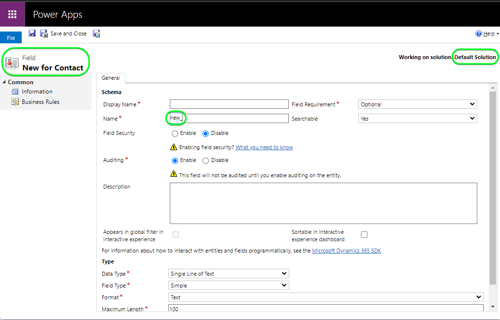
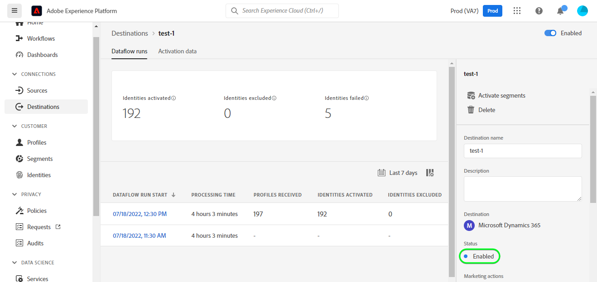

# Connessione [!DNL Microsoft Dynamics 365]

## Panoramica {#overview}

[[!DNL Microsoft Dynamics 365]](https://dynamics.microsoft.com/en-us/) è una piattaforma di applicazioni aziendali basata su cloud che combina la pianificazione delle risorse aziendali (ERP) e la gestione delle relazioni con i clienti (CRM) insieme alle applicazioni di produttività e agli strumenti di intelligenza artificiale, per garantire operazioni complete più fluide e controllate, un migliore potenziale di crescita e costi ridotti.

Questa [!DNL Adobe Experience Platform] [destinazione](/help/destinations/home.md) sfrutta [[!DNL Contact Entity Reference API]](https://docs.microsoft.com/en-us/dynamics365/customerengagement/on-premises/developer/entities/contact?view=op-9-1), che consente di aggiornare le identità all&#39;interno di un pubblico in [!DNL Dynamics 365].

[!DNL Dynamics 365] utilizza OAuth 2 con concessione di autorizzazione come meccanismo di autenticazione per comunicare con [!DNL Contact Entity Reference API]. Le istruzioni per l&#39;autenticazione nell&#39;istanza [!DNL Dynamics 365] sono riportate di seguito, nella sezione [Autentica nella destinazione](#authenticate).

## Casi d’uso {#use-cases}

In qualità di addetto al marketing, puoi fornire esperienze personalizzate ai tuoi utenti, in base agli attributi dei loro profili Adobe Experience Platform. Puoi creare tipi di pubblico dai dati offline e inviarli a [!DNL Dynamics 365] per visualizzarli nei feed degli utenti non appena i tipi di pubblico e i profili vengono aggiornati in Adobe Experience Platform.

## Prerequisiti {#prerequisites}

### Experience Platform prerequisiti {#prerequisites-in-experience-platform}

Prima di attivare i dati nella destinazione [!DNL Dynamics 365], è necessario disporre di uno [schema](/help/xdm/schema/composition.md), un [set di dati](https://experienceleague.adobe.com/docs/platform-learn/tutorials/data-ingestion/create-datasets-and-ingest-data.html) e [tipi di pubblico](https://experienceleague.adobe.com/docs/platform-learn/tutorials/audiences/create-audiences.html) creati in [!DNL Experience Platform].

Se hai bisogno di indicazioni sugli stati del pubblico, consulta la documentazione di Adobe per il gruppo di campi dello schema [Dettagli appartenenza a pubblico](/help/xdm/field-groups/profile/segmentation.md).

### [!DNL Microsoft Dynamics 365] prerequisiti {#prerequisites-destination}

Per esportare i dati da Platform al tuo account [!DNL Dynamics 365], tieni presente i seguenti prerequisiti in [!DNL Dynamics 365]:

#### Devi avere un account [!DNL Microsoft Dynamics 365] {#prerequisites-account}

Vai alla pagina [!DNL Dynamics 365] [prova](https://dynamics.microsoft.com/en-us/dynamics-365-free-trial/) per registrarti e creare un account, se non ne hai già uno.

#### Crea campo in [!DNL Dynamics 365] {#prerequisites-custom-field}

Creare il campo personalizzato di tipo `Simple` con tipo di dati del campo `Single Line of Text` che l&#39;Experience Platform utilizzerà per aggiornare lo stato del pubblico entro [!DNL Dynamics 365].

Per ulteriori informazioni, consulta la documentazione di [!DNL Dynamics 365] [Creare o modificare un campo (attributo)](https://docs.microsoft.com/en-us/dynamics365/customerengagement/on-premises/customize/create-edit-fields?view=op-9-1).

Annotare il **[!UICONTROL prefisso di personalizzazione]** del campo personalizzato creato in [!DNL Dynamics 365]. Questo prefisso sarà necessario durante il passaggio [Compila i dettagli della destinazione](#destination-details). Per ulteriori informazioni, consulta la sezione [Creare e modificare i campi](https://learn.microsoft.com/en-us/dynamics365/customerengagement/on-premises/customize/create-edit-fields?view=op-9-1#create-and-edit-fields) della documentazione di [!DNL Dynamics 365].

Di seguito è riportato un esempio di configurazione in [!DNL Dynamics 365]:

#### Registrare un&#39;applicazione e un utente dell&#39;applicazione in Azure Active Directory {#prerequisites-app-user}

Per consentire a [!DNL Dynamics 365] di accedere alle risorse, è necessario accedere con [!DNL Azure Account] a [[!DNL Azure Active Directory]](https://docs.microsoft.com/en-us/azure/active-directory/develop/howto-create-service-principal-portal#register-an-application-with-azure-ad-and-create-a-service-principal) e creare quanto segue:
* Applicazione [!DNL Azure Active Directory]
* Un&#39;entità servizio
* Segreto applicazione

Sarà inoltre necessario [creare un utente dell&#39;applicazione](https://docs.microsoft.com/en-us/power-platform/admin/manage-application-users#create-an-application-user) in [!DNL Azure Active Directory] e associarlo all&#39;applicazione appena creata.

#### Raccogli [!DNL Dynamics 365] credenziali {#gather-credentials}

Annotare gli elementi riportati di seguito prima di eseguire l&#39;autenticazione nella destinazione CRM [!DNL Dynamics 365]:

| Credenziali | Descrizione | Esempio |
| --- | --- | --- |
| `Client ID` | L&#39;ID client [!DNL Dynamics 365] per l&#39;applicazione [!DNL Azure Active Directory]. Consulta la [[!DNL Dynamics 365] documentazione](https://docs.microsoft.com/en-us/azure/active-directory/develop/howto-create-service-principal-portal#get-tenant-and-app-id-values-for-signing-in) per maggiori informazioni. | `ababbaba-abab-baba-acac-acacacacacac` |
| `Client Secret` | Il segreto client [!DNL Dynamics 365] per l&#39;applicazione [!DNL Azure Active Directory]. Stai utilizzando l&#39;opzione #2 nella [[!DNL Dynamics 365] documentazione](https://docs.microsoft.com/en-us/azure/active-directory/develop/howto-create-service-principal-portal#authentication-two-options). | `abcde~abcdefghijklmnopqrstuvwxyz12345678` come guida. |
| `Tenant ID` | L&#39;ID tenant [!DNL Dynamics 365] per l&#39;applicazione [!DNL Azure Active Directory]. Consulta la [[!DNL Dynamics 365] documentazione](https://docs.microsoft.com/en-us/azure/active-directory/develop/howto-create-service-principal-portal#get-tenant-and-app-id-values-for-signing-in) per maggiori informazioni. | `1234567-aaaa-12ab-ba21-1234567890` |
| `Region` | L’area Microsoft associata all’URL dell’ambiente.  Consulta la [[!DNL Dynamics 365] documentazione](https://learn.microsoft.com/en-us/power-platform/admin/new-datacenter-regions). | Se il dominio è il seguente, devi fornire il valore evidenziato per il campo CRM nel selettore a discesa durante l&#39;autenticazione nella [destinazione](#authenticate).  *org57771b33.`crm`.dynamics.com*  Ad esempio: se il provisioning della tua società è eseguito nell&#39;area Nord America (NAM), l&#39;URL sarà `crm.dynamics.com` e dovrai selezionare `crm`. Se la società dispone del provisioning nell&#39;area canadese (CAN), l&#39;URL sarà `crm3.dynamics.com` e sarà necessario selezionare `crm3`. |
| `Environment URL` | Consulta la [[!DNL Dynamics 365] documentazione](https://docs.microsoft.com/en-us/dynamics365/customerengagement/on-premises/developer/org-service/discover-url-organization-organization-service?view=op-9-1) per maggiori informazioni. | Se il dominio [!DNL Dynamics 365] è il seguente, è necessario il valore evidenziato.  *`org57771b33`.crm.dynamics.com* |

{style="table-layout:auto"}

## Guardrail {#guardrails}

Nella pagina [Limiti delle richieste e allocazioni](https://docs.microsoft.com/en-us/power-platform/admin/api-request-limits-allocations) sono illustrati i limiti API [!DNL Dynamics 365] associati alla licenza [!DNL Dynamics 365]. Assicurati che i dati e il payload rientrino in questi vincoli.

## Identità supportate {#supported-identities}

[!DNL Dynamics 365] supporta l&#39;aggiornamento delle identità descritte nella tabella seguente. Ulteriori informazioni su [identità](/help/identity-service/features/namespaces.md).

| Identità di destinazione | Esempio | Descrizione | Considerazioni |
|---|---|---|---|
| `contactid` | 7eb682f1-ca75-e511-80d4-00155d2a68d1 | Identificatore univoco di un contatto. | **Obbligatorio**. Per ulteriori informazioni, consulta la [[!DNL Dynamics 365] documentazione](https://docs.microsoft.com/en-us/dynamics365/customerengagement/on-premises/developer/entities/contact?view=op-9-1). |

{style="table-layout:auto"}

## Tipi di pubblico supportati {#supported-audiences}

Questa sezione descrive tutti i tipi di pubblico che puoi esportare in questa destinazione.

Questa destinazione supporta l&#39;attivazione di tutti i tipi di pubblico generati tramite l&#39;Experience Platform [Servizio di segmentazione](../../../segmentation/home.md).

## Tipo e frequenza di esportazione {#export-type-frequency}

Per informazioni sul tipo e sulla frequenza di esportazione della destinazione, consulta la tabella seguente.

| Elemento | Tipo | Note |
---------|----------|---------|
| Tipo di esportazione | **[!UICONTROL Basato su profilo]** | <ul><li>Stai esportando tutti i membri di un pubblico, insieme ai campi di schema desiderati *(ad esempio: indirizzo e-mail, numero di telefono, cognome)*, in base al mapping dei campi.</li><li> Ogni stato del pubblico in [!DNL Dynamics 365] viene aggiornato con lo stato del pubblico corrispondente da Platform, in base al valore **[!UICONTROL ID mappatura]** fornito durante il passaggio [pianificazione del pubblico](#schedule-audience-export-example).</li></ul> |
| Frequenza di esportazione | **[!UICONTROL Streaming]** | <ul><li>Le destinazioni di streaming sono connessioni &quot;sempre attive&quot; basate su API. Non appena un profilo viene aggiornato in Experience Platform in base alla valutazione del pubblico, il connettore invia l’aggiornamento a valle alla piattaforma di destinazione. Ulteriori informazioni sulle [destinazioni di streaming](/help/destinations/destination-types.md#streaming-destinations).</li></ul> |

{style="table-layout:auto"}

## Connettersi alla destinazione {#connect}

>[!IMPORTANT]
>
>Per connettersi alla destinazione, sono necessarie le **[!UICONTROL Destinazioni visualizzazione]** e le **[!UICONTROL Autorizzazioni di gestione delle destinazioni]** [per il controllo degli accessi](/help/access-control/home.md#permissions). Leggi la [panoramica sul controllo degli accessi](/help/access-control/ui/overview.md) o contatta l&#39;amministratore del prodotto per ottenere le autorizzazioni necessarie.

Per connettersi a questa destinazione, seguire i passaggi descritti nell&#39;esercitazione [sulla configurazione della destinazione](../../ui/connect-destination.md). Nel flusso di lavoro di configurazione della destinazione, compila i campi elencati nelle due sezioni seguenti.

All&#39;interno di **[!UICONTROL Destinazioni]** > **[!UICONTROL Catalogo]**, cerca [!DNL Dynamics 365]. In alternativa, è possibile individuarlo nella categoria **[!UICONTROL CRM]**.

### Autenticarsi nella destinazione {#authenticate}

Per eseguire l&#39;autenticazione nella destinazione, selezionare **[!UICONTROL Connetti alla destinazione]**.

Compila i campi obbligatori di seguito. Per ulteriori informazioni, consulta la sezione [Raccolta credenziali Dynamics 365](#gather-credentials).
* **[!UICONTROL ID client]**: l&#39;ID client [!DNL Dynamics 365] per l&#39;applicazione [!DNL Azure Active Directory].
* **[!UICONTROL ID tenant]**: l&#39;ID tenant [!DNL Dynamics 365] per l&#39;applicazione [!DNL Azure Active Directory].
* **[!UICONTROL Segreto client]**: Segreto client [!DNL Dynamics 365] per l&#39;applicazione [!DNL Azure Active Directory].
* **[!UICONTROL Area]**: La Tua Area [[!DNL Dynamics 365]](https://learn.microsoft.com/en-us/power-platform/admin/new-datacenter-regions). Ad esempio: se il provisioning della tua società è stato eseguito nell&#39;area Nord America (NAM), l&#39;URL sarà `crm.dynamics.com` e devi selezionare `crm`. Se la società dispone del provisioning nell&#39;area canadese (CAN), l&#39;URL sarà `crm3.dynamics.com` e sarà necessario selezionare `crm3`.
* **[!UICONTROL URL ambiente]**: URL ambiente [!DNL Dynamics 365].

Se i dettagli forniti sono validi, nell&#39;interfaccia utente viene visualizzato lo stato **[!UICONTROL Connesso]** con un segno di spunta verde. A questo punto è possibile procedere al passaggio successivo.

### Inserire i dettagli della destinazione {#destination-details}

Per configurare i dettagli per la destinazione, compila i campi obbligatori e facoltativi seguenti. Un asterisco accanto a un campo nell’interfaccia utente indica che il campo è obbligatorio.

* **[!UICONTROL Nome]**: un nome con cui riconoscerai questa destinazione in futuro.
* **[!UICONTROL Descrizione]**: una descrizione che ti aiuterà a identificare questa destinazione in futuro.
* **[!UICONTROL Prefisso personalizzazione]**: `Customization prefix` del campo personalizzato creato in [!DNL Dynamics 365]. Per ulteriori informazioni, consulta la sezione [Creare e modificare i campi](https://learn.microsoft.com/en-us/dynamics365/customerengagement/on-premises/customize/create-edit-fields?view=op-9-1#create-and-edit-fields) della documentazione di [!DNL Dynamics 365].

### Abilita avvisi {#enable-alerts}

Puoi abilitare gli avvisi per ricevere notifiche sullo stato del flusso di dati verso la tua destinazione. Seleziona un avviso dall’elenco per abbonarti e ricevere notifiche sullo stato del flusso di dati. Per ulteriori informazioni sugli avvisi, consulta la guida su [abbonamento a destinazioni avvisi tramite l&#39;interfaccia utente](../../ui/alerts.md).

Dopo aver fornito i dettagli per la connessione di destinazione, seleziona **[!UICONTROL Avanti]**.

## Attivare tipi di pubblico in questa destinazione {#activate}

>[!IMPORTANT]
> 
>* Per attivare i dati, è necessario **[!UICONTROL Visualizza destinazioni]**, **[!UICONTROL Attiva destinazioni]**, **[!UICONTROL Visualizza profili]** e **[!UICONTROL Visualizza segmenti]** [Autorizzazioni di controllo di accesso](/help/access-control/home.md#permissions). Leggi la [panoramica sul controllo degli accessi](/help/access-control/ui/overview.md) o contatta l&#39;amministratore del prodotto per ottenere le autorizzazioni necessarie.
>* Per esportare *identità*, è necessario disporre dell&#39;autorizzazione **[!UICONTROL Visualizza grafo identità]** [Controllo di accesso](/help/access-control/home.md#permissions).   {width="100" zoomable="yes"}

Leggi [Attivare profili e tipi di pubblico nelle destinazioni di esportazione del pubblico di streaming](/help/destinations/ui/activate-segment-streaming-destinations.md) per le istruzioni sull&#39;attivazione dei tipi di pubblico in questa destinazione.

### Considerazioni sulla mappatura ed esempio {#mapping-considerations-example}

Per inviare correttamente i dati sul pubblico da Adobe Experience Platform alla destinazione [!DNL Dynamics 365], è necessario eseguire il passaggio di mappatura dei campi. La mappatura consiste nella creazione di un collegamento tra i campi dello schema Experience Data Model (XDM) nell’account Platform e i corrispondenti equivalenti dalla destinazione. Per mappare correttamente i campi XDM ai campi di destinazione [!DNL Dynamics 365], effettua le seguenti operazioni:

1. Nel passaggio **[!UICONTROL Mapping]**, seleziona **[!UICONTROL Aggiungi nuovo mapping]**. Viene visualizzata una nuova riga di mappatura.
   

1. Nella finestra **[!UICONTROL Seleziona campo di origine]**, scegli la categoria **[!UICONTROL Seleziona spazio dei nomi identità]** e seleziona `contactid`.
   

1. Nella finestra **[!UICONTROL Seleziona campo di destinazione]**, seleziona il tipo di campo di destinazione a cui vuoi mappare il campo di origine.
   * **[!UICONTROL Seleziona lo spazio dei nomi delle identità]**: seleziona questa opzione per mappare il campo di origine a uno spazio dei nomi delle identità dall&#39;elenco.
     

   * Aggiungi la seguente mappatura tra lo schema del profilo XDM e l&#39;istanza [!DNL Dynamics 365]:
Schema profilo XDM|[!DNL Dynamics 365] istanza| Obbligatorio
|—|—|—|
|`contactid`|`contactid`| Sì |

   * **[!UICONTROL Seleziona attributi personalizzati]**: seleziona questa opzione per mappare il campo di origine a un attributo personalizzato definito nel campo **[!UICONTROL Nome attributo]**. Per un elenco completo degli attributi supportati, consulta la [[!DNL Dynamics 365] documentazione](https://docs.microsoft.com/en-us/dynamics365/customerengagement/on-premises/developer/entities/contact?view=op-9-1#entity-properties).
     

     >[!IMPORTANT]
     >
     > * I nomi dei campi di destinazione devono essere in `lowercase`.
     > * Inoltre, se disponi di un campo sorgente data o marca temporale mappato a un campo di destinazione [!DNL Dynamics 365] [data o marca temporale](https://docs.microsoft.com/en-us/power-apps/developer/data-platform/webapi/reference/timestampdatemapping?view=dataverse-latest), assicurati che il valore mappato non sia vuoto. Se il valore del campo esportato è vuoto, verrà visualizzato un messaggio di errore *`Bad request reported while pushing events to the destination. Please contact the administrator and try again.`* e i dati non verranno aggiornati. Limitazione di [!DNL Dynamics 365].

   * Ad esempio, a seconda dei valori che desideri aggiornare, aggiungi la seguente mappatura tra lo schema del profilo XDM e l&#39;istanza [!DNL Dynamics 365]:
Schema profilo XDM|[!DNL Dynamics 365] istanza|
|—|—|
|`person.name.firstName`|`firstname`|
|`person.name.lastName`|`lastname`|
|`personalEmail.address`|`emailaddress1`|

   * Di seguito è riportato un esempio che utilizza queste mappature:
     

### Esempio di esportazione e pianificazione di un pubblico {#schedule-audience-export-example}

Nel passaggio [[!UICONTROL Pianifica esportazione pubblico]](/help/destinations/ui/activate-segment-streaming-destinations.md#scheduling) del flusso di lavoro di attivazione, devi mappare manualmente i tipi di pubblico di Platform all&#39;attributo del campo personalizzato in [!DNL Dynamics 365].

A questo scopo, seleziona ogni pubblico, quindi immetti l&#39;attributo del campo personalizzato corrispondente da [!DNL Dynamics 365] nel campo **[!UICONTROL ID mappatura]**.

>[!IMPORTANT]
>
>Il valore utilizzato per **[!UICONTROL ID mappatura]** deve corrispondere esattamente al nome dell&#39;attributo del campo personalizzato creato in [!DNL Dynamics 365]. Consulta la [[!DNL Dynamics 365] documentazione](https://docs.microsoft.com/en-us/dynamics365/customerengagement/on-premises/customize/create-edit-fields?view=op-9-1) per informazioni su come trovare gli attributi dei campi personalizzati.

Di seguito è riportato un esempio:

## Convalidare l’esportazione dei dati {#exported-data}

Per verificare di aver impostato correttamente la destinazione, segui i passaggi seguenti:

1. Seleziona **[!UICONTROL Destinazioni]** > **[!UICONTROL Sfoglia]** per passare all&#39;elenco delle destinazioni.
   

1. Selezionare la destinazione e verificare che lo stato sia **[!UICONTROL abilitato]**.
   

1. Passa alla scheda **[!DNL Activation data]**, quindi seleziona un nome di pubblico.
   

1. Controlla il riepilogo del pubblico e assicurati che il conteggio dei profili corrisponda al conteggio creato all’interno del pubblico.
   

1. Accedi al sito Web [!DNL Dynamics 365], quindi passa alla pagina [!DNL Customers] > [!DNL Contacts] e controlla se i profili del pubblico sono stati aggiunti. È possibile vedere che ogni stato del pubblico in [!DNL Dynamics 365] è stato aggiornato con lo stato del pubblico corrispondente da Platform, in base al valore **[!UICONTROL ID mappatura]** fornito durante il passaggio [pianificazione del pubblico](#schedule-audience-export-example).
   

## Utilizzo dei dati e governance {#data-usage-governance}

Tutte le destinazioni [!DNL Adobe Experience Platform] sono conformi ai criteri di utilizzo dei dati durante la gestione dei dati. Per informazioni dettagliate su come [!DNL Adobe Experience Platform] applica la governance dei dati, vedi [Panoramica sulla governance dei dati](/help/data-governance/home.md).

## Errori e risoluzione problemi {#errors-and-troubleshooting}

### Sono stati riscontrati errori sconosciuti durante la trasmissione degli eventi alla destinazione {#unknown-errors}

Durante la verifica di un&#39;esecuzione del flusso di dati, se viene visualizzato il seguente messaggio di errore: `Bad request reported while pushing events to the destination. Please contact the administrator and try again.`

Per correggere questo errore, verifica che l&#39;**[!UICONTROL ID mappatura]** fornito in [!DNL Dynamics 365] per il pubblico di Platform sia valido ed esista in [!DNL Dynamics 365].

## Risorse aggiuntive {#additional-resources}

Ulteriori informazioni utili dalla [[!DNL Dynamics 365] documentazione](https://docs.microsoft.com/en-us/dynamics365/) sono riportate di seguito:
* Metodo [IOrganizationService.Update(Entity)](https://docs.microsoft.com/en-us/dotnet/api/microsoft.xrm.sdk.iorganizationservice.update?view=dataverse-sdk-latest)
* [Aggiornare ed eliminare righe di tabella utilizzando l&#39;API Web](https://docs.microsoft.com/en-us/power-apps/developer/data-platform/webapi/update-delete-entities-using-web-api#basic-update)

### Changelog

Questa sezione acquisisce le funzionalità e i significativi aggiornamenti alla documentazione apportati al connettore di destinazione.

+++ Visualizza changelog

| Mese di rilascio | Tipo di aggiornamento | Descrizione |
|---|---|---|
| Ottobre 2023 | Aggiornamento della documentazione | Sono state aggiornate le indicazioni per indicare che tutti i nomi degli attributi di destinazione devono essere in minuscolo, nel passaggio [Considerazioni sul mapping e esempio](#mapping-considerations-example). |
| Agosto 2023 | Aggiornamento della funzionalità e della documentazione | È stato aggiunto il supporto per [!DNL Dynamics 365] prefissi di campi personalizzati per campi personalizzati non creati nella soluzione predefinita in [!DNL Dynamics 365]. Nel passaggio [Compila i dettagli della destinazione](#destination-details) è stato aggiunto il nuovo campo di input **[!UICONTROL Prefisso personalizzazione]**. (PLATIR-31602). |
| Novembre 2022 | Versione iniziale | Versione di destinazione iniziale e pubblicazione della documentazione. |

{style="table-layout:auto"}

+++