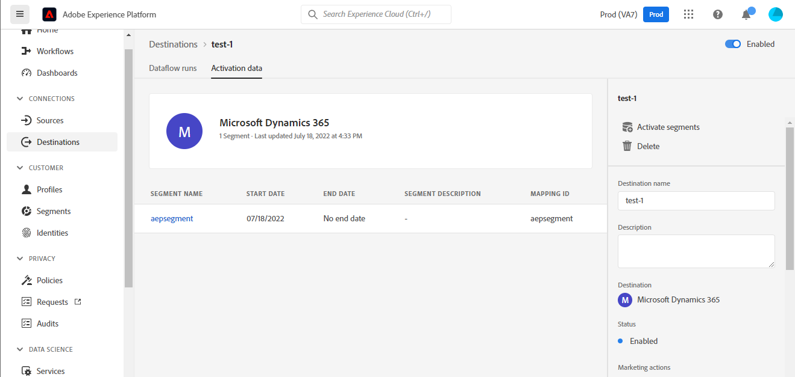

# Connessione [!DNL Microsoft Dynamics 365]

## Panoramica {#overview}

[[!DNL Microsoft Dynamics 365]](https://dynamics.microsoft.com/en-us/) è una piattaforma applicativa aziendale basata su cloud che combina la pianificazione delle risorse aziendali (ERP) e la gestione delle relazioni con i clienti (CRM), insieme alle applicazioni di produttività e agli strumenti di intelligenza artificiale, per garantire operazioni end-to-end più fluide e controllate, un migliore potenziale di crescita e costi ridotti.

Questo [!DNL Adobe Experience Platform] [destinazione](/help/destinations/home.md) sfrutta [[!DNL Contact Entity Reference API]](https://docs.microsoft.com/en-us/dynamics365/customerengagement/on-premises/developer/entities/contact?view=op-9-1), che consente di aggiornare le identità all’interno di un pubblico in [!DNL Dynamics 365].

[!DNL Dynamics 365] utilizza OAuth 2 con Concessione di autorizzazione come meccanismo di autenticazione per comunicare con [!DNL Contact Entity Reference API]. Istruzioni per l’autenticazione [!DNL Dynamics 365] sono riportati di seguito, nella [Autentica nella destinazione](#authenticate) sezione.

## Casi d’uso {#use-cases}

In qualità di addetto al marketing, puoi fornire esperienze personalizzate ai tuoi utenti, in base agli attributi dei loro profili Adobe Experience Platform. Puoi creare tipi di pubblico dai dati offline e inviarli a [!DNL Dynamics 365], per essere visualizzato nei feed degli utenti non appena i tipi di pubblico e i profili vengono aggiornati in Adobe Experience Platform.

## Prerequisiti {#prerequisites}

### Experience Platform prerequisiti {#prerequisites-in-experience-platform}

Prima di attivare i dati in [!DNL Dynamics 365] destinazione, è necessario disporre di un [schema](/help/xdm/schema/composition.md), a [set di dati](https://experienceleague.adobe.com/docs/platform-learn/tutorials/data-ingestion/create-datasets-and-ingest-data.html?lang=it), e [audience](https://experienceleague.adobe.com/docs/platform-learn/tutorials/audiences/create-audiences.html) creato in [!DNL Experience Platform].

Consulta la documentazione di Adobe per [Gruppo di campi schema Dettagli appartenenza pubblico](/help/xdm/field-groups/profile/segmentation.md) per informazioni sugli stati del pubblico.

### [!DNL Microsoft Dynamics 365] prerequisiti {#prerequisites-destination}

Prendi nota dei seguenti prerequisiti in [!DNL Dynamics 365], per esportare i dati da Platform al tuo [!DNL Dynamics 365] account:

#### Devi avere un [!DNL Microsoft Dynamics 365] account {#prerequisites-account}

Vai a [!DNL Dynamics 365] [prova](https://dynamics.microsoft.com/en-us/dynamics-365-free-trial/) per registrarsi e creare un account, se non ne hai già uno.

#### Crea campo in [!DNL Dynamics 365] {#prerequisites-custom-field}

Crea il campo personalizzato di tipo `Simple` con tipo di dati campo come `Single Line of Text` quale Experience Platform utilizzerà per aggiornare lo stato del pubblico in [!DNL Dynamics 365].

Consulta la sezione [!DNL Dynamics 365] [Creare o modificare un campo (attributo)](https://docs.microsoft.com/en-us/dynamics365/customerengagement/on-premises/customize/create-edit-fields?view=op-9-1) se hai bisogno di ulteriore assistenza.

Annota il **[!UICONTROL Prefisso di personalizzazione]** del campo personalizzato creato in [!DNL Dynamics 365]. Questo prefisso sarà necessario durante il [Inserisci i dettagli della destinazione](#destination-details) passaggio. Consulta la sezione [Creare e modificare i campi](https://learn.microsoft.com/en-us/dynamics365/customerengagement/on-premises/customize/create-edit-fields?view=op-9-1#create-and-edit-fields) sezione del [!DNL Dynamics 365] per ulteriori dettagli.

Un esempio di configurazione in [!DNL Dynamics 365] è mostrato di seguito:

#### Registrare un&#39;applicazione e un utente dell&#39;applicazione in Azure Active Directory {#prerequisites-app-user}

Per abilitare [!DNL Dynamics 365] per accedere alle risorse è necessario accedere con il [!DNL Azure Account] a [[!DNL Azure Active Directory]](https://docs.microsoft.com/en-us/azure/active-directory/develop/howto-create-service-principal-portal#register-an-application-with-azure-ad-and-create-a-service-principal) e crea quanto segue:
* Un [!DNL Azure Active Directory] applicazione
* Un&#39;entità servizio
* Segreto applicazione

È inoltre necessario [creare un utente dell&#39;applicazione](https://docs.microsoft.com/en-us/power-platform/admin/manage-application-users#create-an-application-user) in [!DNL Azure Active Directory] e associarlo all&#39;applicazione appena creata.

#### Raccogli [!DNL Dynamics 365] credenziali {#gather-credentials}

Annota gli elementi riportati di seguito prima di eseguire l’autenticazione in [!DNL Dynamics 365] Destinazione CRM:

| Credenziali | Descrizione | Esempio |
| --- | --- | --- |
| `Client ID` | Il [!DNL Dynamics 365] ID client per [!DNL Azure Active Directory] applicazione. Consulta la sezione [[!DNL Dynamics 365] documentazione](https://docs.microsoft.com/en-us/azure/active-directory/develop/howto-create-service-principal-portal#get-tenant-and-app-id-values-for-signing-in) a titolo indicativo. | `ababbaba-abab-baba-acac-acacacacacac` |
| `Client Secret` | Il [!DNL Dynamics 365] Segreto client per [!DNL Azure Active Directory] applicazione. Utilizzeresti l’opzione #2 all’interno di [[!DNL Dynamics 365] documentazione](https://docs.microsoft.com/en-us/azure/active-directory/develop/howto-create-service-principal-portal#authentication-two-options). | `abcde~abcdefghijklmnopqrstuvwxyz12345678` a titolo indicativo. |
| `Tenant ID` | Il [!DNL Dynamics 365] ID tenant per il [!DNL Azure Active Directory] applicazione. Consulta la sezione [[!DNL Dynamics 365] documentazione](https://docs.microsoft.com/en-us/azure/active-directory/develop/howto-create-service-principal-portal#get-tenant-and-app-id-values-for-signing-in) a titolo indicativo. | `1234567-aaaa-12ab-ba21-1234567890` |
| `Region` | L’area Microsoft associata all’URL dell’ambiente.  Consulta la sezione [[!DNL Dynamics 365] documentazione](https://learn.microsoft.com/en-us/power-platform/admin/new-datacenter-regions) a titolo indicativo. | Se il tuo dominio è come di seguito, devi fornire il valore evidenziato per il campo CRM nel selettore a discesa durante l&#39;autenticazione in [destinazione](#authenticate).  *org57771b33.`crm`.dynamics.com*   Ad esempio: se il provisioning della tua azienda viene eseguito nell’area Nord America (NAM), l’URL sarà `crm.dynamics.com` e devi selezionare `crm`. Se il provisioning della tua azienda viene eseguito nell’area del Canada (CAN), l’URL sarà `crm3.dynamics.com` e devi selezionare `crm3`. |
| `Environment URL` | Consulta la sezione [[!DNL Dynamics 365] documentazione](https://docs.microsoft.com/en-us/dynamics365/customerengagement/on-premises/developer/org-service/discover-url-organization-organization-service?view=op-9-1) a titolo indicativo. | Se il [!DNL Dynamics 365] è come di seguito, è necessario il valore evidenziato.  *`org57771b33`.crm.dynamics.com* |

{style="table-layout:auto"}

## Guardrail {#guardrails}

Il [Richieste limiti e allocazioni](https://docs.microsoft.com/en-us/power-platform/admin/api-request-limits-allocations) dettagli pagina [!DNL Dynamics 365] Limiti API associati al tuo [!DNL Dynamics 365] licenza. Assicurati che i dati e il payload rientrino in questi vincoli.

## Identità supportate {#supported-identities}

[!DNL Dynamics 365] supporta l’aggiornamento delle identità descritte nella tabella seguente. Ulteriori informazioni su [identità](/help/identity-service/namespaces.md).

| Identità di destinazione | Esempio | Descrizione | Considerazioni |
|---|---|---|---|
| `contactId` | 7eb682f1-ca75-e511-80d4-00155d2a68d1 | Identificatore univoco di un contatto. | **Obbligatorio**. Consulta la sezione [[!DNL Dynamics 365] documentazione](https://docs.microsoft.com/en-us/dynamics365/customerengagement/on-premises/developer/entities/contact?view=op-9-1) per ulteriori dettagli. |

{style="table-layout:auto"}

## Tipi di pubblico supportati {#supported-audiences}

Questa sezione descrive tutti i tipi di pubblico che puoi esportare in questa destinazione.

Questa destinazione supporta l’attivazione di tutti i tipi di pubblico generati tramite l’Experience Platform [Servizio di segmentazione](../../../segmentation/home.md).

## Tipo e frequenza di esportazione {#export-type-frequency}

Per informazioni sul tipo e sulla frequenza di esportazione della destinazione, consulta la tabella seguente.

| Elemento | Tipo | Note |
---------|----------|---------|
| Tipo di esportazione | **[!UICONTROL Basato su profilo]** | <ul><li>Stai esportando tutti i membri di un pubblico, insieme ai campi di schema desiderati *ad esempio: indirizzo e-mail, numero di telefono, cognome*, in base alla mappatura del campo.</li><li> Ogni stato del pubblico in [!DNL Dynamics 365] viene aggiornato con il corrispondente stato del pubblico da Platform, in base al **[!UICONTROL ID mappatura]** valore fornito durante il [pianificazione del pubblico](#schedule-audience-export-example) passaggio.</li></ul> |
| Frequenza di esportazione | **[!UICONTROL Streaming]** | <ul><li>Le destinazioni di streaming sono connessioni &quot;sempre attive&quot; basate su API. Non appena un profilo viene aggiornato in Experienci Platform in base alla valutazione del pubblico, il connettore invia l’aggiornamento a valle alla piattaforma di destinazione. Ulteriori informazioni su [destinazioni di streaming](/help/destinations/destination-types.md#streaming-destinations).</li></ul> |

{style="table-layout:auto"}

## Connettersi alla destinazione {#connect}

>[!IMPORTANT]
>
>Per connettersi alla destinazione, è necessario **[!UICONTROL Gestire le destinazioni]** [autorizzazione per il controllo degli accessi](/help/access-control/home.md#permissions). Leggi le [panoramica sul controllo degli accessi](/help/access-control/ui/overview.md) oppure contatta l’amministratore del prodotto per ottenere le autorizzazioni necessarie.

Per connettersi a questa destinazione, seguire i passaggi descritti in [esercitazione sulla configurazione della destinazione](../../ui/connect-destination.md). Nel flusso di lavoro di configurazione della destinazione, compila i campi elencati nelle due sezioni seguenti.

Entro **[!UICONTROL Destinazioni]** > **[!UICONTROL Catalogo]** cerca [!DNL Dynamics 365]. In alternativa, è possibile posizionarlo sotto il **[!UICONTROL CRM]** categoria.

### Autenticarsi nella destinazione {#authenticate}

Per eseguire l’autenticazione nella destinazione, seleziona **[!UICONTROL Connetti alla destinazione]**.

Compila i campi obbligatori di seguito. Consulta la sezione [Raccogli credenziali Dynamics 365](#gather-credentials) sezione per eventuali indicazioni.
* **[!UICONTROL ID client]**: Il [!DNL Dynamics 365] ID client per [!DNL Azure Active Directory] applicazione.
* **[!UICONTROL ID tenant]**: Il [!DNL Dynamics 365] ID tenant per il [!DNL Azure Active Directory] applicazione.
* **[!UICONTROL Segreto client]**: Il [!DNL Dynamics 365] Segreto client per [!DNL Azure Active Directory] applicazione.
* **[!UICONTROL Regione]**: il tuo [[!DNL Dynamics 365]](https://learn.microsoft.com/en-us/power-platform/admin/new-datacenter-regions) Regione. Ad esempio: se il provisioning della tua azienda viene eseguito nell’area Nord America (NAM), l’URL sarà `crm.dynamics.com` e devi selezionare `crm`. Se il provisioning della tua azienda viene eseguito nell’area del Canada (CAN), l’URL sarà `crm3.dynamics.com` e devi selezionare `crm3`.
* **[!UICONTROL URL ambiente]**: il tuo [!DNL Dynamics 365] URL ambiente.

Se i dettagli forniti sono validi, nell’interfaccia utente viene visualizzato un **[!UICONTROL Connesso]** con un segno di spunta verde. A questo punto è possibile procedere al passaggio successivo.

### Inserire i dettagli della destinazione {#destination-details}

Per configurare i dettagli per la destinazione, compila i campi obbligatori e facoltativi seguenti. Un asterisco accanto a un campo nell’interfaccia utente indica che il campo è obbligatorio.

* **[!UICONTROL Nome]**: nome con cui riconoscerai questa destinazione in futuro.
* **[!UICONTROL Descrizione]**: descrizione che ti aiuterà a identificare questa destinazione in futuro.
* **[!UICONTROL Prefisso di personalizzazione]**: Il `Customization prefix` del campo personalizzato creato in [!DNL Dynamics 365]. Consulta la sezione [Creare e modificare i campi](https://learn.microsoft.com/en-us/dynamics365/customerengagement/on-premises/customize/create-edit-fields?view=op-9-1#create-and-edit-fields) sezione del [!DNL Dynamics 365] per ulteriori dettagli.

### Abilita avvisi {#enable-alerts}

Puoi abilitare gli avvisi per ricevere notifiche sullo stato del flusso di dati verso la tua destinazione. Seleziona un avviso dall’elenco per abbonarti e ricevere notifiche sullo stato del flusso di dati. Per ulteriori informazioni sugli avvisi, consulta la guida su [abbonamento agli avvisi sulle destinazioni tramite l’interfaccia utente](../../ui/alerts.md).

Una volta completate le informazioni sulla connessione di destinazione, seleziona **[!UICONTROL Successivo]**.

## Attivare tipi di pubblico in questa destinazione {#activate}

>[!IMPORTANT]
> 
>* Per attivare i dati, è necessario **[!UICONTROL Gestire le destinazioni]**, **[!UICONTROL Attivare le destinazioni]**, **[!UICONTROL Visualizza profili]**, e **[!UICONTROL Visualizzare segmenti]** [autorizzazioni di controllo degli accessi](/help/access-control/home.md#permissions). Leggi le [panoramica sul controllo degli accessi](/help/access-control/ui/overview.md) oppure contatta l’amministratore del prodotto per ottenere le autorizzazioni necessarie.
>* Per esportare *identità*, è necessario **[!UICONTROL Visualizza grafico delle identità]** [autorizzazione per il controllo degli accessi](/help/access-control/home.md#permissions).   {width="100" zoomable="yes"}

Letto [Attiva profili e tipi di pubblico nelle destinazioni di esportazione del pubblico in streaming](/help/destinations/ui/activate-segment-streaming-destinations.md) per istruzioni sull’attivazione dei tipi di pubblico in questa destinazione.

### Considerazioni sulla mappatura ed esempio {#mapping-considerations-example}

Per inviare correttamente i dati sul pubblico da Adobe Experience Platform a [!DNL Dynamics 365] destinazione, devi passare attraverso il passaggio di mappatura dei campi. La mappatura consiste nella creazione di un collegamento tra i campi dello schema Experience Data Model (XDM) nell’account Platform e i corrispondenti equivalenti dalla destinazione. Per mappare correttamente i campi XDM su [!DNL Dynamics 365] campi di destinazione, effettua le seguenti operazioni:

1. In **[!UICONTROL Mappatura]** passaggio, seleziona **[!UICONTROL Aggiungi nuova mappatura]**. Viene visualizzata una nuova riga di mappatura.
   

1. In **[!UICONTROL Seleziona campo di origine]** finestra, scegli la **[!UICONTROL Seleziona lo spazio dei nomi dell’identità]** categoria e selezione `contactId`.
   

1. In **[!UICONTROL Seleziona campo di destinazione]** selezionare il tipo di campo di destinazione a cui si desidera mappare il campo di origine.
   * **[!UICONTROL Seleziona lo spazio dei nomi dell’identità]**: seleziona questa opzione per mappare il campo sorgente a uno spazio dei nomi di identità dall’elenco.
     

   * Aggiungi la seguente mappatura tra lo schema del profilo XDM e il [!DNL Dynamics 365] istanza: |Schema profilo XDM|[!DNL Dynamics 365] Istanza| Obbligatorio| |—|—|—| |`contactId`|`contactId`| Sì |

   * **[!UICONTROL Seleziona attributi personalizzati]**: seleziona questa opzione per mappare il campo sorgente a un attributo personalizzato definito in **[!UICONTROL Nome attributo]** campo. Fai riferimento a [[!DNL Dynamics 365] documentazione](https://docs.microsoft.com/en-us/dynamics365/customerengagement/on-premises/developer/entities/contact?view=op-9-1#entity-properties) per un elenco completo degli attributi supportati.
     

     >[!IMPORTANT]
     >
     >Se disponi di un campo sorgente data o marca temporale mappato a un [!DNL Dynamics 365] [data o timestamp](https://docs.microsoft.com/en-us/power-apps/developer/data-platform/webapi/reference/timestampdatemapping?view=dataverse-latest) di destinazione, assicurati che il valore mappato non sia vuoto. Se il valore passato è vuoto, si verifica un *`Bad request reported while pushing events to the destination. Please contact the administrator and try again.`* e i dati non verranno aggiornati. Questo è un [!DNL Dynamics 365] limitazione.

   * Ad esempio, a seconda dei valori che desideri aggiornare, aggiungi la seguente mappatura tra lo schema di profilo XDM e il [!DNL Dynamics 365] istanza: |Schema profilo XDM|[!DNL Dynamics 365] Istanza| |—|—| |`person.name.firstName`|`FirstName`| |`person.name.lastName`|`LastName`| |`personalEmail.address`|`Email`|

   * Di seguito è riportato un esempio che utilizza queste mappature:
     

### Esempio di esportazione e pianificazione di un pubblico {#schedule-audience-export-example}

In [[!UICONTROL Pianificare l’esportazione del pubblico]](/help/destinations/ui/activate-segment-streaming-destinations.md#scheduling) passaggio del flusso di lavoro di attivazione, devi mappare manualmente i tipi di pubblico di Platform all’attributo del campo personalizzato in [!DNL Dynamics 365].

A questo scopo, seleziona ogni pubblico, quindi immetti l’attributo di campo personalizzato corrispondente da [!DNL Dynamics 365] nel **[!UICONTROL ID mappatura]** campo.

>[!IMPORTANT]
>
>Valore utilizzato per **[!UICONTROL ID mappatura]** deve corrispondere esattamente al nome dell’attributo del campo personalizzato creato in [!DNL Dynamics 365]. Consulta [[!DNL Dynamics 365] documentazione](https://docs.microsoft.com/en-us/dynamics365/customerengagement/on-premises/customize/create-edit-fields?view=op-9-1) per informazioni su come trovare gli attributi dei campi personalizzati.

Di seguito è riportato un esempio:

## Convalidare l’esportazione dei dati {#exported-data}

Per verificare di aver impostato correttamente la destinazione, segui i passaggi seguenti:

1. Seleziona **[!UICONTROL Destinazioni]** > **[!UICONTROL Sfoglia]** per passare all’elenco delle destinazioni.
   

1. Seleziona la destinazione e verifica che lo stato sia **[!UICONTROL abilitato]**.
   

1. Passa a **[!DNL Activation data]** , quindi seleziona un nome per il pubblico.
   

1. Controlla il riepilogo del pubblico e assicurati che il conteggio dei profili corrisponda al conteggio creato all’interno del pubblico.
   

1. Accedi a [!DNL Dynamics 365] , quindi passare al [!DNL Customers] > [!DNL Contacts] e verificare se i profili del pubblico sono stati aggiunti. Puoi vedere che ogni stato del pubblico in [!DNL Dynamics 365] è stato aggiornato con il corrispondente stato del pubblico da Platform, in base al **[!UICONTROL ID mappatura]** valore fornito durante il [pianificazione del pubblico](#schedule-audience-export-example) passaggio.
   

## Utilizzo dei dati e governance {#data-usage-governance}

Tutti [!DNL Adobe Experience Platform] le destinazioni sono conformi ai criteri di utilizzo dei dati durante la gestione dei dati. Per informazioni dettagliate su come [!DNL Adobe Experience Platform] applica la governance dei dati, consulta la sezione [Panoramica sulla governance dei dati](/help/data-governance/home.md).

## Errori e risoluzione problemi {#errors-and-troubleshooting}

### Sono stati riscontrati errori sconosciuti durante la trasmissione degli eventi alla destinazione {#unknown-errors}

Durante il controllo di un’esecuzione del flusso di dati, se viene visualizzato il seguente messaggio di errore: `Bad request reported while pushing events to the destination. Please contact the administrator and try again.`

Per correggere questo errore, verifica che **[!UICONTROL ID mappatura]** hai fornito in [!DNL Dynamics 365] per il pubblico di Platform è valido ed esiste in [!DNL Dynamics 365].

## Risorse aggiuntive {#additional-resources}

Ulteriori informazioni utili da [[!DNL Dynamics 365] documentazione](https://docs.microsoft.com/en-us/dynamics365/) è sotto:
* [Metodo IOrganizationService.Update(Entity)](https://docs.microsoft.com/en-us/dotnet/api/microsoft.xrm.sdk.iorganizationservice.update?view=dataverse-sdk-latest)
* [Aggiornare ed eliminare righe di tabella tramite API Web](https://docs.microsoft.com/en-us/power-apps/developer/data-platform/webapi/update-delete-entities-using-web-api#basic-update)

### Changelog

Questa sezione acquisisce le funzionalità e i significativi aggiornamenti alla documentazione apportati al connettore di destinazione.

+++ Visualizza changelog

| Mese di rilascio | Tipo di aggiornamento | Descrizione |
|---|---|---|
| Agosto 2023 | Aggiornamento della funzionalità e della documentazione | È stato aggiunto il supporto per [!DNL Dynamics 365] prefissi di campi personalizzati per campi personalizzati non creati nella soluzione predefinita in [!DNL Dynamics 365]. Un nuovo campo di input, **[!UICONTROL Prefisso di personalizzazione]**, è stato aggiunto nel [Inserisci i dettagli della destinazione](#destination-details) passaggio. (PLATIR-31602). |
| Novembre 2022 | Versione iniziale | Versione di destinazione iniziale e pubblicazione della documentazione. |

{style="table-layout:auto"}

+++