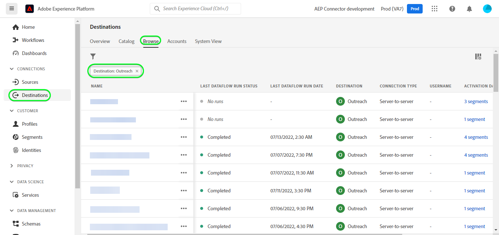

# [!DNL Outreach] connessione

## Panoramica {#overview}

[[!DNL Outreach]](https://www.outreach.io/) è una piattaforma di esecuzione delle vendite con i dati di interazione tra acquirenti e venditori B2B più diffusi al mondo e investimenti significativi in tecnologie di intelligenza artificiale proprietarie per tradurre i dati di vendita in informazioni. [!DNL Outreach] consente alle organizzazioni di automatizzare il coinvolgimento nelle vendite e di agire sulla base delle informazioni sui ricavi per migliorare l&#39;efficienza, la prevedibilità e la crescita.

Questo [!DNL Adobe Experience Platform] [destinazione](/help/destinations/home.md) sfrutta [API di risorsa aggiornamento della portata](https://api.outreach.io/api/v2/docs#update-an-existing-resource), che consente di aggiornare le identità all’interno di un pubblico corrispondente ai potenziali clienti in [!DNL Outreach].

[!DNL Outreach] utilizza OAuth 2 con Concessione di autorizzazione come meccanismo di autenticazione per comunicare con [!DNL Outreach] [!DNL Update Resource API]. Istruzioni per l’autenticazione [!DNL Outreach] sono riportati di seguito, entro [Autentica nella destinazione](#authenticate) sezione.

## Casi d’uso {#use-cases}

In qualità di addetto al marketing, puoi fornire esperienze personalizzate ai potenziali clienti, in base agli attributi dei loro profili Adobe Experience Platform. Puoi creare tipi di pubblico dai dati offline e inviarli a [!DNL Outreach], per essere visualizzato nei feed dei potenziali clienti non appena i tipi di pubblico e i profili vengono aggiornati in Adobe Experience Platform.

## Prerequisiti {#prerequisites}

### Experience Platform prerequisiti {#prerequisites-in-experience-platform}

Prima di attivare i dati in [!DNL Outreach] destinazione, è necessario disporre di un [schema](/help/xdm/schema/composition.md), a [set di dati](https://experienceleague.adobe.com/docs/platform-learn/tutorials/data-ingestion/create-datasets-and-ingest-data.html?lang=it), e [segmenti](https://experienceleague.adobe.com/docs/platform-learn/tutorials/segments/create-segments.html) creato in [!DNL Experience Platform].

Consulta la documentazione di Adobe per [Gruppo di campi schema Dettagli appartenenza pubblico](/help/xdm/field-groups/profile/segmentation.md) per informazioni sugli stati del pubblico.

### Prerequisiti per l’estensione {#prerequisites-destination}

Prendi nota dei seguenti prerequisiti in [!DNL Outreach], per esportare i dati da Platform al tuo [!DNL Outreach] account:

#### Devi avere un account Outreach {#prerequisites-account}

Vai a [!DNL Outreach] [accedi](https://accounts.outreach.io/users/sign_in) per registrarsi e creare un account, se non ne hai già uno. Vedi anche [!DNL Outreach] supporto [pagina](https://support.outreach.io/hc/en-us/articles/207238607-Claim-Your-Outreach-Account) per ulteriori dettagli.

Annota gli elementi riportati di seguito prima di eseguire l’autenticazione in [!DNL Outreach] Destinazione CRM:

| Credenziali | Descrizione |
|---|---|
| E-mail | Il tuo [!DNL Outreach] e-mail account |
| Password | Il tuo [!DNL Outreach] password account |

#### Impostare le etichette per i campi personalizzati {#prerequisites-custom-fields}

[!DNL Outreach] supporta i campi personalizzati per [potenziali clienti](https://support.outreach.io/hc/en-us/articles/360001557554-Outreach-Prospect-Profile-Overview). Fai riferimento a [Come aggiungere un campo personalizzato in Outreach](https://support.outreach.io/hc/en-us/articles/219124908-How-To-Add-a-Custom-Field-in-Outreach) per ulteriori informazioni. Per facilitare l’identificazione, si consiglia di aggiornare manualmente le etichette ai nomi del pubblico corrispondenti, anziché mantenere le impostazioni predefinite. Ad esempio:

[!DNL Outreach] pagina delle impostazioni per i potenziali clienti con campi personalizzati.

[!DNL Outreach] pagina delle impostazioni per i potenziali clienti che visualizzano campi personalizzati con *semplice da usare* etichette corrispondenti ai nomi del pubblico. Puoi visualizzare lo stato del pubblico nella pagina del prospect in base a queste etichette.

>[!NOTE]
>
> I nomi delle etichette sono solo a scopo di identificazione. Non vengono utilizzati per aggiornare i potenziali clienti.

## Guardrail

Il [!DNL Outreach] L’API ha un limite di velocità di 10.000 richieste all’ora per utente. Se raggiungi questo limite, riceverai un’ `429` risponde con il seguente messaggio: `You have exceeded your permitted rate limit of 10,000; please try again at 2017-01-01T00:00:00.`.

Se hai ricevuto questo messaggio, devi aggiornare la pianificazione dell’esportazione del pubblico per adeguarla alla soglia della tariffa.

Consulta la sezione [[!DNL Outreach] documentazione](https://api.outreach.io/api/v2/docs#rate-limiting) per ulteriori dettagli.

## Identità supportate {#supported-identities}

[!DNL Outreach] supporta l’aggiornamento delle identità descritte nella tabella seguente. Ulteriori informazioni su [identità](/help/identity-service/namespaces.md).

| Identità di destinazione | Descrizione | Considerazioni |
|---|---|---|
| `OutreachId` | <ul><li>[!DNL Outreach] identificatore. Si tratta di un valore numerico corrispondente al profilo del prospect.</li><li>L’ID deve corrispondere all’ID all’interno di [!DNL Outreach] URL del prospect in fase di aggiornamento.</li><li>Consulta la sezione [[!DNL Outreach] documentazione](https://api.outreach.io/api/v2/docs#update-an-existing-resource) per ulteriori dettagli.</li></ul> | Obbligatorio |

## Tipo e frequenza di esportazione {#export-type-frequency}

Per informazioni sul tipo e sulla frequenza di esportazione della destinazione, consulta la tabella seguente.

| Elemento | Tipo | Note |
---------|----------|---------|
| Tipo di esportazione | **[!UICONTROL Basato su profilo]** | <ul><li> Stai esportando tutti i membri di un segmento, insieme ai campi schema desiderati *ad esempio: indirizzo e-mail, numero di telefono, cognome*, in base alla mappatura del campo.</li><li> Ogni stato del segmento in [!DNL Outreach] viene aggiornato con il corrispondente stato del pubblico da Platform, in base al [!UICONTROL ID mappatura] valore fornito durante il [pianificazione del pubblico](#schedule-segment-export-example) passaggio.</li></ul> |
| Frequenza di esportazione | **[!UICONTROL Streaming]** | <ul><li> Le destinazioni di streaming sono connessioni &quot;sempre attive&quot; basate su API. Non appena un profilo viene aggiornato in Experienci Platform in base alla valutazione del pubblico, il connettore invia l’aggiornamento a valle alla piattaforma di destinazione. Ulteriori informazioni su [destinazioni di streaming](/help/destinations/destination-types.md#streaming-destinations).</li></ul> |

{style="table-layout:auto"}

## Connettersi alla destinazione {#connect}

>[!IMPORTANT]
> 
> Per connettersi alla destinazione, è necessario **[!UICONTROL Gestire le destinazioni]** [autorizzazione per il controllo degli accessi](/help/access-control/home.md#permissions). Leggi le [panoramica sul controllo degli accessi](/help/access-control/ui/overview.md) oppure contatta l’amministratore del prodotto per ottenere le autorizzazioni necessarie.

Per connettersi a questa destinazione, seguire i passaggi descritti in [esercitazione sulla configurazione della destinazione](../../ui/connect-destination.md). Nel flusso di lavoro di configurazione della destinazione, compila i campi elencati nelle due sezioni seguenti.

Entro **[!UICONTROL Destinazioni]** > **[!UICONTROL Catalogo]** cerca [!DNL Outreach]. In alternativa, è possibile individuarlo nella categoria CRM.

### Autenticarsi nella destinazione {#authenticate}

Per eseguire l’autenticazione nella destinazione, seleziona **[!UICONTROL Connetti alla destinazione]**.

Verrà visualizzata la [!DNL Outreach] pagina di accesso. Immetti l’e-mail.

Immetti la password.

* **[!UICONTROL Nome utente]**: il tuo [!DNL Outreach] e-mail dell’account.
* **[!UICONTROL Password]**: il tuo [!DNL Outreach] password dell&#39;account.

Se i dettagli forniti sono validi, nell’interfaccia utente viene visualizzato un **Connesso** con un segno di spunta verde. A questo punto è possibile procedere al passaggio successivo.

### Inserire i dettagli della destinazione {#destination-details}

Per configurare i dettagli per la destinazione, compila i campi obbligatori e facoltativi seguenti. Un asterisco accanto a un campo nell’interfaccia utente indica che il campo è obbligatorio.

* **[!UICONTROL Nome]**: nome con cui riconoscerai questa destinazione in futuro.
* **[!UICONTROL Descrizione]**: descrizione che ti aiuterà a identificare questa destinazione in futuro.

### Abilita avvisi {#enable-alerts}

Puoi abilitare gli avvisi per ricevere notifiche sullo stato del flusso di dati verso la tua destinazione. Seleziona un avviso dall’elenco per abbonarti e ricevere notifiche sullo stato del flusso di dati. Per ulteriori informazioni sugli avvisi, consulta la guida su [abbonamento agli avvisi sulle destinazioni tramite l’interfaccia utente](../../ui/alerts.md).

Una volta completate le informazioni sulla connessione di destinazione, seleziona **[!UICONTROL Successivo]**.

## Attivare tipi di pubblico in questa destinazione {#activate}

>[!IMPORTANT]
> 
>* Per attivare i dati, è necessario **[!UICONTROL Visualizza destinazioni]**, **[!UICONTROL Attivare le destinazioni]**, **[!UICONTROL Visualizza profili]**, e **[!UICONTROL Visualizzare segmenti]** [autorizzazioni di controllo degli accessi](/help/access-control/home.md#permissions). Leggi le [panoramica sul controllo degli accessi](/help/access-control/ui/overview.md) oppure contatta l’amministratore del prodotto per ottenere le autorizzazioni necessarie.
>* Per esportare *identità*, è necessario **[!UICONTROL Visualizza grafico delle identità]** [autorizzazione per il controllo degli accessi](/help/access-control/home.md#permissions).   {width="100" zoomable="yes"}

Letto [Attiva profili e tipi di pubblico nelle destinazioni di esportazione del pubblico in streaming](../../ui/activate-segment-streaming-destinations.md) per istruzioni sull’attivazione dei tipi di pubblico in questa destinazione.

### Considerazioni sulla mappatura ed esempio {#mapping-considerations-example}

Per inviare correttamente i dati sul pubblico da Adobe Experience Platform a [!DNL Outreach] destinazione, devi passare attraverso il passaggio di mappatura dei campi. La mappatura consiste nella creazione di un collegamento tra i campi dello schema Experience Data Model (XDM) nell’account Platform e i corrispondenti equivalenti dalla destinazione. Per mappare correttamente i campi XDM su [!DNL Outreach] campi di destinazione, effettua le seguenti operazioni:

1. In [!UICONTROL Mappatura] passaggio, fai clic su **[!UICONTROL Aggiungi nuova mappatura]**. Viene visualizzata una nuova riga di mappatura.
   

1. In [!UICONTROL Seleziona campo di origine] finestra, scegli la **[!UICONTROL Seleziona lo spazio dei nomi dell’identità]** e aggiungere le mappature desiderate.
   

1. In [!UICONTROL Seleziona campo di destinazione] selezionare il tipo di campo di destinazione a cui si desidera mappare il campo di origine.
   * **[!UICONTROL Seleziona lo spazio dei nomi dell’identità]**: seleziona questa opzione per mappare il campo sorgente a uno spazio dei nomi di identità dall’elenco.
     

   * Aggiungi la seguente mappatura tra lo schema del profilo XDM e il [!DNL Outreach] istanza: |Schema profilo XDM|[!DNL Outreach] Istanza| Obbligatorio |—|—|—| |`Oid`|`OutreachId`| Sì |

   * **[!UICONTROL Seleziona attributi personalizzati]**: seleziona questa opzione per mappare il campo sorgente a un attributo personalizzato definito in [!UICONTROL Nome attributo] campo. Fai riferimento a [[!DNL Outreach] documentazione di prospect](https://api.outreach.io/api/v2/docs#prospect) per un elenco completo degli attributi supportati.
     

   * Ad esempio, a seconda dei valori che desideri aggiornare, aggiungi la seguente mappatura tra lo schema di profilo XDM e il [!DNL Outreach] istanza: |Schema profilo XDM|[!DNL Outreach] Istanza| |—|—| |`person.name.firstName`|`firstName`| |`person.name.lastName`|`lastName`|

   * Di seguito è riportato un esempio che utilizza queste mappature:
     

### Esempio di esportazione e pianificazione di un pubblico {#schedule-segment-export-example}

* Durante l&#39;esecuzione di [Pianificare l’esportazione del pubblico](../../ui/activate-segment-streaming-destinations.md) passaggio è necessario mappare manualmente i tipi di pubblico di Platform all’attributo del campo personalizzato in [!DNL Outreach].

* A questo scopo, seleziona ogni segmento, quindi inserisci il valore numerico corrispondente che corrisponde al *Campo personalizzato `N` Etichetta* campo da [!DNL Outreach] nel **[!UICONTROL ID mappatura]** campo.

  >[!IMPORTANT]
  >
  > * Il valore numerico *(`N`)* utilizzato all&#39;interno di [!UICONTROL ID mappatura] deve corrispondere alla chiave dell’attributo personalizzato con suffisso al valore numerico in [!DNL Outreach]. Esempio: *Campo personalizzato `N` Etichetta*.
  > * È sufficiente specificare il valore numerico, non l’intera etichetta del campo personalizzato.
  > * [!DNL Outreach] supporta un massimo di 150 campi etichetta personalizzati.
  > * Fai riferimento a [[!DNL Outreach] documentazione di prospect](https://api.outreach.io/api/v2/docs#prospect) per i dettagli.

   * Ad esempio:

     | [!DNL Outreach] Campo | ID mappatura piattaforma |
     |---|---|
     | Campo personalizzato `4` Etichetta | `4` |

     

## Convalidare l’esportazione dei dati {#exported-data}

Per verificare di aver impostato correttamente la destinazione, segui i passaggi seguenti:

1. Seleziona **[!UICONTROL Destinazioni]** > **[!UICONTROL Sfoglia]** per passare all’elenco delle destinazioni.
   

1. Seleziona la destinazione e verifica che lo stato sia **[!UICONTROL abilitato]**.
   

1. Passa a **[!DNL Activation data]** , quindi seleziona un nome per il pubblico.
   

1. Controlla il riepilogo del pubblico e assicurati che il conteggio dei profili corrisponda al conteggio creato all’interno del segmento.
   

1. Accedi a [!DNL Outreach] , quindi passare al [!DNL Apps] > [!DNL Contacts] e verificare se i profili del pubblico sono stati aggiunti. Puoi vedere che ogni stato del pubblico in [!DNL Outreach] è stato aggiornato con il corrispondente stato del pubblico da Platform, in base al [!UICONTROL ID mappatura] valore fornito durante il [pianificazione del pubblico](#schedule-segment-export-example) passaggio.

## Utilizzo dei dati e governance {#data-usage-governance}

Tutti [!DNL Adobe Experience Platform] le destinazioni sono conformi ai criteri di utilizzo dei dati durante la gestione dei dati. Per informazioni dettagliate su come [!DNL Adobe Experience Platform] applica la governance dei dati, consulta la sezione [Panoramica sulla governance dei dati](/help/data-governance/home.md).

## Errori e risoluzione problemi {#errors-and-troubleshooting}

Durante il controllo di un’esecuzione del flusso di dati, è possibile che venga visualizzato il seguente messaggio di errore: `Bad request reported while pushing events to the destination. Please contact the administrator and try again.`

Per correggere questo errore, verifica che [!UICONTROL ID mappatura] fornite in Platform per [!DNL Outreach] il pubblico è valido ed esiste in [!DNL Outreach].

## Risorse aggiuntive {#additional-resources}

Il [[!DNL Outreach] documentazione](https://api.outreach.io/api/v2/docs/) ha dettagli su [Risposte di errore](https://api.outreach.io/api/v2/docs#error-responses) che puoi utilizzare per eseguire il debug di eventuali problemi.
