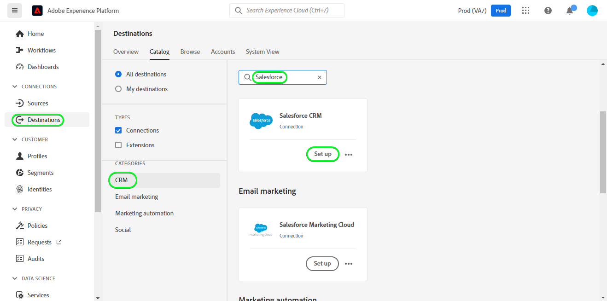

# [!DNL Salesforce CRM] connection

## Panoramica {#overview}

[CRM Salesforce](https://www.salesforce.com/) è una piattaforma di gestione delle relazioni con i clienti (Customer Relationship Management, CRM) popolare.

Questo [!DNL Adobe Experience Platform] [destinazione](/help/destinations/home.md) sfrutta [API REST Salesforce](https://developer.salesforce.com/docs/atlas.en-us.api_rest.meta/api_rest/dome_composite_upsert_example.htm?q=contacts), che ti consente di aggiornare le identità all’interno di un segmento in CRM Salesforce.

Salesforce CRM utilizza OAuth 2 con Password Grant come meccanismo di autenticazione per comunicare con l’API REST di Salesforce. Le istruzioni per l&#39;autenticazione nella tua istanza di gestione delle relazioni con i clienti di Salesforce sono più avanti qui sotto, nella [Autentica a destinazione](#authenticate) sezione .

## Casi d’uso {#use-cases}

In qualità di addetto al marketing, puoi offrire esperienze personalizzate agli utenti in base agli attributi dei loro profili Adobe Experience Platform. Puoi creare segmenti dai tuoi dati offline e inviare tali segmenti a CRM Salesforce per visualizzarli nei feed degli utenti non appena i segmenti e i profili vengono aggiornati in Adobe Experience Platform.

## Prerequisiti {#prerequisites}

### Prerequisiti in Experience Platform {#prerequisites-in-experience-platform}

Prima di attivare i dati alla destinazione CRM Salesforce, devi disporre di un [schema](/help/xdm/schema/composition.md), [set di dati](https://experienceleague.adobe.com/docs/platform-learn/tutorials/data-ingestion/create-datasets-and-ingest-data.html?lang=en)e [segmenti](https://experienceleague.adobe.com/docs/platform-learn/tutorials/segments/create-segments.html?lang=en) creato in [!DNL Experience Platform].

### Prerequisiti in CRM Salesforce {#prerequisites-destination}

Per esportare i dati da Platform al tuo account Salesforce, prendi nota dei seguenti prerequisiti in Salesforce:

#### Devi avere un account Salesforce {#prerequisites-account}

Vai alla Salesforce [processo](https://www.salesforce.com/in/form/signup/freetrial-sales/) per registrare e creare un account Salesforce, se non ne hai già uno.

#### Configurare un’app connessa {#prerequisites-connected-app}

Successivamente, devi configurare un [app connessa](https://help.salesforce.com/s/articleView?id=sf.connected_app_create.htm&amp;language=en_US&amp;r=https%3A%2F%2Fhelp.salesforce.com%2F&amp;type=5) all’interno del tuo account Salesforce, se non ne hai già uno.

All’interno dell’app connessa, assicurati che: [Impostazioni OAuth](https://help.salesforce.com/s/articleView?id=connected_app_create_api_integration.htm&amp;type=5&amp;language=en_US) è abilitato.

Assicurati inoltre che [ambiti](https://help.salesforce.com/s/articleView?id=connected_app_create_api_integration.htm&amp;type=5&amp;language=en_US) indicati di seguito sono selezionati.

* ``chatter_api``
* ``lightning``
* ``visualforce``
* ``content``
* ``openid``
* ``full``
* ``api``
* ``web``
* ``refresh_token``
* ``offline_access``

#### Crea un campo personalizzato all’interno di Salesforce {#prerequisites-custom-field}

Crea il campo personalizzato di tipo `Text Area Long` quale Experience Platform utilizzerà per aggiornare lo stato del segmento all&#39;interno di CRM Salesforce.
Consulta la documentazione di Salesforce per [creare campi personalizzati](https://help.salesforce.com/s/articleView?id=sf.adding_fields.htm&amp;type=5) se hai bisogno di ulteriori informazioni.

>[!IMPORTANT]
>
> Assicurati che il nome del campo non contenga spazi bianchi. Utilizza invece il carattere di sottolineatura `(_)` come separatore.

>[!NOTE]
>
> * Gli oggetti in Salesforce sono limitati a 25 campi esterni, vedere [Attributi del campo personalizzati](https://help.salesforce.com/s/articleView?id=sf.custom_field_attributes.htm&amp;type=5).
> * Questa restrizione implica che potrai avere al massimo 25 appartenenze al segmento Experience Platform attive in qualsiasi momento.
> * Se hai raggiunto questo limite all’interno di Salesforce, dovrai rimuovere l’attributo personalizzato da Salesforce che è stato utilizzato per memorizzare lo stato del segmento rispetto ai segmenti più vecchi all’interno di Experience Platform prima di poter utilizzare un nuovo mappingId.

Consulta la documentazione Adobe Experience Platform per [Gruppo di campi Dettagli appartenenza segmento](/help/xdm/field-groups/profile/segmentation.md) se hai bisogno di indicazioni sugli stati dei segmenti.

#### Raccogli credenziali Salesforce {#gather-credentials}

Annota gli elementi seguenti prima di eseguire l&#39;autenticazione alla destinazione CRM Salesforce:

| Credenziali | Descrizione | Esempio |
| --- | --- | --- |
| <ul><li>Prefisso dominio Salesforce</li></ul> | Vedi [Prefisso dominio Salesforce](https://help.salesforce.com/s/articleView?id=sf.domain_name_setting_login_policy.htm&amp;type=5) per ulteriori indicazioni. | <ul><li>Se il tuo dominio è come indicato di seguito, devi utilizzare il valore evidenziato.  <i>`d5i000000isb4eak-dev-ed`.my.salesforce.com</i></li></ul> |
| <ul><li>Chiave del consumatore</li><li>Segreto consumer</li></ul> | Fai riferimento a [Documentazione di Salesforce](https://help.salesforce.com/s/articleView?id=sf.connected_app_rotate_consumer_details.htm&amp;type=5) se hai bisogno di ulteriori informazioni. | <ul><li>r23kxxxxxxxx0z05xxxxxx</li><li>ipxxxxxxxxxxT4xxxxxxxxxx</li></ul> |

## Identità supportate {#supported-identities}

Salesforce CRM supporta l&#39;aggiornamento delle identità descritte nella tabella seguente. Ulteriori informazioni [identità](/help/identity-service/namespaces.md).

| Identità di destinazione | Descrizione | Considerazioni |
|---|---|---|
| SalesforceId | Identificatore CRM di Salesforce personalizzato che supporta la mappatura di qualsiasi identità. | Obbligatorio. Puoi inviare qualsiasi [identità](../../../identity-service/namespaces.md) al [!DNL Salesforce CRM] a condizione che sia mappata sulla destinazione `SalesforceId`. |

## Tipo e frequenza di esportazione {#export-type-frequency}

Per informazioni sul tipo e sulla frequenza di esportazione della destinazione, fare riferimento alla tabella seguente.

| Elemento | Tipo | Note |
---------|----------|---------|
| Tipo di esportazione | **[!UICONTROL Basato su profilo]** | <ul><li>Stai esportando tutti i membri di un segmento, insieme ai campi dello schema desiderati *(ad esempio: indirizzo e-mail, numero di telefono, cognome)*, in base alla mappatura del campo.</li><li> Gli stati dei segmenti della piattaforma vengono esportati in [!DNL Salesforce CRM] specificando l&#39;attributo di campo personalizzato corrispondente in [!DNL Salesforce CRM] in **[!UICONTROL Attiva destinazione]** > **[!UICONTROL Esportazione di segmenti programmata]** > **[!UICONTROL ID mappatura]** campo .</li></ul> |
| Frequenza delle esportazioni | **[!UICONTROL Streaming]** | <ul><li>Le destinazioni di streaming sono connessioni basate su API &quot;sempre attive&quot;. Non appena un profilo viene aggiornato in Experience Platform in base alla valutazione del segmento, il connettore invia l’aggiornamento a valle alla piattaforma di destinazione. Ulteriori informazioni [destinazioni di streaming](/help/destinations/destination-types.md#streaming-destinations).</li></ul> |

{style=&quot;table-layout:auto&quot;}

## Collegati alla destinazione {#connect}

>[!IMPORTANT]
> 
>Per connettersi alla destinazione, è necessario **[!UICONTROL Gestire le destinazioni]** [autorizzazione controllo accessi](/help/access-control/home.md#permissions). Leggi la sezione [panoramica sul controllo degli accessi](/help/access-control/ui/overview.md) oppure contatta l’amministratore del prodotto per ottenere le autorizzazioni richieste.

Per connettersi a questa destinazione, segui i passaggi descritti in [esercitazione sulla configurazione della destinazione](../../ui/connect-destination.md). Nel flusso di lavoro di configurazione della destinazione , compila i campi elencati nelle due sezioni seguenti.

### Autentica a destinazione {#authenticate}

Per eseguire l’autenticazione nella destinazione, compila i campi richiesti e seleziona **[!UICONTROL Connetti alla destinazione]**.

* **[!UICONTROL Password]**: Password dell&#39;account Salesforce.
* **[!UICONTROL ID client]**: La tua chiave consumer dell&#39;app connessa Salesforce.
* **[!UICONTROL Segreto client]**: Il tuo segreto consumer dell&#39;app Salesforce connessa.
* **[!UICONTROL Nome utente]**: Nome utente dell’account Salesforce.

Se i dettagli forniti sono validi, l’interfaccia utente visualizza un **Connesso** con un segno di spunta verde, puoi quindi procedere al passaggio successivo.

### Compila i dettagli della destinazione {#destination-details}

Per configurare i dettagli della destinazione, compila i campi obbligatori e facoltativi riportati di seguito. Un asterisco accanto a un campo nell’interfaccia utente indica che il campo è obbligatorio.

* **[!UICONTROL Nome]**: Nome con cui riconoscerai questa destinazione in futuro.
* **[!UICONTROL Descrizione]**: Una descrizione che ti aiuterà a identificare questa destinazione in futuro.
* **[!UICONTROL Dominio personalizzato]**: Il dominio Salesforce.

### Abilitare gli avvisi {#enable-alerts}

Puoi abilitare gli avvisi per ricevere notifiche sullo stato del flusso di dati nella tua destinazione. Seleziona un avviso dall’elenco per abbonarti e ricevere le notifiche sullo stato del flusso di dati. Per ulteriori informazioni sugli avvisi, consulta la guida su [iscrizione agli avvisi sulle destinazioni tramite l’interfaccia utente](../../ui/alerts.md).

Una volta completati i dettagli della connessione di destinazione, seleziona **[!UICONTROL Successivo]**.

## Attiva i segmenti in questa destinazione {#activate}

>[!IMPORTANT]
> 
>Per attivare i dati, è necessario **[!UICONTROL Gestire le destinazioni]**, **[!UICONTROL Attivare le destinazioni]**, **[!UICONTROL Visualizza profili]** e **[!UICONTROL Visualizzare i segmenti]** [autorizzazioni di controllo accessi](/help/access-control/home.md#permissions). Leggi la sezione [panoramica sul controllo degli accessi](/help/access-control/ui/overview.md) oppure contatta l’amministratore del prodotto per ottenere le autorizzazioni richieste.

Leggi [Attivare profili e segmenti nelle destinazioni di esportazione dei segmenti in streaming](/help/destinations/ui/activate-segment-streaming-destinations.md) per istruzioni su come attivare i segmenti di pubblico a questa destinazione.

### Considerazioni ed esempi di mappatura {#mapping-considerations-example}

Per inviare correttamente i dati del pubblico da Adobe Experience Platform alla destinazione CRM Salesforce, devi passare attraverso il passaggio di mappatura dei campi. La mappatura consiste nella creazione di un collegamento tra i campi dello schema Experience Data Model (XDM) nell’account Platform e i corrispondenti equivalenti dalla destinazione. Per mappare correttamente i campi XDM sui campi di destinazione di Salesforce CRM, segui questi passaggi:

1. Nel passaggio Mappatura , fai clic su **[!UICONTROL Aggiungi nuova mappatura]**, verrà visualizzata una nuova riga di mappatura sullo schermo.

   

1. Nella finestra seleziona campo di origine, quando selezioni il campo di origine scegli la **[!UICONTROL Seleziona attributi]** e aggiungi le mappature desiderate.

   

1. Nella finestra seleziona il campo di destinazione, seleziona il campo di destinazione e scegli la **[!UICONTROL Seleziona spazio dei nomi identità]** e aggiungi le mappature desiderate.

   

1. Per gli attributi personalizzati, nella finestra seleziona campo di destinazione, seleziona il campo di destinazione e scegli la **[!UICONTROL Seleziona attributi personalizzati]** categoria , quindi specifica il nome dell’attributo di destinazione desiderato e aggiungi le mappature desiderate.

   

1. Ad esempio, puoi aggiungere la seguente mappatura tra lo schema del profilo XDM e il tuo [!DNL Salesforce CRM] istanza:

   |  | Schema del profilo XDM | [!DNL Salesforce CRM] Istanza | Obbligatorio |
   |---|---|---|---|
   | Attributi | <ul><li>person.name.firstName</code></li><li>person.name.lastName</code></li><li>personalEmail.address</code></li></ul> | <ul><li>Nome</code></li><li>LastName</code></li><li>E-mail</code></li></ul> |
   | Identità | <ul><li>crmID</code></li></ul> | <ul><li>SalesforceId</code></li></ul> | Sì |

1. Di seguito è riportato un esempio che utilizza queste mappature:

   

### Pianificare l’esportazione dei segmenti e l’esempio {#schedule-segment-export-example}

Quando si eseguono le [Esportazione di segmenti programmata](/help/destinations/ui/activate-segment-streaming-destinations.md#scheduling) devi mappare manualmente i segmenti di Platform sull’attributo del campo personalizzato in Salesforce.

A questo scopo, seleziona ogni segmento, quindi inserisci l’attributo di campo personalizzato corrispondente da Salesforce nella **[!UICONTROL ID mappatura]** campo .

>[!IMPORTANT]
>
>* Il valore utilizzato per **[!UICONTROL ID mappatura]** deve corrispondere esattamente al nome dell’attributo del campo personalizzato creato in Salesforce.
>* Assicurati che il nome dell’attributo del campo personalizzato creato in Salesforce non utilizzi il carattere spazio vuoto.

Di seguito è riportato un esempio:

## Convalida esportazione dati {#exported-data}

Per verificare di aver configurato correttamente la destinazione, effettua le seguenti operazioni:

1. Seleziona **[!UICONTROL Destinazioni]** > **[!UICONTROL Sfoglia]** per passare all’elenco delle destinazioni.
   

1. Selezionare la destinazione e verificare che lo stato sia **[!UICONTROL abilitato]**.
   

1. Passa alla **[!DNL Activation data]** , quindi seleziona un nome di segmento.
   

1. Monitora il riepilogo dei segmenti e assicurati che il conteggio dei profili corrisponda al conteggio creato all’interno del segmento.
   

1. Accedi al sito web Salesforce, quindi passa al **[!DNL Apps]** > **[!DNL Contacts]** e controlla se i profili del segmento sono stati aggiunti.
   

1. Fai clic su un contatto e controlla se i campi sono aggiornati. Lo stato del segmento da Experience Platform è stato aggiornato rispetto all’attributo del campo personalizzato corrispondente fornito in **ID mappatura** durante il **[!UICONTROL Attiva destinazione]** > **[!UICONTROL Esportazione di segmenti programmata]** passo.
   

## Utilizzo e governance dei dati {#data-usage-governance}

Tutto [!DNL Adobe Experience Platform] le destinazioni sono conformi ai criteri di utilizzo dei dati durante la gestione dei dati. Per informazioni dettagliate su come [!DNL Adobe Experience Platform] applica la governance dei dati, vedi [Panoramica sulla governance dei dati](/help/data-governance/home.md).

## Errori e risoluzione dei problemi {#errors-and-troubleshooting}

### Errori sconosciuti durante il push degli eventi alla destinazione {#unknown-errors}

Quando controlli un’esecuzione di un flusso di dati, se vedi il messaggio di errore seguente, verifica che l’ID di mappatura fornito in [!DNL Salesforce CRM] per il segmento Platform è valido ed esiste in [!DNL Salesforce CRM].

## Risorse aggiuntive {#additional-resources}

Informazioni utili aggiuntive fornite dal [Portale per sviluppatori Salesforce](https://developer.salesforce.com/) è qui sotto:
* [Creare un record](https://developer.salesforce.com/docs/atlas.en-us.api_rest.meta/api_rest/dome_sobject_create.htm)
* [Tipi di pubblico per consigli personalizzati](https://developer.salesforce.com/docs/atlas.en-us.236.0.chatterapi.meta/chatterapi/connect_resources_recommendation_audiences_list.htm)
* [Utilizzo di risorse composite](https://developer.salesforce.com/docs/atlas.en-us.api_rest.meta/api_rest/using_composite_resources.htm?q=composite)
* [Guida introduttiva](https://developer.salesforce.com/docs/atlas.en-us.api_rest.meta/api_rest/quickstart.htm)

### Limiti {#limits}

Salesforce bilancia i carichi delle transazioni imponendo limiti di richiesta, tasso e timeout. Fai riferimento a [Limiti e allocazioni di richieste API](https://developer.salesforce.com/docs/atlas.en-us.salesforce_app_limits_cheatsheet.meta/salesforce_app_limits_cheatsheet/salesforce_app_limits_platform_api.htm) per i dettagli.