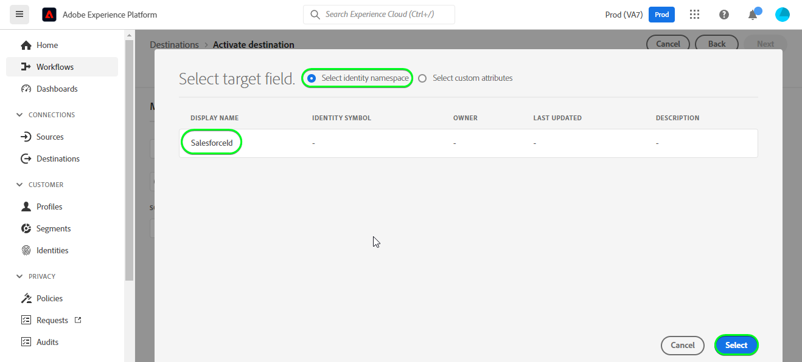

# [!DNL Salesforce CRM] connection

## Panoramica {#overview}

[[!DNL Salesforce CRM]](https://www.salesforce.com/crm/) è una piattaforma di gestione delle relazioni con i clienti (Customer Relationship Management, CRM) popolare e supporta quanto segue:

* [Lead](https://developer.salesforce.com/docs/atlas.en-us.object_reference.meta/object_reference/sforce_api_objects_lead.htm) - Un lead è il nome di una persona o di un&#39;azienda che può (o meno) essere interessata ai prodotti o ai servizi che vendi.
* [Contatti](https://developer.salesforce.com/docs/atlas.en-us.object_reference.meta/object_reference/sforce_api_objects_contact.htm) - Un contatto è una persona con la quale uno dei vostri rappresentanti ha stabilito un rapporto ed è stato qualificato come potenziale cliente.

Questo [!DNL Adobe Experience Platform] [destinazione](/help/destinations/home.md) sfrutta [[!DNL Salesforce composite API]](https://developer.salesforce.com/docs/atlas.en-us.api_rest.meta/api_rest/resources_composite_sobjects_collections_update.htm), che supporta entrambi i tipi di profili descritti in precedenza.

Quando [attivazione dei segmenti](#activate), puoi scegliere tra lead o contatti e aggiornare gli attributi e segmentare i dati in [!DNL Salesforce CRM].

[!DNL Salesforce CRM] utilizza OAuth 2 con Password Grant come meccanismo di autenticazione per comunicare con l’API REST di Salesforce. Istruzioni per l&#39;autenticazione al tuo [!DNL Salesforce CRM] l&#39;istanza è più in basso, nel [Autentica a destinazione](#authenticate) sezione .

## Casi d’uso {#use-cases}

In qualità di addetto al marketing, puoi offrire esperienze personalizzate agli utenti in base agli attributi dei loro profili Adobe Experience Platform. Puoi creare segmenti dai dati offline e inviare questi segmenti a CRM Salesforce per visualizzarli nei feed degli utenti non appena i segmenti e i profili vengono aggiornati in Adobe Experience Platform.

## Prerequisiti {#prerequisites}

### Prerequisiti in Experience Platform {#prerequisites-in-experience-platform}

Prima di attivare i dati alla destinazione CRM Salesforce, devi disporre di un [schema](/help/xdm/schema/composition.md), [set di dati](https://experienceleague.adobe.com/docs/platform-learn/tutorials/data-ingestion/create-datasets-and-ingest-data.html?lang=en)e [segmenti](https://experienceleague.adobe.com/docs/platform-learn/tutorials/segments/create-segments.html?lang=en) creato in [!DNL Experience Platform].

### Prerequisiti in [!DNL Salesforce CRM] {#prerequisites-destination}

Prendi nota dei seguenti prerequisiti in [!DNL Salesforce CRM], per esportare i dati da Platform al tuo account Salesforce:

#### Devi avere un account Salesforce {#prerequisites-account}

Vai alla Salesforce [processo](https://www.salesforce.com/in/form/signup/freetrial-sales/) per registrare e creare un account Salesforce, se non ne hai già uno.

#### Configurare un’app connessa {#prerequisites-connected-app}

Successivamente, devi configurare un [app connessa](https://help.salesforce.com/s/articleView?id=sf.connected_app_create.htm&amp;language=en_US&amp;r=https%3A%2F%2Fhelp.salesforce.com%2F&amp;type=5) all’interno del tuo account Salesforce, se non ne hai già uno.

All’interno dell’app connessa, assicurati che: [Impostazioni OAuth](https://help.salesforce.com/s/articleView?id=connected_app_create_api_integration.htm&amp;type=5&amp;language=en_US) è abilitato.

Assicurati inoltre che [ambiti](https://help.salesforce.com/s/articleView?id=connected_app_create_api_integration.htm&amp;type=5&amp;language=en_US) indicati di seguito sono selezionati.

* ``chatter_api``
* ``lightning``
* ``visualforce``
* ``content``
* ``openid``
* ``full``
* ``api``
* ``web``
* ``refresh_token``
* ``offline_access``

#### Crea un campo personalizzato all’interno di Salesforce {#prerequisites-custom-field}

Crea il campo personalizzato di tipo `Text Area Long`, quale Experience Platform utilizzerà per aggiornare lo stato del segmento in [!DNL Salesforce CRM].
Consulta la documentazione di Salesforce per [creare campi personalizzati](https://help.salesforce.com/s/articleView?id=sf.adding_fields.htm&amp;type=5) se hai bisogno di ulteriori informazioni.

>[!IMPORTANT]
>
>Assicurati che il nome del campo non contenga spazi bianchi. Utilizza invece il carattere di sottolineatura `(_)` come separatore.

>[!NOTE]
>
>* Gli oggetti in Salesforce sono limitati a 25 campi esterni, vedere [Attributi del campo personalizzati](https://help.salesforce.com/s/articleView?id=sf.custom_field_attributes.htm&amp;type=5).
>* Questa limitazione implica che è possibile avere un massimo di 25 appartenenze al segmento Experience Platform attive in qualsiasi momento.
>* Se hai raggiunto questo limite all’interno di Salesforce, devi rimuovere l’attributo personalizzato da Salesforce utilizzato per memorizzare lo stato del segmento rispetto ai segmenti più vecchi all’interno di Experience Platform prima di un nuovo **[!UICONTROL ID mappatura]** può essere utilizzato.

Consulta la documentazione Adobe Experience Platform per [Gruppo di campi Dettagli appartenenza segmento](/help/xdm/field-groups/profile/segmentation.md) se hai bisogno di indicazioni sugli stati dei segmenti.

#### Raccogli credenziali Salesforce {#gather-credentials}

Prima di eseguire l&#39;autenticazione al [!DNL Salesforce CRM] destinazione:

| Credenziali | Descrizione | Esempio |
| --- | --- | --- |
| <ul><li>Prefisso dominio Salesforce</li></ul> | Vedi [Prefisso dominio Salesforce](https://help.salesforce.com/s/articleView?id=sf.domain_name_setting_login_policy.htm&amp;type=5) per ulteriori indicazioni. | <ul><li>Se il tuo dominio è come indicato di seguito, devi utilizzare il valore evidenziato.  <i>`d5i000000isb4eak-dev-ed`.my.salesforce.com</i></li></ul> |
| <ul><li>Chiave del consumatore</li><li>Segreto consumer</li></ul> | Fai riferimento a [Documentazione di Salesforce](https://help.salesforce.com/s/articleView?id=sf.connected_app_rotate_consumer_details.htm&amp;type=5) se hai bisogno di ulteriori informazioni. | <ul><li>r23kxxxxxxxx0z05xxxxxx</code></li><li>ipxxxxxxxxxxT4xxxxxxxxxx</code></li></ul> |

### Guardrail {#guardrails}

Salesforce bilancia i carichi delle transazioni imponendo limiti di richiesta, tasso e timeout. Fai riferimento a [Limiti e allocazioni di richieste API](https://developer.salesforce.com/docs/atlas.en-us.salesforce_app_limits_cheatsheet.meta/salesforce_app_limits_cheatsheet/salesforce_app_limits_platform_api.htm) per i dettagli.

>[!IMPORTANT]
>
>Quando [attivazione dei segmenti](#activate) è necessario selezionare tra *Contatto* o *Lead* tipi. Devi accertarti che i segmenti abbiano la mappatura dati appropriata in base al tipo selezionato.

## Identità supportate {#supported-identities}

[!DNL Salesforce CRM] supporta l’aggiornamento delle identità descritte nella tabella seguente. Ulteriori informazioni [identità](/help/identity-service/namespaces.md).

| Identità di destinazione | Descrizione | Considerazioni |
|---|---|---|
| `SalesforceId` | La [!DNL Salesforce CRM] identificatore per le identità di contatto o lead esportate o aggiornate nel segmento. | Obbligatorio |

## Tipo e frequenza di esportazione {#export-type-frequency}

Per informazioni sul tipo e sulla frequenza di esportazione della destinazione, fare riferimento alla tabella seguente.

| Elemento | Tipo | Note |
---------|----------|---------|
| Tipo di esportazione | **[!UICONTROL Basato su profilo]** | <ul><li>Stai esportando tutti i membri di un segmento, insieme ai campi dello schema desiderati *(ad esempio: indirizzo e-mail, numero di telefono, cognome)*, in base alla mappatura del campo.</li><li> Ogni stato di segmento in [!DNL Salesforce CRM] viene aggiornato con lo stato del segmento corrispondente da Platform, in base alla **[!UICONTROL ID mappatura]** valore fornito durante [programmazione dei segmenti](#schedule-segment-export-example) passo.</li></ul> |
| Frequenza delle esportazioni | **[!UICONTROL Streaming]** | <ul><li>Le destinazioni di streaming sono connessioni basate su API &quot;sempre attive&quot;. Non appena un profilo viene aggiornato in Experience Platform in base alla valutazione del segmento, il connettore invia l’aggiornamento a valle alla piattaforma di destinazione. Ulteriori informazioni [destinazioni di streaming](/help/destinations/destination-types.md#streaming-destinations).</li></ul> |

{style=&quot;table-layout:auto&quot;}

## Collegati alla destinazione {#connect}

>[!IMPORTANT]
>
>Per connettersi alla destinazione, è necessario **[!UICONTROL Gestire le destinazioni]** [autorizzazione controllo accessi](/help/access-control/home.md#permissions). Leggi la sezione [panoramica sul controllo degli accessi](/help/access-control/ui/overview.md) oppure contatta l’amministratore del prodotto per ottenere le autorizzazioni richieste.

Per connettersi a questa destinazione, segui i passaggi descritti in [esercitazione sulla configurazione della destinazione](../../ui/connect-destination.md). Nel flusso di lavoro di configurazione della destinazione , compila i campi elencati nelle due sezioni seguenti.

Within **[!UICONTROL Destinazioni]** > **[!UICONTROL Catalogo]** cercare [!DNL Salesforce CRM]. In alternativa, è possibile individuarlo sotto il **[!UICONTROL CRM]** categoria.

### Autentica a destinazione {#authenticate}

Per eseguire l’autenticazione nella destinazione, compila i campi richiesti e seleziona **[!UICONTROL Connetti alla destinazione]**.

* **[!UICONTROL Password]**: Password dell&#39;account Salesforce.
* **[!UICONTROL Dominio personalizzato]**: Il dominio Salesforce.
* **[!UICONTROL ID client]**: La tua chiave consumer dell&#39;app connessa Salesforce.
* **[!UICONTROL Segreto client]**: Il tuo segreto consumer dell&#39;app Salesforce connessa.
* **[!UICONTROL Nome utente]**: Nome utente dell’account Salesforce.

Se i dettagli forniti sono validi, l’interfaccia utente visualizza un **[!UICONTROL Connesso]** con un segno di spunta verde, puoi quindi procedere al passaggio successivo.

### Compila i dettagli della destinazione {#destination-details}

Per configurare i dettagli della destinazione, compila i campi obbligatori e facoltativi riportati di seguito. Un asterisco accanto a un campo nell’interfaccia utente indica che il campo è obbligatorio.

* **[!UICONTROL Nome]**: Nome con cui riconoscerai questa destinazione in futuro.
* **[!UICONTROL Descrizione]**: Una descrizione che ti aiuterà a identificare questa destinazione in futuro.
* **[!UICONTROL Tipo ID Salesforce]**: Seleziona **[!UICONTROL Contatto]** se le identità che desideri esportare o aggiornare sono di tipo *Contatto*. Seleziona **[!UICONTROL Lead]** se le identità che desideri esportare o aggiornare sono di tipo *Lead*.

### Abilitare gli avvisi {#enable-alerts}

Puoi abilitare gli avvisi per ricevere notifiche sullo stato del flusso di dati nella tua destinazione. Seleziona un avviso dall’elenco per abbonarti e ricevere le notifiche sullo stato del flusso di dati. Per ulteriori informazioni sugli avvisi, consulta la guida su [iscrizione agli avvisi sulle destinazioni tramite l’interfaccia utente](../../ui/alerts.md).

Una volta completati i dettagli della connessione di destinazione, seleziona **[!UICONTROL Successivo]**.

## Attiva i segmenti in questa destinazione {#activate}

>[!IMPORTANT]
>
>Per attivare i dati, è necessario **[!UICONTROL Gestire le destinazioni]**, **[!UICONTROL Attivare le destinazioni]**, **[!UICONTROL Visualizza profili]** e **[!UICONTROL Visualizzare i segmenti]** [autorizzazioni di controllo accessi](/help/access-control/home.md#permissions). Leggi la sezione [panoramica sul controllo degli accessi](/help/access-control/ui/overview.md) oppure contatta l’amministratore del prodotto per ottenere le autorizzazioni richieste.

Leggi [Attivare profili e segmenti nelle destinazioni di esportazione dei segmenti in streaming](/help/destinations/ui/activate-segment-streaming-destinations.md) per istruzioni su come attivare i segmenti di pubblico a questa destinazione.

### Considerazioni ed esempi di mappatura {#mapping-considerations-example}

Per inviare correttamente i dati del pubblico da Adobe Experience Platform al [!DNL Salesforce CRM] destinazione, devi passare attraverso il passaggio di mappatura dei campi . La mappatura consiste nella creazione di un collegamento tra i campi dello schema Experience Data Model (XDM) nell’account Platform e i corrispondenti equivalenti dalla destinazione. Per mappare correttamente i campi XDM su [!DNL Salesforce CRM] campi di destinazione, segui questi passaggi:

1. In **[!UICONTROL Mappatura]** passo, seleziona **[!UICONTROL Aggiungi nuova mappatura]**, verrà visualizzata una nuova riga di mappatura sullo schermo.
   

1. In **[!UICONTROL Selezionare il campo di origine]** finestra, scegli **[!UICONTROL Seleziona spazio dei nomi identità]** o **[!UICONTROL Seleziona attributi]** categoria e seleziona `crmID`.
   

1. In **[!UICONTROL Selezionare il campo di destinazione]** finestra, scegli **[!UICONTROL Seleziona spazio dei nomi identità]** categoria e seleziona `SalesforceId`.
   

   * Aggiungi la seguente mappatura tra lo schema del profilo XDM e il tuo [!DNL Salesforce CRM] istanza:
   | Schema del profilo XDM | [!DNL Salesforce CRM] Istanza | Obbligatorio |
   |---|---|---|
   | `crmID` | `SalesforceId` | Sì |

   * **[!UICONTROL Seleziona attributi personalizzati]**: seleziona questa opzione per mappare il campo di origine a un attributo personalizzato definito in **[!UICONTROL Nome attributo]** campo . Fai riferimento a [[!DNL Salesforce CRM] documentazione](https://help.salesforce.com/s/articleView?id=sf.custom_field_attributes.htm&amp;type=5) per informazioni sugli attributi supportati.
      

   * Se si lavora con *Contatti* all’interno del segmento, consulta la Guida di riferimento agli oggetti in Salesforce per [Contatto](https://developer.salesforce.com/docs/atlas.en-us.object_reference.meta/object_reference/sforce_api_objects_contact.htm) per definire le mappature dei campi da aggiornare.
   * È possibile identificare i campi obbligatori ricercando la parola *Obbligatorio*, indicata nelle descrizioni dei campi nel collegamento precedente.
   * A seconda dei campi che desideri esportare o aggiornare, aggiungi le mappature tra lo schema del profilo XDM e il tuo [!DNL Salesforce CRM] istanza:

   | Schema del profilo XDM | [!DNL Salesforce CRM] Istanza | Note |
   | --- | --- | --- |
   | `person.name.lastName` | `LastName` | `Required`. Cognome del contatto fino a 80 caratteri. |
   | `person.name.firstName` | `FirstName` | Nome del contatto fino a 40 caratteri. |
   | `personalEmail.address` | `Email` | Indirizzo e-mail del contatto. |

   * Di seguito è riportato un esempio che utilizza queste mappature:
      

   * Se si lavora con *Lead* all’interno del segmento, consulta la Guida di riferimento agli oggetti in Salesforce per [Lead](https://developer.salesforce.com/docs/atlas.en-us.object_reference.meta/object_reference/sforce_api_objects_lead.htm) per definire le mappature dei campi da aggiornare.
   * È possibile identificare i campi obbligatori ricercando la parola *Obbligatorio*, indicata nelle descrizioni dei campi nel collegamento precedente.
   * A seconda dei campi che desideri esportare o aggiornare, aggiungi le mappature tra lo schema del profilo XDM e il tuo [!DNL Salesforce CRM] istanza:

   | Schema del profilo XDM | [!DNL Salesforce CRM] Istanza | Note |
   | --- | --- | --- |
   | `person.name.lastName` | `LastName` | `Required`. Cognome del contatto fino a 80 caratteri. |
   | `b2b.companyName` | `Company` | `Required`. L&#39;azienda di lead. |
   | `personalEmail.address` | `Email` | Indirizzo e-mail del contatto. |

   * Di seguito è riportato un esempio che utilizza queste mappature:
      

### Pianificare l’esportazione dei segmenti e l’esempio {#schedule-segment-export-example}

Quando si eseguono le [Esportazione di segmenti programmata](/help/destinations/ui/activate-segment-streaming-destinations.md#scheduling) devi mappare manualmente i segmenti di Platform sull’attributo del campo personalizzato in Salesforce.

A questo scopo, seleziona ogni segmento, quindi inserisci l’attributo di campo personalizzato corrispondente da Salesforce nella **[!UICONTROL ID mappatura]** campo .

>[!IMPORTANT]
>
>* Il valore utilizzato per **[!UICONTROL ID mappatura]** deve corrispondere esattamente al nome dell’attributo del campo personalizzato creato in Salesforce.
>* Assicurati che il nome dell’attributo del campo personalizzato creato in Salesforce non utilizzi il carattere spazio vuoto.

Di seguito è riportato un esempio:

## Convalida esportazione dati {#exported-data}

Per verificare di aver configurato correttamente la destinazione, effettua le seguenti operazioni:

1. Seleziona **[!UICONTROL Destinazioni]** > **[!UICONTROL Sfoglia]** per passare all’elenco delle destinazioni.
   

1. Selezionare la destinazione e verificare che lo stato sia **[!UICONTROL abilitato]**.
   

1. Passa alla **[!UICONTROL Dati di attivazione]** , quindi seleziona un nome di segmento.
   

1. Monitora il riepilogo dei segmenti e assicurati che il conteggio dei profili corrisponda al conteggio creato all’interno del segmento.
   

1. Infine, accedi al sito web Salesforce e convalida se i profili del segmento sono stati aggiunti o aggiornati.
   * Se *Contatti* all’interno del segmento della piattaforma, passa alla **[!DNL Apps]** > **[!DNL Contacts]** pagina.
      

   * Seleziona una *Contatto* e controlla se i campi sono aggiornati. Lo stato di ogni segmento in [!DNL Salesforce CRM] è stato aggiornato con lo stato del segmento corrispondente da Platform, in base alla **[!UICONTROL ID mappatura]** valore fornito durante [programmazione dei segmenti](#schedule-segment-export-example).
      

   * Se *Lead* all’interno del segmento Platform, quindi seleziona **[!DNL Apps]** > **[!DNL Leads]** pagina.
      

   * Seleziona una *Lead* e controlla se i campi sono aggiornati. Lo stato di ogni segmento in [!DNL Salesforce CRM] è stato aggiornato con lo stato del segmento corrispondente da Platform, in base alla **[!UICONTROL ID mappatura]** valore fornito durante [programmazione dei segmenti](#schedule-segment-export-example).
      

## Utilizzo e governance dei dati {#data-usage-governance}

Tutto [!DNL Adobe Experience Platform] le destinazioni sono conformi ai criteri di utilizzo dei dati durante la gestione dei dati. Per informazioni dettagliate su come [!DNL Adobe Experience Platform] applica la governance dei dati, vedi [Panoramica sulla governance dei dati](/help/data-governance/home.md).

## Errori e risoluzione dei problemi {#errors-and-troubleshooting}

### Errori sconosciuti durante il push degli eventi alla destinazione {#unknown-errors}

Quando controlli un&#39;esecuzione di un flusso di dati, se ottieni il seguente messaggio di errore: `Unknown errors encountered while pushing events to the destination. Please contact the administrator and try again.`

Per correggere questo errore, verifica che il **[!UICONTROL ID mappatura]** ha fornito [!DNL Salesforce CRM] per il segmento Platform è valido ed esiste in [!DNL Salesforce CRM].

## Risorse aggiuntive {#additional-resources}

Informazioni utili aggiuntive fornite dal [Portale per sviluppatori Salesforce](https://developer.salesforce.com/) è qui sotto:
* [Guida introduttiva](https://developer.salesforce.com/docs/atlas.en-us.api_rest.meta/api_rest/quickstart.htm)
* [Creare un record](https://developer.salesforce.com/docs/atlas.en-us.api_rest.meta/api_rest/dome_sobject_create.htm)
* [Tipi di pubblico per consigli personalizzati](https://developer.salesforce.com/docs/atlas.en-us.236.0.chatterapi.meta/chatterapi/connect_resources_recommendation_audiences_list.htm)
* [Utilizzo di risorse composite](https://developer.salesforce.com/docs/atlas.en-us.api_rest.meta/api_rest/using_composite_resources.htm?q=composite)
* Questa destinazione sfrutta i [Aggiornare più record](https://developer.salesforce.com/docs/atlas.en-us.api_rest.meta/api_rest/resources_composite_sobjects_collections_update.htm) API anziché [Aggiorna record singolo](https://developer.salesforce.com/docs/atlas.en-us.api_rest.meta/api_rest/dome_composite_upsert_example.htm?q=contacts) Chiamata API.