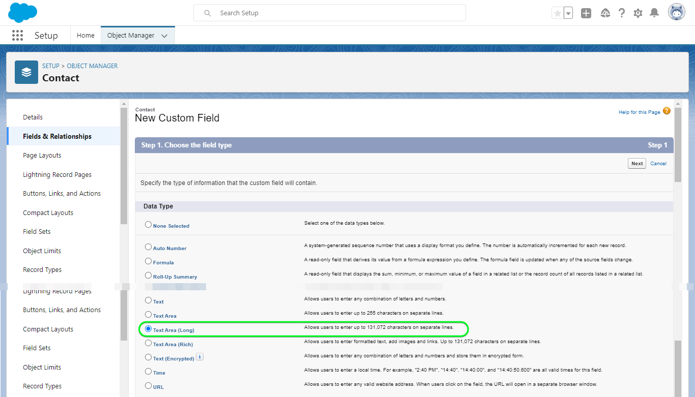
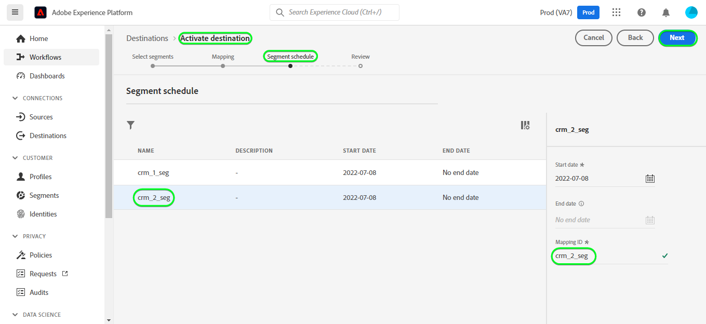
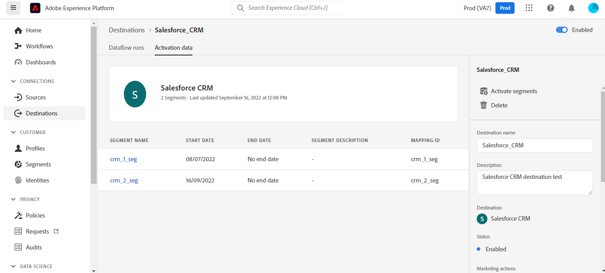
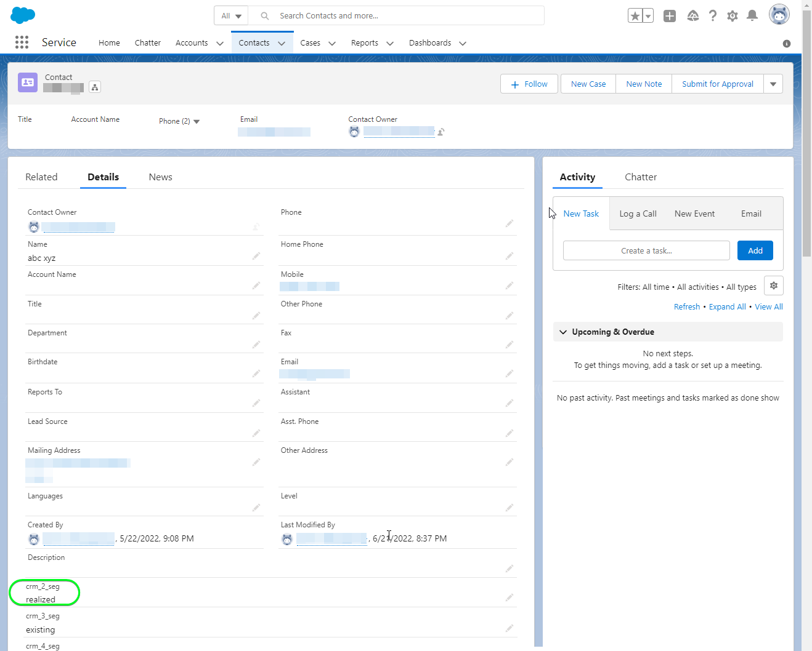
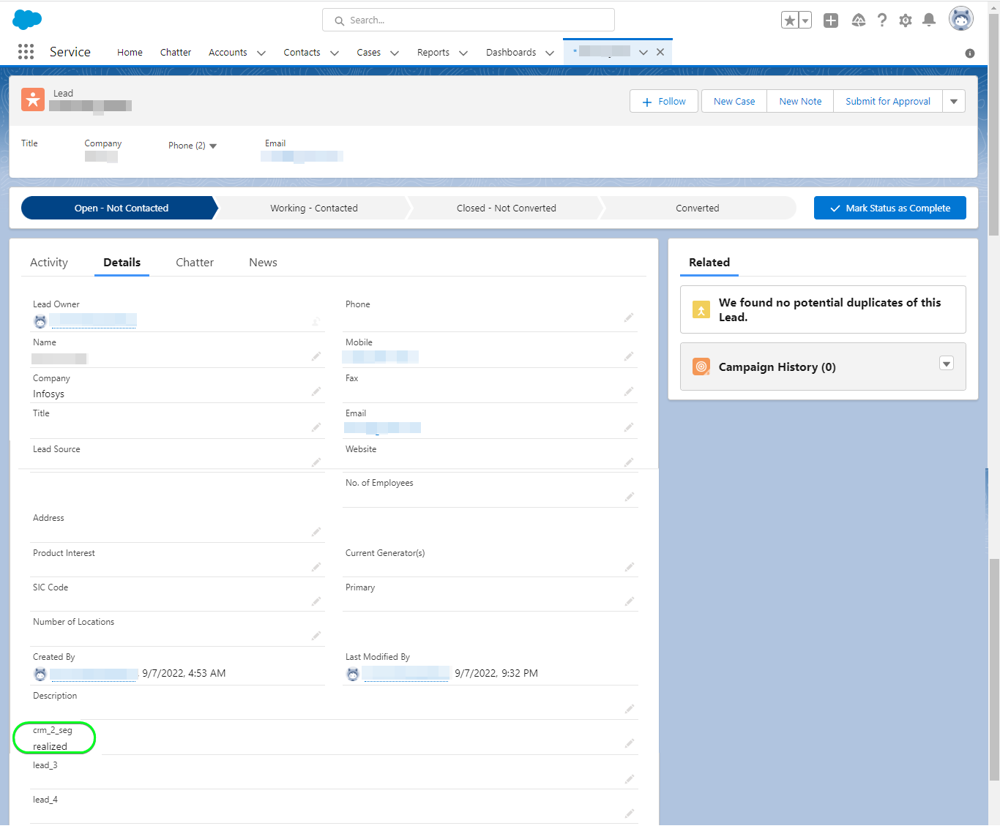

# Connessione [!DNL Salesforce CRM]

## Panoramica {#overview}

[[!DNL Salesforce CRM]](https://www.salesforce.com/crm/) è una popolare piattaforma di gestione delle relazioni con i clienti (CRM) e supporta quanto segue:

* [Lead](https://developer.salesforce.com/docs/atlas.en-us.object_reference.meta/object_reference/sforce_api_objects_lead.htm) - Un lead è il nome di una persona o di un&#39;azienda che può (o non può) essere interessata ai prodotti o ai servizi che si vendono.
* [Contatti](https://developer.salesforce.com/docs/atlas.en-us.object_reference.meta/object_reference/sforce_api_objects_contact.htm) - Un contatto è una persona con cui uno dei vostri rappresentanti ha stabilito una relazione ed è stato qualificato come potenziale cliente.

Questo [!DNL Adobe Experience Platform] [destinazione](/help/destinations/home.md) sfrutta [[!DNL Salesforce composite API]](https://developer.salesforce.com/docs/atlas.en-us.api_rest.meta/api_rest/resources_composite_sobjects_collections_update.htm), che supporta entrambi i tipi di profili descritti in precedenza.

Quando [attivazione dei segmenti](#activate), puoi scegliere tra lead o contatti e aggiornare gli attributi e i dati sul pubblico in [!DNL Salesforce CRM].

[!DNL Salesforce CRM] utilizza OAuth 2 con Concessione password come meccanismo di autenticazione per comunicare con l’API REST di Salesforce. Istruzioni per l’autenticazione [!DNL Salesforce CRM] sono riportati di seguito, nella [Autentica nella destinazione](#authenticate) sezione.

## Casi d’uso {#use-cases}

In qualità di addetto al marketing, puoi fornire esperienze personalizzate ai tuoi utenti, in base agli attributi dei loro profili Adobe Experience Platform. Puoi creare tipi di pubblico dai dati offline e inviarli a Salesforce CRM per visualizzarli nei feed degli utenti non appena i tipi di pubblico e i profili vengono aggiornati in Adobe Experience Platform.

## Prerequisiti {#prerequisites}

### Prerequisiti in Experienci Platform {#prerequisites-in-experience-platform}

Prima di attivare i dati nella destinazione del sistema CRM di Salesforce, devi disporre di un’ [schema](/help/xdm/schema/composition.md), a [set di dati](https://experienceleague.adobe.com/docs/platform-learn/tutorials/data-ingestion/create-datasets-and-ingest-data.html?lang=en), e [segmenti](https://experienceleague.adobe.com/docs/platform-learn/tutorials/segments/create-segments.html?lang=en) creato in [!DNL Experience Platform].

### Prerequisiti in [!DNL Salesforce CRM] {#prerequisites-destination}

Prendi nota dei seguenti prerequisiti in [!DNL Salesforce CRM], per esportare i dati da Platform al tuo account Salesforce:

#### Devi avere un [!DNL Salesforce] account {#prerequisites-account}

Vai a [!DNL Salesforce] [prova](https://www.salesforce.com/in/form/signup/freetrial-sales/) pagina per la registrazione e la creazione di [!DNL Salesforce] account, se non ne hai già uno.

#### Configurare un’app connessa in [!DNL Salesforce] {#prerequisites-connected-app}

Innanzitutto, devi configurare una [[!DNL Salesforce] app connessa](https://help.salesforce.com/s/articleView?id=sf.connected_app_create.htm&amp;language=en_US&amp;r=https%3A%2F%2Fhelp.salesforce.com%2F&amp;type=5) all&#39;interno del [!DNL Salesforce] account, se non ne hai già uno. [!DNL Salesforce CRM] sfrutterà l’app connessa a cui connettersi [!DNL Salesforce].

Quindi, abilita [!DNL OAuth Settings for API Integration] per [!DNL Salesforce connected app]. Consulta la sezione [[!DNL Salesforce]](https://help.salesforce.com/s/articleView?id=connected_app_create_api_integration.htm&amp;type=5&amp;language=en_US) documentazione di riferimento.

Inoltre, assicurati che [ambiti](https://help.salesforce.com/s/articleView?id=connected_app_create_api_integration.htm&amp;type=5&amp;language=en_US) di seguito sono selezionati per il [!DNL Salesforce connected app].

* ``chatter_api``
* ``lightning``
* ``visualforce``
* ``content``
* ``openid``
* ``full``
* ``api``
* ``web``
* ``refresh_token``
* ``offline_access``

Infine, assicurati che `password` la sovvenzione è abilitata all’interno del tuo [!DNL Salesforce] account. Consulta la sezione [!DNL Salesforce] [Flusso nome utente-password OAuth 2.0 per scenari speciali](https://help.salesforce.com/s/articleView?id=sf.remoteaccess_oauth_username_password_flow.htm&amp;type=5) se hai bisogno di assistenza.

>[!IMPORTANT]
>
>Se il [!DNL Salesforce] l’amministratore dell’account ha limitato l’accesso agli intervalli IP attendibili, è necessario contattarli per ottenere [IP EXPERIENCE PLATFORM](/help/destinations/catalog/streaming/ip-address-allow-list.md) inserito nell&#39;elenco Consentiti. Consulta la sezione [!DNL Salesforce] [Limitare l&#39;accesso agli intervalli IP attendibili per un&#39;app connessa](https://help.salesforce.com/s/articleView?id=sf.connected_app_edit_ip_ranges.htm&amp;type=5) se hai bisogno di ulteriore assistenza.

#### Creare campi personalizzati in [!DNL Salesforce] {#prerequisites-custom-field}

Quando si attivano i tipi di pubblico in [!DNL Salesforce CRM] destinazione, è necessario immettere un valore nella **[!UICONTROL ID mappatura]** per ogni pubblico attivato, nel **[Pianificazione del pubblico](#schedule-segment-export-example)** passaggio.

[!DNL Salesforce CRM] richiede questo valore per leggere e interpretare correttamente i tipi di pubblico provenienti da Experienci Platform e per aggiornare il loro stato di pubblico in [!DNL Salesforce]. Consulta la documentazione dell’Experience Platform per [Gruppo di campi schema Dettagli appartenenza pubblico](/help/xdm/field-groups/profile/segmentation.md) per informazioni sugli stati del pubblico.

Per ogni pubblico che attivi da Platform a [!DNL Salesforce CRM], è necessario creare un campo personalizzato del tipo `Text Area (Long)` entro [!DNL Salesforce]. Puoi definire la lunghezza del carattere di campo di qualsiasi dimensione compresa tra 256 e 131.072 caratteri in base alle tue esigenze aziendali. Consulta la [!DNL Salesforce] [Tipi di campi personalizzati](https://help.salesforce.com/s/articleView?id=sf.custom_field_types.htm&amp;type=5) per ulteriori informazioni sui tipi di campi personalizzati. Consulta anche [!DNL Salesforce] documentazione per [creare campi personalizzati](https://help.salesforce.com/s/articleView?id=mc_cab_create_an_attribute.htm&amp;type=5&amp;language=en_US) se hai bisogno di assistenza per la creazione dei campi.

>[!IMPORTANT]
>
>Non includere spazi nel nome del campo. Utilizza invece il carattere di sottolineatura `(_)` come separatore.
>Entro [!DNL Salesforce] è necessario creare campi personalizzati con **[!UICONTROL Nome campo]** che corrisponde esattamente al valore specificato in **[!UICONTROL ID mappatura]** per ogni segmento di Platform attivato. Ad esempio, la schermata seguente mostra un campo personalizzato denominato `crm_2_seg`. Quando attivi un pubblico in questa destinazione, aggiungi `crm_2_seg` as **[!UICONTROL ID mappatura]** per popolare i tipi di pubblico da Experienci Platform in questo campo personalizzato.

Un esempio di creazione di campi personalizzati in [!DNL Salesforce], *Passaggio 1: selezionare il tipo di dati*, è mostrato di seguito:

Un esempio di creazione di campi personalizzati in [!DNL Salesforce], *Passaggio 2: immettere i dettagli per il campo personalizzato*, è mostrato di seguito:

>[!TIP]
>
>* Per distinguere tra i campi personalizzati utilizzati per i tipi di pubblico di Platform e altri campi personalizzati all’interno di [!DNL Salesforce] è possibile includere un prefisso o un suffisso riconoscibile durante la creazione del campo personalizzato. Ad esempio, invece di `test_segment`, utilizza `Adobe_test_segment` o `test_segment_Adobe`
>* Se hai già creato altri campi personalizzati in [!DNL Salesforce], puoi utilizzare lo stesso nome del segmento Platform, per identificare facilmente il pubblico in [!DNL Salesforce].

>[!NOTE]
>
>* Gli oggetti in Salesforce sono limitati a 25 campi esterni, vedi [Attributi di campo personalizzati](https://help.salesforce.com/s/articleView?id=sf.custom_field_attributes.htm&amp;type=5).
>* Questa restrizione implica che è possibile avere solo un massimo di 25 iscrizioni di pubblico Experience Platform attive in qualsiasi momento.
>* Se hai raggiunto questo limite in Salesforce, devi rimuovere da Salesforce gli attributi personalizzati utilizzati per memorizzare lo stato del pubblico rispetto ai tipi di pubblico precedenti in Experienci Platform prima di un nuovo **[!UICONTROL ID mappatura]** possono essere utilizzati.

#### Raccogli [!DNL Salesforce CRM] credenziali {#gather-credentials}

Annota gli elementi riportati di seguito prima di eseguire l’autenticazione in [!DNL Salesforce CRM] destinazione:

| Credenziali | Descrizione | Esempio |
| --- | --- | --- |
| `Username` | Il tuo [!DNL Salesforce] nome utente dell’account. | |
| `Password` | Il tuo [!DNL Salesforce] password dell&#39;account. | |
| `Security Token` | Il tuo [!DNL Salesforce] token di sicurezza che verrà in seguito aggiunto alla fine del [!DNL Salesforce] Password per creare una stringa concatenata da utilizzare come **[!UICONTROL Password]** quando [autenticazione nella destinazione](#authenticate).  Consulta la sezione [!DNL Salesforce] documentazione per [reimpostare il token di sicurezza](https://help.salesforce.com/s/articleView?id=sf.user_security_token.htm&amp;type=5) per scoprire come rigenerarlo dalla [!DNL Salesforce] se non disponi del token di sicurezza. |  |
| `Custom Domain` | Il tuo [!DNL Salesforce] prefisso del dominio.   Consulta la [[!DNL Salesforce] documentazione](https://help.salesforce.com/s/articleView?id=sf.domain_name_setting_login_policy.htm&amp;type=5) per scoprire come ottenere questo valore da [!DNL Salesforce] di rete. | Se il [!DNL Salesforce] il dominio è  *`d5i000000isb4eak-dev-ed`.my.salesforce.com*,  avrà bisogno di `d5i000000isb4eak-dev-ed` come valore. |
| `Client ID` | Salesforce personale `Consumer Key`.   Consulta la sezione [[!DNL Salesforce] documentazione](https://help.salesforce.com/s/articleView?id=sf.connected_app_rotate_consumer_details.htm&amp;type=5) per scoprire come ottenere questo valore da [!DNL Salesforce] di rete. | |
| `Client Secret` | Salesforce personale `Consumer Secret`.   Consulta la sezione [[!DNL Salesforce] documentazione](https://help.salesforce.com/s/articleView?id=sf.connected_app_rotate_consumer_details.htm&amp;type=5) per scoprire come ottenere questo valore da [!DNL Salesforce] di rete. | |

### Guardrail {#guardrails}

[!DNL Salesforce] bilancia i carichi delle transazioni imponendo limiti di richiesta, frequenza e timeout. Consulta la sezione [Limiti e allocazioni di richieste API](https://developer.salesforce.com/docs/atlas.en-us.salesforce_app_limits_cheatsheet.meta/salesforce_app_limits_cheatsheet/salesforce_app_limits_platform_api.htm) per i dettagli.

Se il [!DNL Salesforce] l&#39;amministratore dell&#39;account ha imposto restrizioni IP, sarà necessario aggiungere [Experience Platform di indirizzi IP](/help/destinations/catalog/streaming/ip-address-allow-list.md) al tuo [!DNL Salesforce] intervalli IP attendibili degli account. Consulta la sezione [!DNL Salesforce] [Limitare l&#39;accesso agli intervalli IP attendibili per un&#39;app connessa](https://help.salesforce.com/s/articleView?id=sf.connected_app_edit_ip_ranges.htm&amp;type=5) se hai bisogno di ulteriore assistenza.

>[!IMPORTANT]
>
>Quando [attivazione dei segmenti](#activate) è necessario scegliere tra *Contatto* o *Lead* tipi. Assicurati che i tipi di pubblico dispongano della mappatura dei dati appropriata in base al tipo selezionato.

## Identità supportate {#supported-identities}

[!DNL Salesforce CRM] supporta l’aggiornamento delle identità descritte nella tabella seguente. Ulteriori informazioni su [identità](/help/identity-service/namespaces.md).

| Identità di destinazione | Descrizione | Considerazioni |
|---|---|---|
| `SalesforceId` | Il [!DNL Salesforce CRM] identificatore delle identità di contatto o lead esportate o aggiornate tramite il segmento. | Obbligatorio |

## Tipo e frequenza di esportazione {#export-type-frequency}

Per informazioni sul tipo e sulla frequenza di esportazione della destinazione, consulta la tabella seguente.

| Elemento | Tipo | Note |
---------|----------|---------|
| Tipo di esportazione | **[!UICONTROL Basato su profilo]** | <ul><li>Stai esportando tutti i membri di un segmento, insieme ai campi schema desiderati *ad esempio: indirizzo e-mail, numero di telefono, cognome*, in base alla mappatura del campo.</li><li> Ogni stato del pubblico in [!DNL Salesforce CRM] viene aggiornato con il corrispondente stato del pubblico da Platform, in base al **[!UICONTROL ID mappatura]** valore fornito durante il [pianificazione del pubblico](#schedule-segment-export-example) passaggio.</li></ul> |
| Frequenza di esportazione | **[!UICONTROL Streaming]** | <ul><li>Le destinazioni di streaming sono connessioni &quot;sempre attive&quot; basate su API. Non appena un profilo viene aggiornato in Experienci Platform in base alla valutazione del pubblico, il connettore invia l’aggiornamento a valle alla piattaforma di destinazione. Ulteriori informazioni su [destinazioni di streaming](/help/destinations/destination-types.md#streaming-destinations).</li></ul> |

{style="table-layout:auto"}

## Connetti alla destinazione {#connect}

>[!IMPORTANT]
>
>Per connettersi alla destinazione, è necessario **[!UICONTROL Gestire le destinazioni]** [autorizzazione per il controllo degli accessi](/help/access-control/home.md#permissions). Leggi le [panoramica sul controllo degli accessi](/help/access-control/ui/overview.md) oppure contatta l’amministratore del prodotto per ottenere le autorizzazioni necessarie.

Per connettersi a questa destinazione, seguire i passaggi descritti in [esercitazione sulla configurazione della destinazione](../../ui/connect-destination.md). Nel flusso di lavoro di configurazione della destinazione, compila i campi elencati nelle due sezioni seguenti.

Entro **[!UICONTROL Destinazioni]** > **[!UICONTROL Catalogo]** cerca [!DNL Salesforce CRM]. In alternativa, è possibile posizionarlo sotto il **[!UICONTROL CRM]** categoria.

### Autentica nella destinazione {#authenticate}

Per eseguire l’autenticazione nella destinazione, compila i campi richiesti di seguito e seleziona **[!UICONTROL Connetti alla destinazione]**. Consulta la sezione [Raccogli [!DNL Salesforce CRM] credenziali](#gather-credentials) sezione per eventuali indicazioni.
| Credenziali | Descrizione | | — | — | | **[!UICONTROL Nome utente]** | Il tuo [!DNL Salesforce] nome utente dell’account. | | **[!UICONTROL Password]** | Stringa concatenata composta da [!DNL Salesforce] password dell&#39;account aggiunta al tuo [!DNL Salesforce] Token di sicurezza. Il valore concatenato assume la forma di `{PASSWORD}{TOKEN}`.  Non utilizzare parentesi graffe o spazi. Ad esempio, se [!DNL Salesforce] La password è `MyPa$$w0rd123` e [!DNL Salesforce] Il token di sicurezza è `TOKEN12345....0000`, il valore concatenato che utilizzerai nel **[!UICONTROL Password]** il campo è `MyPa$$w0rd123TOKEN12345....0000`. | | **[!UICONTROL Dominio personalizzato]** | Il tuo [!DNL Salesforce] prefisso del dominio.  Ad esempio, se il dominio è *`d5i000000isb4eak-dev-ed`.my.salesforce.com*, devi fornire `d5i000000isb4eak-dev-ed` come valore. | | **[!UICONTROL ID client]** | Il tuo [!DNL Salesforce] app connessa `Consumer Key`. | | **[!UICONTROL Segreto client]** | Il tuo [!DNL Salesforce] app connessa `Consumer Secret`. |

Se i dettagli forniti sono validi, nell’interfaccia utente viene visualizzato un **[!UICONTROL Connesso]** con un segno di spunta verde, puoi quindi procedere al passaggio successivo.

### Inserisci i dettagli della destinazione {#destination-details}

Per configurare i dettagli per la destinazione, compila i campi obbligatori e facoltativi seguenti. Un asterisco accanto a un campo nell’interfaccia utente indica che il campo è obbligatorio.
* **[!UICONTROL Nome]**: nome con cui riconoscerai questa destinazione in futuro.
* **[!UICONTROL Descrizione]**: descrizione che ti aiuterà a identificare questa destinazione in futuro.
* **[!UICONTROL Tipo ID Salesforce]**:
   * Seleziona **[!UICONTROL Contatto]** se le identità che desideri esportare o aggiornare sono di tipo *Contatto*.
   * Seleziona **[!UICONTROL Lead]** se le identità che desideri esportare o aggiornare sono di tipo *Lead*.

### Abilita avvisi {#enable-alerts}

Puoi abilitare gli avvisi per ricevere notifiche sullo stato del flusso di dati verso la tua destinazione. Seleziona un avviso dall’elenco per abbonarti e ricevere notifiche sullo stato del flusso di dati. Per ulteriori informazioni sugli avvisi, consulta la guida su [abbonamento agli avvisi sulle destinazioni tramite l’interfaccia utente](../../ui/alerts.md).

Una volta completate le informazioni sulla connessione di destinazione, seleziona **[!UICONTROL Successivo]**.

## Attiva il pubblico in questa destinazione {#activate}

>[!IMPORTANT]
> 
>* Per attivare i dati, è necessario **[!UICONTROL Gestire le destinazioni]**, **[!UICONTROL Attivare le destinazioni]**, **[!UICONTROL Visualizza profili]**, e **[!UICONTROL Visualizzare segmenti]** [autorizzazioni di controllo degli accessi](/help/access-control/home.md#permissions). Leggi le [panoramica sul controllo degli accessi](/help/access-control/ui/overview.md) oppure contatta l’amministratore del prodotto per ottenere le autorizzazioni necessarie.
>* Per esportare *identità*, è necessario **[!UICONTROL Visualizza grafico delle identità]** [autorizzazione per il controllo degli accessi](/help/access-control/home.md#permissions).   {width="100" zoomable="yes"}

Letto [Attiva profili e tipi di pubblico nelle destinazioni di esportazione del pubblico in streaming](/help/destinations/ui/activate-segment-streaming-destinations.md) per istruzioni sull’attivazione dei tipi di pubblico in questa destinazione.

### Considerazioni sulla mappatura ed esempio {#mapping-considerations-example}

Per inviare correttamente i dati sul pubblico da Adobe Experience Platform a [!DNL Salesforce CRM] destinazione, devi passare attraverso il passaggio di mappatura dei campi. La mappatura consiste nella creazione di un collegamento tra i campi dello schema Experience Data Model (XDM) nell’account Platform e i corrispondenti equivalenti dalla destinazione.

Attributi specificati in **[!UICONTROL Campo di destinazione]** devono essere denominati esattamente come descritto nella tabella delle mappature degli attributi, in quanto questi attributi formeranno il corpo della richiesta.

Attributi specificati in **[!UICONTROL Campo di origine]** non seguire tali restrizioni. Puoi mapparlo in base alle tue esigenze, ma assicurati che il formato dei dati di input sia valido in base alla [[!DNL Salesforce] documentazione](https://help.salesforce.com/s/articleView?id=sf.custom_field_attributes.htm&amp;type=5). Se i dati di input non sono validi, la chiamata di aggiornamento a [!DNL Salesforce] non riuscirà e i contatti/lead non verranno aggiornati.

Per mappare correttamente i campi XDM su [!DNL (API) Salesforce CRM] campi di destinazione, effettua le seguenti operazioni:

1. In **[!UICONTROL Mappatura]** passaggio, seleziona **[!UICONTROL Aggiungi nuova mappatura]**, sullo schermo viene visualizzata una nuova riga di mappatura.
   
1. In **[!UICONTROL Seleziona campo di origine]** finestra, scegli la **[!UICONTROL Seleziona attributi]** e selezionare l&#39;attributo XDM o scegliere il **[!UICONTROL Seleziona lo spazio dei nomi dell’identità]** e seleziona un’identità.
1. In **[!UICONTROL Seleziona campo di destinazione]** finestra, scegli la **[!UICONTROL Seleziona lo spazio dei nomi dell’identità]** e seleziona un’identità o scegli **[!UICONTROL Seleziona attributi personalizzati]** categoria e selezionare un attributo o definirne uno utilizzando **[!UICONTROL Nome attributo]** in base alle esigenze. Consulta la sezione [[!DNL Salesforce CRM] documentazione](https://help.salesforce.com/s/articleView?id=sf.custom_field_attributes.htm&amp;type=5) per indicazioni sugli attributi supportati.
   * Ripeti questi passaggi per aggiungere le seguenti mappature tra lo schema del profilo XDM e [!DNL (API) Salesforce CRM]:

   **Utilizzo dei contatti**

   * Se si lavora con *Contatti* all’interno del segmento, consulta la documentazione sugli oggetti in Salesforce per [Contatto](https://developer.salesforce.com/docs/atlas.en-us.object_reference.meta/object_reference/sforce_api_objects_contact.htm) per definire le mappature per i campi da aggiornare.
   * È possibile identificare i campi obbligatori cercando la parola *Obbligatorio*, menzionato nelle descrizioni dei campi nel collegamento precedente.
   * A seconda dei campi che desideri esportare o aggiornare, aggiungi mappature tra lo schema del profilo XDM e [!DNL (API) Salesforce CRM]: Note campo origine|campo destinazione| | | — | — | — | |`IdentityMap: crmID`|`Identity: SalesforceId`|`Mandatory`| |`xdm: person.name.lastName`|`Attribute: LastName`| `Mandatory`. Cognome del contatto fino a 80 caratteri. |\
     |`xdm: person.name.firstName`|`Attribute: FirstName`| Il nome del contatto può contenere un massimo di 40 caratteri. | |`xdm: personalEmail.address`|`Attribute: Email`| Indirizzo e-mail del contatto. |

   * Di seguito è riportato un esempio che utilizza queste mappature:
     

   **Utilizzo dei lead**

   * Se si lavora con *Lead* all’interno del segmento, consulta la documentazione sugli oggetti in Salesforce per [Lead](https://developer.salesforce.com/docs/atlas.en-us.object_reference.meta/object_reference/sforce_api_objects_lead.htm) per definire le mappature per i campi da aggiornare.
   * È possibile identificare i campi obbligatori cercando la parola *Obbligatorio*, menzionato nelle descrizioni dei campi nel collegamento precedente.
   * A seconda dei campi che desideri esportare o aggiornare, aggiungi mappature tra lo schema del profilo XDM e [!DNL (API) Salesforce CRM]: Note campo origine|campo destinazione| | | — | — | — | |`IdentityMap: crmID`|`Identity: SalesforceId`|`Mandatory`| |`xdm: person.name.lastName`|`Attribute: LastName`| `Mandatory`. Cognome della sequenza fino a 80 caratteri. |\
     |`xdm: b2b.companyName`|`Attribute: Company`| `Mandatory`. L&#39;azienda del lead. | |`xdm: personalEmail.address`|`Attribute: Email`| Indirizzo e-mail del lead. |

   * Di seguito è riportato un esempio che utilizza queste mappature:
     

Una volta completate le mappature per la connessione di destinazione, seleziona **[!UICONTROL Successivo]**.

### Esempio di esportazione e pianificazione di un pubblico {#schedule-segment-export-example}

Durante l&#39;esecuzione di [Pianificare l’esportazione del pubblico](/help/destinations/ui/activate-segment-streaming-destinations.md#scheduling) passaggio è necessario mappare manualmente i tipi di pubblico attivati da Platform al relativo campo personalizzato in [!DNL Salesforce].

A questo scopo, seleziona ogni segmento, quindi inserisci il nome del campo personalizzato da [!DNL Salesforce] nel [!DNL Salesforce CRM] **[!UICONTROL ID mappatura]** campo. Consulta la sezione [Creare campi personalizzati in [!DNL Salesforce]](#prerequisites-custom-field) sezione per indicazioni e best practice sulla creazione di campi personalizzati in [!DNL Salesforce].

Ad esempio, se [!DNL Salesforce] il campo personalizzato è `crm_2_seg`, specifica questo valore in [!DNL Salesforce CRM] **[!UICONTROL ID mappatura]** per popolare i tipi di pubblico da Experienci Platform in questo campo personalizzato.

Esempio di campo personalizzato da [!DNL Salesforce] è mostrato di seguito:
![[!DNL Salesforce] Schermata dell’interfaccia utente che mostra il campo personalizzato.](../../assets/catalog/crm/salesforce/salesforce-custom-field.png)

Un esempio che indica la posizione del [!DNL Salesforce CRM] **[!UICONTROL ID mappatura]** è mostrato di seguito:

Come mostrato sopra, [!DNL Salesforce] **[!UICONTROL Nome campo]** corrisponde esattamente al valore specificato in [!DNL Salesforce CRM] **[!UICONTROL ID mappatura]**.

A seconda del caso d’uso, tutti i tipi di pubblico attivati possono essere mappati sullo stesso [!DNL Salesforce] campo personalizzato o diverso **[!UICONTROL Nome campo]** in [!DNL Salesforce CRM]. Un esempio tipico basato sull’immagine mostrata sopra potrebbe essere.
| [!DNL Salesforce CRM] nome segmento | [!DNL Salesforce] **[!UICONTROL Nome campo]** | [!DNL Salesforce CRM] **[!UICONTROL ID mappatura]** | | — | — | — | | crm_1_seg | `crm_1_seg` | `crm_1_seg` | | crm_2_seg | `crm_2_seg` | `crm_2_seg` |

Ripeti questa sezione per ogni segmento di Platform attivato.

## Convalidare l’esportazione dei dati {#exported-data}

Per verificare di aver impostato correttamente la destinazione, segui i passaggi seguenti:

1. Seleziona **[!UICONTROL Destinazioni]** > **[!UICONTROL Sfoglia]** per passare all’elenco delle destinazioni.
   

1. Seleziona la destinazione e verifica che lo stato sia **[!UICONTROL abilitato]**.
   

1. Passa a **[!UICONTROL Dati di attivazione]** , quindi seleziona un nome per il pubblico.
   

1. Controlla il riepilogo del pubblico e assicurati che il conteggio dei profili corrisponda al conteggio creato all’interno del segmento.
   

1. Infine, accedi al sito web Salesforce e verifica se i profili del pubblico sono stati aggiunti o aggiornati.

   **Utilizzo dei contatti**

   * Se hai selezionato *Contatti* all’interno del segmento Platform, passa a **[!DNL Apps]** > **[!DNL Contacts]** pagina.
     

   * Seleziona un *Contatto* e controlla se i campi sono aggiornati. Puoi vedere che ogni stato del pubblico in [!DNL Salesforce CRM] è stato aggiornato con il corrispondente stato del pubblico da Platform, in base al **[!UICONTROL ID mappatura]** valore fornito durante il [pianificazione del pubblico](#schedule-segment-export-example).
     

   **Utilizzo dei lead**

   * Se hai selezionato *Lead* all’interno del segmento Platform, quindi vai al **[!DNL Apps]** > **[!DNL Leads]** pagina.
     

   * Seleziona un *Lead* e controlla se i campi sono aggiornati. Puoi vedere che ogni stato del pubblico in [!DNL Salesforce CRM] è stato aggiornato con il corrispondente stato del pubblico da Platform, in base al **[!UICONTROL ID mappatura]** valore fornito durante il [pianificazione del pubblico](#schedule-segment-export-example).
     

## Utilizzo dei dati e governance {#data-usage-governance}

Tutti [!DNL Adobe Experience Platform] le destinazioni sono conformi ai criteri di utilizzo dei dati durante la gestione dei dati. Per informazioni dettagliate su come [!DNL Adobe Experience Platform] applica la governance dei dati, consulta la sezione [Panoramica sulla governance dei dati](/help/data-governance/home.md).

## Errori e risoluzione problemi {#errors-and-troubleshooting}

### Sono stati riscontrati errori sconosciuti durante la trasmissione degli eventi alla destinazione {#unknown-errors}

* Durante il controllo di un’esecuzione del flusso di dati, è possibile che venga visualizzato il seguente messaggio di errore: `Unknown errors encountered while pushing events to the destination. Please contact the administrator and try again.`
  

   * Per correggere questo errore, verifica che **[!UICONTROL ID mappatura]** che hai fornito nel flusso di lavoro di attivazione a [!DNL Salesforce CRM] La destinazione corrisponde esattamente al valore del tipo di campo personalizzato creato in [!DNL Salesforce]. Consulta la sezione [Creare campi personalizzati in [!DNL Salesforce]](#prerequisites-custom-field) sezione di orientamento.

* Quando attivi un segmento, potresti ricevere un messaggio di errore: `The client's IP address is unauthorized for this account. Allowlist the client's IP address...`
   * Per risolvere il problema, contattare il [!DNL Salesforce] amministratore dell’account da aggiungere [Experience Platform di indirizzi IP](/help/destinations/catalog/streaming/ip-address-allow-list.md) al tuo [!DNL Salesforce] intervalli IP attendibili degli account. Consulta la sezione [!DNL Salesforce] [Limitare l&#39;accesso agli intervalli IP attendibili per un&#39;app connessa](https://help.salesforce.com/s/articleView?id=sf.connected_app_edit_ip_ranges.htm&amp;type=5) se hai bisogno di ulteriore assistenza.

## Risorse aggiuntive {#additional-resources}

Ulteriori informazioni utili da [Portale per sviluppatori Salesforce](https://developer.salesforce.com/) è sotto:
* [Guida introduttiva](https://developer.salesforce.com/docs/atlas.en-us.api_rest.meta/api_rest/quickstart.htm)
* [Crea un record](https://developer.salesforce.com/docs/atlas.en-us.api_rest.meta/api_rest/dome_sobject_create.htm)
* [Tipi di pubblico per consigli personalizzati](https://developer.salesforce.com/docs/atlas.en-us.236.0.chatterapi.meta/chatterapi/connect_resources_recommendation_audiences_list.htm)
* [Utilizzo di risorse composite](https://developer.salesforce.com/docs/atlas.en-us.api_rest.meta/api_rest/using_composite_resources.htm?q=composite)
* Questa destinazione sfrutta [Esegue l&#39;upsert di più record](https://developer.salesforce.com/docs/atlas.en-us.api_rest.meta/api_rest/resources_composite_sobjects_collections_update.htm) API invece di [Esegui upsert record singolo](https://developer.salesforce.com/docs/atlas.en-us.api_rest.meta/api_rest/dome_composite_upsert_example.htm?q=contacts) Chiamata API.