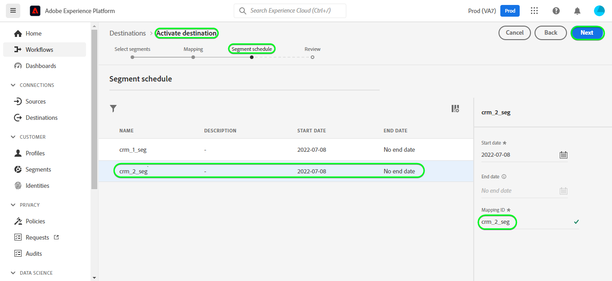

# [!DNL Salesforce CRM] connection

## Panoramica {#overview}

[[!DNL Salesforce CRM]](https://www.salesforce.com/crm/) è una piattaforma di gestione delle relazioni con i clienti (Customer Relationship Management, CRM) popolare e supporta quanto segue:

* [Lead](https://developer.salesforce.com/docs/atlas.en-us.object_reference.meta/object_reference/sforce_api_objects_lead.htm) - Un lead è il nome di una persona o di un&#39;azienda che può (o meno) essere interessata ai prodotti o ai servizi che vendi.
* [Contatti](https://developer.salesforce.com/docs/atlas.en-us.object_reference.meta/object_reference/sforce_api_objects_contact.htm) - Un contatto è una persona con la quale uno dei vostri rappresentanti ha stabilito un rapporto ed è stato qualificato come potenziale cliente.

Questo [!DNL Adobe Experience Platform] [destinazione](/help/destinations/home.md) sfrutta [[!DNL Salesforce composite API]](https://developer.salesforce.com/docs/atlas.en-us.api_rest.meta/api_rest/resources_composite_sobjects_collections_update.htm), che supporta entrambi i tipi di profili descritti in precedenza.

Quando [attivazione dei segmenti](#activate), puoi scegliere tra lead o contatti e aggiornare gli attributi e segmentare i dati in [!DNL Salesforce CRM].

[!DNL Salesforce CRM] utilizza OAuth 2 con Password Grant come meccanismo di autenticazione per comunicare con l’API REST di Salesforce. Istruzioni per l&#39;autenticazione al tuo [!DNL Salesforce CRM] l&#39;istanza è più in basso, nel [Autentica a destinazione](#authenticate) sezione .

## Casi d’uso {#use-cases}

In qualità di addetto al marketing, puoi offrire esperienze personalizzate agli utenti in base agli attributi dei loro profili Adobe Experience Platform. Puoi creare segmenti dai dati offline e inviare questi segmenti a CRM Salesforce per visualizzarli nei feed degli utenti non appena i segmenti e i profili vengono aggiornati in Adobe Experience Platform.

## Prerequisiti {#prerequisites}

### Prerequisiti in Experience Platform {#prerequisites-in-experience-platform}

Prima di attivare i dati alla destinazione CRM Salesforce, devi disporre di un [schema](/help/xdm/schema/composition.md), [set di dati](https://experienceleague.adobe.com/docs/platform-learn/tutorials/data-ingestion/create-datasets-and-ingest-data.html?lang=en)e [segmenti](https://experienceleague.adobe.com/docs/platform-learn/tutorials/segments/create-segments.html?lang=en) creato in [!DNL Experience Platform].

### Prerequisiti in [!DNL Salesforce CRM] {#prerequisites-destination}

Prendi nota dei seguenti prerequisiti in [!DNL Salesforce CRM], per esportare i dati da Platform al tuo account Salesforce:

#### Devi avere un [!DNL Salesforce] account {#prerequisites-account}

Vai a [!DNL Salesforce] [processo](https://www.salesforce.com/in/form/signup/freetrial-sales/) per registrare e creare un [!DNL Salesforce] se non ne hai già uno.

#### Configurare un’app connessa in [!DNL Salesforce] {#prerequisites-connected-app}

Innanzitutto, devi configurare un [[!DNL Salesforce] app connessa](https://help.salesforce.com/s/articleView?id=sf.connected_app_create.htm&amp;language=en_US&amp;r=https%3A%2F%2Fhelp.salesforce.com%2F&amp;type=5) all&#39;interno della [!DNL Salesforce] se non ne hai già uno. [!DNL Salesforce CRM] sfrutterà l’app connessa a cui connettersi [!DNL Salesforce].

Quindi, abilita [!DNL OAuth Settings for API Integration] per [!DNL Salesforce connected app]. Fai riferimento a [[!DNL Salesforce]](https://help.salesforce.com/s/articleView?id=connected_app_create_api_integration.htm&amp;type=5&amp;language=en_US) documentazione di riferimento.

Inoltre, assicurati che [ambiti](https://help.salesforce.com/s/articleView?id=connected_app_create_api_integration.htm&amp;type=5&amp;language=en_US) indicati di seguito sono selezionati per [!DNL Salesforce connected app].

* ``chatter_api``
* ``lightning``
* ``visualforce``
* ``content``
* ``openid``
* ``full``
* ``api``
* ``web``
* ``refresh_token``
* ``offline_access``

Infine, assicurati che `password` la sovvenzione è abilitata all&#39;interno della [!DNL Salesforce] conto. Fai riferimento a [!DNL Salesforce] [Flusso nome utente e password OAuth 2.0 per scenari speciali](https://help.salesforce.com/s/articleView?id=sf.remoteaccess_oauth_username_password_flow.htm&amp;type=5) se hai bisogno di assistenza.

>[!IMPORTANT]
>
>Se [!DNL Salesforce] l&#39;amministratore dell&#39;account ha limitato l&#39;accesso agli intervalli IP attendibili, è necessario contattarli per ottenere [IP di Experience Platform](/help/destinations/catalog/streaming/ip-address-allow-list.md) inserito nell&#39;elenco Consentiti. Fai riferimento a [!DNL Salesforce] [Limitare l&#39;accesso agli intervalli IP attendibili per un&#39;app connessa](https://help.salesforce.com/s/articleView?id=sf.connected_app_edit_ip_ranges.htm&amp;type=5) se hai bisogno di ulteriori informazioni.

#### Crea campi personalizzati all’interno di [!DNL Salesforce] {#prerequisites-custom-field}

Quando si attivano i segmenti nel [!DNL Salesforce CRM] di destinazione, è necessario inserire un valore nel **[!UICONTROL ID mappatura]** per ogni segmento attivato, nel **[Pianificazione del segmento](#schedule-segment-export-example)** passo.

[!DNL Salesforce CRM] richiede questo valore per leggere e interpretare correttamente i segmenti provenienti da Experience Platform e per aggiornare il loro stato del segmento in [!DNL Salesforce]. Consulta la documentazione di Experience Platform per [Gruppo di campi Dettagli appartenenza segmento](/help/xdm/field-groups/profile/segmentation.md) se hai bisogno di indicazioni sugli stati dei segmenti.

Per ogni segmento attivato da Platform a [!DNL Salesforce CRM], è necessario creare un campo personalizzato del tipo `Text Area (Long)` entro [!DNL Salesforce]. Puoi definire la lunghezza del carattere del campo di qualsiasi dimensione compresa tra 256 - 131.072 caratteri in base alle tue esigenze aziendali. Consulta la sezione [!DNL Salesforce] [Tipi di campi personalizzati](https://help.salesforce.com/s/articleView?id=sf.custom_field_types.htm&amp;type=5) pagina di documentazione per ulteriori informazioni sui tipi di campi personalizzati. Fai anche riferimento alla sezione [!DNL Salesforce] documentazione [creare campi personalizzati](https://help.salesforce.com/s/articleView?id=mc_cab_create_an_attribute.htm&amp;type=5&amp;language=en_US) se hai bisogno di assistenza per la creazione dei campi.

>[!IMPORTANT]
>
>Non includere spazi bianchi nel nome del campo. Utilizza invece il carattere di sottolineatura `(_)` come separatore.
>Within [!DNL Salesforce] è necessario creare campi personalizzati con un **[!UICONTROL Nome campo]** che corrisponde esattamente al valore specificato in **[!UICONTROL ID mappatura]** per ogni segmento Platform attivato. Ad esempio, la schermata seguente mostra un campo personalizzato denominato `crm_2_seg`. Quando attivi un segmento a questa destinazione, aggiungi `crm_2_seg` come **[!UICONTROL ID mappatura]** per popolare i tipi di pubblico dei segmenti da Experience Platform in questo campo personalizzato.

Esempio di creazione di campi personalizzati in [!DNL Salesforce], *Passaggio 1: selezionare il tipo di dati*, è mostrato di seguito:

Esempio di creazione di campi personalizzati in [!DNL Salesforce], *Passaggio 2: inserire i dettagli del campo personalizzato*, è mostrato di seguito:

>[!TIP]
>
>* Per distinguere tra campi personalizzati utilizzati per segmenti Platform e altri campi personalizzati all’interno di [!DNL Salesforce] è possibile includere un prefisso o un suffisso riconoscibile durante la creazione del campo personalizzato. Ad esempio, anziché `test_segment`, utilizza `Adobe_test_segment` o `test_segment_Adobe`
>* Se sono già stati creati altri campi personalizzati in [!DNL Salesforce], puoi utilizzare lo stesso nome del segmento Platform per identificare facilmente il segmento in [!DNL Salesforce].

>[!NOTE]
>
>* Gli oggetti in Salesforce sono limitati a 25 campi esterni, vedere [Attributi del campo personalizzati](https://help.salesforce.com/s/articleView?id=sf.custom_field_attributes.htm&amp;type=5).
>* Questa limitazione implica che è possibile avere un massimo di 25 appartenenze al segmento Experience Platform attive in qualsiasi momento.
>* Se hai raggiunto questo limite in Salesforce, devi rimuovere gli attributi personalizzati da Salesforce utilizzati per memorizzare lo stato del segmento rispetto ai segmenti più vecchi all’interno di Experience Platform prima di un nuovo **[!UICONTROL ID mappatura]** può essere utilizzato.

#### Raccogli [!DNL Salesforce CRM] credenziali {#gather-credentials}

Prima di eseguire l&#39;autenticazione al [!DNL Salesforce CRM] destinazione:

| Credenziali | Descrizione | Esempio |
| --- | --- | --- |
| `Username` | Le [!DNL Salesforce] nome utente account. |  |
| `Password` | Le [!DNL Salesforce] password dell&#39;account. |  |
| `Security Token` | Le [!DNL Salesforce] token di sicurezza che verrà aggiunto in seguito alla fine del [!DNL Salesforce] Password per creare una stringa concatenata da utilizzare come **[!UICONTROL Password]** quando [autenticazione alla destinazione](#authenticate).  Fai riferimento a [!DNL Salesforce] documentazione [reimpostare il token di sicurezza](https://help.salesforce.com/s/articleView?id=sf.user_security_token.htm&amp;type=5) per imparare a rigenerarlo dal [!DNL Salesforce] Se non disponi del Token di sicurezza . |  |
| `Custom Domain` | Le [!DNL Salesforce] prefisso del dominio.   Consulta la sezione [[!DNL Salesforce] documentazione](https://help.salesforce.com/s/articleView?id=sf.domain_name_setting_login_policy.htm&amp;type=5) per scoprire come ottenere questo valore dal [!DNL Salesforce] interfaccia. | Se [!DNL Salesforce] dominio  *`d5i000000isb4eak-dev-ed`.my.salesforce.com*,  avrete bisogno di `d5i000000isb4eak-dev-ed` come valore. |
| `Client ID` | La tua Salesforce `Consumer Key`.   Fai riferimento a [[!DNL Salesforce] documentazione](https://help.salesforce.com/s/articleView?id=sf.connected_app_rotate_consumer_details.htm&amp;type=5) per scoprire come ottenere questo valore dal [!DNL Salesforce] interfaccia. |  |
| `Client Secret` | La tua Salesforce `Consumer Secret`.   Fai riferimento a [[!DNL Salesforce] documentazione](https://help.salesforce.com/s/articleView?id=sf.connected_app_rotate_consumer_details.htm&amp;type=5) per scoprire come ottenere questo valore dal [!DNL Salesforce] interfaccia. |  |

### Guardrail {#guardrails}

[!DNL Salesforce] consente di bilanciare i carichi delle transazioni imponendo limiti di richiesta, tasso e timeout. Fai riferimento a [Limiti e allocazioni di richieste API](https://developer.salesforce.com/docs/atlas.en-us.salesforce_app_limits_cheatsheet.meta/salesforce_app_limits_cheatsheet/salesforce_app_limits_platform_api.htm) per i dettagli.

Se [!DNL Salesforce] l&#39;amministratore dell&#39;account ha imposto restrizioni IP, sarà necessario aggiungere [Experience Platform di indirizzi IP](/help/destinations/catalog/streaming/ip-address-allow-list.md) al tuo [!DNL Salesforce] gli intervalli IP affidabili degli account. Fai riferimento a [!DNL Salesforce] [Limitare l&#39;accesso agli intervalli IP attendibili per un&#39;app connessa](https://help.salesforce.com/s/articleView?id=sf.connected_app_edit_ip_ranges.htm&amp;type=5) se hai bisogno di ulteriori informazioni.

>[!IMPORTANT]
>
>Quando [attivazione dei segmenti](#activate) è necessario selezionare tra *Contatto* o *Lead* tipi. Devi accertarti che i segmenti abbiano la mappatura dati appropriata in base al tipo selezionato.

## Identità supportate {#supported-identities}

[!DNL Salesforce CRM] supporta l’aggiornamento delle identità descritte nella tabella seguente. Ulteriori informazioni [identità](/help/identity-service/namespaces.md).

| Identità di destinazione | Descrizione | Considerazioni |
|---|---|---|
| `SalesforceId` | La [!DNL Salesforce CRM] identificatore per le identità di contatto o lead esportate o aggiornate nel segmento. | Obbligatorio |

## Tipo e frequenza di esportazione {#export-type-frequency}

Per informazioni sul tipo e sulla frequenza di esportazione della destinazione, fare riferimento alla tabella seguente.

| Elemento | Tipo | Note |
---------|----------|---------|
| Tipo di esportazione | **[!UICONTROL Basato su profilo]** | <ul><li>Stai esportando tutti i membri di un segmento, insieme ai campi dello schema desiderati *(ad esempio: indirizzo e-mail, numero di telefono, cognome)*, in base alla mappatura del campo.</li><li> Ogni stato di segmento in [!DNL Salesforce CRM] viene aggiornato con lo stato del segmento corrispondente da Platform, in base alla **[!UICONTROL ID mappatura]** valore fornito durante [programmazione dei segmenti](#schedule-segment-export-example) passo.</li></ul> |
| Frequenza delle esportazioni | **[!UICONTROL Streaming]** | <ul><li>Le destinazioni di streaming sono connessioni basate su API &quot;sempre attive&quot;. Non appena un profilo viene aggiornato in Experience Platform in base alla valutazione del segmento, il connettore invia l’aggiornamento a valle alla piattaforma di destinazione. Ulteriori informazioni [destinazioni di streaming](/help/destinations/destination-types.md#streaming-destinations).</li></ul> |

{style=&quot;table-layout:auto&quot;}

## Collegati alla destinazione {#connect}

>[!IMPORTANT]
>
>Per connettersi alla destinazione, è necessario **[!UICONTROL Gestire le destinazioni]** [autorizzazione controllo accessi](/help/access-control/home.md#permissions). Leggi la sezione [panoramica sul controllo degli accessi](/help/access-control/ui/overview.md) oppure contatta l’amministratore del prodotto per ottenere le autorizzazioni richieste.

Per connettersi a questa destinazione, segui i passaggi descritti in [esercitazione sulla configurazione della destinazione](../../ui/connect-destination.md). Nel flusso di lavoro di configurazione della destinazione , compila i campi elencati nelle due sezioni seguenti.

Within **[!UICONTROL Destinazioni]** > **[!UICONTROL Catalogo]** cercare [!DNL Salesforce CRM]. In alternativa, è possibile individuarlo sotto il **[!UICONTROL CRM]** categoria.

### Autentica a destinazione {#authenticate}

Per eseguire l’autenticazione nella destinazione, compila i campi richiesti di seguito e seleziona **[!UICONTROL Connetti alla destinazione]**. Fai riferimento a [Raccogli [!DNL Salesforce CRM] credenziali](#gather-credentials) sezione per eventuali indicazioni.
| Credenziali | Descrizione | | — | — | | **[!UICONTROL Nome utente]** | Il [!DNL Salesforce] nome utente account. | | **[!UICONTROL Password]** | Una stringa concatenata composta da [!DNL Salesforce] password dell&#39;account aggiunta con il tuo [!DNL Salesforce] Token di sicurezza. Il valore concatenato assume la forma di `{PASSWORD}{TOKEN}`.  Nota: non utilizzare parentesi graffe o spazi. Ad esempio, se [!DNL Salesforce] La password è `MyPa$$w0rd123` e [!DNL Salesforce] Token di sicurezza `TOKEN12345....0000`, il valore concatenato utilizzato nella variabile **[!UICONTROL Password]** campo `MyPa$$w0rd123TOKEN12345....0000`. | | **[!UICONTROL Dominio personalizzato]** | Il [!DNL Salesforce] prefisso del dominio.  Ad esempio, se il dominio è *`d5i000000isb4eak-dev-ed`.my.salesforce.com*, è necessario fornire `d5i000000isb4eak-dev-ed` come valore. | | **[!UICONTROL ID client]** | Il [!DNL Salesforce] app connessa `Consumer Key`. | | **[!UICONTROL Segreto client]** | Il [!DNL Salesforce] app connessa `Consumer Secret`. |

Se i dettagli forniti sono validi, l’interfaccia utente visualizza un **[!UICONTROL Connesso]** con un segno di spunta verde, puoi quindi procedere al passaggio successivo.

### Compila i dettagli della destinazione {#destination-details}

Per configurare i dettagli della destinazione, compila i campi obbligatori e facoltativi riportati di seguito. Un asterisco accanto a un campo nell’interfaccia utente indica che il campo è obbligatorio.
* **[!UICONTROL Nome]**: Nome con cui riconoscerai questa destinazione in futuro.
* **[!UICONTROL Descrizione]**: Una descrizione che ti aiuterà a identificare questa destinazione in futuro.
* **[!UICONTROL Tipo ID Salesforce]**:
   * Seleziona **[!UICONTROL Contatto]** se le identità che desideri esportare o aggiornare sono di tipo *Contatto*.
   * Seleziona **[!UICONTROL Lead]** se le identità che desideri esportare o aggiornare sono di tipo *Lead*.

### Abilitare gli avvisi {#enable-alerts}

Puoi abilitare gli avvisi per ricevere notifiche sullo stato del flusso di dati nella tua destinazione. Seleziona un avviso dall’elenco per abbonarti e ricevere le notifiche sullo stato del flusso di dati. Per ulteriori informazioni sugli avvisi, consulta la guida su [iscrizione agli avvisi sulle destinazioni tramite l’interfaccia utente](../../ui/alerts.md).

Una volta completati i dettagli della connessione di destinazione, seleziona **[!UICONTROL Successivo]**.

## Attiva i segmenti in questa destinazione {#activate}

>[!IMPORTANT]
>
>Per attivare i dati, è necessario **[!UICONTROL Gestire le destinazioni]**, **[!UICONTROL Attivare le destinazioni]**, **[!UICONTROL Visualizza profili]** e **[!UICONTROL Visualizzare i segmenti]** [autorizzazioni di controllo accessi](/help/access-control/home.md#permissions). Leggi la sezione [panoramica sul controllo degli accessi](/help/access-control/ui/overview.md) oppure contatta l’amministratore del prodotto per ottenere le autorizzazioni richieste.

Leggi [Attivare profili e segmenti nelle destinazioni di esportazione dei segmenti in streaming](/help/destinations/ui/activate-segment-streaming-destinations.md) per istruzioni su come attivare i segmenti di pubblico a questa destinazione.

### Considerazioni ed esempi di mappatura {#mapping-considerations-example}

Per inviare correttamente i dati del pubblico da Adobe Experience Platform al [!DNL Salesforce CRM] destinazione, devi passare attraverso il passaggio di mappatura dei campi . La mappatura consiste nella creazione di un collegamento tra i campi dello schema Experience Data Model (XDM) nell’account Platform e i corrispondenti equivalenti dalla destinazione.

Attributi specificati nel **[!UICONTROL Campo di destinazione]** devono essere denominati esattamente come descritto nella tabella delle mappature degli attributi, in quanto questi attributi formeranno il corpo della richiesta.

Attributi specificati nel **[!UICONTROL Campo di origine]** non seguire alcuna restrizione di questo tipo. Puoi mapparla in base alle tue esigenze, ma assicurati che il formato dei dati di input sia valido in base alla [[!DNL Salesforce] documentazione](https://help.salesforce.com/s/articleView?id=sf.custom_field_attributes.htm&amp;type=5). Se i dati di input non sono validi, la chiamata di aggiornamento a [!DNL Salesforce] non riuscirà e i contatti/lead non verranno aggiornati.

Per mappare correttamente i campi XDM su [!DNL (API) Salesforce CRM] campi di destinazione, segui questi passaggi:

1. In **[!UICONTROL Mappatura]** passo, seleziona **[!UICONTROL Aggiungi nuova mappatura]**, verrà visualizzata una nuova riga di mappatura sullo schermo.
   
1. In **[!UICONTROL Selezionare il campo di origine]** finestra, scegli **[!UICONTROL Seleziona attributi]** e seleziona l&#39;attributo XDM o scegli la **[!UICONTROL Seleziona spazio dei nomi identità]** e selezionare un&#39;identità.
1. In **[!UICONTROL Selezionare il campo di destinazione]** finestra, scegli **[!UICONTROL Seleziona spazio dei nomi identità]** e selezionare un&#39;identità o scegliere **[!UICONTROL Seleziona attributi personalizzati]** e selezionare un attributo o definirne uno utilizzando **[!UICONTROL Nome attributo]** in base alle esigenze. Fai riferimento a [[!DNL Salesforce CRM] documentazione](https://help.salesforce.com/s/articleView?id=sf.custom_field_attributes.htm&amp;type=5) per informazioni sugli attributi supportati.
   * Ripeti questi passaggi per aggiungere le seguenti mappature tra lo schema del profilo XDM e [!DNL (API) Salesforce CRM]:

   **Utilizzo dei contatti**

   * Se si lavora con *Contatti* all’interno del segmento, consulta la Guida di riferimento agli oggetti in Salesforce per [Contatto](https://developer.salesforce.com/docs/atlas.en-us.object_reference.meta/object_reference/sforce_api_objects_contact.htm) per definire le mappature dei campi da aggiornare.
   * È possibile identificare i campi obbligatori ricercando la parola *Obbligatorio*, indicata nelle descrizioni dei campi nel collegamento precedente.
   * A seconda dei campi che desideri esportare o aggiornare, aggiungi le mappature tra lo schema del profilo XDM e [!DNL (API) Salesforce CRM]: |Campo di origine|Campo di destinazione| Note | | — | — | — | |`IdentityMap: crmID`|`Identity: SalesforceId`|`Mandatory`| |`xdm: person.name.lastName`|`Attribute: LastName`| `Mandatory`. Cognome del contatto fino a 80 caratteri. |\
      |`xdm: person.name.firstName`|`Attribute: FirstName`| Nome del contatto fino a 40 caratteri. | |`xdm: personalEmail.address`|`Attribute: Email`| Indirizzo e-mail del contatto. |

   * Di seguito è riportato un esempio che utilizza queste mappature:
      

   **Utilizzo dei lead**

   * Se si lavora con *Lead* all’interno del segmento, consulta la Guida di riferimento agli oggetti in Salesforce per [Lead](https://developer.salesforce.com/docs/atlas.en-us.object_reference.meta/object_reference/sforce_api_objects_lead.htm) per definire le mappature dei campi da aggiornare.
   * È possibile identificare i campi obbligatori ricercando la parola *Obbligatorio*, indicata nelle descrizioni dei campi nel collegamento precedente.
   * A seconda dei campi che desideri esportare o aggiornare, aggiungi le mappature tra lo schema del profilo XDM e [!DNL (API) Salesforce CRM]: |Campo di origine|Campo di destinazione| Note | | — | — | — | |`IdentityMap: crmID`|`Identity: SalesforceId`|`Mandatory`| |`xdm: person.name.lastName`|`Attribute: LastName`| `Mandatory`. Cognome del lead fino a 80 caratteri. |\
      |`xdm: b2b.companyName`|`Attribute: Company`| `Mandatory`. L&#39;azienda di lead. | |`xdm: personalEmail.address`|`Attribute: Email`| Indirizzo e-mail del lead. |

   * Di seguito è riportato un esempio che utilizza queste mappature:
      

Una volta completate le mappature per la connessione di destinazione, seleziona **[!UICONTROL Successivo]**.

### Pianificare l’esportazione dei segmenti e l’esempio {#schedule-segment-export-example}

Quando si eseguono le [Esportazione di segmenti programmata](/help/destinations/ui/activate-segment-streaming-destinations.md#scheduling) devi mappare manualmente i segmenti attivati da Platform al relativo campo personalizzato in [!DNL Salesforce].

A questo scopo, seleziona ogni segmento, quindi immetti il nome del campo personalizzato da [!DNL Salesforce] in [!DNL Salesforce CRM] **[!UICONTROL ID mappatura]** campo . Fai riferimento a [Crea campi personalizzati all’interno di [!DNL Salesforce]](#prerequisites-custom-field) sezione per istruzioni e best practice sulla creazione di campi personalizzati in [!DNL Salesforce].

Ad esempio, se [!DNL Salesforce] campo personalizzato `crm_2_seg`, specifica questo valore nel [!DNL Salesforce CRM] **[!UICONTROL ID mappatura]** per popolare i tipi di pubblico dei segmenti da Experience Platform in questo campo personalizzato.

Un campo personalizzato di esempio da [!DNL Salesforce] è mostrato di seguito:
![[!DNL Salesforce] Schermata dell’interfaccia utente che mostra il campo personalizzato.](../../assets/catalog/crm/salesforce/salesforce-custom-field.png)

Un esempio che indica la posizione del [!DNL Salesforce CRM] **[!UICONTROL ID mappatura]** è mostrato di seguito:

Come mostrato sopra il [!DNL Salesforce] **[!UICONTROL Nome campo]** corrisponde esattamente al valore specificato in [!DNL Salesforce CRM] **[!UICONTROL ID mappatura]**.

A seconda del caso d’uso, tutti i segmenti attivati possono essere mappati sullo stesso [!DNL Salesforce] campo personalizzato o diverso **[!UICONTROL Nome campo]** in [!DNL Salesforce CRM]. Un esempio tipico basato sull&#39;immagine mostrata sopra potrebbe essere.
| [!DNL Salesforce CRM] nome del segmento | [!DNL Salesforce] **[!UICONTROL Nome campo]** | [!DNL Salesforce CRM] **[!UICONTROL ID mappatura]** | | — | — | — | | crm_1_seg | `crm_1_seg` | `crm_1_seg` | | crm_2_seg | `crm_2_seg` | `crm_2_seg` |

Ripeti questa sezione per ogni segmento Platform attivato.

## Convalida esportazione dati {#exported-data}

Per verificare di aver configurato correttamente la destinazione, effettua le seguenti operazioni:

1. Seleziona **[!UICONTROL Destinazioni]** > **[!UICONTROL Sfoglia]** per passare all’elenco delle destinazioni.
   

1. Selezionare la destinazione e verificare che lo stato sia **[!UICONTROL abilitato]**.
   

1. Passa alla **[!UICONTROL Dati di attivazione]** , quindi seleziona un nome di segmento.
   

1. Monitora il riepilogo dei segmenti e assicurati che il conteggio dei profili corrisponda al conteggio creato all’interno del segmento.
   

1. Infine, accedi al sito web Salesforce e convalida se i profili del segmento sono stati aggiunti o aggiornati.

   **Utilizzo dei contatti**

   * Se hai selezionato *Contatti* all’interno del segmento della piattaforma, passa alla **[!DNL Apps]** > **[!DNL Contacts]** pagina.
      

   * Seleziona una *Contatto* e controlla se i campi sono aggiornati. Lo stato di ogni segmento in [!DNL Salesforce CRM] è stato aggiornato con lo stato del segmento corrispondente da Platform, in base alla **[!UICONTROL ID mappatura]** valore fornito durante [programmazione dei segmenti](#schedule-segment-export-example).
      

   **Utilizzo dei lead**

   * Se hai selezionato *Lead* all’interno del segmento Platform, quindi seleziona **[!DNL Apps]** > **[!DNL Leads]** pagina.
      

   * Seleziona una *Lead* e controlla se i campi sono aggiornati. Lo stato di ogni segmento in [!DNL Salesforce CRM] è stato aggiornato con lo stato del segmento corrispondente da Platform, in base alla **[!UICONTROL ID mappatura]** valore fornito durante [programmazione dei segmenti](#schedule-segment-export-example).
      

## Utilizzo e governance dei dati {#data-usage-governance}

Tutto [!DNL Adobe Experience Platform] le destinazioni sono conformi ai criteri di utilizzo dei dati durante la gestione dei dati. Per informazioni dettagliate su come [!DNL Adobe Experience Platform] applica la governance dei dati, vedi [Panoramica sulla governance dei dati](/help/data-governance/home.md).

## Errori e risoluzione dei problemi {#errors-and-troubleshooting}

### Errori sconosciuti durante il push degli eventi alla destinazione {#unknown-errors}

* Quando controlli un&#39;esecuzione di un flusso di dati, potresti riscontrare il seguente messaggio di errore: `Unknown errors encountered while pushing events to the destination. Please contact the administrator and try again.`

   

   * Per correggere questo errore, verifica che il **[!UICONTROL ID mappatura]** che hai fornito nel flusso di lavoro di attivazione al [!DNL Salesforce CRM] la destinazione corrisponde esattamente al valore del tipo di campo personalizzato creato in [!DNL Salesforce]. Fai riferimento a [Crea campi personalizzati all’interno di [!DNL Salesforce]](#prerequisites-custom-field) sezione di orientamento.

* Quando attivi un segmento, potresti ricevere un messaggio di errore: `The client's IP address is unauthorized for this account. Allowlist the client's IP address...`
   * Per correggere questo errore, contatta il tuo [!DNL Salesforce] amministratore dell&#39;account da aggiungere [Experience Platform di indirizzi IP](/help/destinations/catalog/streaming/ip-address-allow-list.md) al tuo [!DNL Salesforce] gli intervalli IP affidabili degli account. Fai riferimento a [!DNL Salesforce] [Limitare l&#39;accesso agli intervalli IP attendibili per un&#39;app connessa](https://help.salesforce.com/s/articleView?id=sf.connected_app_edit_ip_ranges.htm&amp;type=5) se hai bisogno di ulteriori informazioni.

## Risorse aggiuntive {#additional-resources}

Informazioni utili aggiuntive fornite dal [Portale per sviluppatori Salesforce](https://developer.salesforce.com/) è qui sotto:
* [Guida introduttiva](https://developer.salesforce.com/docs/atlas.en-us.api_rest.meta/api_rest/quickstart.htm)
* [Creare un record](https://developer.salesforce.com/docs/atlas.en-us.api_rest.meta/api_rest/dome_sobject_create.htm)
* [Tipi di pubblico per consigli personalizzati](https://developer.salesforce.com/docs/atlas.en-us.236.0.chatterapi.meta/chatterapi/connect_resources_recommendation_audiences_list.htm)
* [Utilizzo di risorse composite](https://developer.salesforce.com/docs/atlas.en-us.api_rest.meta/api_rest/using_composite_resources.htm?q=composite)
* Questa destinazione sfrutta i [Aggiornare più record](https://developer.salesforce.com/docs/atlas.en-us.api_rest.meta/api_rest/resources_composite_sobjects_collections_update.htm) API anziché [Aggiorna record singolo](https://developer.salesforce.com/docs/atlas.en-us.api_rest.meta/api_rest/dome_composite_upsert_example.htm?q=contacts) Chiamata API.