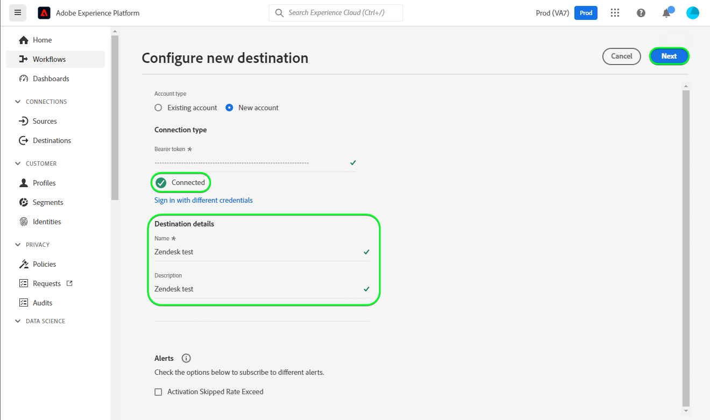

# Connessione [!DNL Zendesk]

[[!DNL Zendesk]](https://www.zendesk.com) è una soluzione di assistenza clienti e uno strumento di vendita.

Questo [!DNL Adobe Experience Platform] [destinazione](/help/destinations/home.md) sfrutta [[!DNL Zendesk] API Contatti](https://developer.zendesk.com/api-reference/sales-crm/resources/contacts/), a **creare e aggiornare le identità** all’interno di un pubblico come contatti in [!DNL Zendesk].

[!DNL Zendesk] utilizza token Bearer come meccanismo di autenticazione per comunicare con [!DNL Zendesk] API Contatti. Istruzioni per l’autenticazione [!DNL Zendesk] sono riportati di seguito, nella [Autentica nella destinazione](#authenticate) sezione.

## Casi d’uso {#use-cases}

Il reparto di assistenza clienti di una piattaforma B2C multicanale desidera garantire ai propri clienti un’esperienza personalizzata senza soluzione di continuità. Il reparto può creare tipi di pubblico dai propri dati offline per creare nuovi profili utente o aggiornare le informazioni di profilo esistenti da interazioni diverse (ad esempio acquisti, restituzioni, ecc.) e invia questi tipi di pubblico da Adobe Experience Platform a [!DNL Zendesk]. Visualizzare le informazioni aggiornate in [!DNL Zendesk] garantisce che l&#39;agente del servizio clienti disponga immediatamente delle informazioni recenti del cliente, consentendo risposte e risoluzioni più rapide.

## Prerequisiti {#prerequisites}

### Experience Platform prerequisiti {#prerequisites-in-experience-platform}

Prima di attivare i dati in [!DNL Zendesk] destinazione, è necessario disporre di un [schema](/help/xdm/schema/composition.md), a [set di dati](https://experienceleague.adobe.com/docs/platform-learn/tutorials/data-ingestion/create-datasets-and-ingest-data.html?lang=en), e [segmenti](https://experienceleague.adobe.com/docs/platform-learn/tutorials/segments/create-segments.html?lang=en) creato in [!DNL Experience Platform].

Consulta la documentazione di Experienci Platform per [Gruppo di campi schema Dettagli appartenenza pubblico](/help/xdm/field-groups/profile/segmentation.md) per informazioni sugli stati del pubblico.

### [!DNL Zendesk] prerequisiti {#prerequisites-destination}

Per esportare i dati da Platform al tuo [!DNL Zendesk] account necessario disporre di [!DNL Zendesk] account.

#### Raccogli [!DNL Zendesk] credenziali {#gather-credentials}

Annota gli elementi riportati di seguito prima di eseguire l’autenticazione in [!DNL Zendesk] destinazione:

| Credenziali | Descrizione | Esempio |
| --- | --- | --- |
| `Bearer token` | Il token di accesso generato nel [!DNL Zendesk] account.   Segui la documentazione per [generare un [!DNL Zendesk] token di accesso](https://developer.zendesk.com/documentation/sales-crm/first-call/#1-generate-an-access-token) se non ne hai uno. | `a0b1c2d3e4...v20w21x22y23z` |

## Guardrail {#guardrails}

Il [Prezzi e limiti di tasso](https://developer.zendesk.com/api-reference/sales-crm/rate-limits/#pricing) dettagli pagina [!DNL Zendesk] Limiti API associati al tuo account. Assicurati che i dati e il payload rientrino in questi vincoli.

## Identità supportate {#supported-identities}

[!DNL Zendesk] supporta l’aggiornamento delle identità descritte nella tabella seguente. Ulteriori informazioni su [identità](/help/identity-service/namespaces.md).

| Identità di destinazione | Esempio | Descrizione | Obbligatorio |
|---|---|---|---|
| `email` | `test@test.com` | Indirizzo e-mail del contatto. | Sì |

## Tipo e frequenza di esportazione {#export-type-frequency}

Per informazioni sul tipo e sulla frequenza di esportazione della destinazione, consulta la tabella seguente.

| Elemento | Tipo | Note |
---------|----------|---------|
| Tipo di esportazione | **[!UICONTROL Basato su profilo]** | <ul><li>Stai esportando tutti i membri di un segmento, insieme ai campi schema desiderati *ad esempio: indirizzo e-mail, numero di telefono, cognome*, in base alla mappatura del campo.</li><li> Ogni stato del segmento in [!DNL Zendesk] viene aggiornato con il corrispondente stato del pubblico da Platform, in base al **[!UICONTROL ID mappatura]** valore fornito durante il [pianificazione del pubblico](#schedule-segment-export-example) passaggio.</li></ul> |
| Frequenza di esportazione | **[!UICONTROL Streaming]** | <ul><li>Le destinazioni di streaming sono connessioni &quot;sempre attive&quot; basate su API. Non appena un profilo viene aggiornato in Experienci Platform in base alla valutazione del pubblico, il connettore invia l’aggiornamento a valle alla piattaforma di destinazione. Ulteriori informazioni su [destinazioni di streaming](/help/destinations/destination-types.md#streaming-destinations).</li></ul> |

{style="table-layout:auto"}

## Connetti alla destinazione {#connect}

>[!IMPORTANT]
>
>Per connettersi alla destinazione, è necessario **[!UICONTROL Gestire le destinazioni]** [autorizzazione per il controllo degli accessi](/help/access-control/home.md#permissions). Leggi le [panoramica sul controllo degli accessi](/help/access-control/ui/overview.md) oppure contatta l’amministratore del prodotto per ottenere le autorizzazioni necessarie.

Per connettersi a questa destinazione, seguire i passaggi descritti in [esercitazione sulla configurazione della destinazione](../../ui/connect-destination.md). Nel flusso di lavoro di configurazione della destinazione, compila i campi elencati nelle due sezioni seguenti.

Entro **[!UICONTROL Destinazioni]** > **[!UICONTROL Catalogo]** cerca [!DNL Zendesk]. In alternativa, è possibile posizionarlo sotto il **[!UICONTROL CRM]** categoria.

### Autentica nella destinazione {#authenticate}

Compila i campi obbligatori di seguito. Consulta la sezione [Raccogli [!DNL Zendesk] credenziali](#gather-credentials) sezione per eventuali indicazioni.
* **[!UICONTROL Token Bearer]**: il token di accesso generato nel [!DNL Zendesk] account.

Per eseguire l’autenticazione nella destinazione, seleziona **[!UICONTROL Connetti alla destinazione]**.

Se i dettagli forniti sono validi, nell’interfaccia utente viene visualizzato un **[!UICONTROL Connesso]** con un segno di spunta verde. A questo punto è possibile procedere al passaggio successivo.

### Inserisci i dettagli della destinazione {#destination-details}

Per configurare i dettagli per la destinazione, compila i campi obbligatori e facoltativi seguenti. Un asterisco accanto a un campo nell’interfaccia utente indica che il campo è obbligatorio.

* **[!UICONTROL Nome]**: nome con cui riconoscerai questa destinazione in futuro.
* **[!UICONTROL Descrizione]**: descrizione che ti aiuterà a identificare questa destinazione in futuro.

### Abilita avvisi {#enable-alerts}

Puoi abilitare gli avvisi per ricevere notifiche sullo stato del flusso di dati verso la tua destinazione. Seleziona un avviso dall’elenco per abbonarti e ricevere notifiche sullo stato del flusso di dati. Per ulteriori informazioni sugli avvisi, consulta la guida su [abbonamento agli avvisi sulle destinazioni tramite l’interfaccia utente](../../ui/alerts.md).

Una volta completate le informazioni sulla connessione di destinazione, seleziona **[!UICONTROL Successivo]**.

## Attiva il pubblico in questa destinazione {#activate}

>[!IMPORTANT]
> 
>* Per attivare i dati, è necessario **[!UICONTROL Gestire le destinazioni]**, **[!UICONTROL Attivare le destinazioni]**, **[!UICONTROL Visualizza profili]**, e **[!UICONTROL Visualizzare segmenti]** [autorizzazioni di controllo degli accessi](/help/access-control/home.md#permissions). Leggi le [panoramica sul controllo degli accessi](/help/access-control/ui/overview.md) oppure contatta l’amministratore del prodotto per ottenere le autorizzazioni necessarie.
>* Per esportare *identità*, è necessario **[!UICONTROL Visualizza grafico delle identità]** [autorizzazione per il controllo degli accessi](/help/access-control/home.md#permissions).   {width="100" zoomable="yes"}

Letto [Attiva profili e tipi di pubblico nelle destinazioni di esportazione del pubblico in streaming](/help/destinations/ui/activate-segment-streaming-destinations.md) per istruzioni sull’attivazione dei tipi di pubblico in questa destinazione.

### Considerazioni sulla mappatura ed esempio {#mapping-considerations-example}

Per inviare correttamente i dati sul pubblico da Adobe Experience Platform a [!DNL Zendesk] destinazione, devi passare attraverso il passaggio di mappatura dei campi. La mappatura consiste nella creazione di un collegamento tra i campi dello schema Experience Data Model (XDM) nell’account Platform e i corrispondenti equivalenti dalla destinazione.

Attributi specificati in **[!UICONTROL Campo di destinazione]** devono essere denominati esattamente come descritto nella tabella delle mappature degli attributi, in quanto questi attributi formeranno il corpo della richiesta.

Attributi specificati in **[!UICONTROL Campo di origine]** non seguire tali restrizioni. Puoi mapparlo in base alle tue esigenze, ma se il formato dei dati non è corretto quando viene inviato a [!DNL Zendesk] si verificherà un errore.

Per mappare correttamente i campi XDM su [!DNL Zendesk] campi di destinazione, effettua le seguenti operazioni:

1. In **[!UICONTROL Mappatura]** passaggio, seleziona **[!UICONTROL Aggiungi nuova mappatura]**. Viene visualizzata una nuova riga di mappatura.
1. In **[!UICONTROL Seleziona campo di origine]** finestra, scegli la **[!UICONTROL Seleziona attributi]** e selezionare l&#39;attributo XDM o scegliere il **[!UICONTROL Seleziona lo spazio dei nomi dell’identità]** e seleziona un’identità.
1. In **[!UICONTROL Seleziona campo di destinazione]** finestra, scegli la **[!UICONTROL Seleziona lo spazio dei nomi dell’identità]** e selezionare un’identità di destinazione, oppure scegli la **[!UICONTROL Seleziona attributi]** e seleziona uno degli attributi di schema supportati.
   * Ripeti questi passaggi per aggiungere le seguenti mappature obbligatorie, puoi anche aggiungere qualsiasi altro attributo che desideri aggiornare tra lo schema di profilo XDM e il [!DNL Zendesk] istanza: Campo di origine|Campo di destinazione| obbligatorio| |—|—|—| |`xdm: person.name.lastName`|`xdm: last_name`| Sì | |`IdentityMap: Email`|`Identity: email`| Sì | |`xdm: person.name.firstName`|`xdm: first_name`| |

   * Di seguito è riportato un esempio che utilizza queste mappature:
     

>[!IMPORTANT]
>
>Il `Attribute: last_name` e `Identity: email` le mappature di destinazione sono obbligatorie per questa destinazione. Se mancano queste mappature, tutte le altre mappature vengono ignorate e non inviate a [!DNL Zendesk].

Una volta completate le mappature per la connessione di destinazione, seleziona **[!UICONTROL Successivo]**.

### Esempio di esportazione e pianificazione di un pubblico {#schedule-segment-export-example}

In [[!UICONTROL Pianificare l’esportazione del pubblico]](/help/destinations/ui/activate-segment-streaming-destinations.md#scheduling) passaggio del flusso di lavoro di attivazione, devi mappare manualmente i tipi di pubblico di Platform all’attributo del campo personalizzato in [!DNL Zendesk].

A questo scopo, seleziona ogni segmento, quindi inserisci l’attributo del campo personalizzato corrispondente da [!DNL Zendesk] nel **[!UICONTROL ID mappatura]** campo.

Di seguito è riportato un esempio:

## Convalidare l’esportazione dei dati {#exported-data}

Per verificare di aver impostato correttamente la destinazione, segui i passaggi seguenti:

1. Seleziona **[!UICONTROL Destinazioni]** > **[!UICONTROL Sfoglia]** e passa all’elenco delle destinazioni.
1. Quindi, seleziona la destinazione e passa al **[!UICONTROL Dati di attivazione]** , quindi seleziona un nome per il pubblico.
   

1. Controlla il riepilogo del pubblico e assicurati che il conteggio dei profili corrisponda al conteggio all’interno del segmento.
   

1. Accedi a [!DNL Zendesk] , quindi passare al **[!UICONTROL Contatti]** per verificare se i profili del pubblico sono stati aggiunti. Questo elenco può essere configurato in modo da visualizzare le colonne per i campi aggiuntivi creati con il pubblico**[!UICONTROL ID mappatura]Stati di ** e pubblico.
   

1. In alternativa, puoi eseguire un drill-down in un singolo **[!UICONTROL Persona]** e controllare la **[!UICONTROL Campi aggiuntivi]** sezione che mostra il nome e lo stato del pubblico.
   

## Utilizzo dei dati e governance {#data-usage-governance}

Tutti [!DNL Adobe Experience Platform] le destinazioni sono conformi ai criteri di utilizzo dei dati durante la gestione dei dati. Per informazioni dettagliate su come [!DNL Adobe Experience Platform] applica la governance dei dati, consulta la sezione [Panoramica sulla governance dei dati](/help/data-governance/home.md).

## Risorse aggiuntive {#additional-resources}

Ulteriori informazioni utili da [!DNL Zendesk] la documentazione è riportata di seguito:
* [Effettuare la prima chiamata](https://developer.zendesk.com/documentation/sales-crm/first-call/)
* [Campi personalizzati](https://developer.zendesk.com/api-reference/sales-crm/requests/#custom-fields)

### Changelog

Questa sezione acquisisce le funzionalità e i significativi aggiornamenti alla documentazione apportati al connettore di destinazione.

+++ Visualizza changelog

| Mese di rilascio | Tipo di aggiornamento | Descrizione |
|---|---|---|
| Aprile 2023 | Aggiornamento della documentazione | <ul><li>Abbiamo aggiornato il [casi d’uso](#use-cases) sezione con un esempio più chiaro di quando i clienti trarrebbero vantaggio dall’utilizzo di questa destinazione.</li> <li>Abbiamo aggiornato il [mappatura](#mapping-considerations-example) per riflettere le mappature richieste corrette. Il `Attribute: last_name` e `Identity: email` le mappature di destinazione sono obbligatorie per questa destinazione. Se mancano queste mappature, tutte le altre mappature vengono ignorate e non inviate a [!DNL Zendesk].</li> <li>Abbiamo aggiornato il [mappatura](#mapping-considerations-example) sezione con chiari esempi di mappature obbligatorie e facoltative.</li></ul> |
| Marzo 2023 | Versione iniziale | Versione di destinazione iniziale e pubblicazione della documentazione. |

{style="table-layout:auto"}

+++