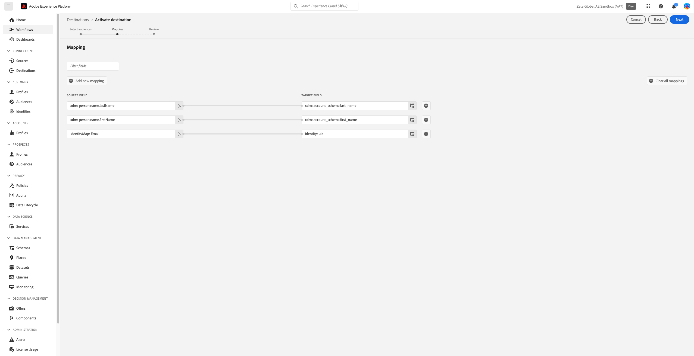

# Zeta Marketing Platform {#zeta-marketing-platform}

## Panoramica {#overview}

Zeta Marketing Platform (ZMP) è un sistema basato su cloud che consente di acquisire, crescere e mantenere i clienti in modo più efficiente, grazie all’intelligenza (dati proprietari e AI). Per ulteriori dettagli, fare riferimento a [Zeta Global](https://zetaglobal.com/).

Con il connettore Zeta Marketing Platform disponibile in Adobe Experience Platform, puoi sincronizzare facilmente i tipi di pubblico da Experience Platform a ZMP.

>[!IMPORTANT]
>
>Il connettore di destinazione e la pagina della documentazione vengono creati e gestiti dal team *Zeta Global*. Per richieste di informazioni o richieste di aggiornamento, contattare il team all&#39;indirizzo [Contattaci](https://zetaglobal.com/about/contact-us/).

## Casi d’uso {#use-cases}

### Creare segmenti di pubblico {#use-case-build-audiences}

Un addetto al marketing vuole creare profili di pubblico univoci, identificare i segmenti più importanti e utilizzarli su tutti i canali digitali supportati dalla Zeta Marketing Platform. Desiderano creare una visualizzazione a 360 reali di un profilo di consumo, generare e attivare tipi di pubblico significativi. Ulteriori dettagli sui canali supportati da Zeta Marketing Platform sono disponibili [qui](https://zetaglobal.com/platform/integrations/).

### Eseguire il targeting degli utenti con annunci pubblicitari {#use-case-target-users}

Un inserzionista mira a indirizzare gli utenti all’interno di tipi di pubblico specifici tramite il Demand Side Platform Zeta (DSP), in quanto tali utenti interagiscono con i loro marchi. Per ulteriori informazioni sull&#39;DSP Zeta, fai clic [qui](https://knowledgebase.zetaglobal.com/pug/).

## Prerequisiti {#prerequisites}

### Prerequisiti per la piattaforma Zeta Marketing

* Prima di impostare una nuova connessione alla destinazione Zeta Marketing Platform, è necessario creare un elenco di clienti vuoto nell’account Zeta Marketing Platform. Devi scegliere uno di questi elenchi di clienti come destinazione designata per ricevere il pubblico Adobe Experience Platform che intendi inviare. Puoi creare un elenco clienti vuoto nello ZMP seguendo le istruzioni [qui](https://knowledgebase.zetaglobal.com/kb/creating-audiences#CreatingAudiences-CreatingaCustomerList).
* Anche se Adobe Experience Platform consente l’attivazione di più tipi di pubblico a una particolare istanza di destinazione ZMP, è obbligatorio che ogni istanza di destinazione ZMP riceva un solo pubblico di Experience Platform. Per gestire più tipi di pubblico dall’Experience Platform, crea altre istanze di destinazione ZMP per ciascun pubblico e seleziona un elenco di clienti diverso dal menu a discesa. Questo approccio assicura che i tipi di pubblico ZMP di destinazione non vengano sovrascritti. Per ulteriori dettagli, vedi [Inserisci i dettagli della destinazione](#destination-details).
* Utilizza le seguenti credenziali per configurare la destinazione:
   * Nome utente: **api**
   * Password: la chiave API REST ZMP. Puoi trovare la tua chiave REST API accedendo al tuo account ZMP e passando alla sezione **Impostazioni** > **Integrazioni** > **Chiavi e app**. Per ulteriori dettagli, consulta la [documentazione ZMP](https://knowledgebase.zetaglobal.com/kb/integrations).

## Identità supportate {#supported-identities}

[!DNL Zeta Marketing Platform] supporta l&#39;attivazione degli ID utente personalizzati descritti nella tabella seguente. Per ulteriori dettagli, vedi [identità](/help/identity-service/features/namespaces.md).

>[!IMPORTANT]
> Per la destinazione di Zeta Marketing Platform è necessario mappare uno spazio dei nomi dell&#39;identità di origine all&#39;identità di destinazione ZMP `uid`. Questo aiuta la Zeta Marketing Platform a differenziare in modo univoco ogni profilo.

| Identità di destinazione | Descrizione | Considerazioni | Note |
---------|----------|----------|----------|
| uid | ID univoco utilizzato da ZMP per differenziare i profili dei clienti | Obbligatorio | Scegliere lo spazio dei nomi dell&#39;identità standard `Email` se si desidera identificare profili univoci utilizzando i relativi indirizzi e-mail. In alternativa, puoi scegliere di mappare lo spazio dei nomi personalizzato su `uid` se i profili cliente non hanno un messaggio e-mail. |
| email_md5_id | Invia un messaggio e-mail MD5 che rappresenta ogni profilo cliente | Facoltativo | Scegli questa identità di destinazione quando intendi identificare in modo univoco i profili dei clienti utilizzando i valori e-mail MD5. È essenziale che gli indirizzi e-mail siano già in formato MD5 nell’Experience Platform, in quanto Platform non converte il testo normale in MD5. In questo scenario, impostare `uid` (obbligatorio) sugli stessi valori di e-mail MD5 o su un altro spazio dei nomi di identità appropriato. |

{style="table-layout:auto"}

## Tipi di pubblico supportati {#supported-audiences}

Questa sezione descrive il tipo di pubblico che puoi esportare in questa destinazione.

| Origine pubblico | Supportato | Descrizione |
|---------|----------|----------|
| [!DNL Segmentation Service] | ✓ | Tipi di pubblico generati tramite il servizio di segmentazione [Experience Platform](../../../segmentation/home.md). |
| Caricamenti personalizzati | X | Tipi di pubblico [importati](../../../segmentation/ui/audience-portal.md#import-audience) in Experience Platform da file CSV. |

{style="table-layout:auto"}

>[!NOTE]
> Man mano che i singoli membri vengono aggiunti o rimossi dal pubblico di Platform, gli aggiornamenti verranno inviati allo ZMP per garantire che l’elenco dei clienti di destinazione sia sincronizzato di conseguenza.

## Tipo e frequenza di esportazione {#export-type-frequency}

Per informazioni sul tipo e sulla frequenza di esportazione della destinazione, consulta la tabella seguente.

| Elemento | Tipo | Note |
---------|----------|---------|
| Frequenza di esportazione | **[!UICONTROL Streaming]** | Le destinazioni di streaming sono connessioni &quot;sempre attive&quot; basate su API. Non appena un profilo viene aggiornato in Experience Platform in base alla valutazione dei segmenti, il connettore invia l’aggiornamento a valle alla piattaforma di destinazione. Ulteriori informazioni sulle [destinazioni di streaming](/help/destinations/destination-types.md#streaming-destinations). |

{style="table-layout:auto"}

## Connettersi alla destinazione {#connect}

>[!IMPORTANT]
> 
>Per connettersi alla destinazione, è necessario disporre dell&#39;autorizzazione **[!UICONTROL Gestione destinazioni]** [controllo di accesso](/help/access-control/home.md#permissions). Leggi la [panoramica sul controllo degli accessi](/help/access-control/ui/overview.md) o contatta l&#39;amministratore del prodotto per ottenere le autorizzazioni necessarie.

Per connettersi a questa destinazione, seguire i passaggi descritti nell&#39;esercitazione [sulla configurazione della destinazione](../../ui/connect-destination.md). Nel flusso di lavoro di configurazione della destinazione, compila i campi elencati nelle due sezioni seguenti.

### Autenticarsi nella destinazione {#authenticate}

Per eseguire l&#39;autenticazione nella destinazione, compilare i campi obbligatori e selezionare **[!UICONTROL Connetti alla destinazione]**.

* **[!UICONTROL Nome utente]**: `api`
* **[!UICONTROL Password]**: la chiave API REST ZMP. Puoi trovare la tua chiave REST API accedendo al tuo account ZMP e passando alla sezione **Impostazioni** > **Integrazioni** > **Chiavi e app**. Per ulteriori dettagli, consulta la [documentazione ZMP](https://knowledgebase.zetaglobal.com/kb/integrations).

### Inserire i dettagli della destinazione {#destination-details}

Per configurare i dettagli per la destinazione, compila i campi obbligatori e facoltativi seguenti. Un asterisco accanto a un campo nell’interfaccia utente indica che il campo è obbligatorio.

* **[!UICONTROL Nome]**: un nome con cui riconoscerai questa destinazione in futuro.
* **[!UICONTROL Descrizione]**: una descrizione che ti aiuterà a identificare questa destinazione in futuro.
* **[!UICONTROL ID sito account ZMP]**: **ID sito** ZMP a cui desideri inviare i tipi di pubblico. Per visualizzare l&#39;ID sito, vai alla sezione **Impostazioni** > **Integrazioni** > **Chiavi e app**. Ulteriori informazioni sono disponibili [qui](https://knowledgebase.zetaglobal.com/kb/integrations).
* **[!UICONTROL Segmento ZMP]**: il segmento dell&#39;elenco clienti nell&#39;account ID sito ZMP che desideri aggiornare con il pubblico di Platform.

### Abilita avvisi {#enable-alerts}

Puoi abilitare gli avvisi per ricevere notifiche sullo stato del flusso di dati verso la tua destinazione. Seleziona un avviso dall’elenco per abbonarti e ricevere notifiche sullo stato del flusso di dati. Per ulteriori informazioni sugli avvisi, consulta la guida su [abbonamento a destinazioni avvisi tramite l&#39;interfaccia utente](../../ui/alerts.md).

Dopo aver fornito i dettagli per la connessione di destinazione, seleziona **[!UICONTROL Avanti]**.

## Attiva i segmenti in questa destinazione {#activate}

>[!IMPORTANT]
> 
>* Per attivare i dati, è necessario **[!UICONTROL Gestire le destinazioni]**, **[!UICONTROL Attivare le destinazioni]**, **[!UICONTROL Visualizzare i profili]** e **[!UICONTROL Visualizzare i segmenti]** [accedere alle autorizzazioni di controllo](/help/access-control/home.md#permissions). Leggi la [panoramica sul controllo degli accessi](/help/access-control/ui/overview.md) o contatta l&#39;amministratore del prodotto per ottenere le autorizzazioni necessarie.
>* Per esportare *identità*, è necessario disporre dell&#39;autorizzazione **[!UICONTROL Visualizza grafo identità]** [Controllo di accesso](/help/access-control/home.md#permissions).   {width="100" zoomable="yes"}

Leggi [Attivare profili e segmenti nelle destinazioni di esportazione dei segmenti di streaming](/help/destinations/ui/activate-segment-streaming-destinations.md) per le istruzioni sull&#39;attivazione dei segmenti di pubblico in questa destinazione.

### Mappare attributi e identità {#map}

Di seguito è riportato un esempio di mapping di identità corretto durante l&#39;esportazione dei profili in [!DNL Zeta Marketing Platform].

Selezione dei campi di origine:
* Selezionare uno spazio dei nomi dell&#39;identità di origine (personalizzato o standard, ad esempio `Email`) che identifica in modo univoco un profilo in Adobe Experience Platform e [!DNL Zeta Marketing Platform].
* Selezionare gli attributi del profilo di origine XDM da esportare e aggiornare in [!DNL Zeta Marketing Platform].

Selezione dei campi di destinazione:
* (Obbligatorio) Seleziona `uid` come identità di destinazione per la quale mappi uno spazio dei nomi dell&#39;identità di origine.
* (Facoltativo) Selezionare `email_md5_id` come identità di destinazione per la quale è stato mappato lo spazio dei nomi dell&#39;identità di origine che rappresenta i valori di posta elettronica md5. È essenziale che gli indirizzi e-mail siano già in formato MD5 nell’Experience Platform, in quanto Platform non converte il testo normale in MD5
* Se necessario, seleziona eventuali mappature di destinazione aggiuntive.

## Dati esportati / Convalida esportazione dati {#exported-data}

In caso di esito positivo dell’attivazione del pubblico da Experience Platform a Zeta Marketing Platform, viene aggiornato l’elenco dei clienti target in ZMP. Il conteggio e i profili di esempio nell’elenco dei clienti di destinazione saranno pari al numero di identità attivate correttamente.

Ogni membro del pubblico che è stato attivato da Experience Platform sarà visibile anche in **Tipi di pubblico** > **Persone** nello ZMP. Potrai anche visualizzare il segmento **Elenco clienti** a cui appartiene un profilo nella visualizzazione Cliente singolo, come illustrato di seguito.

## Utilizzo dei dati e governance {#data-usage-governance}

Tutte le destinazioni [!DNL Adobe Experience Platform] sono conformi ai criteri di utilizzo dei dati durante la gestione dei dati. Per informazioni dettagliate su come [!DNL Adobe Experience Platform] applica la governance dei dati, leggere la [Panoramica sulla governance dei dati](/help/data-governance/home.md).

## Risorse aggiuntive {#additional-resources}

* [Knowledge Base Zeta](https://knowledgebase.zetaglobal.com/kb/)
