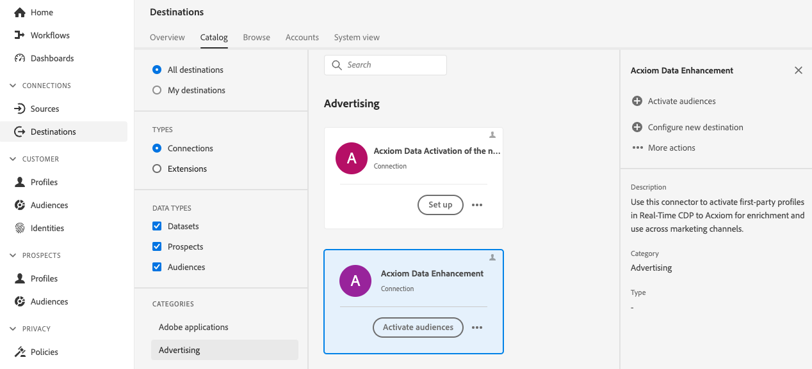

# [!DNL Acxiom Data Enhancement] connessione di destinazione

>[!NOTE]
>
>Il [!DNL Acxiom Data Enhancement] la destinazione è in versione beta.  Il connettore di destinazione e la pagina della documentazione vengono creati e gestiti dal team Acxiom. Per eventuali richieste di informazioni o richieste di aggiornamento, contattatele direttamente all&#39;indirizzo acxiom-adobe-help@acxiom.com.

## Panoramica {#overview}

Utilizza il connettore Acxiom Data Enhancement per fornire dati descrittivi aggiuntivi ai profili di Adobe, da utilizzare in applicazioni di analisi, segmentazione e targeting. Con centinaia di elementi disponibili, questo consente agli utenti di segmentare e modellare meglio i dati, con conseguente targeting più preciso e modellazione predittiva.

Questo tutorial descrive come creare un [!DNL Acxiom Data Enhancement] connessione di destinazione e flusso di dati tramite l’interfaccia utente di Adobe Experience Platform.  Questo connettore viene utilizzato per fornire dati al servizio di miglioramento Acxiom utilizzando Amazon S3 come punto di rilascio.

## Casi d’uso {#use-cases}

Per aiutarti a comprendere meglio come e quando utilizzare la destinazione di Acxiom Data Enhancement, ecco alcuni casi d’uso di esempio che i clienti di Adobe Experience Platform possono risolvere utilizzando questa destinazione.

### Migliorare i dati dei clienti {#enhance-customer-data}

Questo connettore deve essere utilizzato da professionisti del marketing con l’obiettivo di migliorare l’efficacia delle loro strategie di sensibilizzazione aggiungendo elementi descrittivi selezionati ai loro profili Adobi e utilizzarli per eseguire meglio le campagne.

Ad esempio, in qualità di addetto al marketing, potresti voler approfondire la tua comprensione dei tipi di pubblico esistenti arricchendo i loro profili con dati aggiuntivi. Così facendo, migliorerai la segmentazione e le strategie di targeting, con conseguente aumento della personalizzazione e della conversione delle campagne.

Il caso d’uso viene eseguito tramite una combinazione di connettori di destinazione e sorgente.

Per iniziare, esporta i record dei clienti esistenti per l’arricchimento utilizzando questo connettore di destinazione. Il servizio di Acxiom cerca il file, lo recupera, lo arricchisce con i dati di Acxiom e genera un file.

Il cliente deve quindi utilizzare la scheda sorgente Acxiom Data Ingestion corrispondente per acquisire in Adobe Real-Time CDP i profili cliente idrati.

## Prerequisiti {#prerequisites}

>[!IMPORTANT]
>
>* Per connettersi alla destinazione, è necessario **[!UICONTROL Visualizza destinazioni]** e **[!UICONTROL Gestire le destinazioni]**, **[!UICONTROL Attivare le destinazioni]**, **[!UICONTROL Visualizza profili]**, e **[!UICONTROL Visualizzare segmenti]** [autorizzazioni di controllo degli accessi](/help/access-control/home.md#permissions). Leggi le [panoramica sul controllo degli accessi](/help/access-control/ui/overview.md) oppure contatta l’amministratore del prodotto per ottenere le autorizzazioni necessarie.
>* Per esportare *identità*, è necessario **[!UICONTROL Visualizza grafico delle identità]** [autorizzazione per il controllo degli accessi](/help/access-control/home.md#permissions).   {width="100" zoomable="yes"}

## Tipi di pubblico supportati {#supported-audiences}

Questa sezione descrive il tipo di pubblico che puoi esportare in questa destinazione.

| Origine pubblico | Supportati | Descrizione |
|-----------------------------|-----------|---------------------------------------------------------------------------------------------------------------------|
| [!DNL Segmentation Service] | ✓ | Tipi di pubblico generati dall’Experience Platform [Servizio di segmentazione](../../../segmentation/home.md). |
| Caricamenti personalizzati | x | Tipi di pubblico [importato](../../../segmentation/ui/overview.md#import-audience) in Experienci Platform da file CSV. |

{style="table-layout:auto"}

## Tipo e frequenza di esportazione {#export-type-frequency}

Per informazioni sul tipo e sulla frequenza di esportazione della destinazione, consulta la tabella seguente.

| Elemento | Tipo | Note |
|------------------|--------------------------------|------------------------------------------------------------------------------------------------------------------------------------------------------------------------------------------------------------------------------------------------------------------------------------------------------------------------|
| Tipo di esportazione | **[!UICONTROL Basato su profilo]** | Stai esportando tutti i membri di un segmento, insieme ai campi dello schema desiderati (ad esempio: indirizzo e-mail, numero di telefono, cognome), come scelto nella schermata seleziona attributi profilo del [flusso di lavoro di attivazione della destinazione](/help/destinations/ui/activate-batch-profile-destinations.md#select-attributes). |
| Frequenza di esportazione | **[!UICONTROL Batch]** | Le destinazioni batch esportano i file sulle piattaforme a valle con incrementi di tre, sei, otto, dodici o ventiquattro ore. Ulteriori informazioni su [destinazioni basate su file batch](/help/destinations/destination-types.md#file-based). |

{style="table-layout:auto"}

## Connettersi alla destinazione {#connect}

>[!IMPORTANT]
>
>Per connettersi alla destinazione, è necessario **[!UICONTROL Visualizza destinazioni]** e **[!UICONTROL Gestire e attivare le destinazioni dei set di dati]** [autorizzazioni di controllo degli accessi](/help/access-control/home.md#permissions). Leggi le [panoramica sul controllo degli accessi](/help/access-control/ui/overview.md) oppure contatta l’amministratore del prodotto per ottenere le autorizzazioni necessarie.

### Autenticarsi nella destinazione {#authenticate}

Per autenticare nella destinazione, compila i campi obbligatori e seleziona **[!UICONTROL Connetti alla destinazione]**.

Per accedere al bucket in Experienci Platform, devi fornire valori validi per le seguenti credenziali:

| Credenziali | Descrizione |
|---------------|----------------------------------------------------------------------------------------------------------|
| Chiave di accesso S3 | ID della chiave di accesso per il bucket. Puoi recuperare questo valore da [!DNL Acxiom] team. |
| Chiave segreta S3 | ID della chiave segreta del bucket. Puoi recuperare questo valore da [!DNL Acxiom] team. |
| Nome del bucket | Questo è il bucket in cui verranno condivisi i file. Puoi recuperare questo valore da [!DNL Acxiom] team. |

### Nuovo account

Per definire una nuova posizione S3 gestita da Acxiom:

### Account esistente

Gli account già definiti utilizzando la scheda Acxiom Data Enhancement (Miglioramento dati di Acxiom) verranno visualizzati in un pop-up di elenco e, se questa opzione è selezionata, forniscono dettagli sull’account.  Questo è mostrato di seguito nell’esempio dall’interfaccia utente, quando passi a **Destinazioni** > **Account**;

### Inserire i dettagli della destinazione {#destination-details}

Per configurare i dettagli per la destinazione, compila i campi obbligatori e facoltativi seguenti. Un asterisco accanto a un campo nell’interfaccia utente indica che il campo è obbligatorio.

* **Nome (obbligatorio)** - Il nome con cui verrà salvata la destinazione
* **Descrizione** - Breve spiegazione dello scopo della destinazione
* **Nome bucket (obbligatorio)** - Nome del bucket Amazon S3 impostato su S3
* **Percorso cartella (obbligatorio)** - Se si utilizzano sottodirectory in un bucket, è necessario definire un percorso oppure &#39;/&#39; per fare riferimento al percorso principale.
* **Tipo di file** - Selezionare il formato che l&#39;Experience Platform deve utilizzare per i file esportati. Attualmente, l’unico tipo di file previsto per l’elaborazione con Acxiom è CSV

>[!IMPORTANT]
>
>Quando selezioni l’opzione CSV, *Delimitatore*, *Carattere offerta*, *Carattere di escape*, *Valore vuoto*, *Valore nullo*, *Formato di compressione*, e *Includi file manifesto* vengono visualizzate le opzioni, nel documento seguente vengono illustrate in modo più dettagliato queste impostazioni [configurare le opzioni di formattazione](../../ui/batch-destinations-file-formatting-options.md).

### Abilita avvisi {#enable-alerts}

Puoi abilitare gli avvisi per ricevere notifiche sullo stato del flusso di dati verso la tua destinazione. Seleziona un avviso dall’elenco per abbonarti e ricevere notifiche sullo stato del flusso di dati. Per ulteriori informazioni sugli avvisi, consulta la guida su [abbonamento agli avvisi sulle destinazioni tramite l’interfaccia utente](../../ui/alerts.md).

Una volta completate le informazioni sulla connessione di destinazione, seleziona **[!UICONTROL Successivo]**.

## Attivare tipi di pubblico in questa destinazione {#activate}

>[!IMPORTANT]
>
>* Per attivare i dati, è necessario **[!UICONTROL Visualizza destinazioni]**, **[!UICONTROL Attivare le destinazioni]**, **[!UICONTROL Visualizza profili]**, e **[!UICONTROL Visualizzare segmenti]** [autorizzazioni di controllo degli accessi](/help/access-control/home.md#permissions). Leggi le [panoramica sul controllo degli accessi](/help/access-control/ui/overview.md) oppure contatta l’amministratore del prodotto per ottenere le autorizzazioni necessarie.
>* Per esportare *identità*, è necessario **[!UICONTROL Visualizza grafico delle identità]** [autorizzazione per il controllo degli accessi](/help/access-control/home.md#permissions).   {width="100" zoomable="yes"}

Letto [Attivare i dati del pubblico nelle destinazioni di esportazione del profilo batch](/help/destinations/ui/activate-batch-profile-destinations.md) per istruzioni sull’attivazione dei tipi di pubblico in questa destinazione.

### Suggerimenti di mappatura

La corretta elaborazione dei file sul lato Acxiom richiede elementi di nome e indirizzo. Anche se non tutti gli elementi sono necessari, fornire il più possibile contribuirà ad una corrispondenza di successo.

I suggerimenti di mappatura sono forniti nella tabella seguente, in cui sono elencati gli attributi sul lato di destinazione utilizzati dall’elaborazione Acxiom a cui i clienti possono mappare gli attributi del profilo. Considera questi elementi come suggerimenti, in quanto non tutti gli elementi sono necessari e i valori sorgente dipenderanno dalle esigenze dell’account.

| Campo di destinazione | Descrizione origine |
|--------------|-------------------------------------------------------------|
| name | Il valore person.name.fullName in Experienci Platform. |
| firstName | Il valore person.name.firstName in Experienci Platform. |
| lastName | Il valore person.name.lastName in Experienci Platform. |
| address1 | Il valore mailingAddress.street1 in Experienci Platform. |
| address2 | Il valore mailingAddress.street2 in Experienci Platform. |
| città | Il valore mailingAddress.city in Experienci Platform. |
| Stato | Il valore mailingAddress.state in Experienci Platform. |
| zip | Il valore mailingAddress.postalCode in Experienci Platform. |

>[!NOTE]
>
>Se mappi campi aggiuntivi non elencati sopra nel flusso di dati, questi verranno inclusi nell’esportazione dei dati, ma verranno ignorati dall’elaborazione Acxiom.

## Convalidare l’esportazione dei dati {#exported-data}

Per verificare se i dati sono stati esportati correttamente, controlla [!DNL Amazon S3 Storage] e assicurati che i file esportati contengano le popolazioni di profilo previste.

## Passaggi successivi

Seguendo questa esercitazione, hai creato correttamente un flusso di dati per esportare i dati del profilo da Experienci Platform al tuo [!DNL Acxiom] posizione S3 gestita. Successivamente, devi contattare il rappresentante di Adobe con il nome dell’account, i nomi dei file e il percorso del bucket, in modo da poter configurare l’elaborazione.

## Utilizzo dei dati e governance {#data-usage-governance}

Tutti [!DNL Adobe Experience Platform] le destinazioni sono conformi ai criteri di utilizzo dei dati durante la gestione dei dati. Per informazioni dettagliate su come [!DNL Adobe Experience Platform] applica la governance dei dati, leggi [Panoramica sulla governance dei dati](/help/data-governance/home.md).

## Risorse aggiuntive {#additional-resources}

*Acxiom Infobase:* https://www.acxiom.com/wp-content/uploads/2022/02/fs-acxiom-infobase_AC-0268-22.pdf
