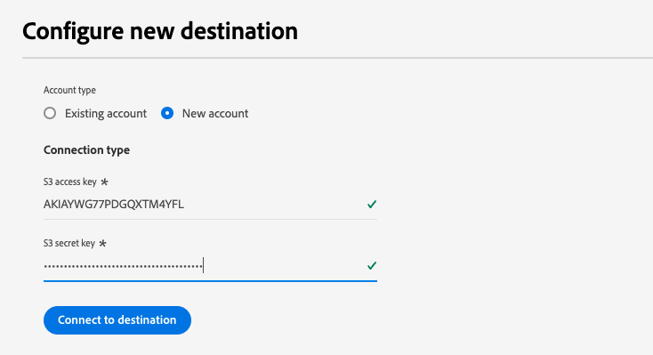
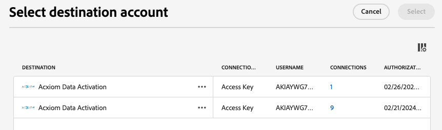
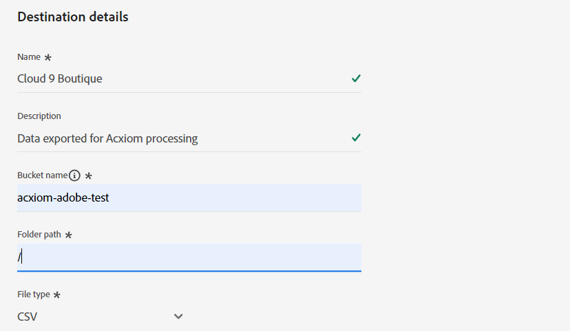

# [!DNL Acxiom Data Enhancement] connessione di destinazione

>[!NOTE]
>
>La destinazione [!DNL Acxiom Data Enhancement] è in versione beta.  Il connettore di destinazione e la pagina della documentazione vengono creati e gestiti dal team Acxiom. Per eventuali richieste di informazioni o richieste di aggiornamento, contattatele direttamente all&#39;indirizzo acxiom-adobe-help@acxiom.com.

## Panoramica {#overview}

Utilizza il connettore [!DNL Acxiom Data Enhancement] per fornire dati descrittivi aggiuntivi ai profili cliente, da utilizzare in applicazioni di analisi, segmentazione e targeting. Con centinaia di elementi disponibili, questo consente di segmentare e modellare meglio i dati, con conseguente targeting più preciso e modellazione predittiva.

Questa esercitazione fornisce i passaggi per creare una connessione di destinazione [!DNL Acxiom Data Enhancement] e un flusso di dati utilizzando l&#39;interfaccia utente di Adobe Experience Platform. Questo connettore viene utilizzato per fornire dati al servizio di miglioramento Acxiom utilizzando Amazon S3 come punto di rilascio.

## Casi d’uso {#use-cases}

Per capire meglio come e quando utilizzare la destinazione [!DNL Acxiom Data Enhancement], ecco alcuni esempi di casi d&#39;uso che i clienti Adobe Experience Platform possono risolvere utilizzando questa destinazione.

### Migliorare i dati dei clienti {#enhance-customer-data}

Questo connettore deve essere utilizzato da professionisti del marketing con l’obiettivo di migliorare l’efficacia delle loro strategie di sensibilizzazione aggiungendo elementi descrittivi selezionati ai loro profili cliente e utilizzarli per targetizzare meglio le campagne.

Ad esempio, in qualità di addetto al marketing, potresti voler approfondire la tua comprensione dei tipi di pubblico esistenti arricchendo i loro profili con dati aggiuntivi. Così facendo, migliorerai la segmentazione e le strategie di targeting, con conseguente aumento della personalizzazione e della conversione delle campagne.

Il caso d’uso viene eseguito tramite una combinazione di connettori di destinazione e sorgente.

Per iniziare, esporta i record dei clienti esistenti per l’arricchimento utilizzando questo connettore di destinazione. Il servizio di Acxiom cerca il file, lo recupera, lo arricchisce con i dati di Acxiom e genera un file.

Il cliente utilizza quindi la scheda di origine [Acxiom Data Ingestion](/help/sources/connectors/data-partners/acxiom-data-ingestion.md) corrispondente per acquisire i profili cliente idrati in Adobe Real-Time CDP.

## Prerequisiti {#prerequisites}

>[!IMPORTANT]
>
>* Per connettersi alla destinazione, sono necessarie le **[!UICONTROL View Destinations]** e **[!UICONTROL Manage Destinations]**, **[!UICONTROL Activate Destinations]**, **[!UICONTROL View Profiles]** e **[!UICONTROL View Segments]** [autorizzazioni di controllo di accesso](/help/access-control/home.md#permissions). Leggi la [panoramica sul controllo degli accessi](/help/access-control/ui/overview.md) o contatta l&#39;amministratore del prodotto per ottenere le autorizzazioni necessarie.
>* Per esportare *identità*, è necessario disporre dell&#39;autorizzazione **[!UICONTROL View Identity Graph]** [per il controllo degli accessi](/help/access-control/home.md#permissions).   {width="100" zoomable="yes"}

## Tipi di pubblico supportati {#supported-audiences}

Questa sezione descrive il tipo di pubblico che puoi esportare in questa destinazione.

| Origine pubblico | Supportato | Descrizione |
|---------|----------|----------|
| [!DNL Segmentation Service] | Sì | Tipi di pubblico generati tramite Experience Platform [Segmentation Service](../../../segmentation/home.md). |
| Tutte le altre origini del pubblico | No | Questa categoria include tutte le origini del pubblico al di fuori dei tipi di pubblico generati tramite [!DNL Segmentation Service]. Leggi informazioni sulle [diverse origini del pubblico](/help/segmentation/ui/audience-portal.md#customize). Alcuni esempi includono: <ul><li> i tipi di pubblico per caricamento personalizzati [importati](../../../segmentation/ui/audience-portal.md#import-audience) in Experience Platform da file CSV,</li><li> pubblico simile, </li><li> pubblico federato, </li><li> tipi di pubblico generati in altre app di Experience Platform come Adobe Journey Optimizer, </li><li> e altro ancora. </li></ul> |

{style="table-layout:auto"}

Tipi di pubblico supportati per tipo di dati sul pubblico:

| Tipo di dati del pubblico | Supportato | Descrizione | Casi d’uso |
|--------------------|-----------|-------------|-----------|
| [Tipi di pubblico per persone](/help/segmentation/types/people-audiences.md) | Sì | In base ai profili dei clienti, consente di eseguire il targeting di gruppi specifici di persone per campagne di marketing. | Acquirenti frequenti, abbandoni del carrello |
| [Pubblico dell&#39;account](/help/segmentation/types/account-audiences.md) | No | Puoi indirizzare l’attività a singoli utenti all’interno di organizzazioni specifiche per strategie di marketing basate sull’account. | Marketing B2B |
| [Pubblico potenziale](/help/segmentation/types/prospect-audiences.md) | No | Puoi indirizzare l’attività a singoli utenti che non sono ancora clienti, ma che condividono alcune caratteristiche con il tuo pubblico di destinazione. | Ricerca di dati di terze parti |
| [Esportazioni set di dati](/help/catalog/datasets/overview.md) | No | Raccolte di dati strutturati archiviati nel Data Lake di Adobe Experience Platform. | Reporting, flussi di lavoro di data science |

{style="table-layout:auto"}

## Tipo e frequenza di esportazione {#export-type-frequency}

Per informazioni sul tipo e sulla frequenza di esportazione della destinazione, consulta la tabella seguente.

| Elemento | Tipo | Note |
|------------------|--------------------------------|------------------------------------------------------------------------------------------------------------------------------------------------------------------------------------------------------------------------------------------------------------------------------------------------------------------------|
| Tipo di esportazione | **[!UICONTROL Profile-based]** | Stai esportando tutti i membri di un segmento, insieme ai campi dello schema desiderati (ad esempio: indirizzo e-mail, numero di telefono, cognome), come scelto nella schermata seleziona attributi profilo del [flusso di lavoro di attivazione della destinazione](/help/destinations/ui/activate-batch-profile-destinations.md#select-attributes). |
| Frequenza di esportazione | **[!UICONTROL Batch]** | Le destinazioni batch esportano i file sulle piattaforme a valle con incrementi di tre, sei, otto, dodici o ventiquattro ore. Ulteriori informazioni sulle [destinazioni basate su file batch](/help/destinations/destination-types.md#file-based). |

{style="table-layout:auto"}

## Connettersi alla destinazione {#connect}

>[!IMPORTANT]
>
>Per connettersi alla destinazione, sono necessarie le **[!UICONTROL View Destinations]** e le **[!UICONTROL Manage and Activate Dataset Destinations]** [autorizzazioni di controllo di accesso](/help/access-control/home.md#permissions). Leggi la [panoramica sul controllo degli accessi](/help/access-control/ui/overview.md) o contatta l&#39;amministratore del prodotto per ottenere le autorizzazioni necessarie.

Per connettersi a questa destinazione, seguire i passaggi descritti nell&#39;esercitazione [sulla configurazione della destinazione](../../ui/connect-destination.md). Nel flusso di lavoro di configurazione della destinazione, compila i campi elencati nelle due sezioni seguenti.

### Autenticarsi nella destinazione {#authenticate}

Per autenticare nella destinazione, compilare i campi obbligatori e selezionare **[!UICONTROL Connect to destination]**.

Per accedere al bucket su Experience Platform, devi fornire valori validi per le seguenti credenziali:

| Credenziali | Descrizione |
|---------------|----------------------------------------------------------------------------------------------------------|
| Chiave di accesso S3 | ID della chiave di accesso per il bucket. È possibile recuperare questo valore dal team [!DNL Acxiom]. |
| Chiave segreta S3 | ID della chiave segreta del bucket. È possibile recuperare questo valore dal team [!DNL Acxiom]. |
| Nome del bucket | Questo è il bucket in cui verranno condivisi i file. È possibile recuperare questo valore dal team [!DNL Acxiom]. |

### Nuovo account

Per definire una nuova posizione S3 gestita da Acxiom:

### Account esistente

Gli account già definiti utilizzando la destinazione [!DNL Acxiom Data Enhancement] vengono visualizzati in un pop-up di elenco. Se questa opzione è selezionata, i dettagli dell’account sono visualizzati nella barra a destra. Visualizzare l&#39;esempio dall&#39;interfaccia utente quando si passa a **[!UICONTROL Destinations]** > **[!UICONTROL Accounts]**;

### Inserire i dettagli della destinazione {#destination-details}

Per configurare i dettagli per la destinazione, compila i campi obbligatori e facoltativi seguenti. Un asterisco accanto a un campo nell’interfaccia utente indica che il campo è obbligatorio.

* **Nome (obbligatorio)** - Nome in cui verrà salvata la destinazione
* **Descrizione** - Breve spiegazione dello scopo della destinazione
* **Nome bucket (obbligatorio)** - Nome del bucket Amazon S3 configurato in S3
* **Percorso cartella (obbligatorio)** - Se vengono utilizzate sottodirectory in un bucket, è necessario definire un percorso oppure &#39;/&#39; per fare riferimento al percorso principale.
* **Tipo file** - Selezionare il formato che Experience Platform deve utilizzare per i file esportati. Attualmente, l’unico tipo di file previsto per l’elaborazione con Acxiom è CSV

>[!IMPORTANT]
>
>Quando si seleziona l&#39;opzione CSV *Delimitatore*, *Carattere preventivo*, *Carattere escape*, *Valore vuoto*, *Valore nullo*, *Formato compressione* e *Includi file manifesto*, le opzioni vengono illustrate nel documento seguente in modo più dettagliato [Configurazione delle opzioni di formattazione](../../ui/batch-destinations-file-formatting-options.md).

### Abilita avvisi {#enable-alerts}

Puoi abilitare gli avvisi per ricevere notifiche sullo stato del flusso di dati verso la tua destinazione. Seleziona un avviso dall’elenco per abbonarti e ricevere notifiche sullo stato del flusso di dati. Per ulteriori informazioni sugli avvisi, consulta la guida su [abbonamento a destinazioni avvisi tramite l&#39;interfaccia utente](../../ui/alerts.md).

Dopo aver fornito i dettagli della connessione di destinazione, selezionare **[!UICONTROL Next]**.

## Attivare tipi di pubblico in questa destinazione {#activate}

>[!IMPORTANT]
>
>* Per attivare i dati, sono necessarie le **[!UICONTROL View Destinations]**, **[!UICONTROL Activate Destinations]**, **[!UICONTROL View Profiles]** e **[!UICONTROL View Segments]** [autorizzazioni di controllo di accesso](/help/access-control/home.md#permissions). Leggi la [panoramica sul controllo degli accessi](/help/access-control/ui/overview.md) o contatta l&#39;amministratore del prodotto per ottenere le autorizzazioni necessarie.
>* Per esportare *identità*, è necessario disporre dell&#39;autorizzazione **[!UICONTROL View Identity Graph]** [per il controllo degli accessi](/help/access-control/home.md#permissions).   {width="100" zoomable="yes"}

Per istruzioni sull&#39;attivazione dei tipi di pubblico in questa destinazione, leggi [Attiva dati pubblico per esportare i profili in batch](/help/destinations/ui/activate-batch-profile-destinations.md).

### Suggerimenti di mappatura

La corretta elaborazione dei file sul lato Acxiom richiede elementi di nome e indirizzo. Anche se non tutti gli elementi sono necessari, fornire il più possibile contribuirà ad una corrispondenza di successo.

I suggerimenti di mappatura sono forniti nella tabella seguente, in cui sono elencati gli attributi sul lato di destinazione utilizzati dall’elaborazione Acxiom a cui i clienti possono mappare gli attributi del profilo. Considera questi elementi come suggerimenti, in quanto non tutti gli elementi sono necessari e i valori sorgente dipenderanno dalle esigenze dell’account.

| Campo di destinazione | Descrizione Source |
|--------------|-------------------------------------------------------------|
| name | Il valore `person.name.fullName` in Experience Platform. |
| firstName | Il valore `person.name.firstName` in Experience Platform. |
| lastName | Il valore `person.name.lastName` in Experience Platform. |
| address1 | Il valore `mailingAddress.street1` in Experience Platform. |
| address2 | Il valore `mailingAddress.street2` in Experience Platform. |
| città | Il valore `mailingAddress.city` in Experience Platform. |
| Stato | Il valore `mailingAddress.state` in Experience Platform. |
| zip | Il valore `mailingAddress.postalCode` in Experience Platform. |

>[!NOTE]
>
>Se mappi campi aggiuntivi non elencati sopra nel flusso di dati, questi verranno inclusi nell’esportazione dei dati, ma verranno ignorati dall’elaborazione Acxiom.

## Convalidare l’esportazione dei dati {#exported-data}

Per verificare se i dati sono stati esportati correttamente, controlla il bucket [!DNL Amazon S3 Storage] e assicurati che i file esportati contengano le popolazioni di profilo previste.

## Passaggi successivi

Seguendo questa esercitazione, è stato creato un flusso di dati per esportare i dati del profilo da Experience Platform nel percorso S3 gestito di [!DNL Acxiom]. Successivamente, devi contattare il rappresentante di Adobe con il nome dell’account, i nomi dei file e il percorso del bucket, in modo da poter configurare l’elaborazione.

## Utilizzo dei dati e governance {#data-usage-governance}

Tutte le destinazioni [!DNL Adobe Experience Platform] sono conformi ai criteri di utilizzo dei dati durante la gestione dei dati. Per informazioni dettagliate su come [!DNL Adobe Experience Platform] applica la governance dei dati, leggere la [Panoramica sulla governance dei dati](/help/data-governance/home.md).

## Risorse aggiuntive {#additional-resources}

*Acxiom Infobase:* https://www.acxiom.com/wp-content/uploads/2022/02/fs-acxiom-infobase_AC-0268-22.pdf
