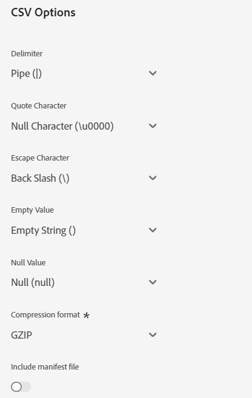

# [!DNL Acxiom Prospect-Suppression] connessione di destinazione

>[!NOTE]
>
>Il [!DNL Acxiom Prospect-Suppression] la destinazione è in versione beta. Il connettore di destinazione e la pagina della documentazione vengono creati e gestiti dal team Acxiom. Per eventuali richieste di informazioni o richieste di aggiornamento, contattatele direttamente all&#39;indirizzo acxiom-adobe-help@acxiom.com.

## Panoramica {#overview}

Utilizzare [!DNL Acxiom Prospect-Suppression] per offrire il pubblico potenziale più produttivo possibile. Questo connettore esporta in modo sicuro i dati di prime parti da Real-time Customer Data Platform e li esegue tramite una risoluzione di igiene e identità pluripremiata che produce un file di dati da utilizzare come elenco di soppressione. Questo verrà confrontato con [!DNL Acxiom Global] che consente di personalizzare gli elenchi dei prospect per l&#39;importazione. Quindi, utilizza [[!DNL Acxiom Prospecting Data Import]](/help/sources/connectors/data-partners/acxiom-prospecting-data-import.md) il connettore di origine per gli elenchi di potenziali clienti da Acxiom di nuovo in Real-Time CDP, con i clienti noti o convertiti rimossi.

Acxiom offre i tipi di pubblico con le prestazioni migliori del settore, con il catalogo più ampio che comprende oltre 12.000 attributi di dati globali, con l’obiettivo specifico di fornire esperienze personalizzate. Utilizza combinazioni illimitate di dati di alta qualità per creare e distribuire tipi di pubblico per soddisfare le esigenze specifiche delle campagne.

Questo tutorial descrive come creare un [!DNL Acxiom Prospect-Suppression] connessione di destinazione e flusso di dati tramite l’interfaccia utente di Adobe Experience Platform. Questo connettore viene utilizzato per fornire dati al servizio Acxiom prospect utilizzando Amazon S3 come punto di rilascio. Una volta avviata l’esportazione dei file nel punto di rilascio di Amazon S3, contatta il rappresentante del tuo account Acxiom.

## Casi d’uso {#use-cases}

Per aiutarti a capire meglio come e quando utilizzare il [!DNL Acxiom Prospect-Suppression] destinazione: di seguito sono riportati alcuni casi di utilizzo esemplificativi che i clienti di Adobe Experience Platform possono risolvere utilizzando questa destinazione.

### Creare un elenco di soppressione per i set di dati di ricerca di potenziali {#create-suppression-list}

I professionisti del marketing che mirano a migliorare l’efficacia delle loro strategie di sensibilizzazione spesso utilizzano la creazione di un elenco di soppressione. Questo elenco include i clienti esistenti e segmenti specifici, garantendo la loro esclusione dalle attività di ricerca di potenziali clienti durante campagne mirate. Questo approccio strategico consente di perfezionare il pubblico, evita la comunicazione ridondante e contribuisce a un’attività di marketing più mirata ed efficiente.

Ad esempio, in qualità di addetto marketing, potresti voler ampliare la portata della campagna aggiungendo profili prospect mirati alle campagne in base ai criteri di segmentazione e soppressione forniti.

Il caso d’uso viene eseguito tramite una combinazione di connettori di destinazione e sorgente.

Per iniziare, devi esportare i profili cliente esistenti utilizzando questo connettore di destinazione per utilizzarli come file di soppressione. In questo modo, nessun record cliente esistente viene incluso.

Il servizio di Acxiom cerca il file, lo recupera e lo utilizza insieme a criteri di selezione aggiuntivi e genera un file prospect. A questo punto puoi utilizzare il [[!DNL Acxiom Prospecting Data Import]](/help/sources/connectors/data-partners/acxiom-prospecting-data-import.md) connettore di origine per acquisire i profili prospect in Adobe Real-Time CDP.

## Prerequisiti {#prerequisites}

>[!IMPORTANT]
>
>* Per connettersi alla destinazione, è necessario **[!UICONTROL Visualizza destinazioni]** e **[!UICONTROL Gestire le destinazioni]**, **[!UICONTROL Attivare le destinazioni]**, **[!UICONTROL Visualizza profili]**, e **[!UICONTROL Visualizzare segmenti]** [autorizzazioni di controllo degli accessi](/help/access-control/home.md#permissions). Leggi le [panoramica sul controllo degli accessi](/help/access-control/ui/overview.md) oppure contatta l’amministratore del prodotto per ottenere le autorizzazioni necessarie.
>* Per esportare *identità*, è necessario **[!UICONTROL Visualizza grafico delle identità]** [autorizzazione per il controllo degli accessi](/help/access-control/home.md#permissions).   {width="100" zoomable="yes"}

## Tipi di pubblico supportati {#supported-audiences}

Questa sezione descrive il tipo di pubblico che puoi esportare in questa destinazione.

| Origine pubblico | Supportati | Descrizione |
|-----------------------------|-----------|---------------------------------------------------------------------------------------------------------------------|
| [!DNL Segmentation Service] | ✓ | Tipi di pubblico generati dall’Experience Platform [Servizio di segmentazione](../../../segmentation/home.md). |
| Caricamenti personalizzati | x | Tipi di pubblico [importato](../../../segmentation/ui/overview.md#import-audience) in Experienci Platform da file CSV. |

{style="table-layout:auto"}

## Tipo e frequenza di esportazione {#export-type-frequency}

Per informazioni sul tipo e sulla frequenza di esportazione della destinazione, consulta la tabella seguente.

| Elemento | Tipo | Note |
|------------------|--------------------------------|------------------------------------------------------------------------------------------------------------------------------------------------------------------------------------------------------------------------------------------------------------------------------------------------------------------------|
| Tipo di esportazione | **[!UICONTROL Basato su profilo]** | Stai esportando tutti i membri di un segmento, insieme ai campi dello schema desiderati (ad esempio: indirizzo e-mail, numero di telefono, cognome), come scelto nella schermata seleziona attributi profilo del [flusso di lavoro di attivazione della destinazione](/help/destinations/ui/activate-batch-profile-destinations.md#select-attributes). |
| Frequenza di esportazione | **[!UICONTROL Batch]** | Le destinazioni batch esportano i file sulle piattaforme a valle con incrementi di tre, sei, otto, dodici o ventiquattro ore. Ulteriori informazioni su [destinazioni basate su file batch](/help/destinations/destination-types.md#file-based). |

{style="table-layout:auto"}

## Connettersi alla destinazione {#connect}

>[!IMPORTANT]
> 
>Per connettersi alla destinazione, è necessario **[!UICONTROL Visualizza destinazioni]** e **[!UICONTROL Gestire le destinazioni]** [autorizzazioni di controllo degli accessi](/help/access-control/home.md#permissions). Leggi le [panoramica sul controllo degli accessi](/help/access-control/ui/overview.md) oppure contatta l’amministratore del prodotto per ottenere le autorizzazioni necessarie.

Per connettersi a questa destinazione, seguire i passaggi descritti in [esercitazione sulla configurazione della destinazione](../../ui/connect-destination.md). Nel flusso di lavoro di configurazione della destinazione, compila i campi elencati nelle due sezioni seguenti.

### Autenticarsi nella destinazione {#authenticate}

Per autenticare nella destinazione, compila i campi obbligatori e seleziona **[!UICONTROL Connetti alla destinazione]**.

Per accedere al bucket in Experienci Platform, devi fornire valori validi per le seguenti credenziali:

| Credenziali | Descrizione |
|---------------|----------------------------------------------------------------------------------------------------------|
| Chiave di accesso S3 | ID della chiave di accesso per il bucket. Puoi recuperare questo valore da [!DNL Acxiom] team. |
| Chiave segreta S3 | ID della chiave segreta del bucket. Puoi recuperare questo valore da [!DNL Acxiom] team. |
| Nome del bucket | Questo è il bucket in cui verranno condivisi i file. Puoi recuperare questo valore da [!DNL Acxiom] team. |

### Nuovo account

Per definire una nuova posizione S3 gestita da Acxiom:

### Account esistente

Account già definiti utilizzando [!DNL Acxiom Prospect Suppression] destinazione viene visualizzata in un pop-up elenco. Se questa opzione è selezionata, i dettagli dell’account sono visualizzati nella barra a destra. Visualizza l’esempio dall’interfaccia utente, quando passi a **[!UICONTROL Destinazioni]** > **[!UICONTROL Account]**:

### Inserire i dettagli della destinazione {#destination-details}

Per configurare i dettagli per la destinazione, compila i campi obbligatori e facoltativi seguenti. Un asterisco accanto a un campo nell’interfaccia utente indica che il campo è obbligatorio.

* **Nome (obbligatorio)** - Il nome con cui verrà salvata la destinazione
* **Descrizione** - Breve spiegazione dello scopo della destinazione
* **Nome bucket (obbligatorio)** - Nome del bucket Amazon S3 impostato su S3
* **Percorso cartella (obbligatorio)** - Se si utilizzano sottodirectory in un bucket, è necessario definire un percorso oppure &#39;/&#39; per fare riferimento al percorso principale.
* **Tipo di file** - Selezionare il formato che l&#39;Experience Platform deve utilizzare per i file esportati. Attualmente, l’unico tipo di file previsto per l’elaborazione con Acxiom è CSV

>[!IMPORTANT]
>
>Quando selezioni l’opzione CSV, *Delimitatore*, *Carattere offerta*, *Carattere di escape*, *Valore vuoto*, *Valore nullo*, *Formato di compressione*, e *Includi file manifesto* vengono visualizzate le opzioni, nel documento seguente vengono illustrate in modo più dettagliato queste impostazioni [configurare le opzioni di formattazione](../../ui/batch-destinations-file-formatting-options.md).

### Abilita avvisi {#enable-alerts}

Puoi abilitare gli avvisi per ricevere notifiche sullo stato del flusso di dati verso la tua destinazione. Seleziona un avviso dall’elenco per abbonarti e ricevere notifiche sullo stato del flusso di dati. Per ulteriori informazioni sugli avvisi, consulta la guida su [abbonamento agli avvisi sulle destinazioni tramite l’interfaccia utente](../../ui/alerts.md).

Una volta completate le informazioni sulla connessione di destinazione, seleziona **[!UICONTROL Successivo]**.

## Attivare tipi di pubblico in questa destinazione {#activate}

>[!IMPORTANT]
>
>* Per attivare i dati, è necessario **[!UICONTROL Visualizza destinazioni]**, **[!UICONTROL Attivare le destinazioni]**, **[!UICONTROL Visualizza profili]**, e **[!UICONTROL Visualizzare segmenti]** [autorizzazioni di controllo degli accessi](/help/access-control/home.md#permissions). Leggi le [panoramica sul controllo degli accessi](/help/access-control/ui/overview.md) oppure contatta l’amministratore del prodotto per ottenere le autorizzazioni necessarie.
>* Per esportare *identità*, è necessario **[!UICONTROL Visualizza grafico delle identità]** [autorizzazione per il controllo degli accessi](/help/access-control/home.md#permissions).   {width="100" zoomable="yes"}

Letto [Attivare i dati del pubblico nelle destinazioni di esportazione del profilo batch](/help/destinations/ui/activate-batch-profile-destinations.md) per istruzioni sull’attivazione dei tipi di pubblico in questa destinazione.

### Suggerimenti di mappatura

L’elaborazione richiede elementi di nome e indirizzo, mentre non tutti sono necessari, purché il più possibile contribuisca ad una corrispondenza corretta.  I suggerimenti di mappatura sono forniti nella tabella seguente, in cui sono elencati gli attributi sul lato di destinazione utilizzati dall’elaborazione Acxiom a cui i clienti possono mappare gli attributi del profilo.  Questo dovrebbe essere trattato come un suggerimento, in quanto non tutti gli elementi sono necessari e i valori sorgente dipenderanno dalle esigenze dell’account.

| Campo di destinazione | Descrizione origine |
|--------------|-------------------------------------------------------------|
| name | Il `person.name.fullName` valore in Experienci Platform. |
| firstName | Il `person.name.firstName` valore in Experienci Platform. |
| lastName | Il `person.name.lastName` valore in Experienci Platform. |
| address1 | Il `mailingAddress.street1` valore in Experienci Platform. |
| address2 | Il `mailingAddress.street2` valore in Experienci Platform. |
| città | Il `mailingAddress.city` valore in Experienci Platform. |
| Stato | Il `mailingAddress.state` valore in Experienci Platform. |
| zip | Il `mailingAddress.postalCode` valore in Experienci Platform. |

{style="table-layout:auto"}

>[!NOTE]
>
>I campi aggiuntivi non elencati sopra verranno inclusi nell’esportazione, ma verranno ignorati dall’elaborazione Acxiom.

## Verifica il flusso di dati

Utilizzare la pagina Revisione per un riepilogo del flusso di dati prima dell&#39;invio

## Convalidare l’esportazione dei dati {#exported-data}

Per verificare se i dati sono stati esportati correttamente, controlla [!DNL Amazon S3 Storage] e assicurati che i file esportati contengano le popolazioni di profilo previste.

## Passaggi successivi

Seguendo questa esercitazione, hai creato correttamente un flusso di dati per esportare dati batch da Experienci Platform al tuo [!DNL Acxiom] posizione S3 gestita. Per configurare l’elaborazione, contatta il rappresentante Acxiom con il nome dell’account, il nome del file e il percorso del bucket.

## Utilizzo dei dati e governance {#data-usage-governance}

Tutti [!DNL Adobe Experience Platform] le destinazioni sono conformi ai criteri di utilizzo dei dati durante la gestione dei dati. Per informazioni dettagliate su come [!DNL Adobe Experience Platform] applica la governance dei dati, leggi [Panoramica sulla governance dei dati](/help/data-governance/home.md).

## Risorse aggiuntive {#additional-resources}

*Dati e distribuzione del pubblico di Acxiom:* https://www.acxiom.com/customer-data/audience-data-distribution/
