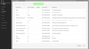

# Destinazione connessioni Enterprise Merkury

>[!NOTE]
>
>Il connettore di destinazione e la pagina della documentazione vengono creati e gestiti dal team [!DNL Merkury]. Per richieste di informazioni o richieste di aggiornamento, contattare il rappresentante dell&#39;account [!DNL Merkury].

## Panoramica

Utilizza la destinazione [!DNL Merkury Enterprise Connections] per inviare in modo sicuro i tipi di pubblico a [!DNL Merkury]. [!DNL Merkury] consente agli addetti al marketing di trovare e inviare facilmente i tipi di pubblico basati su persone alle connessioni indirizzabili 80+ Premium di TV/CTV, publisher e ad-tech di [!DNL Merkury]. [!DNL Merkury] è alimentato da un grafico completo di identità dei consumatori adulti degli Stati Uniti di oltre 268 milioni di persone.

Segui i passaggi descritti in questa pagina della documentazione per creare una connessione di destinazione [!DNL Merkury Connections] e attivare i tipi di pubblico tramite l&#39;interfaccia utente di Adobe Experience Platform.

>[!NOTE]
>
>Se desideri attivare i tipi di pubblico nelle destinazioni dei contenuti multimediali con il tuo account [!DNL Merkury Connect], utilizza invece la destinazione [!DNL Merkury Connections].

## Casi d’uso

* **Attivazione di contenuti multimediali digitali**: è possibile associare e distribuire facilmente i profili di pubblico agli oltre 50 editori premium di [!DNL Merkury] e alle connessioni ad-tech.
* **Migliora l&#39;efficienza**: migliora la portata dei contenuti multimediali indirizzabili e senza cookie, l&#39;efficienza del targeting e il ROAS (Return on Advertising Spend).

## Prerequisiti

>[!IMPORTANT]
>
>* Per connettersi alla destinazione, è necessario **Visualizzare le destinazioni** e **Gestire le destinazioni**, **Attivare le destinazioni**, **Visualizzare i profili** e **Visualizzare i segmenti** [[Autorizzazioni di controllo di accesso]](https://experienceleague.adobe.com/en/docs/experience-platform/access-control/home#permissions). Leggere la [[panoramica sul controllo di accesso]](https://experienceleague.adobe.com/en/docs/experience-platform/access-control/ui/overview) o contattare l&#39;amministratore del prodotto per ottenere le autorizzazioni necessarie.
>* Per esportare *identità*, è necessario **Visualizza grafo identità** [[autorizzazione di controllo di accesso]](https://experienceleague.adobe.com/en/docs/experience-platform/access-control/home#permissions).\

## Identità supportate {#supported-identities}

| Identità di destinazione | Descrizione | Considerazioni |
|---|---|---|
| GAID | GOOGLE ADVERTISING ID | Seleziona l’identità di destinazione GAID quando l’identità di origine è uno spazio dei nomi GAID. |
| IDFA | Apple ID per inserzionisti | Selezionare l&#39;identità di destinazione IDFA quando l&#39;identità di origine è uno spazio dei nomi IDFA. |
| ECID | Experience Cloud ID | Uno spazio dei nomi che rappresenta ECID. A questo spazio dei nomi possono fare riferimento anche i seguenti alias: &quot;Adobe Marketing Cloud ID&quot;, &quot;Adobe Experience Cloud ID&quot;, &quot;Adobe Experience Platform ID&quot;. Per ulteriori informazioni, consulta il seguente documento su [ECID](/help/identity-service/features/ecid.md). |
| phone_sha256 | Numeri di telefono con hash con algoritmo SHA256 | I numeri di telefono con hash SHA256 e testo normale sono supportati da Adobe Experience Platform. Se il campo di origine contiene attributi senza hash, selezionare l&#39;opzione **[!UICONTROL Applica trasformazione]** per impostare [!DNL Platform] per l&#39;hashing automatico dei dati all&#39;attivazione. |
| email_lc_sha256 | Indirizzi e-mail con hash con algoritmo SHA256 | Adobe Experience Platform supporta sia gli indirizzi di posta elettronica in testo normale che quelli con hash SHA256. Se il campo di origine contiene attributi senza hash, selezionare l&#39;opzione **[!UICONTROL Applica trasformazione]** per impostare [!DNL Platform] per l&#39;hashing automatico dei dati all&#39;attivazione. |
| extern_id | ID utente personalizzati | Seleziona questa identità di destinazione quando l&#39;identità di origine è uno spazio dei nomi personalizzato. |

{style="table-layout:auto"}

## Tipi di pubblico supportati

Questa sezione descrive il tipo di pubblico che puoi esportare in questa destinazione.

| **Pubblico** | **Supportato** | **Origine descrizione** |
|---|---|---|      
| Servizio di segmentazione | ✓ | Tipi di pubblico generati tramite l&#39;Experience Platform [[Servizio di segmentazione]](https://experienceleague.adobe.com/en/docs/experience-platform/segmentation/home). |
| Caricamenti personalizzati | X | Tipi di pubblico [[importato]](https://experienceleague.adobe.com/en/docs/experience-platform/segmentation/ui/overview#import-audience) in Experience Platform da file CSV. |

{style="table-layout:auto"}

## Tipo e frequenza di esportazione

Per informazioni sul tipo e sulla frequenza di esportazione della destinazione, consulta la tabella seguente.

| **Elemento** | **Tipo** | **Note** |
|---|---|---|  
| Tipo di esportazione | **Basato su profilo** | Stai esportando tutti i membri di un segmento, insieme ai campi dello schema desiderati (ad esempio: indirizzo e-mail, numero di telefono, cognome), come scelto nella schermata seleziona attributi profilo del [[flusso di lavoro di attivazione destinazione]](https://experienceleague.adobe.com/en/docs/experience-platform/destinations/ui/activate/activate-batch-profile-destinations#select-attributes). |
| Frequenza | **Batch** | Le destinazioni batch esportano i file sulle piattaforme a valle con incrementi di tre, sei, otto, dodici o ventiquattro ore. Ulteriori informazioni su [[destinazioni di frequenza basate su file batch]](https://experienceleague.adobe.com/en/docs/experience-platform/destinations/destination-types#file-based). |

{style="table-layout:auto"}

## Connettersi alla destinazione

>[!IMPORTANT]
>
>Per connettersi alla destinazione, è necessario **Visualizza destinazioni** e **Gestisci e attiva destinazioni set di dati** [[autorizzazioni controllo di accesso]](https://experienceleague.adobe.com/en/docs/experience-platform/access-control/home#permissions). Leggere la [[panoramica sul controllo di accesso]](https://experienceleague.adobe.com/en/docs/experience-platform/access-control/ui/overview) o contattare l&#39;amministratore del prodotto per ottenere le autorizzazioni necessarie.

Per connettersi a questa destinazione, seguire i passaggi descritti nel [[tutorial sulla configurazione della destinazione]](https://experienceleague.adobe.com/en/docs/experience-platform/destinations/ui/connect-destination). Nel flusso di lavoro di configurazione della destinazione, compila i campi elencati nelle due sezioni seguenti.

### Autenticarsi nella destinazione

Per eseguire l&#39;autenticazione nella destinazione, compilare i campi obbligatori e selezionare **Connetti alla destinazione**.

Per accedere al bucket su Experience Platform, devi fornire valori validi per le seguenti credenziali:

| **Credenziali** | **Descrizione** |
|---|---|
| Chiave di accesso | ID della chiave di accesso per il bucket. Puoi recuperare questo valore dal team Merkury. |
| Chiave segreta | ID della chiave segreta del bucket. Puoi recuperare questo valore dal team Merkury. |
| Nome del bucket | Questo è il bucket in cui verranno condivisi i file. Puoi recuperare questo valore dal team Merkury. |

{style="table-layout:auto"}

### Inserire i dettagli della destinazione

Per configurare i dettagli per la destinazione, compila i campi obbligatori e facoltativi seguenti. Un asterisco accanto a un campo nell’interfaccia utente indica che il campo è obbligatorio.

* **Nome (obbligatorio)** - Nome in cui verrà salvata la destinazione
* **Descrizione** - Breve spiegazione dello scopo della destinazione
* **Nome bucket (obbligatorio)** - Nome del bucket Amazon S3 configurato in S3
* **Percorso cartella (obbligatorio)** - Se vengono utilizzate sottodirectory in un bucket, è necessario definire un percorso oppure &#39;/&#39; per fare riferimento al percorso principale.
* Experienci Platform **Tipo file** - Selezionare il formato da utilizzare per i file esportati. Consulta il team di Merkury per il tipo di file previsto per il tuo account.

>[!NOTE]
>
>Quando selezioni l’opzione CSV, vengono visualizzate le opzioni Delimitatore, Carattere preventivo, Carattere escape, Valore vuoto, Valore nullo, Formato compressione e Includi file manifesto, consulta il team Merkury per le impostazioni appropriate per il tuo account.

### Account esistente

Gli account già definiti utilizzando la destinazione Merkury Enterprise Connections vengono visualizzati in un pop-up di elenco. Se questa opzione è selezionata, i dettagli dell’account sono visualizzati nella barra a destra. Visualizza l&#39;esempio dall&#39;interfaccia utente, quando passi a **Destinazioni** > **Account**:

## Abilita avvisi

Puoi abilitare gli avvisi per ricevere notifiche sullo stato del flusso di dati verso la tua destinazione. Seleziona un avviso dall’elenco per abbonarti e ricevere notifiche sullo stato del flusso di dati. Per ulteriori informazioni sugli avvisi, consulta la guida su [abbonamento a destinazioni avvisi tramite l&#39;interfaccia utente](https://experienceleague.adobe.com/en/docs/experience-platform/destinations/ui/alerts).

Dopo aver fornito i dettagli per la connessione di destinazione, seleziona **Avanti**.

## Attivare tipi di pubblico in questa destinazione

>[!IMPORTANT]
>
>* Per attivare i dati, sono necessarie le autorizzazioni di controllo di accesso **Visualizza destinazioni**, **Attiva destinazioni**, **Visualizza profili** e **Visualizza segmenti**. Leggi la panoramica sul controllo degli accessi o contatta l’amministratore del prodotto per ottenere le autorizzazioni necessarie.
>* Per esportare le identità, è necessario disporre dell&#39;autorizzazione di controllo dell&#39;accesso **Visualizza grafo identità**.

Per istruzioni sull&#39;attivazione dei tipi di pubblico in questa destinazione, leggi [Attiva dati pubblico per esportare i profili in batch](https://experienceleague.adobe.com/en/docs/experience-platform/destinations/ui/activate/activate-batch-profile-destinations).

## Suggerimenti di mappatura

La corretta elaborazione dei file sul lato [!DNL Merkury] richiede elementi di nome e indirizzo. Anche se non tutti gli elementi sono necessari, fornire il più possibile contribuirà ad una corrispondenza di successo.

I suggerimenti di mappatura sono forniti nella tabella seguente che elenca gli attributi sul lato destinazione utilizzati dall&#39;elaborazione [!DNL Merkury] a cui i clienti possono mappare gli attributi del profilo. Considera questi elementi come suggerimenti, in quanto non tutti gli elementi sono necessari e i valori sorgente dipenderanno dalle esigenze dell’account.

| Campo di destinazione | Descrizione Source |
|---|---|
| id | Campo di identità da utilizzare per mappare i dati [!DNL Merkury] all&#39;Experience Platform tramite il connettore Source [!DNL Merkury Enterprise Identity] |
| Input_First_Name | Il valore `person.name.firstName` in Experience Platform. |
| Input_Last_Name | Il valore `person.name.lastName` in Experience Platform. |
| Input_Address_Line_1 | Il valore `mailingAddress.street` in Experience Platform. |
| Input_City | Il valore `mailingAddress.city` in Experience Platform. |
| Input_State_Province_Code | Il valore `mailingAddress.state` in Experience Platform. Da utilizzare se lo stato è nel formato di codice a due caratteri. |
| Nome_Provincia_Stato_Input | Il valore `mailingAddress.state` in Experience Platform. Usa se lo stato è il nome completo dello stato |
| Codice_postale_di_input | Il valore `mailingAddress.postalCode` in Experience Platform. |
| Input_Email_Address | Il valore che desideri mappare come indirizzo e-mail dei profili. |
| Input_Phone | Il valore da mappare come numero di telefono dei profili. |

{style="table-layout:auto"}

## Convalidare l’esportazione dei dati

Per verificare se i dati sono stati esportati correttamente, controlla il bucket di archiviazione Amazon S3 e assicurati che i file esportati contengano le popolazioni di profilo previste.

## Utilizzo dei dati e governance

Tutte le destinazioni Adobe Experience Platform sono conformi ai criteri di utilizzo dei dati durante la gestione dei dati. Per informazioni dettagliate su come Adobe Experience Platform applica la governance dei dati, consulta la [Panoramica sulla governance dei dati](https://experienceleague.adobe.com/en/docs/experience-platform/data-governance/home).

## Passaggi successivi

Seguendo questa esercitazione, è stato creato un flusso di dati per esportare i dati del profilo da Experience Platform nel percorso S3 gestito di [!DNL Merkury]. Quindi, devi contattare il tuo rappresentante [!DNL Merkury] con il nome dell&#39;account, i nomi dei file e il percorso del bucket in modo da poter configurare l&#39;elaborazione.