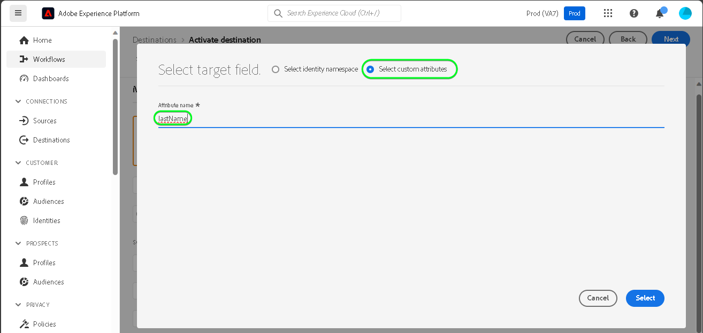
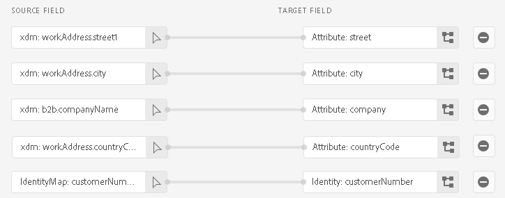
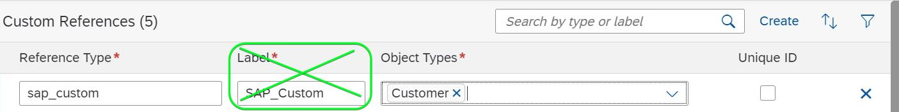
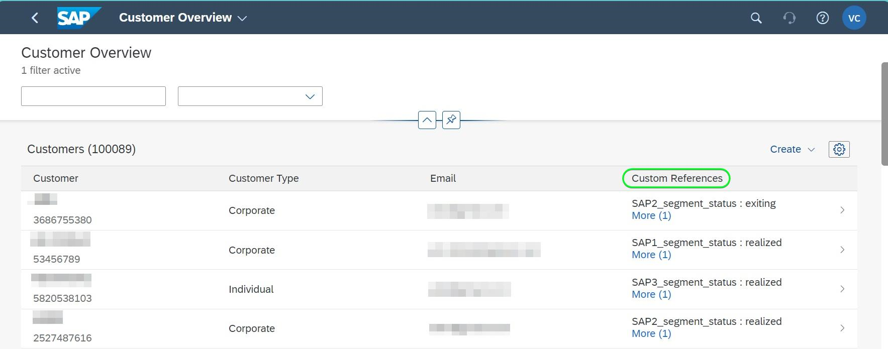

# [!DNL SAP Commerce] connessione

[!DNL SAP Commerce], precedentemente noto come [[!DNL Hybris]](https://www.sap.com/india/products/acquired-brands/what-is-hybris.html), è una soluzione di piattaforma di e-commerce basata su cloud per le aziende B2B e B2C e disponibile come parte del portafoglio SAP Customer Experience. [[!DNL SAP] Fatturazione abbonamento](https://www.sap.com/products/financial-management/subscription-billing.html) è un prodotto incluso nel portfolio e consente la gestione completa del ciclo di vita degli abbonamenti con esperienze di vendita e pagamento semplificate tramite integrazioni standardizzate.

Questo [!DNL Adobe Experience Platform] [destinazione](/help/destinations/home.md) utilizza [[!DNL SAP Subscription Billing] API di gestione clienti](https://api.sap.com/api/BusinessPartner_APIs/path/PUT_customers-customerNumber), per aggiornare i dettagli del cliente in [!DNL SAP Commerce] da un pubblico Experience Platform esistente dopo l’attivazione.

Istruzioni per l’autenticazione [!DNL SAP Commerce] sono riportati di seguito, nella [Autentica nella destinazione](#authenticate) sezione.

## Casi d’uso {#use-cases}

Per aiutarti a capire meglio come e quando utilizzare il [!DNL SAP Commerce] destinazione: ecco un caso d’uso di esempio che i clienti di Adobe Experience Platform possono risolvere utilizzando questa destinazione.

[!DNL SAP Commerce] I clienti memorizzano informazioni su individui o entità organizzative che interagiscono con la tua azienda. Il tuo team utilizza i clienti esistenti in [!DNL SAP Commerce] per generare il pubblico Experience Platform. Dopo aver inviato questi tipi di pubblico a [!DNL SAP Commerce], le loro informazioni vengono aggiornate e a ciascun cliente viene assegnata una proprietà il cui valore è il nome del pubblico che indica a quale pubblico appartiene il cliente.

## Prerequisiti {#prerequisites}

Consulta le sezioni seguenti per eventuali prerequisiti da impostare in Experience Platform e [!DNL SAP Commerce] e per le informazioni che è necessario raccogliere prima di lavorare con [!DNL SAP Commerce] destinazione.

### Experience Platform prerequisiti {#prerequisites-in-experience-platform}

Prima di attivare i dati in [!DNL SAP Commerce] destinazione, è necessario disporre di un [schema](/help/xdm/schema/composition.md), a [set di dati](https://experienceleague.adobe.com/docs/platform-learn/tutorials/data-ingestion/create-datasets-and-ingest-data.html), e [audience](https://experienceleague.adobe.com/docs/platform-learn/tutorials/audiences/create-audiences.html) creato in [!DNL Experience Platform].

Consulta la documentazione di Experience Platform per [Gruppo di campi schema Dettagli appartenenza pubblico](/help/xdm/field-groups/profile/segmentation.md) per informazioni sugli stati del pubblico.

### Prerequisiti per [!DNL SAP Commerce] destinazione {#prerequisites-destination}

Prendi nota dei seguenti prerequisiti per esportare i dati da Platform al tuo [!DNL SAP Commerce] account:

#### Devi avere un [!DNL SAP Subscription Billing] account {#prerequisites-account}

Per esportare i dati da Platform al tuo [!DNL SAP Commerce] account, è necessario disporre di un [!DNL SAP Subscription Billing] account. Se non disponi di un account di fatturazione valido, contatta [!DNL SAP] responsabile dell’account. Consulta la sezione [[!DNL SAP] Configurazione piattaforma](https://help.sap.com/doc/5fd179965d5145fbbe7f2a7aa1272338/latest/en-US/PlatformConfiguration.pdf) per ulteriori dettagli.

#### Generare una chiave di servizio {#prerequisites-service-key}

* Il [!DNL SAP Commerce] service key consente di accedere al [!DNL SAP Subscription Billing] API tramite Experience Platform. Consulta la sezione [!DNL SAP Commerce] [creare una chiave di servizio con ID client e segreto client](https://help.sap.com/docs/CLOUD_TO_CASH_OD/1216e7b79c984675b0a6f0005e351c74/87c11a0f5dc3494eaf3baa355925c030.html#create-a-service-key-with-client-id-and-client-secret) per creare una chiave di servizio. [!DNL SAP Commerce] richiede quanto segue:
   * ID client
   * Segreto client
   * URL. Il pattern dell’URL è il seguente: `https://subscriptionbilling.authentication.eu10.hana.ondemand.com`. Questo valore verrà utilizzato in seguito per ottenere i valori per `Region` e `Endpoint`.

+++Seleziona per visualizzare un esempio della chiave del servizio

```json
{ 
    "url": "https://eu10.revenue.cloud.sap/api",
    "uaa": {
        "clientid": "XXX",
        "clientsecret": "XXX",
        "url": "https://subscriptionbilling.authentication.eu10.hana.ondemand.com",
        "identityzone": "subscriptionbilling",
        "identityzoneid": "XXX",
        "tenantid": "XXX",
        "tenantmode": "dedicated",
        "sburl": "https://internal-xsuaa.authentication.eu10.hana.ondemand.com",
        "apiurl": "https://api.authentication.eu10.hana.ondemand.com",
        "verificationkey": "XXX",
        "xsappname": "XXX",
        "subaccountid": "XXX",
        "uaadomain": "authentication.eu10.hana.ondemand.com",
        "zoneid": "XXX",
        "credential-type": "binding-secret"
    },
    "vendor": "SAP"
}
```

+++

#### Creare riferimenti personalizzati in [!DNL SAP Subscription Billing] {#prerequisites-custom-reference}

Per aggiornare lo stato del pubblico di Experienci Platform in [!DNL SAP Subscription Billing], è necessario un campo di riferimento personalizzato per ogni pubblico selezionato in Platform.

Per creare i riferimenti personalizzati, accedi al tuo [!DNL SAP Subscription Billing] account e passare al **[Dati principali e configurazione]** > **[Riferimenti personalizzati]** pagina. Quindi, seleziona **[!UICONTROL Crea]** per aggiungere un nuovo riferimento per ogni pubblico selezionato in Platform. Questi nomi di campo di riferimento saranno necessari nei successivi [Esempio di esportazione e pianificazione di un pubblico](#schedule-segment-export-example) passaggio.

Un esempio di come creare un personalizzato **[!UICONTROL Tipo di riferimento]** entro [!DNL SAP Subscription Billing] è mostrato di seguito:


Per ulteriori informazioni, consulta [!DNL SAP Subscription Billing] [riferimenti personalizzati](https://help.sap.com/docs/CLOUD_TO_CASH_OD/80d121f216af43648e79664efe5595f7/85696a63c8d8453a934e86c9413a25cf.html?version=2023-11-27) documentazione.

### Raccogli le credenziali richieste {#gather-credentials}

Per connettersi [!DNL SAP Commerce] ad Experience Platform, è necessario fornire valori per le seguenti proprietà di connessione:

| Credenziali | Descrizione |
| --- | --- |
| ID client | Il valore di `clientId` dalla chiave del servizio. |
| Segreto client | Il valore di `clientSecret` dalla chiave del servizio. |
| Endpoint | Il valore di `url` dalla chiave del servizio, è simile a `https://subscriptionbilling.authentication.eu10.hana.ondemand.com`. |
| Area geografica | La posizione del centro dati. La regione è presente nel `url` e ha un valore simile a `eu10` o `us10`. Ad esempio, se `url` è `https://eu10.revenue.cloud.sap/api` di cui hai bisogno `eu10`. |

## Guardrail {#guardrails}

Richieste API a [!DNL SAP Cloud Management service] sono soggetti a [Limiti di velocità](https://help.sap.com/docs/btp/sap-business-technology-platform/account-administration-rate-limiting). Quando il limite di velocità viene superato, si verifica un `HTTP 429 Too Many Requests` codice di stato della risposta .

## Identità supportate {#supported-identities}

[!DNL SAP Commerce] supporta l’aggiornamento delle identità descritte nella tabella seguente. Ulteriori informazioni su [identità](/help/identity-service/features/namespaces.md).

| Identità di destinazione | Descrizione | Considerazioni |
| --- | --- | --- |
| `customerNumberSAP` | Un identificatore del cliente individuale o aziendale già presente nel [!DNL SAP Commerce] account. | Obbligatorio |

## Tipi di pubblico supportati {#supported-audiences}

Questa sezione descrive tutti i tipi di pubblico che puoi esportare in questa destinazione.

Questa destinazione supporta l’attivazione di tutti i tipi di pubblico generati tramite l’Experience Platform [Servizio di segmentazione](../../../segmentation/home.md).

Questa destinazione supporta anche l’attivazione dei tipi di pubblico descritti nella tabella seguente.

| Tipo di pubblico | Supportato | Descrizione |
| ------------- | --------- | ----------- |
| [!DNL Segmentation Service] | ✓ | Tipi di pubblico generati dall’Experience Platform [Servizio di segmentazione](../../../segmentation/home.md). |
| Caricamenti personalizzati | ✓ | Tipi di pubblico [importato](../../../segmentation/ui/audience-portal.md#import-audience) in Experience Platform da file CSV. |

{style="table-layout:auto"}

## Tipo e frequenza di esportazione {#export-type-frequency}

Per informazioni sul tipo e sulla frequenza di esportazione della destinazione, consulta la tabella seguente.

| Elemento | Tipo | Note |
---------|----------|---------|
| Tipo di esportazione | **[!UICONTROL Basato su profilo]** | <ul><li>Stai esportando tutti i membri di un pubblico, insieme ai campi di schema desiderati *ad esempio: indirizzo e-mail, numero di telefono, cognome*, in base alla mappatura del campo.</li><li> Per ogni pubblico selezionato in Platform, la [!DNL SAP Commerce] l’attributo aggiuntivo viene aggiornato con il relativo stato di pubblico da Platform.</li></ul> |
| Frequenza di esportazione | **[!UICONTROL Streaming]** | <ul><li>Le destinazioni di streaming sono connessioni &quot;sempre attive&quot; basate su API. Quando un profilo viene aggiornato in Experience Platform in base alla valutazione del pubblico, il connettore invia l’aggiornamento a valle alla piattaforma di destinazione. Ulteriori informazioni su [destinazioni di streaming](/help/destinations/destination-types.md#streaming-destinations).</li></ul> |

{style="table-layout:auto"}

## Connettersi alla destinazione {#connect}

>[!IMPORTANT]
>
>Per connettersi alla destinazione, è necessario **[!UICONTROL Gestire le destinazioni]** [autorizzazione per il controllo degli accessi](/help/access-control/home.md#permissions). Leggi le [panoramica sul controllo degli accessi](/help/access-control/ui/overview.md) oppure contatta l’amministratore del prodotto per ottenere le autorizzazioni necessarie.

Per connettersi a questa destinazione, seguire i passaggi descritti in [esercitazione sulla configurazione della destinazione](../../ui/connect-destination.md). Nel flusso di lavoro di configurazione della destinazione, compila i campi elencati nelle due sezioni seguenti.

Entro **[!UICONTROL Destinazioni]** > **[!UICONTROL Catalogo]**, cerca [!DNL SAP Commerce]. In alternativa, è possibile posizionarlo sotto il **[!UICONTROL eCommerce]** categoria.

### Autenticarsi nella destinazione {#authenticate}

Compila i campi obbligatori di seguito. Consulta la sezione [Generare una chiave di servizio](#prerequisites-service-key) sezione per eventuali indicazioni.

| Campo | Descrizione |
| --- | --- |
| **[!UICONTROL ID client]** | Il valore di `clientId` dalla chiave del servizio. |
| **[!UICONTROL Segreto client]** | Il valore di `clientSecret` dalla chiave del servizio. |
| **[!UICONTROL Endpoint]** | Il valore di `url` dalla chiave del servizio, è simile a `https://subscriptionbilling.authentication.eu10.hana.ondemand.com`. |
| **[!UICONTROL Regione]** | La posizione del centro dati. La regione è presente nel `url` e ha un valore simile a `eu10` o `us10`. Ad esempio, se `url` è `https://eu10.revenue.cloud.sap/api` di cui hai bisogno `eu10`. |

Per eseguire l’autenticazione nella destinazione, seleziona **[!UICONTROL Connetti alla destinazione]**.


Se i dettagli forniti sono validi, nell’interfaccia utente viene visualizzato un **[!UICONTROL Connesso]** con un segno di spunta verde. A questo punto è possibile procedere al passaggio successivo.

### Inserire i dettagli della destinazione {#destination-details}

Per configurare i dettagli per la destinazione, compila i campi obbligatori e facoltativi seguenti. Un asterisco accanto a un campo nell’interfaccia utente indica che il campo è obbligatorio.


* **[!UICONTROL Nome]**: nome con cui riconoscerai questa destinazione in futuro.
* **[!UICONTROL Descrizione]**: descrizione che ti aiuterà a identificare questa destinazione in futuro.
* **[!UICONTROL Tipo di cliente]**: seleziona una ***Individuale*** o ***Aziendale*** a seconda delle entità all’interno del pubblico. Il [!DNL SAP Subscription Billing] [schema](https://api.sap.com/api/BusinessPartner_APIs/schema) cambia i campi obbligatori in base a questa selezione mappata al `customerType` attributo. Se la selezione è ***Aziendale***, quindi le mappature obbligatorie come `firstName` e `lastName` necessario per un singolo cliente verrà ignorato e `company` diventa obbligatorio e viceversa.

### Abilita avvisi {#enable-alerts}

Puoi abilitare gli avvisi per ricevere notifiche sullo stato del flusso di dati verso la tua destinazione. Seleziona un avviso dall’elenco per abbonarti e ricevere notifiche sullo stato del flusso di dati. Per ulteriori informazioni sugli avvisi, consulta la guida su [abbonamento agli avvisi sulle destinazioni tramite l’interfaccia utente](../../ui/alerts.md).

Una volta completate le informazioni sulla connessione di destinazione, seleziona **[!UICONTROL Successivo]**.

## Attivare tipi di pubblico in questa destinazione {#activate}

>[!IMPORTANT]
> 
>* Per attivare i dati, è necessario **[!UICONTROL Visualizza destinazioni]**, **[!UICONTROL Attivare le destinazioni]**, **[!UICONTROL Visualizza profili]**, e **[!UICONTROL Visualizzare segmenti]** [autorizzazioni di controllo degli accessi](/help/access-control/home.md#permissions). Leggi le [panoramica sul controllo degli accessi](/help/access-control/ui/overview.md) oppure contatta l’amministratore del prodotto per ottenere le autorizzazioni necessarie.
>* Per esportare *identità*, è necessario **[!UICONTROL Visualizza grafico delle identità]** [autorizzazione per il controllo degli accessi](/help/access-control/home.md#permissions). <br> {width="100" zoomable="yes"}

Letto [Attiva profili e tipi di pubblico nelle destinazioni di esportazione del pubblico in streaming](/help/destinations/ui/activate-segment-streaming-destinations.md) per istruzioni sull’attivazione dei tipi di pubblico in questa destinazione.

### Mappare attributi e identità {#map}

Per inviare correttamente i dati sul pubblico da Adobe Experience Platform a [!DNL SAP Commerce] destinazione, devi passare attraverso il passaggio di mappatura campo. La mappatura consiste nella creazione di un collegamento tra i campi dello schema Experience Data Model (XDM) nell’account Platform e i corrispondenti equivalenti dalla destinazione. Per mappare correttamente i campi XDM su [!DNL SAP Commerce] campi di destinazione, segui i passaggi seguenti:

#### Mappa il `customerNumberSAP` identità

Il `customerNumberSAP` identity è una mappatura obbligatoria per questa destinazione. Segui i passaggi seguenti per mapparla:
1. In **[!UICONTROL Mappatura]** passaggio, seleziona **[!UICONTROL Aggiungi nuova mappatura]**. Ora è possibile visualizzare una nuova riga di mappatura sullo schermo.
   
1. In **[!UICONTROL Seleziona campo di origine]** finestra, scegli la **[!UICONTROL Seleziona lo spazio dei nomi dell’identità]** e seleziona `customerNumberSAP`.
   
1. In **[!UICONTROL Seleziona campo di destinazione]** finestra, scegli la **[!UICONTROL Seleziona lo spazio dei nomi dell’identità]** e seleziona la `customerNumber` identità.
   

| Campo origine | Campo di destinazione | Obbligatorio |
| --- | --- | --- |
| `IdentityMap: customerNumberSAP` | `Identity: customerNumber` | Sì |

Di seguito è riportato un esempio con la mappatura di identità:


#### Mappatura degli attributi

Per aggiungere altri attributi che desideri aggiornare tra lo schema del profilo XDM e il [!DNL SAP Subscription Billing] account, ripeti i passaggi seguenti:
1. In **[!UICONTROL Mappatura]** passaggio, seleziona **[!UICONTROL Aggiungi nuova mappatura]**. Ora è possibile visualizzare una nuova riga di mappatura sullo schermo.
   
1. In **[!UICONTROL Seleziona campo di origine]** finestra, scegli la **[!UICONTROL Seleziona attributi]** e selezionare l&#39;attributo XDM.
   
1. In **[!UICONTROL Seleziona campo di destinazione]** finestra, scegli **[!UICONTROL Seleziona attributi personalizzati]** categoria e digitare il nome del [!DNL SAP Subscription Billing] dall&#39;elenco dei clienti [schema](https://api.sap.com/api/BusinessPartner_APIs/schema) attributi.
   

>[!IMPORTANT]
>
> I nomi dei campi di destinazione fanno distinzione tra maiuscole e minuscole e devono corrispondere al [!DNL SAP Subscription Billing] nomi di attributi. L’unica eccezione è `country` dove usare `countryCode` invece. [!DNL SAP Subscription Billing] supporta i codici paese alpha-2 (ISO 3166). Il valore fa distinzione tra maiuscole e minuscole e deve essere compreso tra 0 e 3 caratteri, pertanto assicurati di fornire esattamente come definito in caso di errori: `The country code {} does not exist` o `size must be between 0 and 3`.

#### Mappa `mandatory` attributi per il tipo di cliente selezionato

Le mappature di attributi obbligatorie dipendono dal **[!UICONTROL Tipo di cliente]** che avevi selezionato. Per mappare gli attributi obbligatori, seleziona una delle opzioni seguenti:

>[!BEGINTABS]

>[!TAB Cliente singolo]

| Campo origine | Campo di destinazione | Obbligatorio |
| --- | --- | --- |
| `xdm: person.lastName` | `Attribute: lastName` | Sì |
| `xdm: workAddress.countryCode` | `Attribute: countryCode` | Sì |

>[!TAB Cliente aziendale]

| Campo origine | Campo di destinazione | Obbligatorio |
| --- | --- | --- |
| `xdm: b2b.companyName` | `Attribute: company` | Sì |
| `xdm: workAddress.countryCode` | `Attribute: countryCode` | Sì |

>[!ENDTABS]

#### Mappatura di attributi aggiuntivi

Puoi quindi aggiungere altre mappature tra lo schema di profilo XDM e il [!DNL SAP Subscription Billing] [schema](https://api.sap.com/api/BusinessPartner_APIs/schema) attributi di un cliente come mostrato di seguito:

>[!BEGINTABS]

>[!TAB Cliente singolo]

| Campo origine | Campo di destinazione | Obbligatorio |
| --- | --- | --- |
| `xdm: person.name.firstName` | `Attribute: firstName` | No |
| `xdm: workAddress.street1` | `Attribute: street` | No |
| `xdm: workAddress.city` | `Attribute: city` | No |

Di seguito è riportato un esempio con mappature di attributi obbligatorie e facoltative in cui il cliente è un singolo utente:


>[!TAB Cliente aziendale]

| Campo origine | Campo di destinazione | Obbligatorio |
| --- | --- | --- |
| `xdm: workAddress.street1` | `Attribute: street` | No |
| `xdm: workAddress.city` | `Attribute: city` | No |

Di seguito è riportato un esempio con mappature di attributi obbligatorie e facoltative in cui il cliente è un’azienda:


>[!ENDTABS]

Una volta completate le mappature per la connessione di destinazione, seleziona **[!UICONTROL Successivo]**.

### Esempio di esportazione e pianificazione di un pubblico {#schedule-segment-export-example}

Durante l&#39;esecuzione di [Pianificare l’esportazione del pubblico](/help/destinations/ui/activate-segment-streaming-destinations.md#scheduling) , devi mappare manualmente i tipi di pubblico di Platform su [attributi](#prerequisites-attribute) in [!DNL SAP Subscription Billing].

Un esempio del passaggio di esportazione Pianifica pubblico, con la posizione del [!DNL SAP Commerce] **[!UICONTROL ID mappatura]** evidenziato, è mostrato di seguito:


A questo scopo, seleziona ogni segmento, quindi inserisci il nome del riferimento personalizzato da [!DNL SAP Subscription Billing] nel [!DNL SAP Commerce] **[!UICONTROL ID mappatura]** campo del connettore di destinazione. Per istruzioni sulla creazione di riferimenti personalizzati, consulta [Creare riferimenti personalizzati in [!DNL SAP Subscription Billing]](#prerequisites-custom-reference) sezione.

>[!IMPORTANT]
>
> Non utilizzare l’etichetta di riferimento personalizzata come valore.
>

Ad esempio, se il pubblico Experience Platform selezionato è `sap_audience1` e desideri che il relativo stato venga aggiornato in [!DNL SAP Subscription Billing] riferimento personalizzato `SAP_1`, specifica questo valore in [!DNL SAP_Commerce] **[!UICONTROL ID mappatura]** campo.

Un esempio **[!UICONTROL Tipo di riferimento]** da [!DNL SAP Subscription Billing] è mostrato di seguito:


Un esempio del passaggio Pianifica esportazione pubblico, con un pubblico selezionato e i corrispondenti [!DNL SAP Commerce] **[!UICONTROL ID mappatura]** evidenziato, è mostrato di seguito:


Come mostrato dal valore all&#39;interno del **[!UICONTROL ID mappatura]** deve corrispondere esattamente al [!DNL SAP Subscription Billing] **[!UICONTROL Tipo di riferimento]** valore .

Ripeti questa sezione per ogni pubblico di Platform attivato.

In base all’immagine mostrata sopra in cui hai selezionato due tipi di pubblico, la mappatura sarà la seguente: | [!DNL SAP Commerce] nome del pubblico | [!DNL SAP Subscription Billing] **[!UICONTROL Tipo di riferimento]** | [!DNL SAP Commerce] **[!UICONTROL ID mappatura]** valore | | — | — | — | | sap_audience1 | `SAP_1` | `SAP_1` | | Pubblico SAP2 | `SAP_2` | `SAP_2` |

## Convalidare l’esportazione dei dati {#exported-data}

Per verificare di aver impostato correttamente la destinazione, segui i passaggi seguenti:

Accedi a [!DNL SAP Subscription Billing] account, quindi passare al **[!UICONTROL Contatti]** per verificare gli stati del pubblico. L’elenco può essere configurato in modo da visualizzare le colonne per i riferimenti personalizzati e gli stati del pubblico corrispondenti.


## Utilizzo dei dati e governance {#data-usage-governance}

Tutti [!DNL Adobe Experience Platform] le destinazioni sono conformi ai criteri di utilizzo dei dati durante la gestione dei dati. Per informazioni dettagliate su come [!DNL Adobe Experience Platform] applica la governance dei dati, consulta la sezione [Panoramica sulla governance dei dati](/help/data-governance/home.md).

## Errori e risoluzione problemi {#errors-and-troubleshooting}

Consulta la sezione [[!DNL SAP Subscription Billing] Tipi di errore](https://help.sap.com/docs/CLOUD_TO_CASH_OD/987aec876092428f88162e438acf80d6/1a6a0dd6129c48e8b235190a1b5409fa.html) nella pagina della documentazione di per un elenco dei possibili tipi di errore e dei relativi codici di risposta.

## Risorse aggiuntive {#additional-resources}

Ulteriori informazioni utili da [!DNL SAP] la documentazione è riportata di seguito:
* [Fatturazione dell&#39;abbonamento SAP integrato](https://help.sap.com/docs/CLOUD_TO_CASH_OD/1216e7b79c984675b0a6f0005e351c74/e4b8badf7d124026991e4ab6b57d2a33.html)

### Changelog

Questa sezione acquisisce le funzionalità e i significativi aggiornamenti alla documentazione apportati al connettore di destinazione.

+++ Visualizza changelog

| Mese di rilascio | Tipo di aggiornamento | Descrizione |
|---|---|---|
| Gennaio 2024 | Versione iniziale | Versione di destinazione iniziale e pubblicazione della documentazione. |

{style="table-layout:auto"}

+++
