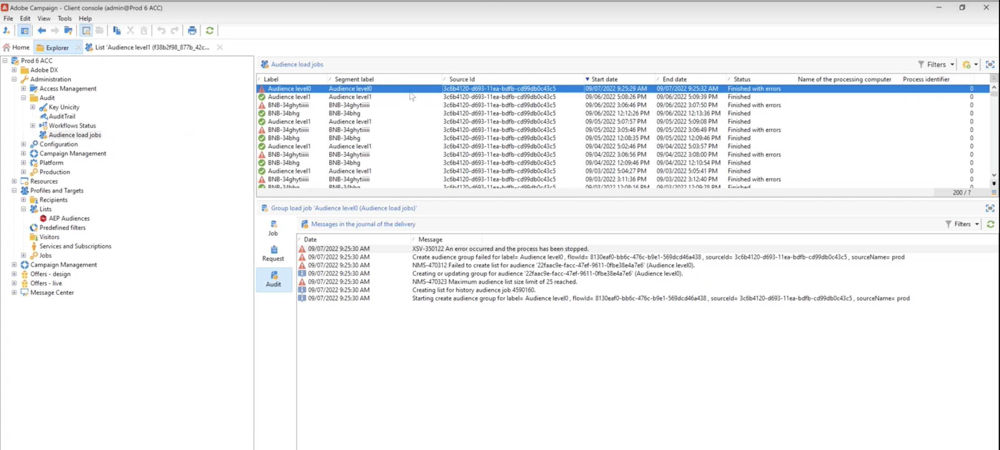

# Connessione Adobe Campaign Managed Cloud Services {#adobe-campaign-managed-services}

## Panoramica {#overview}

Adobe Campaign Managed Cloud Services fornisce una piattaforma per la progettazione di esperienze cliente cross-channel e un ambiente per l’orchestrazione visiva delle campagne, la gestione delle interazioni in tempo reale e l’esecuzione cross-channel. [Guida introduttiva a Campaign](https://experienceleague.adobe.com/docs/campaign/campaign-v8/start/get-started.html)

Utilizza Campaign per:
* Stimolare la personalizzazione e il coinvolgimento attraverso un’unica vista accessibile del cliente,
* Integrare nel percorso cliente canali e-mail, mobili, online e offline,
* Automatizzare la consegna di messaggi e offerte significativi e tempestivi.

>[!IMPORTANT]
>
>Quando si utilizza la connessione Adobe Campaign Managed Cloud Services, tenere presente le seguenti protezioni:
>
>* Un massimo di 50 segmenti può essere [attivato](#activate) per la destinazione,
>* Per ogni segmento, puoi aggiungere fino a 20 campi [map](#map) ad Adobe Campaign,
>* Conservazione dei dati nella zona di destinazione dei dati dell’archiviazione BLOB di Azure (DLZ) : 7 giorni,
>* La frequenza di attivazione è di almeno 3 ore.

## Casi d’uso {#use-cases}

Per comprendere meglio come e quando utilizzare la destinazione Adobe Campaign Manage Service, ecco un esempio di caso d’uso che i clienti Adobe Experience Platform possono risolvere utilizzando questa destinazione.

Adobe Experience Platform crea un profilo cliente che incorpora informazioni come il grafico dell’identità, i dati comportamentali di analytics, unisce dati offline e online e così via. Con questa integrazione, puoi aumentare le funzionalità di segmentazione già esistenti all’interno di Adobe Campaign con i tipi di pubblico basati su Adobe Experience Platform e quindi attivare tali dati in Campaign.

Ad esempio, un’azienda di abbigliamento sportivo desidera sfruttare i segmenti avanzati basati su Adobe Experience Platform e attivarli utilizzando Adobe Campaign per raggiungere la propria base clienti attraverso i diversi canali supportati da Adobe Campaign.

Una volta inviati i messaggi, desiderano migliorare il profilo del cliente in Adobe Experience Platform con i dati dell’esperienza provenienti da Adobe Campaign, ad esempio invii, apertura e clic.

Il risultato sono campagne cross-channel più coerenti nell’ecosistema Adobe Experience Cloud e un profilo cliente avanzato che si adatta e apprende rapidamente.

[Ulteriori informazioni sull’integrazione di Adobe Campaign con Adobe Experience Platform](https://experienceleague.adobe.com/docs/campaign/campaign-v8/connect/ac-aep.html)

## Prerequisiti {#prerequisites}

Affinché Campaign possa recuperare i dati da Adobe Experience Platform, devi creare un progetto API di Campaign e chiedere all’Assistenza clienti di aggiungere l’ID client associato a un elenco consentiti.

>[!NOTE]
>
>Le informazioni globali su come creare un progetto API sono descritte in [questa documentazione](https://experienceleague.adobe.com/docs/platform-learn/getting-started-for-data-architects-and-data-engineers/set-up-developer-console-and-postman.html)

1. Accedi a [Console Adobe Developer](https://console.adobe.io/) e crea un nuovo progetto.

1. Seleziona **[!UICONTROL Aggiungi API]** e scegli **[!UICONTROL Adobe Campaign]**.

   

1. Genera una coppia di chiavi.

1. Seleziona la `<Instance Name> - admin` profilo di prodotto e seleziona **[!UICONTROL Salva API configurata]**.

1. Viene creato il progetto API. Nota in basso **[!UICONTROL ID client]** nel progetto. Rivolgiti all’Assistenza clienti di Adobe e chiedi loro di aggiungere il tuo ID cliente a un elenco consentiti.

   

## Identità supportate {#supported-identities}

*Adobe Campaign Managed Cloud Services* supporta l’attivazione delle identità descritte nella tabella seguente. Ulteriori informazioni [identità](/help/identity-service/namespaces.md).

| Identità di destinazione | Descrizione | Considerazioni |
|---|---|---|
| external_id | ID utente personalizzati | Seleziona questa identità di destinazione quando l’identità di origine è uno spazio dei nomi personalizzato. È consigliabile utilizzare questa identità e mapparla all’ID nella tua istanza Campaign che rappresenta il cliente (loyalty_ID, account_ID, customer_ID...). |
| ECID | Experience Cloud ID | Spazio dei nomi che rappresenta ECID. Questo namespace può essere indicato anche dai seguenti alias: &quot;Adobe Marketing Cloud ID&quot;, &quot;Adobe Experience Cloud ID&quot;, &quot;Adobe Experience Platform ID&quot;. Vedi il seguente documento su [ECID](/help/identity-service/ecid.md) per ulteriori informazioni. |
| email_lc_sha256 | Indirizzi e-mail con hash con l’algoritmo SHA256 | Gli indirizzi e-mail con hash SHA256 e di testo normale sono supportati da Adobe Experience Platform. Quando il campo di origine contiene attributi senza hash, seleziona la **[!UICONTROL Applica trasformazione]** opzione, per avere [!DNL Platform] hash automaticamente i dati all’attivazione. |
| phone_sha256 | Hash dei numeri di telefono con l&#39;algoritmo SHA256 | Sia il testo normale che i numeri di telefono con hash SHA256 sono supportati da Adobe Experience Platform. Quando il campo di origine contiene attributi senza hash, seleziona la **[!UICONTROL Applica trasformazione]** opzione, per avere [!DNL Platform] hash automaticamente i dati all’attivazione. |
| GAID | Google Advertising ID | Selezionare l&#39;identità di destinazione GAID quando l&#39;identità di origine è uno spazio dei nomi GAID. |
| IDFA | Apple ID per gli inserzionisti | Seleziona l’identità di destinazione IDFA quando l’identità di origine è uno spazio dei nomi IDFA. |

{style=&quot;table-layout:auto&quot;}

## Tipo e frequenza di esportazione {#export-type-frequency}

Per informazioni sul tipo e sulla frequenza di esportazione della destinazione, fare riferimento alla tabella seguente.

| Elemento | Tipo | Note |
---------|----------|---------|
| Tipo di esportazione | **[!UICONTROL Basato su profilo]** | Stai esportando tutti i membri di un segmento, insieme ai campi dello schema desiderati (ad esempio: indirizzo e-mail, numero di telefono, cognome), come scelto nella schermata seleziona attributi profilo del [flusso di lavoro di attivazione della destinazione](/help/destinations/ui/activate-batch-profile-destinations.md#select-attributes). |
| Frequenza delle esportazioni | **[!UICONTROL Batch]** | Le destinazioni batch esportano file su piattaforme downstream con incrementi di tre, sei, otto, dodici o ventiquattro ore. Ulteriori informazioni [destinazioni batch basate su file](/help/destinations/destination-types.md#file-based). |

{style=&quot;table-layout:auto&quot;}

## Collegati alla destinazione {#connect}

>[!IMPORTANT]
> 
>Per connettersi alla destinazione, è necessario **[!UICONTROL Gestire le destinazioni]** [autorizzazione controllo accessi](/help/access-control/home.md#permissions). Leggi la sezione [panoramica sul controllo degli accessi](/help/access-control/ui/overview.md) oppure contatta l’amministratore del prodotto per ottenere le autorizzazioni richieste.

Per connettersi a questa destinazione, segui i passaggi descritti in [esercitazione sulla configurazione della destinazione](../../ui/connect-destination.md). Nel flusso di lavoro di configurazione della destinazione , compila i campi elencati nelle due sezioni seguenti.

### Compila i dettagli della destinazione {#destination-details}

Per configurare i dettagli della destinazione, compila i campi obbligatori e facoltativi riportati di seguito. Un asterisco accanto a un campo nell’interfaccia utente indica che il campo è obbligatorio.

* **[!UICONTROL Nome]**: Nome con cui riconoscerai questa destinazione in futuro.
* **[!UICONTROL Descrizione]**: Una descrizione che ti aiuterà a identificare questa destinazione in futuro.
* **[!UICONTROL Seleziona istanza]**: Le **[!DNL Campaign]** istanza di marketing.
* **[!UICONTROL Mappatura del target]**: Seleziona la mappatura di destinazione in uso **[!DNL Adobe Campaign]** per inviare consegne. [Ulteriori informazioni](https://experienceleague.adobe.com/docs/campaign/campaign-v8/profiles-and-audiences/add-profiles/target-mappings.html).

### Abilitare gli avvisi {#enable-alerts}

Puoi abilitare gli avvisi per ricevere notifiche sullo stato del flusso di dati nella tua destinazione. Seleziona un avviso dall’elenco per abbonarti e ricevere le notifiche sullo stato del flusso di dati. Per ulteriori informazioni sugli avvisi, consulta la guida su [iscrizione agli avvisi sulle destinazioni tramite l’interfaccia utente](../../ui/alerts.md).

Una volta completati i dettagli della connessione di destinazione, seleziona **[!UICONTROL Successivo]**.

### Politica di governance e azioni di esecuzione {#governance}

Seleziona le azioni di marketing applicabili ai dati da esportare nella destinazione. Per Adobe Campaign, ti consigliamo di selezionare il **[!UICONTROL Targeting e-mail]** azione di marketing.

Per ulteriori informazioni sulle azioni di marketing, consulta la sezione [panoramica dei criteri di utilizzo dei dati](/help/data-governance/policies/overview.md) pagina.

## Attiva i segmenti in questa destinazione {#activate}

>[!IMPORTANT]
> 
>Per attivare i dati, è necessario **[!UICONTROL Gestire le destinazioni]**, **[!UICONTROL Attivare le destinazioni]**, **[!UICONTROL Visualizza profili]** e **[!UICONTROL Visualizzare i segmenti]** [autorizzazioni di controllo accessi](/help/access-control/home.md#permissions). Leggi la sezione [panoramica sul controllo degli accessi](/help/access-control/ui/overview.md) oppure contatta l’amministratore del prodotto per ottenere le autorizzazioni richieste.

Leggi [Attivare i dati del pubblico nelle destinazioni di esportazione del profilo batch](https://experienceleague.adobe.com/docs/experience-platform/destinations/ui/activate/activate-batch-profile-destinations.html) per istruzioni sull’attivazione dei dati sul pubblico a questa destinazione.

### Mappare attributi e identità {#map}

Seleziona i campi XDM da esportare con i profili e mappali ai campi Adobe Campaign corrispondenti.[Ulteriori informazioni sulla selezione di identità e attributi per le destinazioni di marketing e-mail](overview.md)

1. Selezionare i campi di origine:

   * Seleziona un **identifier** (Ad esempio: il campo e-mail) come identità sorgente che identifica in modo univoco un profilo in Adobe Experience Platform e Adobe Campaign.

   * Seleziona tutti gli altri **Attributi del profilo di origine XDM** che devono essere esportati in Adobe Campaign.
   >[!NOTE]
   >
   >Il campo &quot;segmentMembershipStatus&quot; è una mappatura necessaria per riflettere lo stato di segmentMembership. Questo campo viene aggiunto per impostazione predefinita e non può essere modificato o rimosso.

1. Mappa ogni campo con il relativo campo di destinazione in Adobe Campaign. I campi di destinazione disponibili sono determinati dalla mappatura di destinazione selezionata quando [creazione della destinazione](#destination-details).

1. Identifica gli attributi obbligatori e le chiavi di deduplicazione. I valori negli attributi contrassegnati come &quot;Obbligatorio&quot; o &quot;Chiave di deduplicazione&quot; non possono essere nulli.

   * [Attributi obbligatori](../../ui/activate-batch-profile-destinations.md#mandatory-attributes) assicurati che tutti i record di profilo contengano gli attributi selezionati. Ad esempio: tutti i profili esportati contengono un indirizzo e-mail. Si consiglia di impostare l’opzione obbligatoria sia per il campo identity che per il campo utilizzato come chiave di deduplicazione.
   * [Chiave di deduplicazione](../../ui/activate-batch-profile-destinations.md#mandatory-attributes) è una chiave primaria che determina l’identità in base alla quale gli utenti desiderano che i loro profili vengano deduplicati.

      >[!IMPORTANT]
      >
      >Assicurati che il nome dell&#39;attributo della chiave di deduplicazione corrisponda a un nome di colonna della mappatura di destinazione selezionata.
   

1. Una volta eseguita la mappatura, puoi rivedere e completare la configurazione di destinazione per iniziare a inviare i dati a **[!DNL Campaign]**.
   [Scopri come rivedere e completare la configurazione della destinazione](/help/destinations/destination-types.md#review).

## Esportazione di dati / Convalida esportazione dati {#exported-data}

Una volta che una destinazione è stata attivata, puoi accedere al processo corrispondente e ai dati esportati in Campaign.

### Monitorare i processi di esportazione dei dati {#jobs}

Passa a **[!UICONTROL Amministrazione]** > **[!UICONTROL Audit]** > **[!UICONTROL Processi di caricamento del pubblico]** per monitorare tutti i processi di esportazione attivati da Adobe Experience Platform.

### Accedere ai dati esportati {#data}

Passa a **[!UICONTROL Profilo e destinazione]** > **[!UICONTROL Elenco]** > **[!UICONTROL Pubblico AEP]** per accedere ai tipi di pubblico creati dopo l’attivazione di una destinazione.

## Utilizzo e governance dei dati {#data-usage-governance}

Tutto [!DNL Adobe Experience Platform] le destinazioni sono conformi ai criteri di utilizzo dei dati durante la gestione dei dati. Per informazioni dettagliate su come [!DNL Adobe Experience Platform] impone la governance dei dati, leggi [Panoramica sulla governance dei dati](/help/data-governance/home.md).
