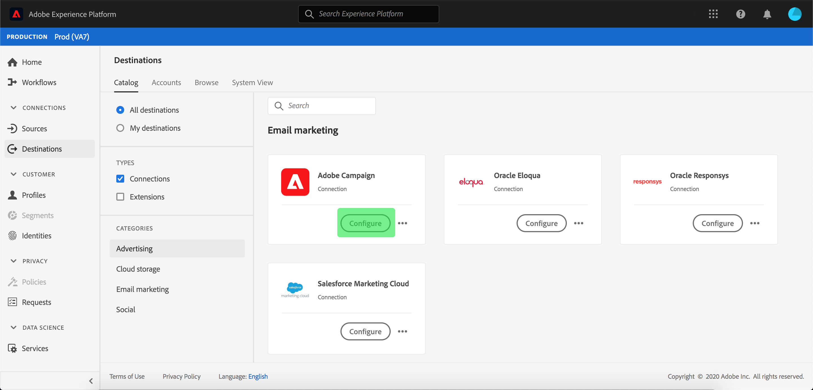

#  Adobe Campaign

## Panoramica

 Adobe Campaign è un insieme di soluzioni che consentono di personalizzare e distribuire campagne su tutti i canali online e offline. Per ulteriori informazioni, vedere [Informazioni su Adobe Campaign Classic](https://experienceleague.adobe.com/docs/campaign-classic/using/getting-started/starting-with-adobe-campaign/about-adobe-campaign-classic.html).

Per inviare i dati del segmento a  Adobe Campaign, è necessario prima [collegare la destinazione](#connect-destination) in Adobe Experience Platform, quindi [impostare un&#39;importazione di dati](#import-data-into-campaign) dalla posizione di memorizzazione in  Adobe Campaign.

## Tipo di esportazione {#export-type}

**Basato**  su profilo: si esportano tutti i membri di un segmento, insieme ai campi dello schema desiderati (ad esempio: indirizzo e-mail, numero di telefono, cognome), come scelto nella schermata degli attributi selezionati del flusso di lavoro [ di attivazione della ](../../ui/activate-destinations.md#select-attributes)destinazione.

## Destinazione Connect {#connect-destination}

In **[!UICONTROL Connections]** > **[!UICONTROL Destinations]**, selezionare  Adobe Campaign, quindi selezionare **[!UICONTROL Connect destination]**.

Nel flusso di lavoro di destinazione di Connect, selezionate **[!UICONTROL Connection type]** per il percorso di memorizzazione. Per  Adobe Campaign, è possibile selezionare tra **[!UICONTROL Amazon S3]**, **[!UICONTROL SFTP with Password]**, **[!UICONTROL SFTP with SSH Key]** e **[!UICONTROL Azure Blob]**. Compila le informazioni riportate di seguito, a seconda del tipo di connessione, quindi seleziona **[!UICONTROL Connect]**.

- Per le connessioni **[!UICONTROL Amazon S3]**, dovete fornire il vostro ID chiave di accesso e la chiave di accesso segreta.
- Per le connessioni **[!UICONTROL SFTP with Password]**, dovete fornire Domain, Port, UserName e Password.
- Per le connessioni **[!UICONTROL SFTP with SSH Key]**, è necessario fornire Domain, Port, Username e SSH Key.
- Per le connessioni **[!UICONTROL Azure Blob]**, è necessario fornire una stringa di connessione.

Facoltativamente, puoi allegare la chiave pubblica in formato RSA per aggiungere la crittografia con PGP/GPG ai file esportati nella sezione **[!UICONTROL Key]**. Questa chiave pubblica **deve essere scritta come una stringa codificata Base64.**

In **[!UICONTROL Basic Information]**, compila le informazioni pertinenti per la tua destinazione, come mostrato di seguito:
- **[!UICONTROL Name]**: Scegli un nome appropriato per la tua destinazione.
- **[!UICONTROL Description]**: Inserite una descrizione per la destinazione.
- **[!UICONTROL Bucket Name]**:  *Per connessioni* S3. Immettete la posizione del bucket S3 in cui Platform depositerà i dati di esportazione come file CSV o delimitati da tabulazioni.
- **[!UICONTROL Folder Path]**: Specificate il percorso nel percorso di archiviazione in cui Platform depositerà i dati di esportazione come file CSV o delimitati da tabulazioni.
- **[!UICONTROL Container]**:  *Per connessioni* Blob. Il contenitore che contiene il percorso della cartella Blob è in.
- **[!UICONTROL File Format]**:  **** CSVo  **TAB_DELIMITED**. Selezionare il formato di file da esportare nel percorso di memorizzazione.

Fare clic su **[!UICONTROL Create]** dopo aver compilato i campi riportati sopra. La destinazione è ora connessa e potete [attivare i segmenti](../../ui/activate-destinations.md) alla destinazione.

## Attivare i segmenti {#activate-segments}

Per informazioni sul flusso di lavoro di attivazione dei segmenti, vedere [Attivare profili e segmenti in una destinazione](../../ui/activate-destinations.md).

## Attributi di destinazione {#destination-attributes}

Quando si attivano [segmenti](../../ui/activate-destinations.md) nella  destinazione Adobe Campaign, si consiglia di selezionare un identificatore univoco dal [schema unione](../../../profile/home.md#profile-fragments-and-union-schemas). Selezionate l’identificatore univoco ed eventuali altri campi XDM da esportare nella destinazione. Per ulteriori informazioni, vedere [Selezionare i campi dello schema da utilizzare come attributi di destinazione nei file esportati](./overview.md#destination-attributes) nella documentazione delle destinazioni di marketing per e-mail.

## Dati esportati {#exported-data}

Per le destinazioni [!DNL Adobe Campaign], Platform crea un file delimitato da tabulazioni `.txt` o `.csv` nel percorso di archiviazione fornito. Per ulteriori informazioni sui file, vedi [Destinazioni di marketing e archiviazione di e-mail e Cloud](../../ui/activate-destinations.md#esp-and-cloud-storage) nell&#39;esercitazione sull&#39;attivazione dei segmenti.

## Imposta l&#39;importazione dei dati in  Adobe Campaign {#import-data-into-campaign}

>[!IMPORTANT]
>
>- Ricorda i limiti di archiviazione SFTP, i limiti di archiviazione del database e i limiti di profilo attivi come previsto dal contratto Adobe Campaign  durante l&#39;esecuzione di questa integrazione.
>- Devi pianificare, importare e mappare i segmenti esportati in  Adobe Campaign utilizzando i flussi di lavoro [!DNL Campaign]. Fare riferimento a [Impostazione di un&#39;importazione ricorrente](https://experienceleague.adobe.com/docs/campaign-classic/using/automating-with-workflows/general-operation/importing-data.html#automating-with-workflows) nella documentazione  Adobe Campaign.

Dopo aver collegato la piattaforma allo storage [!DNL Amazon S3] o SFTP, è necessario impostare l&#39;importazione dei dati dalla posizione di archiviazione in  Adobe Campaign. Per informazioni su come eseguire questa operazione, fare riferimento a [Importazione di dati](https://experienceleague.adobe.com/docs/campaign-classic/using/automating-with-workflows/general-operation/importing-data.html) nella documentazione Adobe Campaign .