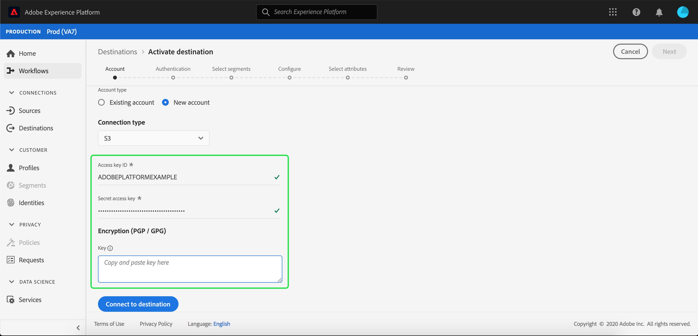

# Connessione Adobe Campaign

## Panoramica {#overview}

Adobe Campaign è un set di soluzioni che consentono di personalizzare e distribuire campagne su tutti i canali online e offline. Per ulteriori informazioni, consulta [Introduzione a Campaign Classic](https://experienceleague.adobe.com/docs/campaign-classic/using/getting-started/starting-with-adobe-campaign/about-adobe-campaign-classic.html) .

Per inviare i dati dei segmenti ad Adobe Campaign, è necessario prima [collegare la destinazione](#connect-destination) in Adobe Experience Platform, quindi [impostare un&#39;importazione di dati](#import-data-into-campaign) dalla posizione di archiviazione in Adobe Campaign.

## Tipo di esportazione {#export-type}

**Basato su profilo** : stai esportando tutti i membri di un segmento, insieme ai campi dello schema desiderati (ad esempio: indirizzo e-mail, numero di telefono, cognome), come scelto nel passaggio  **[!UICONTROL Seleziona]** attributi del flusso di lavoro [ di attivazione della ](../../ui/activate-destinations.md#select-attributes)destinazione.

## ELENCO CONSENTITI di indirizzi IP {#allow-list}

Quando si impostano le destinazioni di marketing e-mail con l’archiviazione SFTP, Adobe consiglia di aggiungere determinati intervalli IP al proprio elenco consentiti.

Per aggiungere IP di Adobe al tuo elenco consentiti, fai riferimento all’ [elenco consentiti di indirizzi IP per le destinazioni di archiviazione cloud](../cloud-storage/ip-address-allow-list.md) .

## Collegare la destinazione {#connect-destination}

In **[!UICONTROL Connessioni]** > **[!UICONTROL Destinazioni]**, seleziona Adobe Campaign, quindi seleziona **[!UICONTROL Configura]**.

>[!NOTE]
>
>Se esiste già una connessione con questa destinazione, è possibile visualizzare un pulsante **[!UICONTROL Attiva]** sulla scheda di destinazione. Per ulteriori informazioni sulla differenza tra [!UICONTROL Attiva] e [!UICONTROL Configura], consulta la sezione [Catalogo](../../ui/destinations-workspace.md#catalog) della documentazione dell&#39;area di lavoro di destinazione.

Nel passaggio **[!UICONTROL Account]** del flusso di lavoro di destinazione Connetti, selezionare il **[!UICONTROL Tipo di connessione]** per il percorso di archiviazione. Per Adobe Campaign, puoi selezionare tra **[!UICONTROL Amazon S3]**, **[!UICONTROL SFTP con password]**, **[!UICONTROL SFTP con chiave SSH]** e **[!UICONTROL Azure Blob]**. Il metodo preferito per inviare dati ad Adobe Campaign è tramite [!DNL Amazon S3] o [!DNL Azure Blob]. Compila le informazioni seguenti, a seconda del tipo di connessione, quindi seleziona **[!UICONTROL Connetti]**.

- Per le connessioni **[!UICONTROL Amazon S3]**, devi fornire il tuo [!UICONTROL ID chiave di accesso] e [!UICONTROL Chiave di accesso segreto].
- Per le connessioni **[!UICONTROL SFTP con password]**, è necessario fornire [!UICONTROL Dominio], [!UICONTROL Porta], [!UICONTROL Nome utente] e [!UICONTROL Password].
- Per le connessioni **[!UICONTROL SFTP con chiave SSH]**, è necessario fornire [!UICONTROL Dominio], [!UICONTROL Porta], [!UICONTROL Nome utente] e [!UICONTROL Chiave SSH].
- Per le connessioni **[!UICONTROL Azure Blob]**, è necessario fornire una stringa di connessione.

Facoltativamente, puoi allegare la tua chiave pubblica in formato RSA per aggiungere la crittografia con PGP/GPG ai file esportati nella sezione **[!UICONTROL Chiave]** . La chiave pubblica deve essere scritta come stringa codificata [!DNL Base64].

In **[!UICONTROL Autenticazione account]**, compila le informazioni pertinenti per la tua destinazione, come mostrato di seguito:
- **[!UICONTROL Nome]**: Scegli un nome appropriato per la destinazione.
- **[!UICONTROL Descrizione]**: Inserisci una descrizione per la destinazione.
- **[!UICONTROL Nome]** blocco:  *Per connessioni* S3. Immetti la posizione del bucket S3 in cui [!DNL Platform] depositerà i dati di esportazione come file CSV o delimitati da tabulazioni.
- **[!UICONTROL Percorso]** cartella: Fornisci il percorso nel percorso di archiviazione in cui  [!DNL Platform] verranno depositati i dati di esportazione come file CSV o delimitati da tabulazioni.
- **[!UICONTROL Contenitore]**:  *Per connessioni* Blob. Il contenitore contenente il BLOB nel percorso della cartella è in.
- **[!UICONTROL Formato]** file:  **** CSVo  **TAB_DELIMITTED**. Selezionare il formato di file da esportare nel percorso di archiviazione.
- **[!UICONTROL Azioni]** di marketing: Le azioni di marketing indicano l’intento per il quale i dati verranno esportati nella destinazione. Puoi scegliere tra azioni di marketing definite da Adobi o creare una tua azione di marketing. Per ulteriori informazioni sulle azioni di marketing, consulta la pagina [Panoramica dei criteri di utilizzo dei dati](../../../data-governance/policies/overview.md) .

Selezionare **[!UICONTROL Crea destinazione]** dopo aver compilato i campi sopra riportati. La destinazione è ora connessa ed è possibile [attivare segmenti](../../ui/activate-destinations.md) alla destinazione.

## Attiva segmenti {#activate-segments}

Per informazioni sul flusso di lavoro di attivazione dei segmenti, consulta [Attivare profili e segmenti su una destinazione](../../ui/activate-destinations.md) .

## Attributi di destinazione {#destination-attributes}

Quando si attivano [segmenti](../../ui/activate-destinations.md) nella destinazione Adobe Campaign, l&#39;Adobe consiglia di selezionare un identificatore univoco dal [schema di unione](../../../profile/home.md#profile-fragments-and-union-schemas). Seleziona l’identificatore univoco e tutti gli altri campi XDM da esportare nella destinazione. Per ulteriori informazioni, consulta [Selezionare i campi dello schema da utilizzare come attributi di destinazione nei file esportati](./overview.md#destination-attributes).

## Dati esportati {#exported-data}

Per le destinazioni [!DNL Adobe Campaign], [!DNL Platform] crea un file `.csv` delimitato da tabulazioni nel percorso di archiviazione fornito. Per ulteriori informazioni sui file, consulta [Destinazioni di e-mail marketing e destinazioni di archiviazione Cloud](../../ui/activate-destinations.md#esp-and-cloud-storage) nell’esercitazione sull’attivazione dei segmenti.

## Configurare l’importazione di dati in Adobe Campaign {#import-data-into-campaign}

>[!IMPORTANT]
>
>- Tieni presente i limiti di archiviazione [!DNL SFTP], i limiti di archiviazione del database e i limiti dei profili attivi in base al contratto Adobe Campaign durante l&#39;esecuzione dell&#39;integrazione.
>- Devi pianificare, importare e mappare i segmenti esportati in Adobe Campaign utilizzando i flussi di lavoro [!DNL Campaign] . Consulta [Impostazione di un&#39;importazione ricorrente](https://experienceleague.adobe.com/docs/campaign-classic/using/automating-with-workflows/use-cases/data-management/recurring-import-workflow.html) nella documentazione di Adobe Campaign Classic e [Informazioni sulle attività di gestione dati](https://experienceleague.adobe.com/docs/campaign-standard/using/managing-processes-and-data/data-management-activities/about-data-management-activities.html) nella documentazione di Adobe Campaign Standard.
>- Il metodo preferito per inviare dati ad Adobe Campaign è tramite [!DNL Amazon S3] o [!DNL Azure Blob].

Dopo aver effettuato la connessione di [!DNL Platform] allo storage [!DNL Amazon S3] o [!DNL Azure Blob], è necessario impostare l&#39;importazione dei dati dal percorso di archiviazione in Adobe Campaign. Per informazioni su come eseguire questa operazione, consulta le seguenti pagine di documentazione di Adobe Campaign:
- [Guida introduttiva all’importazione, all’](https://experienceleague.adobe.com/docs/campaign-classic/using/getting-started/importing-and-exporting-data/get-started-data-import-export.html) esportazione e al caricamento  [dei dati (file)](https://experienceleague.adobe.com/docs/campaign-classic/using/automating-with-workflows/action-activities/data-loading--file-.html)  nella documentazione di Adobe Campaign Classic.
- [Guida introduttiva ai processi e alla ](https://experienceleague.adobe.com/docs/campaign-standard/using/managing-processes-and-data/get-started-workflows.html) gestione dei dati e al  [caricamento ](https://experienceleague.adobe.com/docs/campaign-standard/using/managing-processes-and-data/data-management-activities/load-file.html) dei file nella documentazione di Adobe Campaign Standard.
