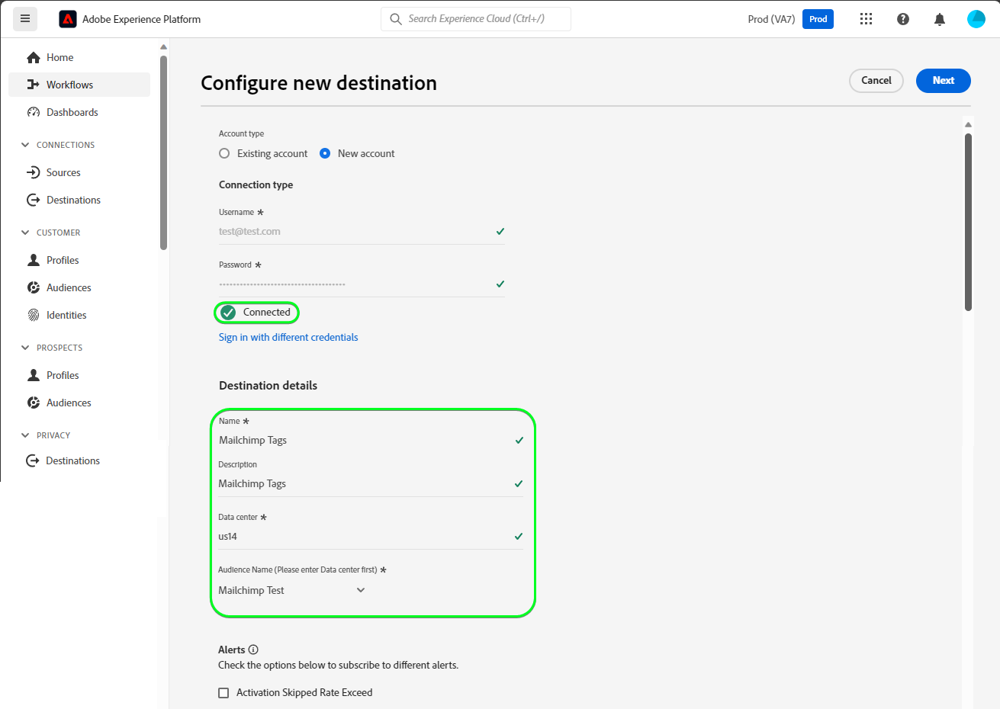

# Connessione [!DNL Mailchimp Tags]

[[!DNL Mailchimp]](https://mailchimp.com) *(noto anche come [!DNL Intuit Mailchimp])* è un popolare piattaforma di automazione del marketing e servizio di marketing via e-mail utilizzato dalle aziende per gestire e parlare con i contatti *(clienti, clienti o altre parti interessate)* utilizzando mailing list e campagne di marketing via e-mail.

[!DNL Mailchimp Tags] utilizza [tipi di pubblico](https://mailchimp.com/help/getting-started-audience/) e [tag](https://mailchimp.com/help/getting-started-tags/) per gestire le informazioni di contatto. I tag sono etichette che consentono di organizzare i contatti ed etichettarli per la categorizzazione interna in [!DNL Mailchimp].

Rispetto a [!DNL Mailchimp Interest Categories], che utilizzeresti per ordinare i tuoi contatti in base ai loro interessi e preferenze, [!DNL Mailchimp Tags] ha lo scopo di gestire gli abbonamenti ad argomenti di interesse per i tuoi contatti. *Nota: l&#39;Experience Platform dispone anche di una connessione per [!DNL Mailchimp Interest Categories]. È possibile estrarlo nella pagina [[!DNL Mailchimp Interest Categories]](/help/destinations/catalog/email-marketing/mailchimp-interest-categories.md).*

Questa [!DNL Adobe Experience Platform] [destinazione](/help/destinations/home.md) sfrutta l&#39;endpoint [[!DNL Mailchimp batch subscribe or unsubscribe API]](https://mailchimp.com/developer/marketing/api/lists/batch-subscribe-or-unsubscribe/). È possibile **aggiungere nuovi contatti** o **aggiornare i tag dei contatti [!DNL Mailchimp] esistenti** all&#39;interno di un pubblico [!DNL Mailchimp] esistente dopo averli attivati all&#39;interno di un nuovo pubblico. [!DNL Mailchimp Tags] utilizza i nomi del pubblico selezionati da Platform come nomi dei tag in [!DNL Mailchimp].

## Casi d’uso {#use-cases}

Per aiutarti a capire meglio come e quando utilizzare la destinazione [!DNL Mailchimp Tags], ecco un esempio di caso d&#39;uso che i clienti Adobe Experience Platform possono risolvere utilizzando questa destinazione.

### Invia e-mail ai contatti per campagne di marketing {#use-case-send-emails}

Il reparto vendite di un’organizzazione desidera trasmettere una campagna di marketing basata su e-mail a un elenco curato di contatti. Gli elenchi di contatti vengono ricevuti in batch da diverse origini offline e devono pertanto essere tracciati. Il team identifica un pubblico [!DNL Mailchimp] esistente e inizia a creare i tipi di pubblico Experienci Platform in cui vengono aggiunti i contatti di ogni elenco. Dopo aver inviato questi tipi di pubblico a [!DNL Mailchimp Tags], se nel pubblico [!DNL Mailchimp] selezionato non esistono contatti, questi vengono aggiunti con un tag associato che include il nome del pubblico a cui appartiene il contatto. Se esistono già contatti nel pubblico [!DNL Mailchimp], viene aggiunto un nuovo tag con il nome del pubblico. Poiché le etichette sono visibili in [!DNL Mailchimp], le origini offline sono facilmente identificabili. Dopo l&#39;invio dei dati a [!DNL Mailchimp], l&#39;e-mail della campagna di marketing viene inviata al pubblico.

## Prerequisiti {#prerequisites}

Consultare le sezioni seguenti per eventuali prerequisiti da impostare in Experience Platform e [!DNL Mailchimp] e per informazioni da raccogliere prima di utilizzare la destinazione [!DNL Mailchimp Tags].

### Prerequisiti in Experience Platform {#prerequisites-in-experience-platform}

Prima di attivare i dati nella destinazione [!DNL Mailchimp Tags], è necessario disporre di uno [schema](/help/xdm/schema/composition.md), un [set di dati](https://experienceleague.adobe.com/docs/platform-learn/tutorials/data-ingestion/create-datasets-and-ingest-data.html?lang=en) e [tipi di pubblico](https://experienceleague.adobe.com/docs/platform-learn/tutorials/audiences/create-audiences.html) creati in [!DNL Experience Platform].

### Prerequisiti per la destinazione [!DNL Mailchimp Tags] {#prerequisites-destination}

Per esportare i dati da Platform al tuo account [!DNL Mailchimp Tags], tieni presente i seguenti prerequisiti:

#### Devi avere un account [!DNL Mailchimp] {#prerequisites-account}

Prima di poter creare una destinazione [!DNL Mailchimp Tags], è necessario assicurarsi di disporre di un account [!DNL Mailchimp]. Se non ne hai già una, visita la [[!DNL Mailchimp] pagina di iscrizione](https://login.mailchimp.com/signup/) per registrarti e creare il tuo account.

#### Raccogli la chiave API [!DNL Mailchimp] {#gather-credentials}

È necessaria la [!DNL Mailchimp] **chiave API** per autenticare la destinazione [!DNL Mailchimp Interest Categories] in base all&#39;account [!DNL Mailchimp]. La **chiave API** funge da **password** quando [autentichi la destinazione](#authenticate).

Se non disponi della tua **chiave API**, accedi al tuo account [!DNL Mailchimp] e fai riferimento alla documentazione di [!DNL Mailchimp] in [come generare la tua chiave API](https://mailchimp.com/developer/marketing/guides/quick-start/#generate-your-api-key).

Esempio di chiave API: `0123456789abcdef0123456789abcde-us14`.

>[!IMPORTANT]
>
>Se generi la **chiave API**, annotala in quanto non potrai più accedervi dopo la generazione.

#### Identificare il data center [!DNL Mailchimp] {#identify-data-center}

Successivamente, è necessario identificare il data center [!DNL Mailchimp]. Per eseguire questa operazione, accedere all&#39;account [!DNL Mailchimp] e passare alla **sezione delle chiavi API** dell&#39;account.

L’ID del centro dati è la prima sezione dell’URL visualizzato nel browser. Se l&#39;URL è *https://`us14`.mailchimp.com/account/api/*, il datacenter è `us14`.

L&#39;ID del datacenter viene anche aggiunto alla chiave API nel formato *key-dc*. Ad esempio, se la chiave API è `0123456789abcdef0123456789abcde-us14`, il datacenter è `us14`.

Annotare il valore del datacenter *(`us14` in questo esempio)*. Questo valore ti sarà necessario quando [inserisci i dettagli di destinazione](#destination-details).

Per ulteriori informazioni, consulta la [[!DNL Mailchimp] documentazione di base](https://mailchimp.com/developer/marketing/docs/fundamentals/#api-structure).

### Guardrail {#guardrails}

Per informazioni dettagliate sui limiti imposti dall&#39;API [!DNL Mailchimp], vedere [!DNL Mailchimp] [limiti di tariffa](https://mailchimp.com/developer/marketing/docs/fundamentals/#api-limits).

## Identità supportate {#supported-identities}

[!DNL Mailchimp] supporta l&#39;attivazione delle identità descritte nella tabella seguente. Ulteriori informazioni su [identità](/help/identity-service/features/namespaces.md).

| Identità di destinazione | Descrizione | Considerazioni |
|---|---|---|
| E-mail | L’indirizzo e-mail del contatto. | Obbligatorio |

{style="table-layout:auto"}

## Tipi di pubblico supportati {#supported-audiences}

Questa sezione descrive il tipo di pubblico che puoi esportare in questa destinazione.

| Origine pubblico | Supportato | Descrizione |
|---------|----------|----------|
| [!DNL Segmentation Service] | ✓ | Tipi di pubblico generati tramite il servizio di segmentazione [Experience Platform](../../../segmentation/home.md). |
| Caricamenti personalizzati | ✓ | Tipi di pubblico [importati](../../../segmentation/ui/audience-portal.md#import-audience) in Experience Platform da file CSV. |

{style="table-layout:auto"}

## Tipo e frequenza di esportazione {#export-type-frequency}

Per informazioni sul tipo e sulla frequenza di esportazione della destinazione, consulta la tabella seguente.

| Elemento | Tipo | Note |
---------|----------|---------|
| Tipo di esportazione | **[!UICONTROL Basato su profilo]** | <ul><li>Stai esportando tutti i membri di un pubblico, insieme ai campi di schema desiderati *(ad esempio: indirizzo e-mail, numero di telefono, cognome)*, in base al mapping dei campi.</li><li> Per ogni pubblico selezionato in Platform, lo stato del segmento [!DNL Mailchimp Tags] corrispondente viene aggiornato con lo stato del pubblico da Platform.</li></ul> |
| Frequenza di esportazione | **[!UICONTROL Streaming]** | Le destinazioni di streaming sono connessioni &quot;sempre attive&quot; basate su API. Non appena un profilo viene aggiornato in Experience Platform in base alla valutazione del pubblico, il connettore invia l’aggiornamento a valle alla piattaforma di destinazione. Ulteriori informazioni sulle [destinazioni di streaming](/help/destinations/destination-types.md#streaming-destinations). |

{style="table-layout:auto"}

## Connettersi alla destinazione {#connect}

>[!IMPORTANT]
>
>Per connettersi alla destinazione, è necessario disporre dell&#39;autorizzazione **[!UICONTROL Gestione destinazioni]** [controllo di accesso](/help/access-control/home.md#permissions). Leggi la [panoramica sul controllo degli accessi](/help/access-control/ui/overview.md) o contatta l&#39;amministratore del prodotto per ottenere le autorizzazioni necessarie.

Per connettersi a questa destinazione, seguire i passaggi descritti nell&#39;esercitazione [sulla configurazione della destinazione](../../ui/connect-destination.md). Nel flusso di lavoro di configurazione della destinazione, compila i campi elencati nelle due sezioni seguenti.

In **[!UICONTROL Destinazioni]** > **[!UICONTROL Catalogo]**, cerca [!DNL Mailchimp Tags]. In alternativa puoi trovarlo nella categoria **[!UICONTROL E-mail marketing]**.

### Autenticarsi nella destinazione {#authenticate}

Per eseguire l&#39;autenticazione nella destinazione, compilare i campi obbligatori e selezionare **[!UICONTROL Connetti alla destinazione]**.

| Campo | Descrizione |
| --- | --- |
| **[!UICONTROL Nome utente]** | Nome utente [!DNL Mailchimp]. |
| **[!UICONTROL Password]** | La [!DNL Mailchimp] **chiave API**, annotata nella sezione [Raccogli [!DNL Mailchimp] credenziali](#gather-credentials).  La chiave API assume la forma di `{KEY}-{DC}`, dove la parte `{KEY}` fa riferimento al valore annotato nella sezione [[!DNL Mailchimp] Chiave API](#gather-credentials) e la parte `{DC}` fa riferimento al [[!DNL Mailchimp] datacenter](#identify-data-center).  È possibile fornire la porzione `{KEY}` o l&#39;intero modulo.  Ad esempio, se la chiave API è  *`0123456789abcdef0123456789abcde-us14`*,  puoi fornire *`0123456789abcdef0123456789abcde`*o *`0123456789abcdef0123456789abcde-us14`*come valore. |

{style="table-layout:auto"}

Se i dettagli forniti sono validi, nell&#39;interfaccia utente viene visualizzato lo stato **[!UICONTROL Connesso]** con un segno di spunta verde. A questo punto è possibile procedere al passaggio successivo.

### Inserire i dettagli della destinazione {#destination-details}

Per configurare i dettagli per la destinazione, compila i campi obbligatori e facoltativi seguenti. Un asterisco accanto a un campo nell’interfaccia utente indica che il campo è obbligatorio.

| Campo | Descrizione |
| --- | --- |
| **[!UICONTROL Nome]** | Un nome con cui riconoscerai questa destinazione in futuro. |
| **[!UICONTROL Descrizione]** | Una descrizione che ti aiuterà a identificare questa destinazione in futuro. |
| **[!UICONTROL Data center]** | Il tuo account [!DNL Mailchimp] `data center`. Per ulteriori informazioni, consulta la sezione [Identificare [!DNL Mailchimp] il centro dati](#identify-data-center). |
| **[!UICONTROL Nome pubblico (immettere prima il centro dati)]** | Dopo aver immesso il **[!UICONTROL centro dati]**, questo menu a discesa viene compilato automaticamente con i nomi del pubblico del tuo account [!DNL Mailchimp]. Seleziona il pubblico da aggiornare con i dati di Platform. |

{style="table-layout:auto"}

### Abilita avvisi {#enable-alerts}

Puoi abilitare gli avvisi per ricevere notifiche sullo stato del flusso di dati verso la tua destinazione. Seleziona un avviso dall’elenco per abbonarti e ricevere notifiche sullo stato del flusso di dati. Per ulteriori informazioni sugli avvisi, consulta la guida su [abbonamento a destinazioni avvisi tramite l&#39;interfaccia utente](../../ui/alerts.md).

Dopo aver fornito i dettagli per la connessione di destinazione, seleziona **[!UICONTROL Avanti]**.

## Attivare tipi di pubblico in questa destinazione {#activate}

>[!IMPORTANT]
> 
>* Per attivare i dati, è necessario **[!UICONTROL Visualizza destinazioni]**, **[!UICONTROL Attiva destinazioni]**, **[!UICONTROL Visualizza profili]** e **[!UICONTROL Visualizza segmenti]** [Autorizzazioni di controllo di accesso](/help/access-control/home.md#permissions). Leggi la [panoramica sul controllo degli accessi](/help/access-control/ui/overview.md) o contatta l&#39;amministratore del prodotto per ottenere le autorizzazioni necessarie.
>* Per esportare *identità*, è necessario disporre dell&#39;autorizzazione **[!UICONTROL Visualizza grafo identità]** [Controllo di accesso](/help/access-control/home.md#permissions).   {width="100" zoomable="yes"}

Per istruzioni sull&#39;attivazione dei tipi di pubblico in questa destinazione, leggi [Attiva tipi di pubblico in destinazioni di streaming](/help/destinations/ui/activate-segment-streaming-destinations.md).

### Considerazioni sulla mappatura ed esempio {#mapping-considerations-example}

Per inviare correttamente i dati sul pubblico da Adobe Experience Platform alla destinazione [!DNL Mailchimp Tags], è necessario eseguire il passaggio di mappatura dei campi. La mappatura consiste nella creazione di un collegamento tra i campi dello schema Experience Data Model (XDM) nell’account Platform e i corrispondenti equivalenti dalla destinazione.

Per mappare correttamente i campi XDM ai campi di destinazione [!DNL Mailchimp Tags], effettua le seguenti operazioni:

1. Nel passaggio **[!UICONTROL Mapping]**, seleziona **[!UICONTROL Aggiungi nuovo mapping]**. Viene visualizzata una nuova riga di mappatura.
1. Nella finestra **[!UICONTROL Seleziona campo di origine]**, scegli **[!UICONTROL Seleziona spazio dei nomi identità]** e seleziona lo spazio dei nomi identità `Email`.

   

1. Nella finestra **[!UICONTROL Seleziona campo di destinazione]**, scegli **[!UICONTROL Seleziona spazio dei nomi identità]** e seleziona lo spazio dei nomi identità `Email`.

   

   Le mappature tra lo schema del profilo XDM e [!DNL Mailchimp Tags] saranno le seguenti:

   | Campo origine | Campo di destinazione | Obbligatorio |
   | --- | --- | --- |
   | `IdentityMap: Email` | `Identity: Email` | Sì |

   Di seguito è riportato un esempio con le mappature completate:
   

Dopo aver fornito le mappature per la connessione di destinazione, seleziona **[!UICONTROL Avanti]**.

## Convalidare l’esportazione dei dati {#exported-data}

Per verificare di aver impostato correttamente la destinazione, segui i passaggi seguenti:

1. Accedi al tuo account [[!DNL Mailchimp]](https://login.mailchimp.com/). Quindi passa alla pagina **[!DNL Audience]** > **[!DNL All Contacts]** e controlla se i contatti del pubblico sono stati aggiunti e quelli all&#39;interno del pubblico sono stati aggiornati con il nome del pubblico.
   

## Utilizzo dei dati e governance {#data-usage-governance}

Tutte le destinazioni [!DNL Adobe Experience Platform] sono conformi ai criteri di utilizzo dei dati durante la gestione dei dati. Per informazioni dettagliate su come [!DNL Adobe Experience Platform] applica la governance dei dati, vedi [Panoramica sulla governance dei dati](/help/data-governance/home.md).

## Errori e risoluzione problemi {#errors-and-troubleshooting}

Per un elenco completo dei codici di stato e di errore con relative spiegazioni, consultare la [[!DNL Mailchimp] pagina errori](https://mailchimp.com/developer/marketing/docs/errors/).

## Risorse aggiuntive {#additional-resources}

Di seguito sono riportate ulteriori informazioni utili dalla documentazione di [!DNL Mailchimp]:
* [Guida introduttiva a [!DNL Mailchimp]](https://mailchimp.com/help/getting-started-with-mailchimp/)
* [Guida introduttiva ai tipi di pubblico](https://mailchimp.com/help/getting-started-audience/)
* [Crea un pubblico](https://mailchimp.com/help/create-audience/)
* [Guida introduttiva ai tag](https://mailchimp.com/help/getting-started-tags/)
* [API marketing](https://mailchimp.com/developer/marketing/api/)
