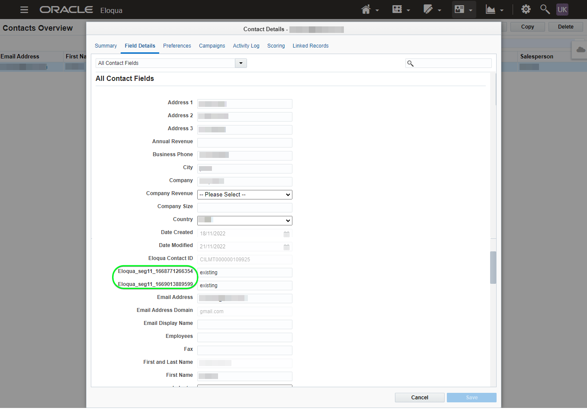
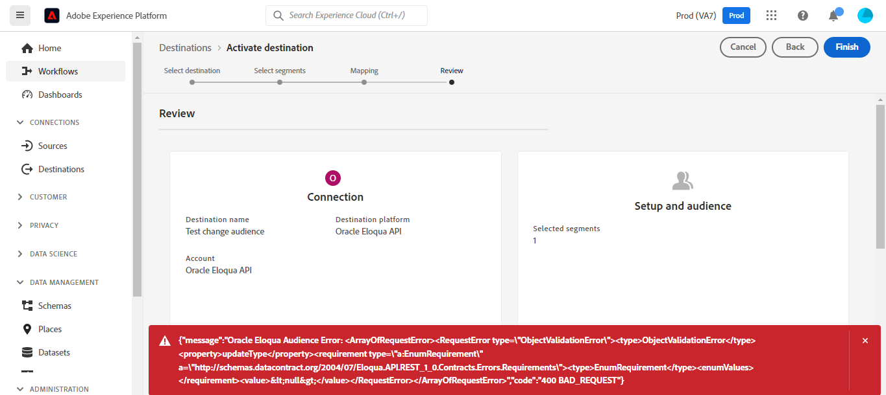

# Connessione [!DNL (API) Oracle Eloqua]

[[!DNL Oracle Eloqua]](https://www.oracle.com/cx/marketing/automation/) consente agli addetti al marketing di pianificare ed eseguire campagne offrendo al contempo ai potenziali clienti un’esperienza personalizzata. Grazie alla gestione integrata dei lead e alla facile creazione delle campagne, gli esperti di marketing possono coinvolgere il pubblico giusto al momento giusto nel percorso dell’acquirente e scalare in modo elegante, per raggiungere il pubblico su tutti i canali, comprese e-mail, ricerche per display, video e dispositivi mobili. I team di vendita possono chiudere più offerte a una velocità più elevata, aumentando il ROI del marketing attraverso approfondimenti in tempo reale.

Questo [!DNL Adobe Experience Platform] [destinazione](/help/destinations/home.md) sfrutta [Aggiornare un contatto](https://docs.oracle.com/en/cloud/saas/marketing/eloqua-rest-api/op-api-rest-1.0-data-contact-id-put.html) operazione da [!DNL Oracle Eloqua] REST API, che consente di: **aggiorna identità** all’interno di un pubblico in [!DNL Oracle Eloqua].

[!DNL Oracle Eloqua] utilizza [Autenticazione di base](https://docs.oracle.com/en/cloud/saas/marketing/eloqua-rest-api/Authentication_Basic.html) per comunicare con [!DNL Oracle Eloqua] API REST. Istruzioni per l’autenticazione [!DNL Oracle Eloqua] sono riportati di seguito, nella [Autentica nella destinazione](#authenticate) sezione.

## Casi d’uso {#use-cases}

Il reparto marketing di una piattaforma online desidera trasmettere una campagna di marketing basata su e-mail a un pubblico curato di lead. Il team marketing della piattaforma può aggiornare le informazioni sui lead esistenti tramite Adobe Experience Platform, creare tipi di pubblico dai propri dati offline e inviarli a [!DNL Oracle Eloqua], che può quindi essere utilizzato per inviare l’e-mail della campagna di marketing.

## Prerequisiti {#prerequisites}

### Experience Platform prerequisiti {#prerequisites-in-experience-platform}

Prima di attivare i dati in [!DNL Oracle Eloqua] destinazione, è necessario disporre di un [schema](/help/xdm/schema/composition.md), a [set di dati](https://experienceleague.adobe.com/docs/platform-learn/tutorials/data-ingestion/create-datasets-and-ingest-data.html?lang=it), e [segmenti](https://experienceleague.adobe.com/docs/platform-learn/tutorials/segments/create-segments.html) creato in [!DNL Experience Platform].

Consulta la documentazione dell’Experience Platform per [Gruppo di campi schema Dettagli appartenenza pubblico](/help/xdm/field-groups/profile/segmentation.md) per informazioni sugli stati del pubblico.

### [!DNL Oracle Eloqua] prerequisiti {#prerequisites-destination}

Per esportare i dati da Platform al tuo [!DNL Oracle Eloqua] account necessario disporre di un [!DNL Oracle Eloqua] account.

Inoltre, è necessario, come minimo, *&quot;Utenti avanzati - Autorizzazioni di marketing&quot;* per [!DNL Oracle Eloqua] dell&#39;istanza. Consulta la sezione *&quot;Gruppi di sicurezza&quot;* sezione sul [Accesso utente protetto](https://docs.oracle.com/en/cloud/saas/marketing/eloqua-user/Help/SecurityOverview/SecuredUserAccess.htm) per una guida. L’accesso è richiesto dalla destinazione per essere programmaticamente [determinare l’URL di base](https://docs.oracle.com/en/cloud/saas/marketing/eloqua-rest-api/DeterminingBaseURL.html) quando si richiama [!DNL Oracle Eloqua] API.

#### Raccogli [!DNL Oracle Eloqua] credenziali {#gather-credentials}

Annota gli elementi riportati di seguito prima di eseguire l’autenticazione in [!DNL Oracle Eloqua] destinazione:

| Credenziali | Descrizione |
| --- | --- |
| `Company Name` | Il nome dell&#39;azienda associata al tuo [!DNL Oracle Eloqua] account. <br>In seguito utilizzerai `Company Name` e [!DNL Oracle Eloqua] `Username` come stringa concatenata da utilizzare come **[!UICONTROL Nome utente]** quando [autenticazione nella destinazione](#authenticate). |
| `Username` | Il nome utente del [!DNL Oracle Eloqua] account. |
| `Password` | La password del tuo [!DNL Oracle Eloqua] account. |
| `Pod` | [!DNL Oracle Eloqua] supporta più data center, ciascuno con un nome di dominio univoco. [!DNL Oracle Eloqua] si riferisce a questi come &quot;pod&quot;, ci sono attualmente sette in totale - p01, p02, p03, p04, p06, p07, e p08. Per ottenere il POD in uso, accedere a [!DNL Oracle Eloqua] e annota l’URL nel browser dopo aver effettuato correttamente l’accesso. Ad esempio, se l’URL del browser è `secure.p01.eloqua.com` tuo `pod` è `p01`. Consulta la sezione [determinazione del POD](https://community.oracle.com/topliners/discussion/4470225/determining-your-pod-number-for-oracle-eloqua) per ulteriori informazioni. |

Consulta la sezione [Accesso a [!DNL Oracle Eloqua]](https://docs.oracle.com/en/cloud/saas/marketing/eloqua-user/Help/Administration/Tasks/SigningInToEloqua.htm#Signing) a titolo indicativo.

## Guardrail {#guardrails}

>[!NOTE]
>
>* [!DNL Oracle Eloqua] i campi dei contatti personalizzati vengono creati automaticamente utilizzando i nomi dei tipi di pubblico selezionati durante **[!UICONTROL Seleziona segmenti]** passaggio.

* [!DNL Oracle Eloqua] ha un limite massimo di 250 campi di contatto personalizzati.
* Prima di esportare nuovi tipi di pubblico, assicurati che il numero di tipi di pubblico di Platform e quello esistente in [!DNL Oracle Eloqua] non superi questo limite.
* Se questo limite viene superato, si verifica un errore in Experienci Platform. Questo perché il [!DNL Oracle Eloqua] L’API non riesce a convalidare la richiesta e risponde con un segno - *400: errore di convalida* - messaggio di errore che descrive il problema.
* Se hai raggiunto il limite specificato sopra, devi rimuovere le mappature esistenti dalla destinazione ed eliminare i campi dei contatti personalizzati corrispondenti nel tuo [!DNL Oracle Eloqua] prima di esportare altri segmenti.

* Consulta la sezione [[!DNL Oracle Eloqua] Creazione di campi contatto](https://docs.oracle.com/en/cloud/saas/marketing/eloqua-user/Help/ContactFields/Tasks/CreatingContactFields.htm) per informazioni sui limiti aggiuntivi.

## Identità supportate {#supported-identities}

[!DNL Oracle Eloqua] supporta l’aggiornamento delle identità descritte nella tabella seguente. Ulteriori informazioni su [identità](/help/identity-service/namespaces.md).

| Identità di destinazione | Descrizione | Obbligatorio |
|---|---|---|
| `EloquaId` | Identificatore univoco del contatto. | Sì |

## Tipo e frequenza di esportazione {#export-type-frequency}

Per informazioni sul tipo e sulla frequenza di esportazione della destinazione, consulta la tabella seguente.

| Elemento | Tipo | Note |
---------|----------|---------|
| Tipo di esportazione | **[!UICONTROL Basato su profilo]** | <ul><li>Stai esportando tutti i membri di un segmento, insieme ai campi schema desiderati *ad esempio: indirizzo e-mail, numero di telefono, cognome*, in base alla mappatura del campo.</li><li> Per ogni pubblico selezionato in Platform, la [!DNL Oracle Eloqua] Lo stato del segmento viene aggiornato con il relativo stato del pubblico da Platform.</li></ul> |
| Frequenza di esportazione | **[!UICONTROL Streaming]** | <ul><li>Le destinazioni di streaming sono connessioni &quot;sempre attive&quot; basate su API. Non appena un profilo viene aggiornato in Experienci Platform in base alla valutazione del pubblico, il connettore invia l’aggiornamento a valle alla piattaforma di destinazione. Ulteriori informazioni su [destinazioni di streaming](/help/destinations/destination-types.md#streaming-destinations).</li></ul> |

{style="table-layout:auto"}

## Connetti alla destinazione {#connect}

>[!IMPORTANT]
>
>Per connettersi alla destinazione, è necessario **[!UICONTROL Gestire le destinazioni]** [autorizzazione per il controllo degli accessi](/help/access-control/home.md#permissions). Leggi le [panoramica sul controllo degli accessi](/help/access-control/ui/overview.md) oppure contatta l’amministratore del prodotto per ottenere le autorizzazioni necessarie.

Per connettersi a questa destinazione, seguire i passaggi descritti in [esercitazione sulla configurazione della destinazione](../../ui/connect-destination.md). Nel flusso di lavoro di configurazione della destinazione, compila i campi elencati nelle due sezioni seguenti.

Entro **[!UICONTROL Destinazioni]** > **[!UICONTROL Catalogo]** cerca [!DNL (API) Oracle Eloqua]. In alternativa, è possibile posizionarlo sotto il **[!UICONTROL E-mail marketing]** categoria.

### Autentica nella destinazione {#authenticate}

>[!CONTEXTUALHELP]
>id="platform_destinations_apioracleeloqua_companyname_username"
>title="Nome società\Nome utente"
>abstract="Compila questo campo con il nome della tua società e il nome utente di Oracle Eloqua nel modulo `{COMPANY_NAME}\{USERNAME}`"

Compila i campi obbligatori di seguito. Consulta la sezione [Raccogli [!DNL Oracle Eloqua] credenziali](#gather-credentials) sezione per eventuali indicazioni.
* **[!UICONTROL Password]**: password del [!DNL Oracle Eloqua] account.
* **[!UICONTROL Nome utente]**: stringa concatenata composta da [!DNL Oracle Eloqua] Nome dell’azienda e [!DNL Oracle Eloqua] Nome utente.<br>Il valore concatenato assume la forma di `{COMPANY_NAME}\{USERNAME}`.<br> Non utilizzare parentesi graffe o spazi e conserva `\`. <br>Ad esempio, se [!DNL Oracle Eloqua] Il nome dell’azienda è `MyCompany` e [!DNL Oracle Eloqua] Il nome utente è `Username`, il valore concatenato che utilizzerai nel **[!UICONTROL Nome utente]** il campo è `MyCompany\Username`.

Per eseguire l’autenticazione nella destinazione, seleziona **[!UICONTROL Connetti alla destinazione]**.


Se i dettagli forniti sono validi, nell’interfaccia utente viene visualizzato un **[!UICONTROL Connesso]** con un segno di spunta verde. A questo punto è possibile procedere al passaggio successivo.

### Inserisci i dettagli della destinazione {#destination-details}

>[!CONTEXTUALHELP]
>id="platform_destinations_apioracleeloqua_pod"
>title="Pod"
>abstract="Per trovare il numero del tuo pod, accedi a Oracle Eloqua. Osserva l’URL nel browser dopo aver effettuato correttamente l’accesso. "
>additional-url="https://support.oracle.com/knowledge/Oracle%20Cloud/2307176_1.html" text="Oracle Knowledge Base: trova il tuo numero di pod"

Per configurare i dettagli per la destinazione, compila i campi obbligatori e facoltativi seguenti. Un asterisco accanto a un campo nell’interfaccia utente indica che il campo è obbligatorio.


* **[!UICONTROL Nome]**: nome con cui riconoscerai questa destinazione in futuro.
* **[!UICONTROL Descrizione]**: descrizione che ti aiuterà a identificare questa destinazione in futuro.
* **[!UICONTROL Pod]**: per ottenere quale `pod` sei attivo, accedi a [!DNL Oracle Eloqua] e annota l’URL nel browser dopo aver effettuato correttamente l’accesso. Ad esempio, se l’URL del browser è `secure.p01.eloqua.com` il `pod` il valore da selezionare è `p01`. Consulta la sezione [Raccogli [!DNL Oracle Eloqua] credenziali](#gather-credentials) sezione per ulteriori indicazioni.

### Abilita avvisi {#enable-alerts}

Puoi abilitare gli avvisi per ricevere notifiche sullo stato del flusso di dati verso la tua destinazione. Seleziona un avviso dall’elenco per abbonarti e ricevere notifiche sullo stato del flusso di dati. Per ulteriori informazioni sugli avvisi, consulta la guida su [abbonamento agli avvisi sulle destinazioni tramite l’interfaccia utente](../../ui/alerts.md).

Una volta completate le informazioni sulla connessione di destinazione, seleziona **[!UICONTROL Successivo]**.

## Attiva il pubblico in questa destinazione {#activate}

>[!IMPORTANT]
> 
>* Per attivare i dati, è necessario **[!UICONTROL Gestire le destinazioni]**, **[!UICONTROL Attivare le destinazioni]**, **[!UICONTROL Visualizza profili]**, e **[!UICONTROL Visualizzare segmenti]** [autorizzazioni di controllo degli accessi](/help/access-control/home.md#permissions). Leggi le [panoramica sul controllo degli accessi](/help/access-control/ui/overview.md) oppure contatta l’amministratore del prodotto per ottenere le autorizzazioni necessarie.
>* Per esportare *identità*, è necessario **[!UICONTROL Visualizza grafico delle identità]** [autorizzazione per il controllo degli accessi](/help/access-control/home.md#permissions). <br> {width="100" zoomable="yes"}

Letto [Attiva profili e tipi di pubblico nelle destinazioni di esportazione del pubblico in streaming](/help/destinations/ui/activate-segment-streaming-destinations.md) per istruzioni sull’attivazione dei tipi di pubblico in questa destinazione.

### Considerazioni sulla mappatura ed esempio {#mapping-considerations-example}

Per inviare correttamente i dati sul pubblico da Adobe Experience Platform a [!DNL Oracle Eloqua] destinazione, devi passare attraverso il passaggio di mappatura dei campi. La mappatura consiste nella creazione di un collegamento tra i campi dello schema Experience Data Model (XDM) nell’account Platform e i corrispondenti equivalenti dalla destinazione.

Per mappare i campi XDM su [!DNL Oracle Eloqua] campi di destinazione, effettua le seguenti operazioni:

1. In **[!UICONTROL Mappatura]** passaggio, seleziona **[!UICONTROL Aggiungi nuova mappatura]**. Viene visualizzata una nuova riga di mappatura.
1. In **[!UICONTROL Seleziona campo di origine]** finestra, scegli la **[!UICONTROL Seleziona attributi]** e selezionare l&#39;attributo XDM o scegliere il **[!UICONTROL Seleziona lo spazio dei nomi dell’identità]** e seleziona un’identità.
1. In **[!UICONTROL Seleziona campo di destinazione]** finestra, scegli **[!UICONTROL Seleziona lo spazio dei nomi dell’identità]** e seleziona un’identità, oppure scegli **[!UICONTROL Seleziona attributi personalizzati]** e digita il nome dell’attributo desiderato nella **[!UICONTROL Nome attributo]** campo. Il nome attributo fornito deve corrispondere a un attributo contatto esistente in [!DNL Oracle Eloqua]. Consulta [[!DNL create a contact]](https://docs.oracle.com/en/cloud/saas/marketing/eloqua-rest-api/op-api-rest-1.0-data-contact-post.html) per i nomi di attributo esatti che è possibile utilizzare in [!DNL Oracle Eloqua].
   * Ripeti questi passaggi per aggiungere le mappature di attributi richieste e desiderate tra lo schema di profilo XDM e [!DNL Oracle Eloqua]: | Campo di origine | Campo di destinazione | Obbligatorio | |—|—|—| |`IdentityMap: Eid`|`Identity: EloquaId`| Sì | |`xdm: personalEmail.address`|`Attribute: emailAddress`| Sì | |`xdm: personName.firstName`|`Attribute: firstName`| | |`xdm: personName.lastName`|`Attribute: lastName`| | |`xdm: workAddress.street1`|`Attribute: address1`| | |`xdm: workAddress.street2`|`Attribute: address2`| | |`xdm: workAddress.street3`|`Attribute: address3`| | |`xdm: workAddress.postalCode`|`Attribute: postalCode`| | |`xdm: workAddress.country`|`Attribute: country`| | |`xdm: workAddress.city`|`Attribute: city`| |

   * Di seguito è riportato un esempio con le mappature di cui sopra:
     

>[!IMPORTANT]
>
>* Attributi specificati in **[!UICONTROL Campo di destinazione]** deve essere denominato esattamente come specificato nella [[!DNL Create a contact]](https://docs.oracle.com/en/cloud/saas/marketing/eloqua-rest-api/op-api-rest-1.0-data-contact-post.html) poiché questi attributi formeranno il corpo della richiesta.
>* Attributi specificati in **[!UICONTROL Campo di origine]** non seguire tali restrizioni. Puoi mapparlo in base alle tue esigenze, ma se il formato dei dati non è corretto quando viene inviato a [!DNL Oracle Eloqua] si verificherà un errore. Ad esempio, puoi mappare il **[!UICONTROL Campo di origine]** spazio dei nomi delle identità `contact key`, `ABC ID` ecc. a **[!UICONTROL Campo di destinazione]** : `EloquaId` dopo aver verificato che i valori ID corrispondano al formato accettato da [!DNL Oracle Eloqua].
>* Il `EloquaID` la mappatura è obbligatoria per aggiornare gli attributi corrispondenti all’identità.
>* Il `emailAddress` è richiesta la mappatura. Senza di esso, l’API genera un errore come mostrato di seguito:
>
>```json
>{
>     "type":"ObjectValidationError",
>     "container":{
>           "type":"ObjectKey",
>           "objectType":"Contact"
>     },
>     "property":"emailAddress",
>     "requirement":{
>           "type":"EmailAddressRequirement"
>     },
>     "value":"<null>"
>}
>```

Una volta completate le mappature per la connessione di destinazione, seleziona **[!UICONTROL Successivo]**.

>[!NOTE]
>
>La destinazione aggiunge automaticamente un identificatore univoco ai nomi del pubblico selezionato a ogni esecuzione durante l’invio delle informazioni del campo del contatto a [!DNL Oracle Eloqua]. In questo modo i nomi dei campi contatto corrispondenti ai nomi del pubblico non si sovrappongono. Consulta la sezione [Convalidare l’esportazione dei dati](#exported-data) esempio di schermata di sezione di un [!DNL Oracle Eloqua] Pagina Dettagli contatto con il campo contatto personalizzato creato utilizzando i nomi del pubblico.

## Convalidare l’esportazione dei dati {#exported-data}

Per verificare di aver impostato correttamente la destinazione, segui i passaggi seguenti:

1. Seleziona **[!UICONTROL Destinazioni]** > **[!UICONTROL Sfoglia]** e passa all’elenco delle destinazioni.
1. Quindi, seleziona la destinazione e passa al **[!UICONTROL Dati di attivazione]** , quindi seleziona un nome per il pubblico.
   

1. Controlla il riepilogo del pubblico e assicurati che il conteggio dei profili corrisponda al conteggio all’interno del segmento.
   

1. Accedi a [!DNL Oracle Eloqua] , quindi passare al **[!UICONTROL Panoramica dei contatti]** per verificare se i profili del pubblico sono stati aggiunti. Per visualizzare lo stato del pubblico, approfondisci in **[!UICONTROL Dettagli contatto]** e verificare se è stato creato il campo contatto con il nome del pubblico selezionato come prefisso.



## Utilizzo dei dati e governance {#data-usage-governance}

Tutti [!DNL Adobe Experience Platform] le destinazioni sono conformi ai criteri di utilizzo dei dati durante la gestione dei dati. Per informazioni dettagliate su come [!DNL Adobe Experience Platform] applica la governance dei dati, consulta la sezione [Panoramica sulla governance dei dati](/help/data-governance/home.md).

## Errori e risoluzione problemi {#errors-and-troubleshooting}

Quando crei la destinazione, potresti ricevere uno dei seguenti messaggi di errore: `400: There was a validation error` o `400 BAD_REQUEST`. Ciò si verifica quando si supera il limite di 250 campi contatto personalizzati, come descritto in [guardrail](#guardrails) sezione. Per risolvere questo errore, assicurati di non superare il limite del campo contatto personalizzato in [!DNL Oracle Eloqua].


Consulta la sezione [[!DNL Oracle Eloqua] Codici di stato HTTP](https://docs.oracle.com/en/cloud/saas/marketing/eloqua-rest-api/APIRequests_HTTPStatusCodes.html) e [[!DNL Oracle Eloqua] Errori di convalida](https://docs.oracle.com/en/cloud/saas/marketing/eloqua-rest-api/APIRequests_HTTPValidationErrors.html) pagine per un elenco completo di codici di stato e di errore con spiegazioni.

## Risorse aggiuntive {#additional-resources}

Per ulteriori dettagli, vedi [!DNL Oracle Eloqua] documentazione:

* [Oracle di automazione del marketing Eloqua](https://docs.oracle.com/en/cloud/saas/marketing/eloqua.html)
* [API REST, ad Oracle Eloqua Marketing Cloud Service](https://docs.oracle.com/en/cloud/saas/marketing/eloqua-rest-api/rest-endpoints.html)

### Changelog

Questa sezione acquisisce le funzionalità e i significativi aggiornamenti alla documentazione apportati al connettore di destinazione.

+++ Visualizza changelog

| Mese di rilascio | Tipo di aggiornamento | Descrizione |
|---|---|---|
| Aprile 2023 | Aggiornamento della documentazione | <ul><li>Abbiamo aggiornato il [casi d’uso](#use-cases) sezione con un esempio più chiaro di quando i clienti trarrebbero vantaggio dall’utilizzo di questa destinazione.</li> <li>Abbiamo aggiornato il [mappatura](#mapping-considerations-example) sezione con chiari esempi di mappature obbligatorie e facoltative.</li> <li>Abbiamo aggiornato il [Connetti alla destinazione](#connect) sezione con un esempio su come creare il valore concatenato per il **[!UICONTROL Nome utente]** campo utilizzando [!DNL Oracle Eloqua] Nome dell’azienda e [!DNL Oracle Eloqua] Nome utente. (PLATIR-28343)</li><li>Abbiamo aggiornato il [Raccogli [!DNL Oracle Eloqua] credenziali](#gather-credentials) e [Inserisci i dettagli della destinazione](#destination-details) sezioni con istruzioni su [!DNL Oracle Eloqua] **[!UICONTROL Pod]** selezione. Il *&quot;Pod&quot;* viene utilizzato dalla destinazione per creare l’URL di base per le chiamate API. Il [[!DNL Oracle Eloqua] prerequisiti](#prerequisites-destination) è stata aggiornata anche con indicazioni sull’assegnazione *&quot;Utenti avanzati - Autorizzazioni di marketing&quot;* come obbligatorio *&quot;Gruppi di sicurezza&quot;* per [!DNL Oracle Eloqua] dell&#39;istanza.</li></ul> |
| Marzo 2023 | Versione iniziale | Versione di destinazione iniziale e pubblicazione della documentazione. |

{style="table-layout:auto"}

+++