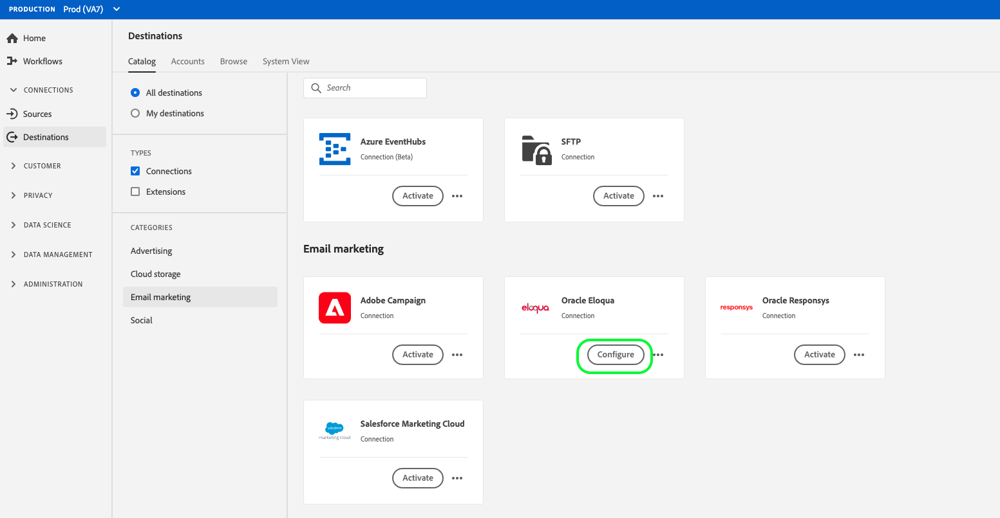

# [!DNL Oracle Eloqua] connection

[[!DNL Oracle Eloqua]](https://www.oracle.com/cx/marketing/automation/) è una piattaforma software as a service (SaaS) per l&#39;automazione del marketing offerta da  [!DNL Oracle] che ha lo scopo di aiutare gli esperti di marketing e le organizzazioni B2B a gestire le campagne di marketing e la generazione di lead di vendita.

Per inviare i dati dei segmenti a [!DNL Oracle Eloqua], è necessario prima [collegare la destinazione](#connect-destination) in Adobe Experience Platform, quindi [impostare un&#39;importazione di dati](#import-data-into-eloqua) dal percorso di archiviazione in [!DNL Oracle Eloqua].

## Tipo di esportazione {#export-type}

**Basato su profilo** : stai esportando tutti i membri di un segmento, insieme ai campi dello schema desiderati (ad esempio: indirizzo e-mail, numero di telefono, cognome), come scelto dalla schermata seleziona attributi del flusso di lavoro [ di attivazione della ](../../ui/activate-destinations.md#select-attributes)destinazione.

## ELENCO CONSENTITI di indirizzi IP {#allow-list}

Quando si impostano le destinazioni di marketing e-mail con l’archiviazione SFTP, Adobe consiglia di aggiungere determinati intervalli IP al proprio elenco consentiti.

Per aggiungere IP di Adobe al tuo elenco consentiti, fai riferimento all’ [elenco consentiti di indirizzi IP per le destinazioni di archiviazione cloud](../cloud-storage/ip-address-allow-list.md) .

## Connetti alla destinazione {#connect-destination}

In **[!UICONTROL Connessioni]** > **[!UICONTROL Destinazioni]**, seleziona [!DNL Oracle Eloqua], quindi seleziona **[!UICONTROL Configura]**.

>[!NOTE]
>
>Se esiste già una connessione con questa destinazione, è possibile visualizzare un pulsante **[!UICONTROL Attiva]** sulla scheda di destinazione. Per ulteriori informazioni sulla differenza tra [!UICONTROL Attiva] e [!UICONTROL Configura], consulta la sezione [Catalogo](../../ui/destinations-workspace.md#catalog) della documentazione dell&#39;area di lavoro di destinazione.

Nel passaggio **[!UICONTROL Account]**, se in precedenza era stata impostata una connessione alla destinazione di archiviazione cloud, selezionare **[!UICONTROL Account esistente]** e selezionare una delle connessioni esistenti. In alternativa, è possibile selezionare **[!UICONTROL Nuovo account]** per impostare una nuova connessione. Inserisci le credenziali di autenticazione del tuo account e seleziona **[!UICONTROL Connetti a destinazione]**. Per [!DNL Oracle Eloqua], puoi scegliere tra **[!UICONTROL SFTP con password]** e **[!UICONTROL SFTP con chiave SSH]**.

Compila le informazioni seguenti, a seconda del tipo di connessione, e seleziona **[!UICONTROL Connetti a destinazione]**.

- Per le connessioni **[!UICONTROL SFTP con password]**, è necessario fornire [!UICONTROL Dominio], [!UICONTROL Porta], [!UICONTROL Nome utente] e [!UICONTROL Password].
- Per le connessioni **[!UICONTROL SFTP con chiave SSH]**, è necessario fornire [!UICONTROL Dominio], [!UICONTROL Porta], [!UICONTROL Nome utente] e [!UICONTROL Chiave SSH].

Facoltativamente, puoi allegare la tua chiave pubblica in formato RSA per aggiungere la crittografia con PGP/GPG ai file esportati nella sezione **[!UICONTROL Chiave]** . La chiave pubblica deve essere scritta come stringa codificata [!DNL Base64].

Nel passaggio **[!UICONTROL Autenticazione]**, compila le informazioni rilevanti per la tua destinazione come mostrato di seguito:
- **[!UICONTROL Nome]**: Scegli un nome appropriato per la destinazione.
- **[!UICONTROL Descrizione]**: Inserisci una descrizione per la destinazione.
- **[!UICONTROL Percorso]** cartella: Fornisci il percorso nel percorso di archiviazione in cui Platform depositerà i dati di esportazione come file CSV o delimitati da tabulazioni.
- **[!UICONTROL Formato]** file:  **** CSVo  **TAB_DELIMITTED**. Selezionare il formato di file da esportare nel percorso di archiviazione.
- **[!UICONTROL Azioni]** di marketing: Le azioni di marketing indicano l’intento per il quale i dati verranno esportati nella destinazione. Puoi scegliere tra azioni di marketing definite da Adobi o creare una tua azione di marketing. Per ulteriori informazioni sulle azioni di marketing, consulta la [Panoramica sui criteri di utilizzo dei dati](../../../data-governance/policies/overview.md).

<!--

Commenting out Amazon S3 bucket part for now until support is clarified

- **[!UICONTROL Bucket name]**: Your Amazon S3 bucket, where Platform will deposit the data export. Your input must be between 3 and 63 characters long. Must begin and end with a letter or number. Must contain only lowercase letters, numbers, or hyphens ( - ). Must not be formatted as an IP address (for example, 192.100.1.1).

-->

Fai clic su **[!UICONTROL Crea destinazione]** dopo aver compilato i campi sopra riportati. La destinazione viene ora creata ed è possibile [attivare segmenti](../../ui/activate-destinations.md) alla destinazione.

## Attiva segmenti {#activate-segments}

Per informazioni sul flusso di lavoro di attivazione dei segmenti, consulta [Attivare profili e segmenti su una destinazione](../../ui/activate-destinations.md) .

## Attributi di destinazione {#destination-attributes}

Quando si attivano [i segmenti](../../ui/activate-destinations.md) alla destinazione [!DNL Oracle Eloqua], l&#39;Adobe consiglia di selezionare un identificatore univoco dal proprio [schema di unione](../../../profile/home.md#profile-fragments-and-union-schemas). Seleziona l’identificatore univoco e tutti gli altri campi XDM da esportare nella destinazione. Per ulteriori informazioni, consulta [Selezionare i campi dello schema da utilizzare come attributi di destinazione nei file esportati](./overview.md#destination-attributes).

## Dati esportati {#exported-data}

Per le destinazioni [!DNL Oracle Eloqua], Platform crea un file `.csv` delimitato da tabulazioni nel percorso di archiviazione fornito. Per ulteriori informazioni sui file, consulta [Destinazioni di e-mail marketing e destinazioni di archiviazione Cloud](../../ui/activate-destinations.md#esp-and-cloud-storage) nell’esercitazione sull’attivazione dei segmenti.

## Imposta l’importazione di dati in [!DNL Oracle Eloqua] {#import-data-into-eloqua}

Dopo aver collegato [!DNL Platform] allo storage [!DNL SFTP], è necessario impostare l&#39;importazione dei dati dal percorso di archiviazione in [!DNL Oracle Eloqua]. Per informazioni su come eseguire questa operazione, consulta [Importazione di contatti o account](https://docs.oracle.com/cloud/latest/marketingcs_gs/OMCAA/Help/DataImportExport/Tasks/ImportingContactsOrAccounts.htm) in [!DNL Oracle Eloqua Help Center].
