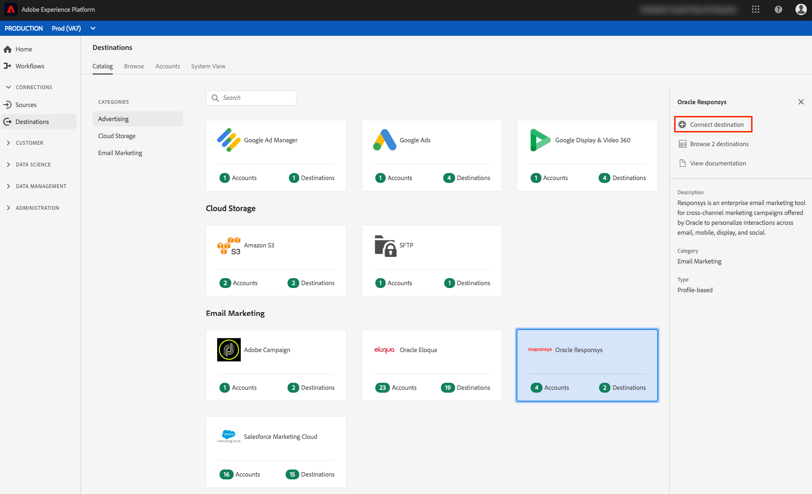
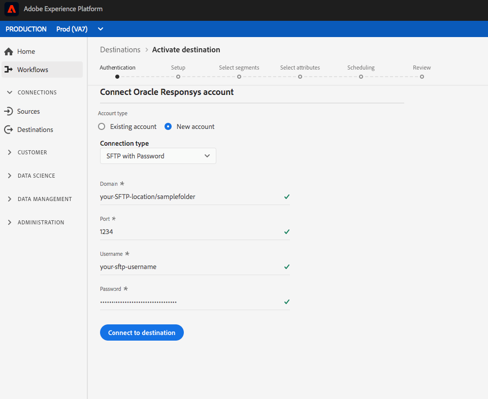

# [!DNL Oracle Responsys] connection

## Panoramica {#overview}

 Responsysis uno strumento di marketing e-mail aziendale per campagne di marketing cross-channel offerte da  [!DNL Oracle] per personalizzare le interazioni tra e-mail, dispositivi mobili, visualizzazioni e social.

Per inviare i dati dei segmenti a [!DNL Oracle Responsys], è necessario prima [connettersi alla destinazione](#connect-destination) in Adobe Experience Platform, quindi [impostare un&#39;importazione di dati](#import-data-into-responsys) dal percorso di archiviazione in [!DNL Oracle Responsys].

## Tipo di esportazione {#export-type}

**Basato su profilo** : stai esportando tutti i membri di un segmento, insieme ai campi dello schema desiderati (ad esempio: indirizzo e-mail, numero di telefono, cognome), come scelto dalla schermata seleziona attributi del flusso di lavoro [ di attivazione della ](../../ui/activate-destinations.md#select-attributes)destinazione.

## Collegare la destinazione {#connect-destination}

In **[!UICONTROL Connections]** > **[!UICONTROL Destinations]**, selezionare [!DNL Oracle Responsys], quindi selezionare **[!UICONTROL Connect destination]**.

Nel passaggio **[!UICONTROL Authentication]**, se in precedenza hai impostato una connessione alla destinazione di archiviazione cloud, seleziona **[!UICONTROL Existing Account]** e seleziona una delle connessioni esistenti. In alternativa, è possibile selezionare **[!UICONTROL New Account]** per impostare una nuova connessione. Immetti le credenziali di autenticazione del tuo account e seleziona **[!UICONTROL Connect to destination]**. Per [!DNL Oracle Responsys], puoi selezionare tra **[!UICONTROL SFTP with Password]** e **[!UICONTROL SFTP with SSH Key]**. Compila le informazioni seguenti, a seconda del tipo di connessione, e seleziona **[!UICONTROL Connect to destination]**.

Per le connessioni **[!UICONTROL SFTP with Password]**, è necessario specificare Dominio, Porta, Nome utente e Password.

Per le connessioni **[!UICONTROL SFTP with SSH Key]**, è necessario specificare Dominio, Porta, Nome utente e Chiave SSH.

Nel passaggio **[!UICONTROL Setup]** , compila le informazioni rilevanti per la tua destinazione come mostrato di seguito:
- **[!UICONTROL Name]**: Scegli un nome appropriato per la destinazione.
- **[!UICONTROL Description]**: Inserisci una descrizione per la destinazione.
- **[!UICONTROL Bucket name]**: Il tuo bucket Amazon S3, dove Platform depositerà l’esportazione dei dati. La lunghezza dell’input deve essere compresa tra 3 e 63 caratteri. Deve iniziare e terminare con una lettera o un numero. Deve contenere solo lettere minuscole, numeri o trattini ( - ). Non deve essere formattato come indirizzo IP (ad esempio, 192.100.1.1).
- **[!UICONTROL Folder Path]**: Fornisci il percorso nel percorso di archiviazione in cui Platform depositerà i dati di esportazione come file CSV o delimitati da tabulazioni.
- **[!UICONTROL File Format]**:  **** CSVo  **TAB_DELIMITTED**. Selezionare il formato di file da esportare nel percorso di archiviazione.
- **[!UICONTROL Marketing actions]**: Le azioni di marketing indicano l’intento per il quale i dati verranno esportati nella destinazione. Puoi scegliere tra azioni di marketing definite da Adobi o creare una tua azione di marketing. Per ulteriori informazioni sulle azioni di marketing, consulta la pagina [Governance dei dati in Adobe Experience Platform](../../../data-governance/policies/overview.md) . Per informazioni sulle singole azioni di marketing definite da Adobe, consulta la [Panoramica sui criteri di utilizzo dei dati](../../../data-governance/policies/overview.md).

Fai clic su **[!UICONTROL Create destination]** dopo aver compilato i campi sopra riportati. La destinazione è ora connessa ed è possibile [attivare segmenti](../../ui/activate-destinations.md) alla destinazione.

## Attiva segmenti {#activate-segments}

Per informazioni sul flusso di lavoro di attivazione dei segmenti, consulta [Attivare profili e segmenti su una destinazione](../../ui/activate-destinations.md) .

## Attributi di destinazione {#destination-attributes}

Quando si attivano [i segmenti](../../ui/activate-destinations.md) alla destinazione [!DNL Oracle Responsys], è consigliabile selezionare un identificatore univoco dal [schema di unione](../../../profile/home.md#profile-fragments-and-union-schemas). Seleziona l’identificatore univoco e tutti gli altri campi XDM da esportare nella destinazione. Per ulteriori informazioni, consulta [Selezionare i campi dello schema da utilizzare come attributi di destinazione nei file esportati](./overview.md#destination-attributes) in E-mail Marketing Destinations.

## Dati esportati {#exported-data}

Per le destinazioni [!DNL Oracle Responsys], Platform crea un file `.txt` o `.csv` delimitato da tabulazioni nel percorso di archiviazione fornito. Per ulteriori informazioni sui file, consulta [Destinazioni di e-mail marketing e destinazioni di archiviazione Cloud](../../ui/activate-destinations.md#esp-and-cloud-storage) nell’esercitazione sull’attivazione dei segmenti.

## Imposta l’importazione di dati in [!DNL Oracle Responsys] {#import-data-into-responsys}

Dopo aver collegato Platform all’archivio [!DNL Amazon S3] o SFTP, è necessario impostare l’importazione dei dati dal percorso di archiviazione in [!DNL Oracle Responsys]. Per informazioni su come eseguire questa operazione, consulta [Importazione di contatti o account](https://docs.oracle.com/cloud/latest/marketingcs_gs/OMCEA/Connect_WizardUpload.htm) in [!DNL Oracle Responsys Help Center].