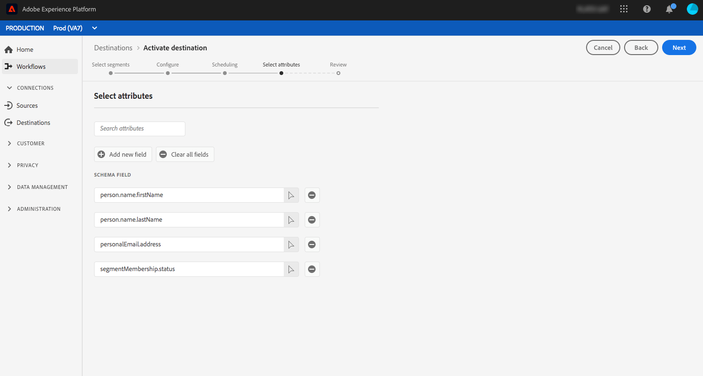

# Destinazioni di marketing e-mail {#email-marketing-destinations}

I provider di servizi e-mail (ESP) consentono di gestire le attività di marketing relative alle e-mail, ad esempio l&#39;invio di campagne e-mail promozionali. Adobe Experience Platform si integra con ESP consentendo di attivare i segmenti nelle destinazioni di e-mail marketing.

Per inviare i segmenti alle destinazioni di marketing e-mail per le campagne, la piattaforma deve prima connettersi alla destinazione.

La connessione alle destinazioni di marketing tramite e-mail è un processo in tre fasi. Ciascuno dei passaggi è descritto più avanti in questa pagina.

Nel flusso di destinazione di connessione, descritto nella sezione seguente, collegatevi a  Amazon S3 o SFTP. La piattaforma esporta i segmenti come file `.csv` o `.txt` e li distribuisce nella posizione desiderata. Pianificare l&#39;importazione dei dati nella piattaforma di e-mail marketing dalla posizione di archiviazione abilitata in Piattaforma. Il processo di importazione dei dati varia a seconda del partner. Per ulteriori informazioni, consulta gli articoli delle singole destinazioni.

## Configurare la destinazione {#connect-destination}

In **[!UICONTROL Connections]** > **[!UICONTROL Destinations]**, seleziona la destinazione di marketing e-mail a cui vuoi connetterti, quindi seleziona **[!UICONTROL Configure]**.

Nel passaggio **[!UICONTROL Authentication]**, se in precedenza avete impostato una connessione alla destinazione di marketing delle e-mail, selezionate **[!UICONTROL Existing Account]** e selezionate la connessione esistente. In alternativa, potete selezionare **[!UICONTROL New Account]** per impostare una nuova connessione alla destinazione di e-mail marketing. Nel selettore **[!UICONTROL Connection type]**, potete scegliere tra  Amazon S3, SFTP con password o SFTP con chiave SSH. Compila le informazioni riportate di seguito, a seconda del tipo di connessione, quindi seleziona **[!UICONTROL Connect]**.

- Per le **connessioni S3**, è necessario fornire il proprio ID chiave di accesso Amazon  e la chiave di accesso segreta.
- Per le connessioni **SFTP con password**, è necessario fornire Dominio, Porta, Nome utente e Password per il server SFTP.
- Per le connessioni **SFTP con chiave SSH**, è necessario fornire Domain, Port, Username e Chiave SSH per il server SFTP.

Facoltativamente, puoi allegare la chiave pubblica in formato RSA per aggiungere la crittografia ai file esportati nella sezione **[!UICONTROL Key]**. Questa chiave pubblica **deve essere scritta come una stringa codificata Base64.**

Nel passaggio **[!UICONTROL Setup]**, immettete un nome e una descrizione per la nuova destinazione, nonché il formato del file per i file esportati.

Se nel passaggio precedente avete selezionato &#39;opzione di archiviazione Amazon S3, inserite il nome del bucket e il percorso della cartella nella destinazione di archiviazione cloud in cui verranno inviati i file. Per l&#39;opzione di memorizzazione SFTP, inserite il percorso della cartella in cui verranno inviati i file.

Inoltre in questo passaggio, puoi selezionare qualsiasi caso di utilizzo marketing da applicare a questa destinazione. I casi di utilizzo del marketing indicano l&#39;intento per il quale i dati verranno esportati nella destinazione. Puoi scegliere tra  casi di utilizzo di marketing definiti dal Adobe o creare un caso di utilizzo di marketing personale. Per ulteriori informazioni sui casi di utilizzo del marketing, vedere la [panoramica dei criteri di utilizzo dei dati](../../../data-governance/policies/overview.md).

## Selezionare i membri del segmento da includere nelle esportazioni di destinazione {#select-segments}

Nella pagina **[!UICONTROL Select Segments]**, seleziona i segmenti da inviare alla destinazione. Per ulteriori informazioni sui campi, consulta le sezioni seguenti.

## Configurare i nomi dei file

Per informazioni sulla pianificazione del segmento e sulle opzioni di modifica del nome del file, fare riferimento al passaggio [Configura](../../ui/activate-destinations.md#configure) nell&#39;esercitazione sulle destinazioni di attivazione.

## Selezionare gli attributi - Selezionare i campi dello schema da utilizzare come attributi di destinazione nei file esportati {#destination-attributes}

In questo passaggio, stai selezionando quali campi esportare per le destinazioni di marketing tramite e-mail, oltre a indicare quali campi sono obbligatori.

Per ulteriori informazioni su questo passaggio, fare riferimento al passaggio [Seleziona attributi](../../ui/activate-destinations.md#select-attributes) nell&#39;esercitazione di attivazione delle destinazioni.

### Identità {#identity}

È consigliabile selezionare un identificatore univoco dal [schema unione](../../../profile/home.md#profile-fragments-and-union-schemas). Questo è il campo di cui vengono cancellate le identità degli utenti. Nella maggior parte dei casi, questo campo è l&#39;indirizzo e-mail, ma può anche essere un ID programma fedeltà o un numero di telefono. Vedere la tabella seguente per gli identificatori univoci più comuni e il relativo campo XDM nello schema.

| Identificatore univoco | Campo XDM nello schema unificato |
----------------- | ---------------------------
| Indirizzo e-mail | `personalEmail.address` |
| Telefono | `mobilePhone.number` |
| ID programma fedeltà | `Customer-defined XDM field` |

### Altri attributi di destinazione

Nel selettore del campo Schema, scegliete gli altri campi da esportare nella destinazione e-mail. Alcune opzioni consigliate sono:

| Schema | Campo XDM |
------ | ---------
| Nome | `person.name.firstName` |
| Cognome | `person.name.lastName` |
| Telefono | `mobilePhone.number` |
| Indirizzo | `homeAddress.city` |
| Stato indirizzo | `homeAddress.stateProvince` |
| Indirizzo Codice postale | `homeAddress.postalCode` |
| Compleanno | `person.birthDayAndMonth` |
| Appartenenza al segmento | `segmentMembership.status` |

## Importa dati dalla posizione di archiviazione nella destinazione

Consulta i singoli articoli di destinazione marketing e-mail per informazioni su come importare dati dalla posizione di archiviazione nelle destinazioni:

- [Adobe Campaign](./adobe-campaign.md#import-data-into-campaign)
- [ Oracle Eloqua](./oracle-eloqua.md#import-data-into-eloqua)
- [ Oracle Responsys](./oracle-responsys.md#import-data-into-responsys)
- [Marketing Cloud Salesforce](./salesforce-marketing-cloud.md#import-data-into-salesforce)

## Attivare i segmenti nelle destinazioni di e-mail marketing

Per istruzioni su come attivare i segmenti nelle destinazioni di marketing tramite e-mail, vedi [Activate Data to Destinations](../../ui/activate-destinations.md) (Attiva dati sulle destinazioni).

## Risorse aggiuntive

- [Attivare i dati per le destinazioni](../../ui/activate-destinations.md)
- [Creare le destinazioni di marketing e attivare i dati tramite l&#39;API del servizio di flusso](../../api/email-marketing.md)