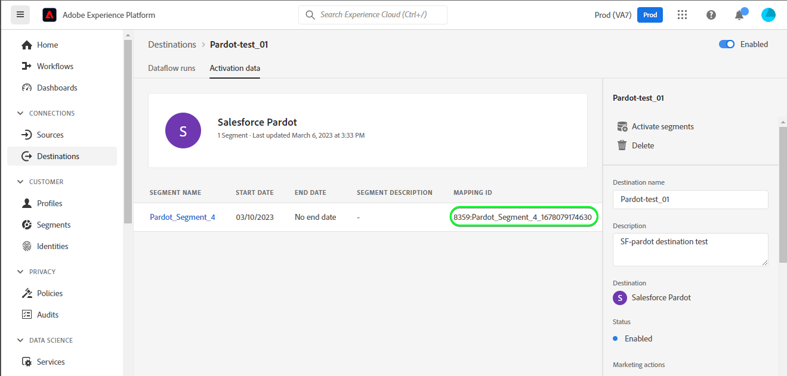

# [!DNL Salesforce Marketing Cloud Account Engagement] connessione

Utilizza il [[!DNL Salesforce Marketing Cloud Account Engagement]](https://www.salesforce.com/products/marketing-cloud/marketing-automation/) *(precedentemente noto come [!DNL Pardot])* destinazione per acquisire, tracciare, valutare e valutare i lead. Puoi anche progettare tracce di lead per tutte le fasi della pipeline per tipi di pubblico di mercato e gruppi di clienti mirati tramite campagne e-mail drip e gestione dei lead con sviluppo, valutazione e segmentazione delle campagne.

Confrontato con [!DNL Salesforce Marketing Cloud Engagement] che è più orientato verso **B2C** marketing, [!DNL Marketing Cloud Account Engagement] è ideale per **B2B** casi d’uso che coinvolgono più dipartimenti e decision maker e che richiedono cicli di vendita e decisionali più lunghi. Inoltre, mantieni anche una maggiore vicinanza e integrazione con il tuo CRM per prendere le decisioni di vendita e marketing appropriate. *Nota: Experience Platform dispone anche di connessioni per [!DNL Salesforce Marketing Cloud Engagement], puoi controllarli sulla [[!DNL Salesforce Marketing Cloud]](/help/destinations/catalog/email-marketing/salesforce-marketing-cloud.md) e [[!DNL (API) Salesforce Marketing Cloud]](/help/destinations/catalog/email-marketing/salesforce-marketing-cloud-exact-target.md) pagine.*

Questo [!DNL Adobe Experience Platform] [destinazione](/help/destinations/home.md) sfrutta [[!DNL Salesforce Account Engagement API > Prospect Upsert by Email]](https://developer.salesforce.com/docs/marketing/pardot/guide/prospect-v5.html#prospect-upsert-by-email) endpoint, a **aggiungere o aggiornare i lead** dopo averli attivati in un nuovo [!DNL Marketing Cloud Account Engagement] segmento.

[!DNL Marketing Cloud Account Engagement] utilizza il protocollo OAuth 2 con codice di autorizzazione per l’autenticazione in [!DNL Account Engagement] API. Istruzioni per l’autenticazione [!DNL Marketing Cloud Account Engagement] sono riportati di seguito, nella [Autentica nella destinazione](#authenticate) sezione.

## Casi d’uso {#use-cases}

Per aiutarti a capire meglio come e quando utilizzare il [!DNL Marketing Cloud Account Engagement] destinazione: ecco un caso d’uso di esempio che i clienti di Adobe Experience Platform possono risolvere utilizzando questa destinazione.

### Invia e-mail ai contatti per campagne di marketing {#use-case-send-emails}

Il reparto marketing di una piattaforma online desidera trasmettere una campagna di marketing basata su e-mail a un pubblico curato di lead B2B. Il team marketing della piattaforma può aggiungere nuovi lead o aggiornare informazioni sui lead esistenti tramite Adobe Experience Platform, creare tipi di pubblico dai propri dati offline e inviarli a [!DNL Marketing Cloud Account Engagement], che può quindi essere utilizzato per inviare l’e-mail della campagna di marketing.

## Prerequisiti {#prerequisites}

Consulta le sezioni seguenti per eventuali prerequisiti da impostare in Experience Platform e [!DNL Salesforce] e per le informazioni da raccogliere prima di lavorare con [!DNL Marketing Cloud Account Engagement] destinazione.

### Prerequisiti in Experience Platform {#prerequisites-in-experience-platform}

Prima di attivare i dati in [!DNL Marketing Cloud Account Engagement] destinazione, è necessario disporre di un [schema](/help/xdm/schema/composition.md), a [set di dati](https://experienceleague.adobe.com/docs/platform-learn/tutorials/data-ingestion/create-datasets-and-ingest-data.html?lang=en), e [segmenti](https://experienceleague.adobe.com/docs/platform-learn/tutorials/segments/create-segments.html?lang=en) creato in [!DNL Experience Platform].

### Prerequisiti in [!DNL Marketing Cloud Account Engagement] {#prerequisites-destination}

Prendi nota dei seguenti prerequisiti per esportare i dati da Platform al [!DNL Marketing Cloud Account Engagement] account:

#### Devi avere un [!DNL Marketing Cloud Account Engagement] account {#prerequisites-account}

A [!DNL Marketing Cloud Account Engagement] account con un abbonamento a [Coinvolgimento account Marketing Cloud](https://www.salesforce.com/products/marketing-cloud/marketing-automation/) prodotto è obbligatorio per procedere.

Il tuo [!DNL Salesforce] l&#39;account deve avere [!DNL Salesforce] `Account Engagement Administrator role`. Questo è necessario per [creare campi prospect personalizzati](https://help.salesforce.com/s/articleView?id=sf.pardot_fields_create_custom_field.htm&amp;type=5).

Infine, il tuo account dovrebbe anche essere in grado di accedere al [[!DNL Account Engagement Lightning App]](https://help.salesforce.com/s/articleView?id=sf.pardot_lightning_enable.htm&amp;type=5).

Contatta in [[!DNL Salesforce] Supporto](https://www.salesforce.com/company/contact-us/?d=cta-glob-footer-10) o [!DNL Salesforce] amministratore dell&#39;account se non si dispone di un account o se l&#39;account non dispone di [!DNL Marketing Cloud Account Engagement] abbonamento o [!DNL Account Engagement Administrator role].

#### Raccogli [!DNL Marketing Cloud Account Engagement] credenziali {#gather-credentials}

Annota gli elementi riportati di seguito prima di eseguire l’autenticazione in [!DNL Marketing Cloud Account Engagement] destinazione.

| Credenziali | Descrizione |
| --- | --- |
| `Username` | Il tuo [!DNL Marketing Cloud Account Engagement] nome utente dell’account. |
| `Password` | Il tuo [!DNL Marketing Cloud Account Engagement] password dell&#39;account. |
| `Account Engagement Business Unit ID` | Per trovare l&#39;ID Business Unit di Account Engagement, utilizza Configurazione in [!DNL Salesforce]. Dalla configurazione, immetti *Configurazione Business Unit* nella casella Ricerca rapida. L&#39;ID Business Unit di coinvolgimento dell&#39;account inizia con `0Uv` ed è lungo 18 caratteri. Se non è possibile accedere alle informazioni di configurazione della Business Unit, rivolgersi al [!DNL Salesforce] L&#39;amministratore dell&#39;account ti fornirà `Account Engagement Business Unit ID`. Se hai bisogno di ulteriori informazioni, consulta [[!DNL Salesforce] Autenticazione](https://developer.salesforce.com/docs/marketing/pardot/guide/authentication) pagina delle linee guida. |

{style="table-layout:auto"}

### Guardrail {#guardrails}

Consulta la sezione [!DNL Marketing Cloud Account Engagement] [limiti di tariffa](https://developer.salesforce.com/docs/marketing/pardot/guide/overview.html#rate-limits) che specifica i limiti imposti dal piano e si applicherebbe anche alle esecuzioni di Experienci Platform.

>[!IMPORTANT]
>
>Se il [!DNL Salesforce] l’amministratore dell’account ha limitato l’accesso agli intervalli IP attendibili, è necessario contattarli per ottenere [IP EXPERIENCE PLATFORM](/help/destinations/catalog/streaming/ip-address-allow-list.md) inserito nell&#39;elenco Consentiti. Consulta la sezione [!DNL Salesforce] [Limitare l&#39;accesso agli intervalli IP attendibili per un&#39;app connessa](https://help.salesforce.com/s/articleView?id=sf.connected_app_edit_ip_ranges.htm&amp;type=5) se hai bisogno di ulteriore assistenza.

## Identità supportate {#supported-identities}

[!DNL Marketing Cloud Account Engagement] supporta l’attivazione delle identità descritte nella tabella seguente. Ulteriori informazioni su [identità](/help/identity-service/namespaces.md).

| Identità di destinazione | Descrizione | Considerazioni |
|---|---|---|
| E-mail | Indirizzo e-mail del potenziale cliente | Obbligatorio |

{style="table-layout:auto"}

## Tipo e frequenza di esportazione {#export-type-frequency}

Per informazioni sul tipo e sulla frequenza di esportazione della destinazione, consulta la tabella seguente.

| Elemento | Tipo | Note |
---------|----------|---------|
| Tipo di esportazione | **[!UICONTROL Basato su profilo]** | <ul><li>Stai esportando tutti i membri di un segmento, insieme ai campi schema desiderati *ad esempio: indirizzo e-mail, numero di telefono, cognome*, in base alla mappatura del campo.</li><li> Per ogni pubblico selezionato in Platform, la [!DNL Salesforce Marketing Cloud Account Engagement] Lo stato del segmento viene aggiornato con il relativo stato del pubblico da Platform.</li></ul> |
| Frequenza di esportazione | **[!UICONTROL Streaming]** | Le destinazioni di streaming sono connessioni &quot;sempre attive&quot; basate su API. Non appena un profilo viene aggiornato in Experience Platform in base alla valutazione del pubblico, il connettore invia l’aggiornamento a valle alla piattaforma di destinazione. Ulteriori informazioni su [destinazioni di streaming](/help/destinations/destination-types.md#streaming-destinations). |

{style="table-layout:auto"}

## Connetti alla destinazione {#connect}

>[!IMPORTANT]
>
>Per connettersi alla destinazione, è necessario **[!UICONTROL Gestire le destinazioni]** [autorizzazione per il controllo degli accessi](/help/access-control/home.md#permissions). Leggi le [panoramica sul controllo degli accessi](/help/access-control/ui/overview.md) oppure contatta l’amministratore del prodotto per ottenere le autorizzazioni necessarie.

Per connettersi a questa destinazione, seguire i passaggi descritti in [esercitazione sulla configurazione della destinazione](../../ui/connect-destination.md). Nel flusso di lavoro di configurazione della destinazione, compila i campi elencati nelle due sezioni seguenti.

Entro **[!UICONTROL Destinazioni]** > **[!UICONTROL Catalogo]**, cerca [!DNL Salesforce Marketing Cloud Account Engagement]. In alternativa, è possibile posizionarlo sotto il **[!UICONTROL E-mail marketing]** categoria.

### Autentica nella destinazione {#authenticate}

Per eseguire l’autenticazione nella destinazione, seleziona **[!UICONTROL Connetti alla destinazione]**. Passerai alla [!DNL Salesforce] pagina di accesso. Immetti il [!DNL Marketing Cloud Account Engagement] credenziali dell’account e seleziona [!DNL Log In].

Quindi, seleziona [!UICONTROL Consenti] nella finestra successiva per assegnare le autorizzazioni **Adobe Experience Platform** per accedere al tuo [!DNL Salesforce Marketing Cloud Account Engagement] account. *Questa operazione deve essere eseguita una sola volta*.

Se i dettagli forniti sono validi, nell’interfaccia utente viene visualizzato un messaggio: *Connessione all&#39;account Salesforce Marketing Cloud Account Engagement riuscita* messaggio e un **[!UICONTROL Connesso]** con un segno di spunta verde, puoi quindi procedere al passaggio successivo.

### Inserisci i dettagli della destinazione {#destination-details}

Per configurare i dettagli per la destinazione, compila i campi obbligatori e facoltativi seguenti. Un asterisco accanto a un campo nell’interfaccia utente indica che il campo è obbligatorio. Consulta la sezione [Raccogli [!DNL Marketing Cloud Account Engagement] credenziali](#gather-credentials) sezione per eventuali indicazioni.

| Campo | Descrizione |
| --- | --- |
| **[!UICONTROL Nome]** | Un nome con cui riconoscerai questa destinazione in futuro. |
| **[!UICONTROL Descrizione]** | Una descrizione che ti aiuterà a identificare questa destinazione in futuro. |
| **[!UICONTROL ID Business Unit di coinvolgimento dell&#39;account]** | Il [!DNL Salesforce] `Account Engagement Business Unit ID`. |

{style="table-layout:auto"}

### Abilita avvisi {#enable-alerts}

Puoi abilitare gli avvisi per ricevere notifiche sullo stato del flusso di dati verso la tua destinazione. Seleziona un avviso dall’elenco per abbonarti e ricevere notifiche sullo stato del flusso di dati. Per ulteriori informazioni sugli avvisi, consulta la guida su [abbonamento agli avvisi sulle destinazioni tramite l’interfaccia utente](../../ui/alerts.md).

Una volta completate le informazioni sulla connessione di destinazione, seleziona **[!UICONTROL Successivo]**.

## Attiva il pubblico in questa destinazione {#activate}

>[!IMPORTANT]
>
>Per attivare i dati, è necessario **[!UICONTROL Gestire le destinazioni]**, **[!UICONTROL Attivare le destinazioni]**, **[!UICONTROL Visualizza profili]**, e **[!UICONTROL Visualizzare segmenti]** [autorizzazioni di controllo degli accessi](/help/access-control/home.md#permissions). Leggi le [panoramica sul controllo degli accessi](/help/access-control/ui/overview.md) oppure contatta l’amministratore del prodotto per ottenere le autorizzazioni necessarie.

Letto [Attiva profili e tipi di pubblico nelle destinazioni di esportazione del pubblico in streaming](/help/destinations/ui/activate-segment-streaming-destinations.md) per istruzioni sull’attivazione dei tipi di pubblico in questa destinazione.

### Considerazioni sulla mappatura ed esempio {#mapping-considerations-example}

Per inviare correttamente i dati sul pubblico da Adobe Experience Platform a [!DNL Marketing Cloud Account Engagement] destinazione, devi passare attraverso il passaggio di mappatura dei campi. La mappatura consiste nella creazione di un collegamento tra i campi dello schema Experience Data Model (XDM) nell’account Platform e i corrispondenti equivalenti dalla destinazione.

Per mappare correttamente i campi XDM su [!DNL Marketing Cloud Account Engagement] campi di destinazione, segui i passaggi indicati di seguito.

1. In **[!UICONTROL Mappatura]** passaggio, seleziona **[!UICONTROL Aggiungi nuova mappatura]**. Viene visualizzata una nuova riga di mappatura.
1. In **[!UICONTROL Seleziona campo di origine]** finestra, scegli la **[!UICONTROL Seleziona attributi]** e selezionare l&#39;attributo XDM o scegliere il **[!UICONTROL Seleziona lo spazio dei nomi dell’identità]** e seleziona un’identità.
1. In **[!UICONTROL Seleziona campo di destinazione]** finestra, scegli la **[!UICONTROL Seleziona lo spazio dei nomi dell’identità]** e seleziona un’identità o scegli **[!UICONTROL Seleziona attributi personalizzati]** categoria e specificare dall&#39;elenco di [[!DNL Prospect API fields]](https://developer.salesforce.com/docs/marketing/pardot/guide/prospect-v5.html#fields) dallo schema disponibile.

   * Ripeti questi passaggi per aggiungere qualsiasi mappatura tra lo schema del profilo XDM e [!DNL Marketing Cloud Account Engagement]: | Campo di origine | Campo di destinazione | Obbligatorio | | — | — | — | |`IdentityMap: Email`|`Identity: email`| Sì | |`xdm: MailingAddress.city`|`xdm: city`| | |`xdm: person.name.firstName`|`Attribute: firstName`| |

   * Di seguito è riportato un esempio con le mappature di cui sopra:
     

Una volta completate le mappature per la connessione di destinazione, seleziona **[!UICONTROL Successivo]**.

## Convalidare l’esportazione dei dati {#exported-data}

Per verificare di aver impostato correttamente la destinazione, segui i passaggi seguenti:

1. Passa a uno dei tipi di pubblico selezionati. Seleziona la scheda **[!DNL Activation data]**. Il **[!UICONTROL ID mappatura]** nella colonna viene visualizzato il nome del campo personalizzato generato all&#39;interno del [!DNL Marketing Cloud Account Engagement Prospects] pagina.
   

1. Accedi a [[!DNL Salesforce]](https://login.salesforce.com/) sito Web. Quindi vai al **[!DNL Account Engagement]** > **[!DNL Prospects]** > **[!DNL Pardot Prospects]** e verificare se i potenziali clienti del pubblico sono stati aggiunti o aggiornati. In alternativa, puoi anche accedere a [[!DNL Salesforce Pardot]](https://pi.pardot.com/) e accedere al **[!DNL Prospects]** pagina.
   

1. Per verificare se i potenziali clienti sono stati aggiornati, seleziona un potenziale cliente e verifica se il campo del potenziale cliente personalizzato è stato aggiornato con lo stato di pubblico Experience Platform.
   

## Utilizzo dei dati e governance {#data-usage-governance}

Tutti [!DNL Adobe Experience Platform] le destinazioni sono conformi ai criteri di utilizzo dei dati durante la gestione dei dati. Per informazioni dettagliate su come [!DNL Adobe Experience Platform] applica la governance dei dati, consulta la sezione [Panoramica sulla governance dei dati](/help/data-governance/home.md).

## Risorse aggiuntive {#additional-resources}

* [!DNL Marketing Cloud Account Engagement] [Documentazione API](https://developer.salesforce.com/docs/marketing/pardot/guide/overview.html).
