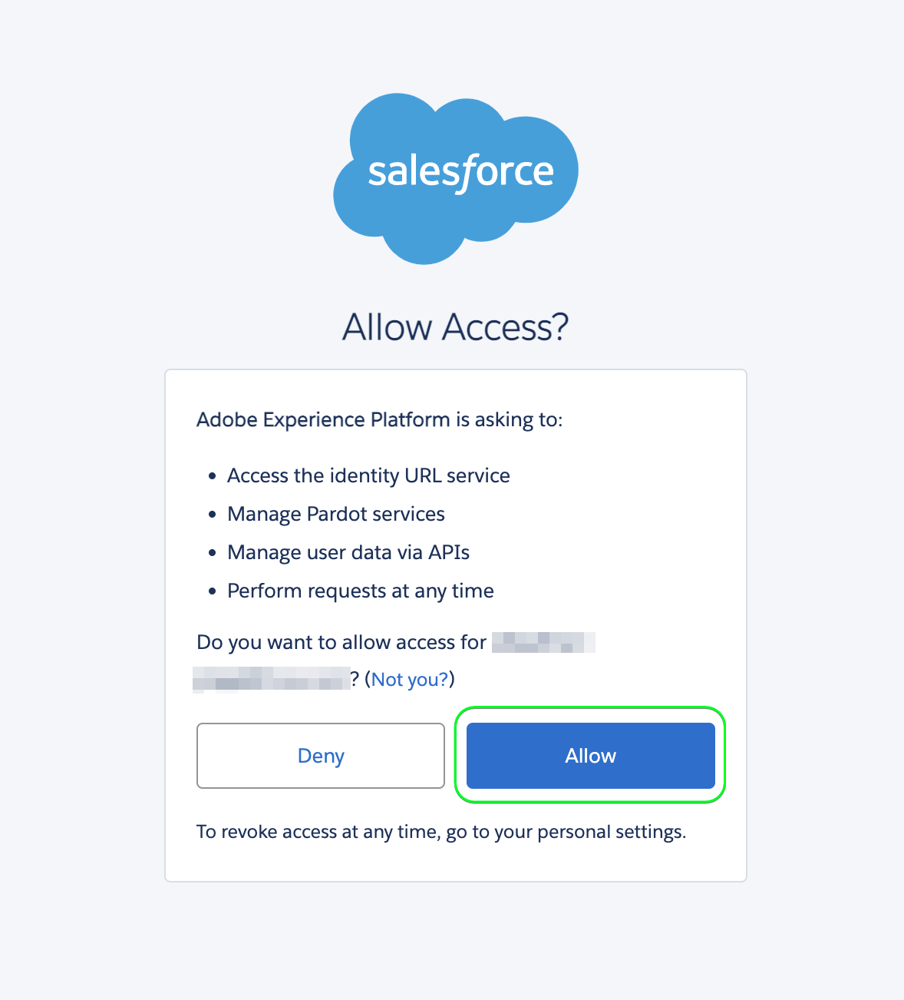
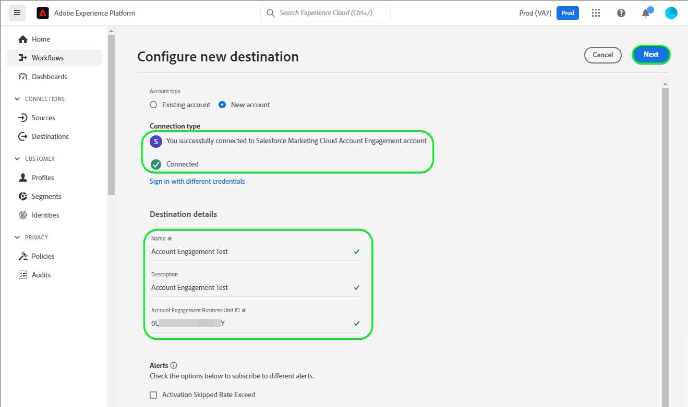

# Connessione [!DNL Salesforce Marketing Cloud Account Engagement]

Utilizza la destinazione [[!DNL Salesforce Marketing Cloud Account Engagement]](https://www.salesforce.com/products/marketing-cloud/marketing-automation/) *(precedentemente nota come [!DNL Pardot])* per acquisire, tenere traccia, valutare e valutare i lead. Puoi anche progettare tracce di lead per tutte le fasi della pipeline per tipi di pubblico di mercato e gruppi di clienti mirati tramite campagne e-mail drip e gestione dei lead con sviluppo, valutazione e segmentazione delle campagne.

Rispetto a [!DNL Salesforce Marketing Cloud Engagement], che è più orientato al marketing **B2C**, [!DNL Marketing Cloud Account Engagement] è ideale per i casi di utilizzo **B2B** che coinvolgono più dipartimenti e responsabili decisionali e che richiedono cicli di vendita e decisionali più lunghi. Inoltre, mantieni anche una maggiore vicinanza e integrazione con il tuo CRM per prendere le decisioni di vendita e marketing appropriate. *Nota: l&#39;Experience Platform dispone anche di connessioni per [!DNL Salesforce Marketing Cloud Engagement]. È possibile controllarle nelle pagine [[!DNL Salesforce Marketing Cloud]](/help/destinations/catalog/email-marketing/salesforce-marketing-cloud.md) e [[!DNL (API) Salesforce Marketing Cloud]](/help/destinations/catalog/email-marketing/salesforce-marketing-cloud-exact-target.md).*

Questa [!DNL Adobe Experience Platform] [destinazione](/help/destinations/home.md) sfrutta l&#39;endpoint [[!DNL Salesforce Account Engagement API > Prospect Upsert by Email]](https://developer.salesforce.com/docs/marketing/pardot/guide/prospect-v5.html#prospect-upsert-by-email) per **aggiungere o aggiornare i lead** dopo averli attivati in un nuovo segmento [!DNL Marketing Cloud Account Engagement].

[!DNL Marketing Cloud Account Engagement] utilizza il protocollo OAuth 2 con codice di autorizzazione per l&#39;autenticazione nell&#39;API [!DNL Account Engagement]. Le istruzioni per l&#39;autenticazione nell&#39;istanza [!DNL Marketing Cloud Account Engagement] sono riportate di seguito, nella sezione [Autentica nella destinazione](#authenticate).

## Casi d’uso {#use-cases}

Per aiutarti a capire meglio come e quando utilizzare la destinazione [!DNL Marketing Cloud Account Engagement], ecco un esempio di caso d&#39;uso che i clienti Adobe Experience Platform possono risolvere utilizzando questa destinazione.

### Invia e-mail ai contatti per campagne di marketing {#use-case-send-emails}

Il reparto marketing di una piattaforma online desidera trasmettere una campagna di marketing basata su e-mail a un pubblico curato di lead B2B. Il team marketing della piattaforma può aggiungere nuovi lead o aggiornare le informazioni sui lead esistenti tramite Adobe Experience Platform, creare tipi di pubblico dai propri dati offline e inviare tali tipi di pubblico a [!DNL Marketing Cloud Account Engagement], che può quindi essere utilizzato per inviare l&#39;e-mail della campagna di marketing.

## Prerequisiti {#prerequisites}

Consultare le sezioni seguenti per eventuali prerequisiti da impostare in Experience Platform e [!DNL Salesforce] e per informazioni da raccogliere prima di utilizzare la destinazione [!DNL Marketing Cloud Account Engagement].

### Prerequisiti in Experience Platform {#prerequisites-in-experience-platform}

Prima di attivare i dati nella destinazione [!DNL Marketing Cloud Account Engagement], è necessario disporre di uno [schema](/help/xdm/schema/composition.md), un [set di dati](https://experienceleague.adobe.com/docs/platform-learn/tutorials/data-ingestion/create-datasets-and-ingest-data.html) e [segmenti](https://experienceleague.adobe.com/docs/platform-learn/tutorials/segments/create-segments.html) creati in [!DNL Experience Platform].

### Prerequisiti in [!DNL Marketing Cloud Account Engagement] {#prerequisites-destination}

Per esportare i dati da Platform al tuo account [!DNL Marketing Cloud Account Engagement], tieni presente i seguenti prerequisiti:

#### Devi avere un account [!DNL Marketing Cloud Account Engagement] {#prerequisites-account}

Per continuare è obbligatorio un account [!DNL Marketing Cloud Account Engagement] con una sottoscrizione al prodotto [Marketing Cloud Account Engagement](https://www.salesforce.com/products/marketing-cloud/marketing-automation/).

L&#39;account [!DNL Salesforce] deve avere [!DNL Salesforce] `Account Engagement Administrator role`. È necessario per [creare campi prospect personalizzati](https://help.salesforce.com/s/articleView?id=sf.pardot_fields_create_custom_field.htm&amp;type=5).

Infine, il tuo account dovrebbe anche essere in grado di accedere a [[!DNL Account Engagement Lightning App]](https://help.salesforce.com/s/articleView?id=sf.pardot_lightning_enable.htm&amp;type=5).

Rivolgiti al [[!DNL Salesforce] Supporto](https://www.salesforce.com/company/contact-us/?d=cta-glob-footer-10) o all&#39;amministratore dell&#39;account [!DNL Salesforce] se non disponi di un account o se nell&#39;account manca l&#39;abbonamento [!DNL Marketing Cloud Account Engagement] o [!DNL Account Engagement Administrator role].

#### Raccogli [!DNL Marketing Cloud Account Engagement] credenziali {#gather-credentials}

Annotare gli elementi riportati di seguito prima di eseguire l&#39;autenticazione nella destinazione [!DNL Marketing Cloud Account Engagement].

| Credenziali | Descrizione |
| --- | --- |
| `Username` | Nome utente dell&#39;account [!DNL Marketing Cloud Account Engagement]. |
| `Password` | Password dell&#39;account [!DNL Marketing Cloud Account Engagement]. |
| `Account Engagement Business Unit ID` | Per trovare l&#39;ID Business Unit di Account Engagement, utilizzare Configurazione in [!DNL Salesforce]. In Configurazione, immettere *Configurazione unità aziendale* nella casella Ricerca rapida. L&#39;ID Business Unit di coinvolgimento dell&#39;account inizia con `0Uv` e contiene 18 caratteri. Se non riesci ad accedere alle informazioni di configurazione della Business Unit, chiedi all&#39;amministratore dell&#39;account [!DNL Salesforce] di fornirti `Account Engagement Business Unit ID`. Se hai bisogno di ulteriori indicazioni, consulta la pagina delle linee guida di [[!DNL Salesforce] Autenticazione](https://developer.salesforce.com/docs/marketing/pardot/guide/authentication). |

{style="table-layout:auto"}

### Guardrail {#guardrails}

Consulta i [!DNL Marketing Cloud Account Engagement] [limiti di tasso](https://developer.salesforce.com/docs/marketing/pardot/guide/overview.html#rate-limits) che descrivono i limiti imposti dal piano e che si applicano anche alle esecuzioni degli Experienci Platform.

>[!IMPORTANT]
>
>Se l&#39;amministratore dell&#39;account [!DNL Salesforce] ha limitato l&#39;accesso agli intervalli IP attendibili, è necessario contattarli per inserire nell&#39;elenco Consentiti [IP Experienci Platform](/help/destinations/catalog/streaming/ip-address-allow-list.md). Se hai bisogno di ulteriori indicazioni, consulta la documentazione [!DNL Salesforce] [Limita l&#39;accesso agli intervalli IP attendibili per un&#39;app connessa](https://help.salesforce.com/s/articleView?id=sf.connected_app_edit_ip_ranges.htm&amp;type=5).

## Identità supportate {#supported-identities}

[!DNL Marketing Cloud Account Engagement] supporta l&#39;attivazione delle identità descritte nella tabella seguente. Ulteriori informazioni su [identità](/help/identity-service/features/namespaces.md).

| Identità di destinazione | Descrizione | Considerazioni |
|---|---|---|
| E-mail | Indirizzo e-mail del potenziale cliente | Obbligatorio |

{style="table-layout:auto"}

## Tipo e frequenza di esportazione {#export-type-frequency}

Per informazioni sul tipo e sulla frequenza di esportazione della destinazione, consulta la tabella seguente.

| Elemento | Tipo | Note |
---------|----------|---------|
| Tipo di esportazione | **[!UICONTROL Basato su profilo]** | <ul><li>Stai esportando tutti i membri di un segmento, insieme ai campi dello schema desiderati *(ad esempio: indirizzo e-mail, numero di telefono, cognome)*, in base al mapping dei campi.</li><li> Per ogni pubblico selezionato in Platform, lo stato del segmento [!DNL Salesforce Marketing Cloud Account Engagement] corrispondente viene aggiornato da Platform in base allo stato del pubblico.</li></ul> |
| Frequenza di esportazione | **[!UICONTROL Streaming]** | Le destinazioni di streaming sono connessioni &quot;sempre attive&quot; basate su API. Non appena un profilo viene aggiornato in Experience Platform in base alla valutazione del pubblico, il connettore invia l’aggiornamento a valle alla piattaforma di destinazione. Ulteriori informazioni sulle [destinazioni di streaming](/help/destinations/destination-types.md#streaming-destinations). |

{style="table-layout:auto"}

## Connettersi alla destinazione {#connect}

>[!IMPORTANT]
>
>Per connettersi alla destinazione, sono necessarie le **[!UICONTROL Destinazioni visualizzazione]** e le **[!UICONTROL Autorizzazioni di gestione delle destinazioni]** [per il controllo degli accessi](/help/access-control/home.md#permissions). Leggi la [panoramica sul controllo degli accessi](/help/access-control/ui/overview.md) o contatta l&#39;amministratore del prodotto per ottenere le autorizzazioni necessarie.

Per connettersi a questa destinazione, seguire i passaggi descritti nell&#39;esercitazione [sulla configurazione della destinazione](../../ui/connect-destination.md). Nel flusso di lavoro di configurazione della destinazione, compila i campi elencati nelle due sezioni seguenti.

In **[!UICONTROL Destinazioni]** > **[!UICONTROL Catalogo]**, cerca [!DNL Salesforce Marketing Cloud Account Engagement]. In alternativa puoi trovarlo nella categoria **[!UICONTROL E-mail marketing]**.

### Autenticarsi nella destinazione {#authenticate}

Per eseguire l&#39;autenticazione nella destinazione, selezionare **[!UICONTROL Connetti alla destinazione]**. Si passerà alla pagina di accesso [!DNL Salesforce]. Immettere le credenziali dell&#39;account [!DNL Marketing Cloud Account Engagement] e selezionare [!DNL Log In].

Selezionare [!UICONTROL Consenti] nella finestra successiva per concedere le autorizzazioni all&#39;app **Adobe Experience Platform** per accedere al tuo account [!DNL Salesforce Marketing Cloud Account Engagement]. *Sarà necessario eseguire questa operazione una sola volta*.

Se i dettagli forniti sono validi, nell&#39;interfaccia utente viene visualizzato un messaggio: *Sei connesso correttamente al messaggio dell&#39;account di Marketing Cloud Salesforce* e uno stato **[!UICONTROL Connesso]** con un segno di spunta verde, puoi quindi procedere al passaggio successivo.

### Inserire i dettagli della destinazione {#destination-details}

Per configurare i dettagli per la destinazione, compila i campi obbligatori e facoltativi seguenti. Un asterisco accanto a un campo nell’interfaccia utente indica che il campo è obbligatorio. Per ulteriori informazioni, consulta la sezione [Raccogli [!DNL Marketing Cloud Account Engagement] credenziali](#gather-credentials).

| Campo | Descrizione |
| --- | --- |
| **[!UICONTROL Nome]** | Un nome con cui riconoscerai questa destinazione in futuro. |
| **[!UICONTROL Descrizione]** | Una descrizione che ti aiuterà a identificare questa destinazione in futuro. |
| **[!UICONTROL ID Business Unit di coinvolgimento account]** | [!DNL Salesforce] `Account Engagement Business Unit ID`. |

{style="table-layout:auto"}

### Abilita avvisi {#enable-alerts}

Puoi abilitare gli avvisi per ricevere notifiche sullo stato del flusso di dati verso la tua destinazione. Seleziona un avviso dall’elenco per abbonarti e ricevere notifiche sullo stato del flusso di dati. Per ulteriori informazioni sugli avvisi, consulta la guida su [abbonamento a destinazioni avvisi tramite l&#39;interfaccia utente](../../ui/alerts.md).

Dopo aver fornito i dettagli per la connessione di destinazione, seleziona **[!UICONTROL Avanti]**.

## Attivare tipi di pubblico in questa destinazione {#activate}

>[!IMPORTANT]
> 
>* Per attivare i dati, è necessario **[!UICONTROL Visualizza destinazioni]**, **[!UICONTROL Attiva destinazioni]**, **[!UICONTROL Visualizza profili]** e **[!UICONTROL Visualizza segmenti]** [Autorizzazioni di controllo di accesso](/help/access-control/home.md#permissions). Leggi la [panoramica sul controllo degli accessi](/help/access-control/ui/overview.md) o contatta l&#39;amministratore del prodotto per ottenere le autorizzazioni necessarie.
>* Per esportare *identità*, è necessario disporre dell&#39;autorizzazione **[!UICONTROL Visualizza grafo identità]** [Controllo di accesso](/help/access-control/home.md#permissions).   {width="100" zoomable="yes"}

Leggi [Attivare profili e tipi di pubblico nelle destinazioni di esportazione del pubblico di streaming](/help/destinations/ui/activate-segment-streaming-destinations.md) per le istruzioni sull&#39;attivazione dei tipi di pubblico in questa destinazione.

### Considerazioni sulla mappatura ed esempio {#mapping-considerations-example}

Per inviare correttamente i dati sul pubblico da Adobe Experience Platform alla destinazione [!DNL Marketing Cloud Account Engagement], è necessario eseguire il passaggio di mappatura dei campi. La mappatura consiste nella creazione di un collegamento tra i campi dello schema Experience Data Model (XDM) nell’account Platform e i corrispondenti equivalenti dalla destinazione.

Per mappare correttamente i campi XDM ai campi di destinazione [!DNL Marketing Cloud Account Engagement], effettua le seguenti operazioni.

1. Nel passaggio **[!UICONTROL Mapping]**, seleziona **[!UICONTROL Aggiungi nuovo mapping]**. Viene visualizzata una nuova riga di mappatura.
1. Nella finestra **[!UICONTROL Seleziona campo di origine]**, scegli la categoria **[!UICONTROL Seleziona attributi]** e seleziona l&#39;attributo XDM oppure scegli lo spazio dei nomi **[!UICONTROL Seleziona identità]** e seleziona un&#39;identità.
1. Nella finestra **[!UICONTROL Seleziona campo di destinazione]**, scegli **[!UICONTROL Seleziona spazio dei nomi identità]** e seleziona un&#39;identità oppure scegli **[!UICONTROL Seleziona attributi personalizzati]** categoria e specifica dall&#39;elenco di [[!DNL Prospect API fields]](https://developer.salesforce.com/docs/marketing/pardot/guide/prospect-v5.html#fields) dallo schema disponibile.

   * Ripeti questi passaggi per aggiungere qualsiasi mappatura tra lo schema del profilo XDM e [!DNL Marketing Cloud Account Engagement]:

     | Campo origine | Campo di destinazione | Obbligatorio |
     | --- | --- | --- |
     | `IdentityMap: Email` | `Identity: email` | Sì |
     | `xdm: MailingAddress.city` | `xdm: city` | |
     | `xdm: person.name.firstName` | `Attribute: firstName` | |

   * Di seguito è riportato un esempio con le mappature di cui sopra:
     

Dopo aver fornito le mappature per la connessione di destinazione, seleziona **[!UICONTROL Avanti]**.

## Convalidare l’esportazione dei dati {#exported-data}

Per verificare di aver impostato correttamente la destinazione, segui i passaggi seguenti:

1. Passa a uno dei tipi di pubblico selezionati. Seleziona la scheda **[!DNL Activation data]**. La colonna **[!UICONTROL ID mapping]** visualizza il nome del campo personalizzato generato nella pagina [!DNL Marketing Cloud Account Engagement Prospects].
   

1. Accedere al sito Web [[!DNL Salesforce]](https://login.salesforce.com/). Quindi passa alla pagina **[!DNL Account Engagement]** > **[!DNL Prospects]** > **[!DNL Pardot Prospects]** e controlla se i potenziali clienti del pubblico sono stati aggiunti o aggiornati. In alternativa, è possibile accedere a [[!DNL Salesforce Pardot]](https://pi.pardot.com/) e alla pagina **[!DNL Prospects]**.
   

1. Per verificare se i potenziali clienti sono stati aggiornati, seleziona un potenziale cliente e verifica se il campo del potenziale cliente personalizzato è stato aggiornato con lo stato di pubblico Experience Platform.
   

## Utilizzo dei dati e governance {#data-usage-governance}

Tutte le destinazioni [!DNL Adobe Experience Platform] sono conformi ai criteri di utilizzo dei dati durante la gestione dei dati. Per informazioni dettagliate su come [!DNL Adobe Experience Platform] applica la governance dei dati, vedi [Panoramica sulla governance dei dati](/help/data-governance/home.md).

## Risorse aggiuntive {#additional-resources}

* [!DNL Marketing Cloud Account Engagement] [Documentazione API](https://developer.salesforce.com/docs/marketing/pardot/guide/overview.html).
