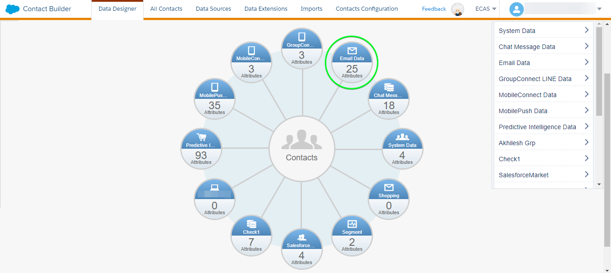

# [!DNL (API) Salesforce Marketing Cloud] connessione

## Panoramica {#overview}

[[!DNL (API) Salesforce Marketing Cloud]](https://www.salesforce.com/products/marketing-cloud/engagement/) (precedentemente noto come [!DNL ExactTarget]) è una suite di marketing digitale che consente di creare e personalizzare percorsi per consentire a visitatori e clienti di personalizzare la propria esperienza.

>[!IMPORTANT]
>
> Nota la differenza tra questa connessione e l&#39;altra [[!DNL Salesforce Marketing Cloud] connessione](/help/destinations/catalog/email-marketing/salesforce-marketing-cloud.md) che esiste nella sezione del catalogo di e-mail marketing. L’altra connessione di Marketing Cloud Salesforce consente di esportare i file in una posizione di archiviazione specifica, mentre si tratta di una connessione in streaming basata su API.

Confrontato con [!DNL Salesforce Marketing Cloud Account Engagement] che è più orientato verso **B2B** marketing, [!DNL (API) Salesforce Marketing Cloud] la destinazione è ideale per **B2C** casi d’uso con cicli decisionali transazionali più brevi. Puoi consolidare set di dati più grandi che rappresentano il comportamento del pubblico di destinazione per regolare e migliorare le campagne di marketing assegnando priorità e segmentando i contatti, in particolare da set di dati esterni [!DNL Salesforce]. *Experienci Platform dispone anche di una connessione per [[!DNL Salesforce Marketing Cloud Account Engagement]](/help/destinations/catalog/email-marketing/salesforce-marketing-cloud-account-engagement.md).*

Questo [!DNL Adobe Experience Platform] [destinazione](/help/destinations/home.md) utilizza [!DNL Salesforce Marketing Cloud] [aggiorna contatti](https://developer.salesforce.com/docs/marketing/marketing-cloud/guide/updateContacts.html) API, che consente di: **aggiungere contatti e aggiornare i dati dei contatti** per le esigenze aziendali dopo averle attivate in una nuova [!DNL Salesforce Marketing Cloud] segmento.

[!DNL Salesforce Marketing Cloud] utilizza OAuth 2 con credenziali client come meccanismo di autenticazione per comunicare con [!DNL Salesforce Marketing Cloud] API. Istruzioni per l’autenticazione [!DNL Salesforce Marketing Cloud] sono riportati di seguito, nella [Autentica nella destinazione](#authenticate) sezione.

## Casi d’uso {#use-cases}

Per aiutarti a capire meglio come e quando utilizzare il [!DNL (API) Salesforce Marketing Cloud] destinazione: ecco un caso d’uso di esempio che i clienti di Adobe Experience Platform possono risolvere utilizzando questa destinazione.

### Invia e-mail ai contatti per campagne di marketing {#use-case-send-emails}

Il reparto vendite di una piattaforma di noleggio a domicilio desidera inviare un’e-mail di marketing a un pubblico di clienti mirato. Il team marketing della piattaforma può aggiungere nuovi contatti o aggiornare quelli esistenti *(e i loro indirizzi e-mail)* tramite Adobe Experience Platform, crea tipi di pubblico dai propri dati offline e inviali a [!DNL Salesforce Marketing Cloud], che può quindi essere utilizzato per inviare l’e-mail della campagna di marketing.

## Prerequisiti {#prerequisites}

### Prerequisiti in Experienci Platform {#prerequisites-in-experience-platform}

Prima di attivare i dati in [!DNL (API) Salesforce Marketing Cloud] destinazione, è necessario disporre di un [schema](/help/xdm/schema/composition.md), a [set di dati](https://experienceleague.adobe.com/docs/platform-learn/tutorials/data-ingestion/create-datasets-and-ingest-data.html?lang=it), e [segmenti](https://experienceleague.adobe.com/docs/platform-learn/tutorials/segments/create-segments.html) creato in [!DNL Experience Platform].

### Prerequisiti in [!DNL (API) Salesforce Marketing Cloud] {#prerequisites-destination}

Prendi nota dei seguenti prerequisiti per esportare i dati da Platform al tuo [!DNL Salesforce Marketing Cloud] account:

#### Devi avere un [!DNL Salesforce Marketing Cloud] account {#prerequisites-account}

A [!DNL Salesforce Marketing Cloud] account con un abbonamento a [[!DNL Marketing Cloud Engagement]](https://www.salesforce.com/products/marketing-cloud/engagement/) prodotto è obbligatorio per procedere.

Contatta in [[!DNL Salesforce] Supporto](https://www.salesforce.com/company/contact-us/?d=cta-glob-footer-10) se non ha un [!DNL Salesforce Marketing Cloud] o il tuo account non dispone del [!DNL Marketing Cloud Engagement] abbonamento al prodotto.

#### Creare attributi in [!DNL Salesforce Marketing Cloud] {#prerequisites-attribute}

Quando si attivano i tipi di pubblico in [!DNL (API) Salesforce Marketing Cloud] destinazione, è necessario immettere un valore nella **[!UICONTROL ID mappatura]** per ogni pubblico attivato, nel **[Pianificazione del pubblico](#schedule-segment-export-example)** passaggio.

[!DNL Salesforce] richiede questo valore per leggere e interpretare correttamente i tipi di pubblico provenienti da Experienci Platform e per aggiornare il loro stato di pubblico in [!DNL Salesforce Marketing Cloud]. Consulta la documentazione dell’Experience Platform per [Gruppo di campi schema Dettagli appartenenza pubblico](/help/xdm/field-groups/profile/segmentation.md) per informazioni sugli stati del pubblico.

Per ogni pubblico che attivi da Platform a [!DNL Salesforce], è necessario disporre di un attributo di tipo `Text` collegato al [!DNL Email Demographics] estensione dati in [!DNL Salesforce Marketing Cloud]. Utilizza il [!DNL Salesforce Marketing Cloud] [!DNL Contact Builder] per creare attributi. Consulta la sezione [!DNL Salesforce Marketing Cloud] documentazione per [creare attributi](https://help.salesforce.com/s/articleView?id=mc_cab_create_an_attribute.htm&amp;type=5&amp;language=en_US) per informazioni sulla creazione di attributi.

I nomi dei campi attributo vengono utilizzati per [!DNL (API) Salesforce Marketing Cloud] campo di destinazione durante il **[!UICONTROL Mappatura]** passaggio. Puoi definire il carattere del campo con un massimo di 4000 caratteri, in base ai requisiti aziendali. Consulta la [!DNL Salesforce Marketing Cloud] [Tipi di dati delle estensioni dati](https://help.salesforce.com/s/articleView?id=sf.mc_es_data_extension_data_types.htm&amp;type=5) per ulteriori informazioni sui tipi di attributi.

Un esempio della schermata di progettazione dati in [!DNL Salesforce Marketing Cloud], in cui si aggiunge l&#39;attributo è mostrato di seguito:

Una visualizzazione di un [!DNL Salesforce Marketing Cloud] [!DNL Email Data] gruppo di attributi con attributi corrispondenti allo stato del pubblico all’interno del [!DNL Email Demographics] di seguito è illustrata l&#39;estensione dei dati:

Il [!DNL (API) Salesforce Marketing Cloud] la destinazione utilizza [!DNL Salesforce Marketing Cloud] [!DNL Search Attribute-Set Definitions REST] [API](https://developer.salesforce.com/docs/marketing/marketing-cloud/guide/retrieveAttributeSetDefinitions.html) per recuperare in modo dinamico le estensioni di dati e gli attributi collegati definiti in [!DNL Salesforce Marketing Cloud].

Questi vengono visualizzati nel **[!UICONTROL Campo di destinazione]** finestra di selezione quando si imposta [mappatura](#mapping-considerations-example) nel flusso di lavoro a [attivare i tipi di pubblico nella destinazione](#activate).

>[!IMPORTANT]
>
> Entro [!DNL Salesforce Marketing Cloud], è necessario creare attributi con **[!UICONTROL NOME CAMPO]** che corrisponde esattamente al valore specificato in **[!UICONTROL ID mappatura]** per ogni segmento di Platform attivato. Ad esempio, la schermata seguente mostra un attributo denominato `salesforce_mc_segment_1`. Quando attivi un pubblico in questa destinazione, aggiungi `salesforce_mc_segment_1` as **[!UICONTROL ID mappatura]** per popolare i tipi di pubblico da Experienci Platform in questo attributo.

Esempio di creazione di attributi in [!DNL Salesforce Marketing Cloud], è mostrato di seguito:

>[!TIP]
>
> * Durante la creazione dell’attributo, non includere spazi nel nome del campo. Utilizza invece il carattere di sottolineatura `(_)` come separatore.
> * Per distinguere tra gli attributi utilizzati per i tipi di pubblico di Platform e altri attributi all’interno di [!DNL Salesforce Marketing Cloud], è possibile includere un prefisso o un suffisso riconoscibile per gli attributi utilizzati per i segmenti di Adobe. Ad esempio, invece di `test_segment`, utilizza `Adobe_test_segment` o `test_segment_Adobe`.
> * Se hai già creato altri attributi in [!DNL Salesforce Marketing Cloud], puoi utilizzare lo stesso nome del segmento Platform, per identificare facilmente il pubblico in [!DNL Salesforce Marketing Cloud].

#### Assegnare ruoli utente e autorizzazioni in [!DNL Salesforce Marketing Cloud] {#prerequisites-roles-permissions}

As [!DNL Salesforce Marketing Cloud] supporta ruoli personalizzati a seconda del caso d’uso, all’utente devono essere assegnati i ruoli pertinenti per aggiornare gli attributi in [!DNL Salesforce Marketing Cloud]. Di seguito è riportato un esempio di ruoli assegnati a un utente:

A seconda dei ruoli [!DNL Salesforce Marketing Cloud] utente è stato assegnato, è inoltre necessario assegnare le autorizzazioni al [!DNL Salesforce Marketing Cloud] estensione dati collegata ai campi che desideri aggiornare.

Poiché questa destinazione richiede l’accesso a `[!DNL data extension]`, è necessario consentirli. Ad esempio, per `Email` [!DNL data extension] devi consentire come mostrato di seguito:

Per limitare il livello di accesso, è inoltre possibile sostituire l&#39;accesso individuale utilizzando privilegi granulari.

Consulta la sezione [[!DNL Marketing Cloud Roles]](https://help.salesforce.com/s/articleView?language=en_US&amp;id=sf.mc_overview_marketing_cloud_roles.htm&amp;type=5) e [[!DNL Marketing Cloud Roles and Permissions]](https://help.salesforce.com/s/articleView?language=en_US&amp;id=sf.mc_overview_roles.htm&amp;type=5) pagine per istruzioni dettagliate.

#### Raccogli [!DNL Salesforce Marketing Cloud] credenziali {#gather-credentials}

Annota gli elementi riportati di seguito prima di eseguire l’autenticazione in [!DNL (API) Salesforce Marketing Cloud] destinazione.

| Credenziali | Descrizione | Esempio |
| --- | --- | --- |
| Subdomain | Consulta [[!DNL Salesforce Marketing Cloud domain prefix]](https://developer.salesforce.com/docs/marketing/marketing-cloud/guide/your-subdomain-tenant-specific-endpoints.html) per scoprire come ottenere questo valore da [!DNL Salesforce Marketing Cloud] di rete. | Se il [!DNL Salesforce Marketing Cloud] il dominio è  *`mcq4jrssqdlyc4lph19nnqgzzs84`.login.exacttarget.com*,  devi fornire `mcq4jrssqdlyc4lph19nnqgzzs84` come valore. |
| ID client | Consulta la [!DNL Salesforce Marketing Cloud] [documentazione](https://developer.salesforce.com/docs/marketing/marketing-cloud/guide/access-token-s2s.html) per scoprire come ottenere questo valore da [!DNL Salesforce Marketing Cloud] di rete. | r23kxxxxxxxx0z05xxxxxx |
| Segreto client | Consulta la [!DNL Salesforce Marketing Cloud] [documentazione](https://developer.salesforce.com/docs/marketing/marketing-cloud/guide/access-token-s2s.html) per scoprire come ottenere questo valore da [!DNL Salesforce Marketing Cloud] di rete. | ipxxxxxxxxT4xxxxxxxxxx |

{style="table-layout:auto"}

### Guardrail {#guardrails}

* Salesforce impone alcuni [limiti di tariffa](https://developer.salesforce.com/docs/marketing/marketing-cloud/guide/rate-limiting.html).
   * Consulta la sezione [!DNL Salesforce Marketing Cloud] [documentazione](https://developer.salesforce.com/docs/marketing/marketing-cloud/guide/rate-limiting-errors.html) per risolvere eventuali limiti probabili riscontrati e ridurre gli errori durante l&#39;esecuzione.
   * Consulta la sezione [[!DNL Salesforce Marketing Cloud] Prezzi di coinvolgimento](https://www.salesforce.com/editions-pricing/marketing-cloud/email/) pagina a *Scarica il grafico di confronto dell&#39;edizione completa* in un pdf che descrive i limiti imposti dal piano.
   * Il [Panoramica API](https://developer.salesforce.com/docs/marketing/marketing-cloud/guide/apis-overview.html) limiti aggiuntivi per i dettagli della pagina.
   * Fai riferimento a [qui](https://salesforce.stackexchange.com/questions/205898/marketing-cloud-api-limits) per una pagina che raccoglie questi dettagli.
* Il conteggio di *campi personalizzati consentiti per oggetto* varia a seconda della versione di Salesforce.
   * Consulta la sezione [!DNL Salesforce] [documentazione](https://help.salesforce.com/s/articleView?id=sf.custom_field_allocations.htm&amp;type=5) per ulteriori informazioni.
   * Se hai raggiunto il limite definito per *campi personalizzati consentiti per oggetto* entro [!DNL Salesforce Marketing Cloud] sarà necessario
      * Rimuovi gli attributi precedenti prima di aggiungere nuovi attributi in [!DNL Salesforce Marketing Cloud].
      * Aggiorna o rimuovi eventuali tipi di pubblico attivati nelle destinazioni Platform che utilizzano questi nomi di attributi precedenti come valore fornito per **[!UICONTROL ID mappatura]** durante il [pianificazione del pubblico](#schedule-segment-export-example) passaggio.

## Identità supportate {#supported-identities}

[!DNL (API) Salesforce Marketing Cloud] supporta l’attivazione delle identità descritte nella tabella seguente. Ulteriori informazioni su [identità](/help/identity-service/namespaces.md).

| Identità di destinazione | Descrizione | Considerazioni |
|---|---|---|
| contactKey | [!DNL Salesforce Marketing Cloud] Chiave contatto. Consulta la sezione [!DNL Salesforce Marketing Cloud] [documentazione](https://help.salesforce.com/s/articleView?id=sf.mc_cab_contact_builder_best_practices.htm&amp;type=5) se ha bisogno di ulteriore assistenza. | Obbligatorio |

## Tipi di pubblico supportati {#supported-audiences}

Questa sezione descrive quali tipi di pubblico puoi esportare in questa destinazione.

| Origine pubblico | Supportati | Descrizione |
---------|----------|----------|
| [!DNL Segmentation Service] | ✓ | Tipi di pubblico generati dall’Experience Platform [Servizio di segmentazione](../../../segmentation/home.md). |
| Caricamenti personalizzati | X | Tipi di pubblico [importato](../../../segmentation/ui/overview.md#import-audience) in Experienci Platform da file CSV. |

{style="table-layout:auto"}

## Tipo e frequenza di esportazione {#export-type-frequency}

Per informazioni sul tipo e sulla frequenza di esportazione della destinazione, consulta la tabella seguente.

| Elemento | Tipo | Note |
---------|----------|---------|
| Tipo di esportazione | **[!UICONTROL Basato su profilo]** | <ul><li>Stai esportando tutti i membri di un segmento, insieme ai campi schema desiderati *ad esempio: indirizzo e-mail, numero di telefono, cognome*, in base alla mappatura del campo.</li><li> Ogni stato del segmento in [!DNL Salesforce Marketing Cloud] viene aggiornato con il corrispondente stato del pubblico da Platform, in base al **[!UICONTROL ID mappatura]** valore fornito durante il [pianificazione del pubblico](#schedule-segment-export-example) passaggio.</li></ul> |
| Frequenza di esportazione | **[!UICONTROL Streaming]** | Le destinazioni di streaming sono connessioni &quot;sempre attive&quot; basate su API. Non appena un profilo viene aggiornato in Experienci Platform in base alla valutazione del pubblico, il connettore invia l’aggiornamento a valle alla piattaforma di destinazione. Ulteriori informazioni su [destinazioni di streaming](/help/destinations/destination-types.md#streaming-destinations). |

{style="table-layout:auto"}

## Connettersi alla destinazione {#connect}

>[!IMPORTANT]
>
> Per connettersi alla destinazione, è necessario **[!UICONTROL Gestire le destinazioni]** [autorizzazione per il controllo degli accessi](/help/access-control/home.md#permissions). Leggi le [panoramica sul controllo degli accessi](/help/access-control/ui/overview.md) oppure contatta l’amministratore del prodotto per ottenere le autorizzazioni necessarie.

Per connettersi a questa destinazione, seguire i passaggi descritti in [esercitazione sulla configurazione della destinazione](../../ui/connect-destination.md). Nel flusso di lavoro di configurazione della destinazione, compila i campi elencati nelle due sezioni seguenti.

Entro **[!UICONTROL Destinazioni]** > **[!UICONTROL Catalogo]**, cerca [!DNL (API) Salesforce Marketing Cloud]. In alternativa, è possibile posizionarlo sotto il **[!UICONTROL E-mail marketing]** categoria.

### Autenticarsi nella destinazione {#authenticate}

Per eseguire l’autenticazione nella destinazione, compila i campi richiesti di seguito e seleziona **[!UICONTROL Connetti alla destinazione]**. Consulta la sezione [Raccogli [!DNL Salesforce Marketing Cloud] credenziali](#gather-credentials) sezione per eventuali indicazioni.

| [!DNL (API) Salesforce Marketing Cloud] destinazione | [!DNL Salesforce Marketing Cloud] |
| --- | --- |
| **[!UICONTROL Sottodominio]** | Il tuo [!DNL Salesforce Marketing Cloud] prefisso del dominio.  Ad esempio, se il dominio è   *`mcq4jrssqdlyc4lph19nnqgzzs84`.login.exacttarget.com*,   devi fornire `mcq4jrssqdlyc4lph19nnqgzzs84` come valore. |
| **[!UICONTROL ID client]** | Il tuo [!DNL Salesforce Marketing Cloud] `Client ID`. |
| **[!UICONTROL Segreto client]** | Il tuo [!DNL Salesforce Marketing Cloud] `Client Secret`. |

Se i dettagli forniti sono validi, nell’interfaccia utente viene visualizzato un **[!UICONTROL Connesso]** con un segno di spunta verde, puoi quindi procedere al passaggio successivo.

### Inserire i dettagli della destinazione {#destination-details}

Per configurare i dettagli per la destinazione, compila i campi obbligatori e facoltativi seguenti. Un asterisco accanto a un campo nell’interfaccia utente indica che il campo è obbligatorio.

* **[!UICONTROL Nome]**: nome con cui riconoscerai questa destinazione in futuro.
* **[!UICONTROL Descrizione]**: descrizione che ti aiuterà a identificare questa destinazione in futuro.

### Abilita avvisi {#enable-alerts}

Puoi abilitare gli avvisi per ricevere notifiche sullo stato del flusso di dati verso la tua destinazione. Seleziona un avviso dall’elenco per abbonarti e ricevere notifiche sullo stato del flusso di dati. Per ulteriori informazioni sugli avvisi, consulta la guida su [abbonamento agli avvisi sulle destinazioni tramite l’interfaccia utente](../../ui/alerts.md).

Una volta completate le informazioni sulla connessione di destinazione, seleziona **[!UICONTROL Successivo]**.

## Attivare tipi di pubblico in questa destinazione {#activate}

>[!IMPORTANT]
> 
> * Per attivare i dati, è necessario **[!UICONTROL Gestire le destinazioni]**, **[!UICONTROL Attivare le destinazioni]**, **[!UICONTROL Visualizza profili]**, e **[!UICONTROL Visualizzare segmenti]** [autorizzazioni di controllo degli accessi](/help/access-control/home.md#permissions). Leggi le [panoramica sul controllo degli accessi](/help/access-control/ui/overview.md) oppure contatta l’amministratore del prodotto per ottenere le autorizzazioni necessarie.
> * Per esportare *identità*, è necessario **[!UICONTROL Visualizza grafico delle identità]** [autorizzazione per il controllo degli accessi](/help/access-control/home.md#permissions).   {width="100" zoomable="yes"}

Letto [Attiva profili e tipi di pubblico nelle destinazioni di esportazione del pubblico in streaming](/help/destinations/ui/activate-segment-streaming-destinations.md) per istruzioni sull’attivazione dei tipi di pubblico in questa destinazione.

### Considerazioni sulla mappatura ed esempio {#mapping-considerations-example}

Per inviare correttamente i dati sul pubblico da Adobe Experience Platform a [!DNL (API) Salesforce Marketing Cloud] destinazione, devi passare attraverso il passaggio di mappatura dei campi. La mappatura consiste nella creazione di un collegamento tra i campi dello schema Experience Data Model (XDM) nell’account Platform e i corrispondenti equivalenti dalla destinazione.

Per mappare correttamente i campi XDM su [!DNL (API) Salesforce Marketing Cloud] campi di destinazione, segui i passaggi indicati di seguito.

>[!IMPORTANT]
>
> * Anche se i nomi degli attributi sono come da [!DNL Salesforce Marketing Cloud] account, le mappature per entrambi `contactKey` e `personalEmail.address` sono obbligatori.
>
> * L&#39;integrazione con [!DNL Salesforce Marketing Cloud] L’API è soggetta a un limite di impaginazione del numero di attributi che gli Experienci Platform possono recuperare da Salesforce. Ciò significa che durante il **[!UICONTROL Mappatura]** fase, lo schema del campo di destinazione può visualizzare un massimo di 2000 attributi dal tuo account Salesforce.

1. In **[!UICONTROL Mappatura]** passaggio, seleziona **[!UICONTROL Aggiungi nuova mappatura]**. Viene visualizzata una nuova riga di mappatura.
   
1. In **[!UICONTROL Seleziona campo di origine]** finestra, scegli la **[!UICONTROL Seleziona attributi]** e selezionare l&#39;attributo XDM o scegliere il **[!UICONTROL Seleziona lo spazio dei nomi dell’identità]** e seleziona un’identità.
1. In **[!UICONTROL Seleziona campo di destinazione]** finestra, scegli la **[!UICONTROL Seleziona lo spazio dei nomi dell’identità]** e seleziona un’identità o scegli **[!UICONTROL Seleziona attributi]** e seleziona un attributo dalle estensioni di dati visualizzate, in base alle esigenze. Il [!DNL (API) Salesforce Marketing Cloud] la destinazione utilizza [!DNL Salesforce Marketing Cloud] [!DNL Search Attribute-Set Definitions REST] [API](https://developer.salesforce.com/docs/marketing/marketing-cloud/guide/retrieveAttributeSetDefinitions.html) per recuperare in modo dinamico le estensioni di dati e gli attributi collegati definiti in [!DNL Salesforce Marketing Cloud]. Questi vengono visualizzati nel **[!UICONTROL Campo di destinazione]** popup quando si imposta [mappatura](#mapping-considerations-example) nel [attiva flusso di lavoro tipi di pubblico](#activate).

   * Ripeti questi passaggi per aggiungere le seguenti mappature tra lo schema del profilo XDM e [!DNL (API) Salesforce Marketing Cloud]:

     | Campo di origine | Campo di destinazione | Obbligatorio |
     |---|---|---|
     | `IdentityMap: contactKey` | `Identity: salesforceContactKey` | `Mandatory` |
     | `xdm: personalEmail.address` | `Attribute: Email Address` dal [!DNL Salesforce Marketing Cloud] [!DNL Email Addresses] estensione dati. | `Mandatory`, quando si aggiungono nuovi contatti. |
     | `xdm: person.name.firstName` | `Attribute: First Name` dal desiderato [!DNL Salesforce Marketing Cloud] estensione dati. | - |

   * Di seguito è riportato un esempio che utilizza queste mappature:
     

Una volta completate le mappature per la connessione di destinazione, seleziona **[!UICONTROL Successivo]**.

### Esempio di esportazione e pianificazione di un pubblico {#schedule-segment-export-example}

Durante l&#39;esecuzione di [Pianificare l’esportazione del pubblico](/help/destinations/ui/activate-segment-streaming-destinations.md#scheduling) , devi mappare manualmente i tipi di pubblico di Platform su [attributi](#prerequisites-attribute) in [!DNL Salesforce Marketing Cloud].

A questo scopo, seleziona ogni segmento, quindi inserisci il nome dell’attributo da [!DNL Salesforce Marketing Cloud] nel [!DNL (API) Salesforce Marketing Cloud] **[!UICONTROL ID mappatura]** campo. Consulta la sezione [Crea attributo in [!DNL Salesforce Marketing Cloud]](#prerequisites-custom-field) sezione per indicazioni e best practice sulla creazione di attributi in [!DNL Salesforce Marketing Cloud].

Ad esempio, se [!DNL Salesforce Marketing Cloud] l&#39;attributo è `salesforce_mc_segment_1`, specifica questo valore in [!DNL (API) Salesforce Marketing Cloud] **[!UICONTROL ID mappatura]** per popolare i tipi di pubblico da Experienci Platform in questo attributo.

Un attributo di esempio da [!DNL Salesforce Marketing Cloud] è mostrato di seguito:

Un esempio che indica la posizione del [!DNL (API) Salesforce Marketing Cloud] **[!UICONTROL ID mappatura]** è mostrato di seguito:

Come mostrato nella [!DNL (API) Salesforce Marketing Cloud] **[!UICONTROL ID mappatura]** deve corrispondere esattamente al valore specificato in [!DNL Salesforce Marketing Cloud] **[!UICONTROL NOME CAMPO]**.

Ripeti questa sezione per ogni segmento di Platform attivato.

Un esempio tipico basato sull’immagine mostrata sopra potrebbe essere.
| [!DNL (API) Salesforce Marketing Cloud] nome segmento | [!DNL Salesforce Marketing Cloud] **[!UICONTROL NOME CAMPO]** | [!DNL (API) Salesforce Marketing Cloud] **[!UICONTROL ID mappatura]** | | — | — | — | | pubblico mc salesforce 1 | `salesforce_mc_segment_1` | `salesforce_mc_segment_1` | | pubblico mc salesforce 2 | `salesforce_mc_segment_2` | `salesforce_mc_segment_2` |

## Convalidare l’esportazione dei dati {#exported-data}

Per verificare di aver impostato correttamente la destinazione, segui i passaggi seguenti:

1. Seleziona **[!UICONTROL Destinazioni]** > **[!UICONTROL Sfoglia]** per passare all’elenco delle destinazioni.
   

1. Seleziona la destinazione e verifica che lo stato sia **[!UICONTROL abilitato]**.
   

1. Passa a **[!DNL Activation data]** , quindi seleziona un nome per il pubblico.
   

1. Controlla il riepilogo del pubblico e assicurati che il conteggio dei profili corrisponda al conteggio creato all’interno del segmento.
   

1. Accedi a [[!DNL Salesforce Marketing Cloud]](https://mc.exacttarget.com/) sito Web. Quindi vai al **[!DNL Audience Builder]** > **[!DNL Contact Builder]** > **[!DNL All contacts]** > **[!DNL Email]** e verificare se i profili del pubblico sono stati aggiunti.
   

1. Per verificare se i profili sono stati aggiornati, passa alla **[!UICONTROL E-mail]** e verificare se i valori degli attributi per il profilo dal pubblico sono stati aggiornati. In caso di esito positivo, puoi vedere che ogni stato del pubblico in [!DNL Salesforce Marketing Cloud] è stato aggiornato con il corrispondente stato del pubblico da Platform, in base al **[!UICONTROL ID mappatura]** valore fornito nella [pianificazione del pubblico](#schedule-segment-export-example) passaggio.
   

## Utilizzo dei dati e governance {#data-usage-governance}

Tutti [!DNL Adobe Experience Platform] le destinazioni sono conformi ai criteri di utilizzo dei dati durante la gestione dei dati. Per informazioni dettagliate su come [!DNL Adobe Experience Platform] applica la governance dei dati, consulta la sezione [Panoramica sulla governance dei dati](/help/data-governance/home.md).

## Errori e risoluzione problemi {#errors-and-troubleshooting}

### Sono stati riscontrati errori sconosciuti durante la trasmissione degli eventi al Marketing Cloud Salesforce {#unknown-errors}

* Durante il controllo di un’esecuzione del flusso di dati, è possibile che venga visualizzato il seguente messaggio di errore: `Unknown errors encountered while pushing events to the destination. Please contact the administrator and try again.`
  

   * Per correggere questo errore, verifica che **[!UICONTROL ID mappatura]** che hai fornito nel flusso di lavoro di attivazione a [!DNL (API) Salesforce Marketing Cloud] La destinazione corrisponde esattamente al nome dell&#39;attributo creato in [!DNL Salesforce Marketing Cloud]. Consulta la sezione [Crea attributo in [!DNL Salesforce Marketing Cloud]](#prerequisites-custom-field) sezione di orientamento.

* Quando attivi un segmento, potresti ricevere un messaggio di errore: `The client's IP address is unauthorized for this account. Allowlist the client's IP address...`
   * Per risolvere il problema, contattare il [!DNL Salesforce Marketing Cloud] amministratore dell’account da aggiungere [Experience Platform di indirizzi IP](/help/destinations/catalog/streaming/ip-address-allow-list.md) al tuo [!DNL Salesforce Marketing Cloud] intervalli IP attendibili degli account. Consulta la sezione [!DNL Salesforce Marketing Cloud] [Indirizzi IP da includere nei Marketing Cloud di in Inserire nell&#39;elenco Consentiti](https://help.salesforce.com/s/articleView?id=sf.mc_es_ip_addresses_for_inclusion.htm&amp;type=5) se hai bisogno di ulteriore assistenza.

## Risorse aggiuntive {#additional-resources}

* [!DNL Salesforce Marketing Cloud] [API](https://developer.salesforce.com/docs/marketing/marketing-cloud/guide/apis-overview.html)
* [!DNL Salesforce Marketing Cloud] [documentazione](https://developer.salesforce.com/docs/marketing/marketing-cloud/guide/updateContacts.html) spiegazione di come i contatti vengono aggiornati con le informazioni specificate.

### Changelog {#changelog}

Questa sezione acquisisce le funzionalità e i significativi aggiornamenti alla documentazione apportati al connettore di destinazione.

+++ Visualizza changelog

| Mese di rilascio | Tipo di aggiornamento | Descrizione |
|---|---|---|
| Ottobre 2023 | Aggiornamento della documentazione | <ul><li>Abbiamo aggiornato il [Prerequisiti nel Marketing Cloud Salesforce (API)](#prerequisites-destination) e in generale, sono stati rimossi i riferimenti non necessari ai gruppi di attributi all’interno del documento.</li> <li>È stata aggiornata la documentazione per indicare che gli attributi per gli stati dei tipi di pubblico devono essere creati in [!DNL Salesforce Marketing Cloud] all&#39;interno del [!DNL Email Demographics] solo estensione dati.</li> <li>È stata aggiornata la tabella di mappatura all’interno di [Considerazioni sulla mappatura ed esempio](#mapping-considerations-example) , la mappatura per `Email Address` all&#39;interno del `Email Addresses` l&#39;estensione dei dati è contrassegnata come obbligatoria; questo requisito è menzionato nella didascalia contrassegnata come IMPORTANTE ma è stato omesso dalla tabella.</li></ul> |
| Aprile 2023 | Aggiornamento della documentazione | <ul><li>Abbiamo corretto un&#39;istruzione e un collegamento di riferimento in [Prerequisiti nel Marketing Cloud Salesforce (API)](#prerequisites-destination) sezione per richiamarlo [!DNL Salesforce Marketing Cloud Engagement] è un abbonamento obbligatorio per utilizzare questa destinazione. La sezione in precedenza diceva erroneamente che gli utenti necessitavano di un abbonamento al Marketing Cloud **Account** Coinvolgimento per procedere.</li> <li>Abbiamo aggiunto una sezione in [prerequisiti](#prerequisites) per [ruoli e autorizzazioni](#prerequisites-roles-permissions) da assegnare al [!DNL Salesforce] affinché questa destinazione funzioni. (PLATIR-26299)</li></ul> |
| Febbraio 2023 | Aggiornamento della documentazione | Abbiamo aggiornato il [Prerequisiti nel Marketing Cloud Salesforce (API)](#prerequisites-destination) sezione per includere un collegamento di riferimento che richiami [!DNL Salesforce Marketing Cloud Engagement] è un abbonamento obbligatorio per utilizzare questa destinazione. |
| Febbraio 2023 | Aggiornamento della funzionalità | È stato risolto un problema che causava l’invio a Salesforce di un JSON non valido a causa di una configurazione errata nella destinazione. Questo causava la mancata attivazione di un numero elevato di identità da parte di alcuni utenti. (PLATIR-26299) |
| Gennaio 2023 | Aggiornamento della documentazione | <ul><li>Abbiamo aggiornato il [Prerequisiti in [!DNL Salesforce]](#prerequisites-destination) sezione per richiamare che gli attributi devono essere creati sul [!DNL Salesforce] lato. Questa sezione ora include istruzioni dettagliate su come farlo e best practice per la denominazione degli attributi in [!DNL Salesforce]. (PLATIR-25602)</li><li>Abbiamo aggiunto istruzioni chiare su come utilizzare l’ID mappatura per ogni pubblico attivato nel [pianificazione del pubblico](#schedule-segment-export-example) passaggio. (PLATIR-25602)</li></ul> |
| Ottobre 2022 | Versione iniziale | Versione di destinazione iniziale e pubblicazione della documentazione. |

{style="table-layout:auto"}

+++
