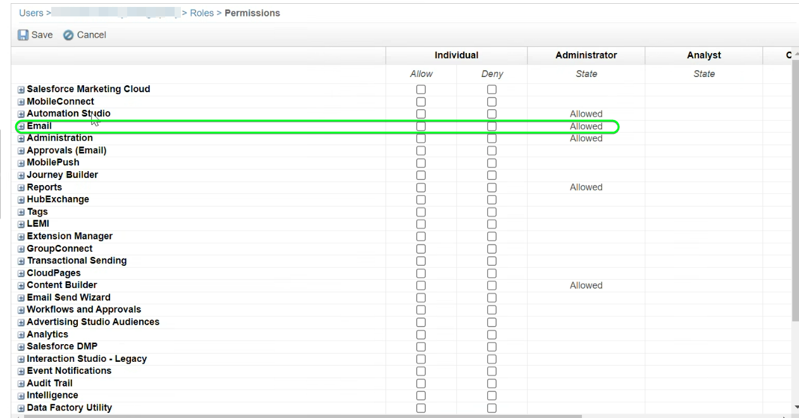

# Connessione [!DNL (API) Salesforce Marketing Cloud]

## Panoramica {#overview}

[[!DNL (API) Salesforce Marketing Cloud]](https://www.salesforce.com/products/marketing-cloud/engagement/) (precedentemente noto come [!DNL ExactTarget]) è una suite di marketing digitale che consente di creare e personalizzare percorsi per i visitatori e i clienti per personalizzare la propria esperienza.

>[!IMPORTANT]
>
> Nota la differenza tra questa connessione e l&#39;altra [[!DNL Salesforce Marketing Cloud] connessione](/help/destinations/catalog/email-marketing/salesforce-marketing-cloud.md) esistente nella sezione del catalogo di e-mail marketing. L’altra connessione di Marketing Cloud Salesforce consente di esportare i file in una posizione di archiviazione specifica, mentre si tratta di una connessione in streaming basata su API.

Rispetto a [!DNL Salesforce Marketing Cloud Account Engagement], più orientato al marketing **B2B**, la destinazione [!DNL (API) Salesforce Marketing Cloud] è ideale per i casi d&#39;uso **B2C** con cicli decisionali transazionali più brevi. È possibile consolidare set di dati più grandi che rappresentano il comportamento del pubblico di destinazione per regolare e migliorare le campagne di marketing assegnando priorità e segmentando i contatti, in particolare dai set di dati esterni a [!DNL Salesforce]. *Nota: l&#39;Experience Platform dispone anche di una connessione per [[!DNL Salesforce Marketing Cloud Account Engagement]](/help/destinations/catalog/email-marketing/salesforce-marketing-cloud-account-engagement.md).*

Questa [!DNL Adobe Experience Platform] [destinazione](/help/destinations/home.md) utilizza l&#39;API [!DNL Salesforce Marketing Cloud] [aggiorna contatti](https://developer.salesforce.com/docs/marketing/marketing-cloud/guide/updateContacts.html), che ti consente di **aggiungere contatti e aggiornare i dati dei contatti** per le tue esigenze aziendali dopo averli attivati in un nuovo segmento [!DNL Salesforce Marketing Cloud].

[!DNL Salesforce Marketing Cloud] utilizza OAuth 2 con credenziali client come meccanismo di autenticazione per comunicare con l&#39;API [!DNL Salesforce Marketing Cloud]. Le istruzioni per l&#39;autenticazione nell&#39;istanza [!DNL Salesforce Marketing Cloud] sono riportate di seguito, nella sezione [Autentica nella destinazione](#authenticate).

## Casi d’uso {#use-cases}

Per aiutarti a capire meglio come e quando utilizzare la destinazione [!DNL (API) Salesforce Marketing Cloud], ecco un esempio di caso d&#39;uso che i clienti Adobe Experience Platform possono risolvere utilizzando questa destinazione.

### Invia e-mail ai contatti per campagne di marketing {#use-case-send-emails}

Il reparto vendite di una piattaforma di noleggio a domicilio desidera inviare un’e-mail di marketing a un pubblico di clienti mirato. Il team marketing della piattaforma può aggiungere nuovi contatti/aggiornare i contatti esistenti *(e i relativi indirizzi e-mail)* tramite Adobe Experience Platform, creare tipi di pubblico dai propri dati offline e inviare tali tipi di pubblico a [!DNL Salesforce Marketing Cloud], che può quindi essere utilizzato per inviare l&#39;e-mail della campagna di marketing.

## Prerequisiti {#prerequisites}

### Prerequisiti in Experience Platform {#prerequisites-in-experience-platform}

Prima di attivare i dati nella destinazione [!DNL (API) Salesforce Marketing Cloud], è necessario disporre di uno [schema](/help/xdm/schema/composition.md), un [set di dati](https://experienceleague.adobe.com/docs/platform-learn/tutorials/data-ingestion/create-datasets-and-ingest-data.html) e [segmenti](https://experienceleague.adobe.com/docs/platform-learn/tutorials/segments/create-segments.html) creati in [!DNL Experience Platform].

### Prerequisiti in [!DNL (API) Salesforce Marketing Cloud] {#prerequisites-destination}

Per esportare i dati da Platform al tuo account [!DNL Salesforce Marketing Cloud], tieni presente i seguenti prerequisiti:

#### Devi avere un account [!DNL Salesforce Marketing Cloud] {#prerequisites-account}

Per continuare è obbligatorio un account [!DNL Salesforce Marketing Cloud] con una sottoscrizione al prodotto [[!DNL Marketing Cloud Engagement]](https://www.salesforce.com/products/marketing-cloud/engagement/).

Contatta il [[!DNL Salesforce] Supporto](https://www.salesforce.com/company/contact-us/?d=cta-glob-footer-10) se non disponi di un account [!DNL Salesforce Marketing Cloud] o se il tuo account non dispone dell&#39;abbonamento al prodotto [!DNL Marketing Cloud Engagement].

#### Crea attributi in [!DNL Salesforce Marketing Cloud] {#prerequisites-attribute}

Quando si attivano i tipi di pubblico nella destinazione [!DNL (API) Salesforce Marketing Cloud], è necessario immettere un valore nel campo **[!UICONTROL ID mappatura]** per ogni pubblico attivato, nel passaggio **[Pianificazione pubblico](#schedule-segment-export-example)**.

[!DNL Salesforce] richiede questo valore per leggere e interpretare correttamente i tipi di pubblico provenienti da Experience Platform e per aggiornare il loro stato di pubblico entro [!DNL Salesforce Marketing Cloud]. Se hai bisogno di indicazioni sugli stati del pubblico, consulta la documentazione dell&#39;Experience Platform per il gruppo di campi [Dettagli appartenenza pubblico](/help/xdm/field-groups/profile/segmentation.md).

Per ogni pubblico attivato da Platform a [!DNL Salesforce], è necessario disporre di un attributo di tipo `Text` collegato all&#39;estensione dati [!DNL Email Demographics] all&#39;interno di [!DNL Salesforce Marketing Cloud]. Utilizzare [!DNL Salesforce Marketing Cloud] [!DNL Contact Builder] per creare gli attributi. Per informazioni sulla creazione degli attributi, consulta la documentazione di [!DNL Salesforce Marketing Cloud] per [creare gli attributi](https://help.salesforce.com/s/articleView?id=mc_cab_create_an_attribute.htm&amp;type=5&amp;language=en_US).

I nomi dei campi attributo vengono utilizzati per il campo di destinazione [!DNL (API) Salesforce Marketing Cloud] durante il passaggio **[!UICONTROL Mappatura]**. Puoi definire il carattere del campo con un massimo di 4000 caratteri, in base ai requisiti aziendali. Per ulteriori informazioni sui tipi di attributo, vedere la pagina della documentazione [!DNL Salesforce Marketing Cloud] [Tipi di dati estensioni](https://help.salesforce.com/s/articleView?id=sf.mc_es_data_extension_data_types.htm&amp;type=5).

Di seguito è riportato un esempio della schermata di progettazione dati in [!DNL Salesforce Marketing Cloud], in cui verrà aggiunto l&#39;attributo:

Di seguito è riportata una visualizzazione di un gruppo di attributi [!DNL Salesforce Marketing Cloud] [!DNL Email Data] con attributi corrispondenti allo stato del pubblico all&#39;interno dell&#39;estensione dati [!DNL Email Demographics]:

La destinazione [!DNL (API) Salesforce Marketing Cloud] utilizza l&#39;[!DNL Salesforce Marketing Cloud] [!DNL Search Attribute-Set Definitions REST] [API](https://developer.salesforce.com/docs/marketing/marketing-cloud/guide/retrieveAttributeSetDefinitions.html) per recuperare in modo dinamico le estensioni dei dati e i relativi attributi collegati&#39; definiti in [!DNL Salesforce Marketing Cloud].

Questi vengono visualizzati nella finestra di selezione del **[!UICONTROL campo di destinazione]** quando imposti la [mappatura](#mapping-considerations-example) nel flusso di lavoro per [attivare il pubblico nella destinazione](#activate).

>[!IMPORTANT]
>
> In [!DNL Salesforce Marketing Cloud], è necessario creare attributi con un **[!UICONTROL NOME CAMPO]** che corrisponda esattamente al valore specificato in **[!UICONTROL ID mappatura]** per ogni segmento di Platform attivato. Ad esempio, la schermata seguente mostra un attributo denominato `salesforce_mc_segment_1`. Quando si attiva un pubblico in questa destinazione, aggiungere `salesforce_mc_segment_1` come **[!UICONTROL ID mappatura]** per popolare i tipi di pubblico da Experience Platform in questo attributo.

Di seguito è riportato un esempio di creazione di attributi in [!DNL Salesforce Marketing Cloud]:

>[!TIP]
>
> * Durante la creazione dell’attributo, non includere spazi nel nome del campo. Utilizzare invece il carattere di sottolineatura `(_)` come separatore.
> * Per distinguere tra gli attributi utilizzati per i tipi di pubblico di Platform e altri attributi all&#39;interno di [!DNL Salesforce Marketing Cloud], è possibile includere un prefisso o un suffisso riconoscibile per gli attributi utilizzati per i segmenti di Adobe. Ad esempio, invece di `test_segment`, utilizzare `Adobe_test_segment` o `test_segment_Adobe`.
> * Se in [!DNL Salesforce Marketing Cloud] sono già stati creati altri attributi, è possibile utilizzare lo stesso nome del segmento Platform per identificare facilmente il pubblico in [!DNL Salesforce Marketing Cloud].

#### Assegna ruoli utente e autorizzazioni in [!DNL Salesforce Marketing Cloud] {#prerequisites-roles-permissions}

Poiché [!DNL Salesforce Marketing Cloud] supporta ruoli personalizzati a seconda del caso d&#39;uso, all&#39;utente devono essere assegnati i ruoli appropriati per aggiornare gli attributi in [!DNL Salesforce Marketing Cloud]. Di seguito è riportato un esempio di ruoli assegnati a un utente:

A seconda dei ruoli assegnati all&#39;utente [!DNL Salesforce Marketing Cloud], è inoltre necessario assegnare le autorizzazioni all&#39;estensione dati [!DNL Salesforce Marketing Cloud] collegata ai campi che si desidera aggiornare.

Poiché questa destinazione richiede l&#39;accesso a `[!DNL data extension]`, è necessario consentire l&#39;accesso. Ad esempio, per `Email` [!DNL data extension] è necessario consentire come mostrato di seguito:

Per limitare il livello di accesso, è inoltre possibile sostituire l&#39;accesso individuale utilizzando privilegi granulari.

Per istruzioni dettagliate, consultare le pagine [[!DNL Marketing Cloud Roles]](https://help.salesforce.com/s/articleView?language=en_US&amp;id=sf.mc_overview_marketing_cloud_roles.htm&amp;type=5) e [[!DNL Marketing Cloud Roles and Permissions]](https://help.salesforce.com/s/articleView?language=en_US&amp;id=sf.mc_overview_roles.htm&amp;type=5).

#### Raccogli [!DNL Salesforce Marketing Cloud] credenziali {#gather-credentials}

Annotare gli elementi riportati di seguito prima di eseguire l&#39;autenticazione nella destinazione [!DNL (API) Salesforce Marketing Cloud].

| Credenziali | Descrizione | Esempio |
| --- | --- | --- |
| Subdomain | Per informazioni su come ottenere questo valore dall&#39;interfaccia [!DNL Salesforce Marketing Cloud], vedere [[!DNL Salesforce Marketing Cloud domain prefix]](https://developer.salesforce.com/docs/marketing/marketing-cloud/guide/your-subdomain-tenant-specific-endpoints.html). | Se il dominio [!DNL Salesforce Marketing Cloud] è   *`mcq4jrssqdlyc4lph19nnqgzzs84`.login.exacttarget.com*,  è necessario fornire `mcq4jrssqdlyc4lph19nnqgzzs84` come valore. |
| ID client | Per informazioni su come ottenere questo valore dall&#39;interfaccia [!DNL Salesforce Marketing Cloud], consulta la [!DNL Salesforce Marketing Cloud] [documentazione](https://developer.salesforce.com/docs/marketing/marketing-cloud/guide/access-token-s2s.html). | r23kxxxxxxxx0z05xxxxxx |
| Segreto client | Per informazioni su come ottenere questo valore dall&#39;interfaccia [!DNL Salesforce Marketing Cloud], consulta la [!DNL Salesforce Marketing Cloud] [documentazione](https://developer.salesforce.com/docs/marketing/marketing-cloud/guide/access-token-s2s.html). | ipxxxxxxxxT4xxxxxxxxxx |

{style="table-layout:auto"}

### Guardrail {#guardrails}

* Salesforce impone alcuni [limiti di tariffa](https://developer.salesforce.com/docs/marketing/marketing-cloud/guide/rate-limiting.html).
   * Consulta la [!DNL Salesforce Marketing Cloud] [documentazione](https://developer.salesforce.com/docs/marketing/marketing-cloud/guide/rate-limiting-errors.html) per risolvere eventuali probabili limiti che potresti incontrare e ridurre gli errori durante l&#39;esecuzione.
   * Consultare la pagina [[!DNL Salesforce Marketing Cloud] Determinazione prezzi per l&#39;accordo](https://www.salesforce.com/editions-pricing/marketing-cloud/email/) per *Scaricare il grafico di confronto dell&#39;edizione completa* in formato pdf con informazioni dettagliate sui limiti imposti dal piano.
   * Nella pagina [Panoramica API](https://developer.salesforce.com/docs/marketing/marketing-cloud/guide/apis-overview.html) sono riportati ulteriori limiti.
   * Fai riferimento a [qui](https://salesforce.stackexchange.com/questions/205898/marketing-cloud-api-limits) per una pagina che raccoglie questi dettagli.
* Il numero di *campi personalizzati consentiti per oggetto* varia in base alla versione Salesforce.
   * Per ulteriori informazioni, consulta la [!DNL Salesforce] [documentazione](https://help.salesforce.com/s/articleView?id=sf.custom_field_allocations.htm&amp;type=5).
   * Se hai raggiunto il limite definito per *campi personalizzati consentiti per oggetto* entro [!DNL Salesforce Marketing Cloud], dovrai
      * Rimuovere gli attributi precedenti prima di aggiungere nuovi attributi in [!DNL Salesforce Marketing Cloud].
      * Aggiorna o rimuovi eventuali tipi di pubblico attivati nelle destinazioni Platform che utilizzano questi nomi di attributi meno recenti come valore fornito per **[!UICONTROL ID mappatura]** durante il passaggio [pianificazione del pubblico](#schedule-segment-export-example).

## Identità supportate {#supported-identities}

[!DNL (API) Salesforce Marketing Cloud] supporta l&#39;attivazione delle identità descritte nella tabella seguente. Ulteriori informazioni su [identità](/help/identity-service/features/namespaces.md).

| Identità di destinazione | Descrizione | Considerazioni |
|---|---|---|
| contactKey | Chiave contatto [!DNL Salesforce Marketing Cloud]. Per ulteriori informazioni, consulta la [!DNL Salesforce Marketing Cloud] [documentazione](https://help.salesforce.com/s/articleView?id=sf.mc_cab_contact_builder_best_practices.htm&amp;type=5). | Obbligatorio |

## Tipi di pubblico supportati {#supported-audiences}

Questa sezione descrive quali tipi di pubblico puoi esportare in questa destinazione.

| Origine pubblico | Supportato | Descrizione |
|---------|----------|----------|
| [!DNL Segmentation Service] | ✓ | Tipi di pubblico generati tramite il servizio di segmentazione [Experience Platform](../../../segmentation/home.md). |
| Caricamenti personalizzati | X | Tipi di pubblico [importati](../../../segmentation/ui/audience-portal.md#import-audience) in Experience Platform da file CSV. |

{style="table-layout:auto"}

## Tipo e frequenza di esportazione {#export-type-frequency}

Per informazioni sul tipo e sulla frequenza di esportazione della destinazione, consulta la tabella seguente.

| Elemento | Tipo | Note |
---------|----------|---------|
| Tipo di esportazione | **[!UICONTROL Basato su profilo]** | <ul><li>Stai esportando tutti i membri di un segmento, insieme ai campi dello schema desiderati *(ad esempio: indirizzo e-mail, numero di telefono, cognome)*, in base al mapping dei campi.</li><li> Ogni stato del segmento in [!DNL Salesforce Marketing Cloud] viene aggiornato con lo stato del pubblico corrispondente da Platform, in base al valore **[!UICONTROL ID mappatura]** fornito durante il passaggio [pianificazione del pubblico](#schedule-segment-export-example).</li></ul> |
| Frequenza di esportazione | **[!UICONTROL Streaming]** | Le destinazioni di streaming sono connessioni &quot;sempre attive&quot; basate su API. Non appena un profilo viene aggiornato in Experience Platform in base alla valutazione del pubblico, il connettore invia l’aggiornamento a valle alla piattaforma di destinazione. Ulteriori informazioni sulle [destinazioni di streaming](/help/destinations/destination-types.md#streaming-destinations). |

{style="table-layout:auto"}

## Connettersi alla destinazione {#connect}

>[!IMPORTANT]
>
> Per connettersi alla destinazione, è necessario disporre dell&#39;autorizzazione **[!UICONTROL Gestione destinazioni]** [controllo di accesso](/help/access-control/home.md#permissions). Leggi la [panoramica sul controllo degli accessi](/help/access-control/ui/overview.md) o contatta l&#39;amministratore del prodotto per ottenere le autorizzazioni necessarie.

Per connettersi a questa destinazione, seguire i passaggi descritti nell&#39;esercitazione [sulla configurazione della destinazione](../../ui/connect-destination.md). Nel flusso di lavoro di configurazione della destinazione, compila i campi elencati nelle due sezioni seguenti.

In **[!UICONTROL Destinazioni]** > **[!UICONTROL Catalogo]**, cerca [!DNL (API) Salesforce Marketing Cloud]. In alternativa puoi trovarlo nella categoria **[!UICONTROL E-mail marketing]**.

### Autenticarsi nella destinazione {#authenticate}

Per eseguire l&#39;autenticazione nella destinazione, compilare i campi obbligatori e selezionare **[!UICONTROL Connetti alla destinazione]**. Per ulteriori informazioni, consulta la sezione [Raccogli [!DNL Salesforce Marketing Cloud] credenziali](#gather-credentials).

| [!DNL (API) Salesforce Marketing Cloud] destinazione | [!DNL Salesforce Marketing Cloud] |
| --- | --- |
| **[!UICONTROL Sottodominio]** | Il prefisso del dominio [!DNL Salesforce Marketing Cloud].  Ad esempio, se il dominio è   *`mcq4jrssqdlyc4lph19nnqgzzs84`.login.exacttarget.com*,   è necessario fornire `mcq4jrssqdlyc4lph19nnqgzzs84` come valore. |
| **[!UICONTROL ID client]** | [!DNL Salesforce Marketing Cloud] `Client ID`. |
| **[!UICONTROL Segreto client]** | [!DNL Salesforce Marketing Cloud] `Client Secret`. |

Se i dettagli forniti sono validi, nell&#39;interfaccia utente viene visualizzato lo stato **[!UICONTROL Connesso]** con un segno di spunta verde. Sarà quindi possibile procedere al passaggio successivo.

### Inserire i dettagli della destinazione {#destination-details}

Per configurare i dettagli per la destinazione, compila i campi obbligatori e facoltativi seguenti. Un asterisco accanto a un campo nell’interfaccia utente indica che il campo è obbligatorio.

* **[!UICONTROL Nome]**: un nome con cui riconoscerai questa destinazione in futuro.
* **[!UICONTROL Descrizione]**: una descrizione che ti aiuterà a identificare questa destinazione in futuro.

### Abilita avvisi {#enable-alerts}

Puoi abilitare gli avvisi per ricevere notifiche sullo stato del flusso di dati verso la tua destinazione. Seleziona un avviso dall’elenco per abbonarti e ricevere notifiche sullo stato del flusso di dati. Per ulteriori informazioni sugli avvisi, consulta la guida su [abbonamento a destinazioni avvisi tramite l&#39;interfaccia utente](../../ui/alerts.md).

Dopo aver fornito i dettagli per la connessione di destinazione, seleziona **[!UICONTROL Avanti]**.

## Attivare tipi di pubblico in questa destinazione {#activate}

>[!IMPORTANT]
> 
> * Per attivare i dati, è necessario **[!UICONTROL Visualizza destinazioni]**, **[!UICONTROL Attiva destinazioni]**, **[!UICONTROL Visualizza profili]** e **[!UICONTROL Visualizza segmenti]** [Autorizzazioni di controllo di accesso](/help/access-control/home.md#permissions). Leggi la [panoramica sul controllo degli accessi](/help/access-control/ui/overview.md) o contatta l&#39;amministratore del prodotto per ottenere le autorizzazioni necessarie.
> * Per esportare *identità*, è necessario disporre dell&#39;autorizzazione **[!UICONTROL Visualizza grafo identità]** [Controllo di accesso](/help/access-control/home.md#permissions).   {width="100" zoomable="yes"}

Leggi [Attivare profili e tipi di pubblico nelle destinazioni di esportazione del pubblico di streaming](/help/destinations/ui/activate-segment-streaming-destinations.md) per le istruzioni sull&#39;attivazione dei tipi di pubblico in questa destinazione.

### Considerazioni sulla mappatura ed esempio {#mapping-considerations-example}

Per inviare correttamente i dati sul pubblico da Adobe Experience Platform alla destinazione [!DNL (API) Salesforce Marketing Cloud], è necessario eseguire il passaggio di mappatura dei campi. La mappatura consiste nella creazione di un collegamento tra i campi dello schema Experience Data Model (XDM) nell’account Platform e i corrispondenti equivalenti dalla destinazione.

Per mappare correttamente i campi XDM ai campi di destinazione [!DNL (API) Salesforce Marketing Cloud], effettua le seguenti operazioni.

>[!IMPORTANT]
>
> * Anche se i nomi degli attributi corrispondono a quelli dell&#39;account [!DNL Salesforce Marketing Cloud], le mappature per `contactKey` e `personalEmail.address` sono obbligatorie.
>
> * L&#39;integrazione con l&#39;API [!DNL Salesforce Marketing Cloud] è soggetta a un limite di impaginazione del numero di attributi che gli Experienci Platform possono recuperare da Salesforce. Ciò significa che durante il passaggio **[!UICONTROL Mappatura]**, lo schema del campo di destinazione può visualizzare un massimo di 2000 attributi dal tuo account Salesforce.

1. Nel passaggio **[!UICONTROL Mapping]**, seleziona **[!UICONTROL Aggiungi nuovo mapping]**. Viene visualizzata una nuova riga di mappatura.
   
1. Nella finestra **[!UICONTROL Seleziona campo di origine]**, scegli la categoria **[!UICONTROL Seleziona attributi]** e seleziona l&#39;attributo XDM oppure scegli lo spazio dei nomi **[!UICONTROL Seleziona identità]** e seleziona un&#39;identità.
1. Nella finestra **[!UICONTROL Seleziona campo di destinazione]**, scegli **[!UICONTROL Seleziona spazio dei nomi identità]** e seleziona un&#39;identità oppure scegli **[!UICONTROL Seleziona attributi]** categoria e seleziona un attributo dalle estensioni di dati visualizzate in base alle esigenze. La destinazione [!DNL (API) Salesforce Marketing Cloud] utilizza l&#39;[!DNL Salesforce Marketing Cloud] [!DNL Search Attribute-Set Definitions REST] [API](https://developer.salesforce.com/docs/marketing/marketing-cloud/guide/retrieveAttributeSetDefinitions.html) per recuperare in modo dinamico le estensioni dei dati e i relativi attributi collegati&#39; definiti in [!DNL Salesforce Marketing Cloud]. Questi vengono visualizzati nel popup del campo **[!UICONTROL Target]** quando imposti [mapping](#mapping-considerations-example) nel flusso di lavoro [attiva tipi di pubblico](#activate).

   * Ripeti questi passaggi per aggiungere le seguenti mappature tra lo schema del profilo XDM e [!DNL (API) Salesforce Marketing Cloud]:

     | Campo origine | Campo di destinazione | Obbligatorio |
     |---|---|---|
     | `IdentityMap: contactKey` | `Identity: salesforceContactKey` | `Mandatory` |
     | `xdm: personalEmail.address` | `Attribute: Email Address` dall&#39;estensione dati [!DNL Salesforce Marketing Cloud] [!DNL Email Addresses]. | `Mandatory`, durante l&#39;aggiunta di nuovi contatti. |
     | `xdm: person.name.firstName` | `Attribute: First Name` dall&#39;estensione dati [!DNL Salesforce Marketing Cloud] desiderata. | - |

   * Di seguito è riportato un esempio che utilizza queste mappature:
     

Dopo aver fornito le mappature per la connessione di destinazione, seleziona **[!UICONTROL Avanti]**.

### Esempio di esportazione e pianificazione di un pubblico {#schedule-segment-export-example}

Quando esegui il passaggio [Pianifica esportazione pubblico](/help/destinations/ui/activate-segment-streaming-destinations.md#scheduling), devi mappare manualmente i tipi di pubblico di Platform agli [attributi](#prerequisites-attribute) in [!DNL Salesforce Marketing Cloud].

A tale scopo, selezionare ogni segmento, quindi immettere il nome dell&#39;attributo da [!DNL Salesforce Marketing Cloud] nel campo [!DNL (API) Salesforce Marketing Cloud] **[!UICONTROL ID mappatura]**. Consulta la sezione [Creare un attributo all&#39;interno di [!DNL Salesforce Marketing Cloud]](#prerequisites-custom-field) per indicazioni e best practice sulla creazione di attributi in [!DNL Salesforce Marketing Cloud].

Se ad esempio l&#39;attributo [!DNL Salesforce Marketing Cloud] è `salesforce_mc_segment_1`, specificare questo valore nell&#39;ID [!DNL (API) Salesforce Marketing Cloud] **[!UICONTROL Mapping]** per popolare i tipi di pubblico di Experience Platform in questo attributo.

Di seguito è riportato un attributo di esempio da [!DNL Salesforce Marketing Cloud]:

Di seguito è riportato un esempio che indica la posizione dell&#39;[!DNL (API) Salesforce Marketing Cloud] **[!UICONTROL ID mappatura]**:

Come mostrato, [!DNL (API) Salesforce Marketing Cloud] **[!UICONTROL L&#39;ID mappatura]** deve corrispondere esattamente al valore specificato in [!DNL Salesforce Marketing Cloud] **[!UICONTROL NOME CAMPO]**.

Ripeti questa sezione per ogni segmento di Platform attivato.

Un esempio tipico basato sull’immagine mostrata sopra potrebbe essere.
| Nome segmento [!DNL (API) Salesforce Marketing Cloud] | [!DNL Salesforce Marketing Cloud] **[!UICONTROL NOME CAMPO]** | [!DNL (API) Salesforce Marketing Cloud] **[!UICONTROL ID mappatura]** |
| — | — | — |
| pubblico mc salesforce 1 | `salesforce_mc_segment_1` | `salesforce_mc_segment_1` |
| pubblico mc salesforce 2 | `salesforce_mc_segment_2` | `salesforce_mc_segment_2` |

## Convalidare l’esportazione dei dati {#exported-data}

Per verificare di aver impostato correttamente la destinazione, segui i passaggi seguenti:

1. Seleziona **[!UICONTROL Destinazioni]** > **[!UICONTROL Sfoglia]** per passare all&#39;elenco delle destinazioni.
   

1. Selezionare la destinazione e verificare che lo stato sia **[!UICONTROL abilitato]**.
   

1. Passa alla scheda **[!DNL Activation data]**, quindi seleziona un nome di pubblico.
   

1. Controlla il riepilogo del pubblico e assicurati che il conteggio dei profili corrisponda al conteggio creato all’interno del segmento.
   

1. Accedere al sito Web [[!DNL Salesforce Marketing Cloud]](https://mc.exacttarget.com/). Quindi passa alla pagina **[!DNL Audience Builder]** > **[!DNL Contact Builder]** > **[!DNL All contacts]** > **[!DNL Email]** e controlla se i profili del pubblico sono stati aggiunti.
   

1. Per verificare se i profili sono stati aggiornati, passa alla pagina **[!UICONTROL E-mail]** e verifica se i valori degli attributi per il profilo dal pubblico sono stati aggiornati. In caso di esito positivo, puoi vedere che ogni stato del pubblico in [!DNL Salesforce Marketing Cloud] è stato aggiornato con lo stato del pubblico corrispondente da Platform, in base al valore **[!UICONTROL ID mappatura]** fornito nel passaggio [pianificazione del pubblico](#schedule-segment-export-example).
   

## Utilizzo dei dati e governance {#data-usage-governance}

Tutte le destinazioni [!DNL Adobe Experience Platform] sono conformi ai criteri di utilizzo dei dati durante la gestione dei dati. Per informazioni dettagliate su come [!DNL Adobe Experience Platform] applica la governance dei dati, vedi [Panoramica sulla governance dei dati](/help/data-governance/home.md).

## Errori e risoluzione problemi {#errors-and-troubleshooting}

### Sono stati riscontrati errori sconosciuti durante la trasmissione degli eventi al Marketing Cloud Salesforce {#unknown-errors}

* Durante il controllo di un&#39;esecuzione del flusso di dati, è possibile che venga visualizzato il seguente messaggio di errore: `Unknown errors encountered while pushing events to the destination. Please contact the administrator and try again.`
  

   * Per correggere questo errore, verificare che l&#39;ID **[!UICONTROL mapping]** fornito nel flusso di lavoro di attivazione per la destinazione [!DNL (API) Salesforce Marketing Cloud] corrisponda esattamente al nome dell&#39;attributo creato in [!DNL Salesforce Marketing Cloud]. Consulta la sezione [Creare un attributo all&#39;interno di [!DNL Salesforce Marketing Cloud]](#prerequisites-custom-field) per maggiori informazioni.

* Quando si attiva un segmento, è possibile che venga visualizzato un messaggio di errore: `The client's IP address is unauthorized for this account. Allowlist the client's IP address...`
   * Per risolvere l&#39;errore, contattare l&#39;amministratore dell&#39;account [!DNL Salesforce Marketing Cloud] per aggiungere [indirizzi IP Experienci Platform](/help/destinations/catalog/streaming/ip-address-allow-list.md) agli intervalli IP attendibili degli account [!DNL Salesforce Marketing Cloud]. Se hai bisogno di ulteriori indicazioni, consulta la [!DNL Salesforce Marketing Cloud] [Indirizzi IP per l&#39;inclusione nei Inserisce nell&#39;elenco Consentiti di accesso ai Marketing Cloud di accesso ai sistemi di accesso ai dati (IP), nella documentazione di](https://help.salesforce.com/s/articleView?id=sf.mc_es_ip_addresses_for_inclusion.htm&amp;type=5).

## Risorse aggiuntive {#additional-resources}

* [!DNL Salesforce Marketing Cloud] [API](https://developer.salesforce.com/docs/marketing/marketing-cloud/guide/apis-overview.html)
* [!DNL Salesforce Marketing Cloud] [documentazione](https://developer.salesforce.com/docs/marketing/marketing-cloud/guide/updateContacts.html) che spiega come i contatti vengono aggiornati con le informazioni specificate.

### Changelog {#changelog}

Questa sezione acquisisce le funzionalità e i significativi aggiornamenti alla documentazione apportati al connettore di destinazione.

+++ Visualizza changelog

| Mese di rilascio | Tipo di aggiornamento | Descrizione |
|---|---|---|
| Ottobre 2023 | Aggiornamento della documentazione | <ul><li>Abbiamo aggiornato la sezione [Prerequisiti nel Marketing Cloud (API) Salesforce](#prerequisites-destination) e in generale abbiamo rimosso i riferimenti non necessari ai gruppi di attributi nel documento.</li> <li>È stata aggiornata la documentazione per indicare che gli attributi per gli stati dei tipi di pubblico devono essere creati entro [!DNL Salesforce Marketing Cloud] solo all&#39;interno dell&#39;estensione dati [!DNL Email Demographics].</li> <li>È stata aggiornata la tabella di mappatura all&#39;interno della sezione [Considerazioni di mappatura ed esempio](#mapping-considerations-example). La mappatura per l&#39;attributo `Email Address` all&#39;interno dell&#39;estensione dati `Email Addresses` è contrassegnata come obbligatoria. Questo requisito è stato menzionato nel callout contrassegnato come IMPORTANTE ma è stato omesso dalla tabella.</li></ul> |
| Aprile 2023 | Aggiornamento della documentazione | <ul><li>È stato corretto un collegamento di riferimento e istruzione nella sezione [Prerequisiti nel Marketing Cloud (API) Salesforce](#prerequisites-destination) per segnalare che [!DNL Salesforce Marketing Cloud Engagement] è una sottoscrizione obbligatoria per l&#39;utilizzo di questa destinazione. La sezione precedentemente richiamata erroneamente che gli utenti hanno bisogno di una sottoscrizione al Marketing Cloud **Account** Engagement per procedere.</li> <li>È stata aggiunta una sezione in [prerequisiti](#prerequisites) per l&#39;assegnazione di [ruoli e autorizzazioni](#prerequisites-roles-permissions) all&#39;utente [!DNL Salesforce] affinché la destinazione funzioni. (PLATIR-26299)</li></ul> |
| Febbraio 2023 | Aggiornamento della documentazione | La sezione [Prerequisiti nel Marketing Cloud (API) Salesforce](#prerequisites-destination) è stata aggiornata per includere un collegamento di riferimento che indica che [!DNL Salesforce Marketing Cloud Engagement] è una sottoscrizione obbligatoria per l&#39;utilizzo di questa destinazione. |
| Febbraio 2023 | Aggiornamento della funzionalità | È stato risolto un problema che causava l’invio a Salesforce di un JSON non valido a causa di una configurazione errata nella destinazione. Questo causava la mancata attivazione di un numero elevato di identità da parte di alcuni utenti. (PLATIR-26299) |
| Gennaio 2023 | Aggiornamento della documentazione | <ul><li>Abbiamo aggiornato la sezione [Prerequisiti in [!DNL Salesforce]](#prerequisites-destination) per segnalare che gli attributi devono essere creati sul lato [!DNL Salesforce]. Questa sezione ora include istruzioni dettagliate su come eseguire questa operazione e best practice per la denominazione degli attributi in [!DNL Salesforce]. (PLATIR-25602)</li><li>Abbiamo aggiunto istruzioni chiare su come utilizzare l&#39;ID mappatura per ogni pubblico attivato nel passaggio [pianificazione del pubblico](#schedule-segment-export-example). (PLATIR-25602)</li></ul> |
| Ottobre 2022 | Versione iniziale | Versione di destinazione iniziale e pubblicazione della documentazione. |

{style="table-layout:auto"}

+++
