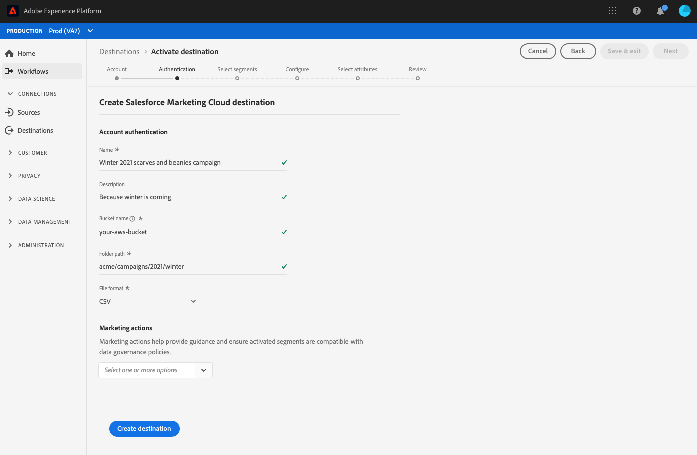

# [!DNL Salesforce Marketing Cloud] connection

[[!DNL Salesforce Marketing Cloud]](https://www.salesforce.com/products/marketing-cloud/email-marketing/) è una suite di marketing digitale precedentemente nota come ExactTarget che consente di creare e personalizzare percorsi per visitatori e clienti per personalizzare la loro esperienza.

Per inviare i dati del segmento a [!DNL Salesforce Marketing Cloud], è necessario prima [collegare la destinazione](#connect-destination) nella piattaforma, quindi [impostare un&#39;importazione di dati](#import-data-into-salesforce) dalla posizione di archiviazione in [!DNL Salesforce Marketing Cloud].

## Tipo di esportazione {#export-type}

**Basato**  su profilo: si esportano tutti i membri di un segmento, insieme ai campi dello schema desiderati (ad esempio: indirizzo e-mail, numero di telefono, cognome), come scelto nella schermata degli attributi selezionati del flusso di lavoro [ di attivazione della ](../../ui/activate-destinations.md#select-attributes)destinazione.

## Destinazione Connect {#connect-destination}

In **[!UICONTROL Connections]** > **[!UICONTROL Destinations]**, selezionare [!DNL Salesforce Marketing Cloud], quindi selezionare **[!UICONTROL Connect destination]**.

Nel passaggio **[!UICONTROL Authentication]**, se in precedenza è stata impostata una connessione alla destinazione di archiviazione cloud, selezionare **[!UICONTROL Existing Account]** e selezionare una delle connessioni esistenti. In alternativa, è possibile selezionare **[!UICONTROL New Account]** per impostare una nuova connessione. Compilate le credenziali di autenticazione dell&#39;account e selezionate **[!UICONTROL Connect to destination]**. Per [!DNL Salesforce Marketing Cloud], è possibile selezionare tra **[!UICONTROL SFTP with Password]** e **[!UICONTROL SFTP with SSH Key]**. Compila le informazioni riportate di seguito, a seconda del tipo di connessione, e seleziona **[!UICONTROL Connect to destination]**.

Per le connessioni **[!UICONTROL SFTP with Password]**, dovete fornire Domain, Port, UserName e Password.

Per le connessioni **[!UICONTROL SFTP with SSH Key]**, è necessario fornire Domain, Port, Username e SSH Key.

Nel passaggio **[!UICONTROL Setup]**, compila le informazioni rilevanti per la tua destinazione come indicato di seguito:
- **[!UICONTROL Name]**: Scegli un nome appropriato per la tua destinazione.
- **[!UICONTROL Description]**: Inserite una descrizione per la destinazione.
- **[!UICONTROL Folder Path]**: Specificate il percorso nel percorso di archiviazione in cui Platform depositerà i dati di esportazione come file CSV o delimitati da tabulazioni.
- **[!UICONTROL File Format]**: **[!UICONTROL CSV]** o **[!UICONTROL TAB_DELIMITED]**. Selezionare il formato di file da esportare nel percorso di memorizzazione.

Fare clic su **[!UICONTROL Create destination]** dopo aver compilato i campi riportati sopra. La destinazione è ora connessa e potete [attivare i segmenti](../../ui/activate-destinations.md) alla destinazione.

## Attivare i segmenti {#activate-segments}

Per informazioni sul flusso di lavoro di attivazione dei segmenti, vedere [Attivare profili e segmenti in una destinazione](../../ui/activate-destinations.md).

## Attributi di destinazione {#destination-attributes}

Quando si attivano [segmenti](../../ui/activate-destinations.md) alla destinazione [!DNL Salesforce Marketing Cloud], è consigliabile selezionare un identificatore univoco dal [schema unione](../../../profile/home.md#profile-fragments-and-union-schemas). Selezionate l’identificatore univoco ed eventuali altri campi XDM da esportare nella destinazione. Per ulteriori informazioni, vedere [Selezionare i campi dello schema da utilizzare come attributi di destinazione nei file esportati](./overview.md#destination-attributes) in Destinazioni marketing e-mail.

## Dati esportati {#exported-data}

Per le destinazioni [!DNL Salesforce Marketing Cloud], Platform crea un file delimitato da tabulazioni `.txt` o `.csv` nel percorso di archiviazione fornito. Per ulteriori informazioni sui file, vedi [Destinazioni di marketing e archiviazione di e-mail e Cloud](../../ui/activate-destinations.md#esp-and-cloud-storage) nell&#39;esercitazione sull&#39;attivazione dei segmenti.

## Imposta l&#39;importazione dei dati in [!DNL Salesforce Marketing Cloud] {#import-data-into-salesforce}

Dopo aver collegato la piattaforma allo storage [!DNL Amazon S3] o SFTP, è necessario impostare l&#39;importazione dei dati dalla posizione di archiviazione in [!DNL Salesforce Marketing Cloud]. Per ulteriori informazioni su come eseguire questa operazione, vedere [Importazione di utenti iscritti in Marketing Cloud da un file](https://help.salesforce.com/articleView?id=mc_es_import_subscribers_from_file.htm&amp;type=5) in [!DNL Salesforce Help Center].