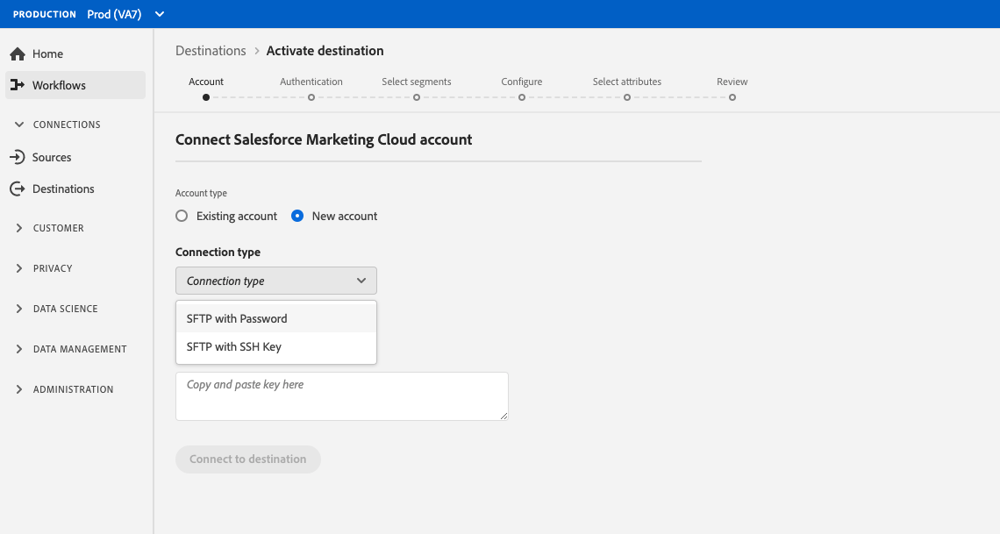

# [!DNL Salesforce Marketing Cloud] connection

## Panoramica {#overview}

[[!DNL Salesforce Marketing Cloud]](https://www.salesforce.com/products/marketing-cloud/email-marketing/) è una suite di marketing digitale precedentemente nota come ExactTarget che consente di creare e personalizzare percorsi per visitatori e clienti per personalizzare la loro esperienza.

Per inviare i dati dei segmenti a [!DNL Salesforce Marketing Cloud], è necessario prima [collegare la destinazione](#connect-destination) in Platform, quindi [impostare un&#39;importazione di dati](#import-data-into-salesforce) dal percorso di archiviazione in [!DNL Salesforce Marketing Cloud].

## Tipo di esportazione {#export-type}

**Basato su profilo** : stai esportando tutti i membri di un segmento, insieme ai campi dello schema desiderati (ad esempio: indirizzo e-mail, numero di telefono, cognome), come scelto dalla schermata seleziona attributi del flusso di lavoro [ di attivazione della ](../../ui/activate-destinations.md#select-attributes)destinazione.

## ELENCO CONSENTITI di indirizzi IP {#allow-list}

Quando si impostano le destinazioni di marketing e-mail con l’archiviazione SFTP, Adobe consiglia di aggiungere determinati intervalli IP al proprio elenco consentiti.

Per aggiungere IP di Adobe al tuo elenco consentiti, fai riferimento all’ [elenco consentiti di indirizzi IP per le destinazioni di archiviazione cloud](../cloud-storage/ip-address-allow-list.md) .

## Collegare la destinazione {#connect-destination}

In **[!UICONTROL Connections]** > **[!UICONTROL Destinations]**, selezionare [!DNL Salesforce Marketing Cloud], quindi selezionare **[!UICONTROL Configure]**.

Nel passaggio **[!UICONTROL Account]**, se in precedenza hai impostato una connessione alla destinazione di archiviazione cloud, seleziona **[!UICONTROL Existing Account]** e seleziona una delle connessioni esistenti. In alternativa, è possibile selezionare **[!UICONTROL New Account]** per impostare una nuova connessione. Immetti le credenziali di autenticazione del tuo account e seleziona **[!UICONTROL Connect to destination]**. Per [!DNL Salesforce Marketing Cloud], puoi selezionare tra **[!UICONTROL SFTP with Password]** e **[!UICONTROL SFTP with SSH Key]**.

Compila le informazioni seguenti, a seconda del tipo di connessione, e seleziona **[!UICONTROL Configure]**.

- Per le connessioni **[!UICONTROL SFTP with Password]**, è necessario specificare [!UICONTROL Domain], [!UICONTROL Port], [!UICONTROL Username] e [!UICONTROL Password].
- Per le connessioni **[!UICONTROL SFTP with SSH Key]**, è necessario specificare [!UICONTROL Domain], [!UICONTROL Port], [!UICONTROL Username] e [!UICONTROL SSH Key].

Facoltativamente, puoi allegare la tua chiave pubblica in formato RSA per aggiungere la crittografia con PGP/GPG ai file esportati nella sezione **[!UICONTROL Key]** . La chiave pubblica deve essere scritta come stringa codificata [!DNL Base64].

Nel passaggio **[!UICONTROL Authentication]** , compila le informazioni rilevanti per la tua destinazione come mostrato di seguito:
- **[!UICONTROL Name]**: Scegli un nome appropriato per la destinazione.
- **[!UICONTROL Description]**: Inserisci una descrizione per la destinazione.
- **[!UICONTROL Folder Path]**: Fornisci il percorso nel percorso di archiviazione in cui Platform depositerà i dati di esportazione come file CSV o delimitati da tabulazioni.
- **[!UICONTROL File Format]**:  **** CSVo  **TAB_DELIMITTED**. Selezionare il formato di file da esportare nel percorso di archiviazione.
- **[!UICONTROL Marketing actions]**: Le azioni di marketing indicano l’intento per il quale i dati verranno esportati nella destinazione. Puoi scegliere tra azioni di marketing definite da Adobi o creare una tua azione di marketing. Per ulteriori informazioni sulle azioni di marketing, consulta la [Panoramica sui criteri di utilizzo dei dati](../../../data-governance/policies/overview.md).

<!--

Commenting out Amazon S3 bucket part for now until support is clarified

- **[!UICONTROL Bucket name]**: Your Amazon S3 bucket, where Platform will deposit the data export. Your input must be between 3 and 63 characters long. Must begin and end with a letter or number. Must contain only lowercase letters, numbers, or hyphens ( - ). Must not be formatted as an IP address (for example, 192.100.1.1).

-->

Fai clic su **[!UICONTROL Create destination]** dopo aver compilato i campi sopra riportati. La destinazione è ora connessa ed è possibile [attivare segmenti](../../ui/activate-destinations.md) alla destinazione.

## Attiva segmenti {#activate-segments}

Per informazioni sul flusso di lavoro di attivazione dei segmenti, consulta [Attivare profili e segmenti su una destinazione](../../ui/activate-destinations.md) .

## Attributi di destinazione {#destination-attributes}

Quando si attivano [i segmenti](../../ui/activate-destinations.md) alla destinazione [!DNL Salesforce Marketing Cloud], l&#39;Adobe consiglia di selezionare un identificatore univoco dal proprio [schema di unione](../../../profile/home.md#profile-fragments-and-union-schemas). Seleziona l’identificatore univoco e tutti gli altri campi XDM da esportare nella destinazione. Per ulteriori informazioni, consulta [Selezionare i campi dello schema da utilizzare come attributi di destinazione nei file esportati](./overview.md#destination-attributes).

## Dati esportati {#exported-data}

Per le destinazioni [!DNL Salesforce Marketing Cloud], Platform crea un file `.txt` o `.csv` delimitato da tabulazioni nel percorso di archiviazione fornito. Per ulteriori informazioni sui file, consulta [Destinazioni di e-mail marketing e destinazioni di archiviazione Cloud](../../ui/activate-destinations.md#esp-and-cloud-storage) nell’esercitazione sull’attivazione dei segmenti.

## Imposta l’importazione di dati in [!DNL Salesforce Marketing Cloud] {#import-data-into-salesforce}

Dopo aver effettuato la connessione di [!DNL Platform] all&#39;archiviazione SFTP, devi impostare l&#39;importazione di dati dal percorso di archiviazione in [!DNL Salesforce Marketing Cloud]. Per informazioni su come eseguire questa operazione, consulta [Importazione di Sottoscrittori in un Marketing Cloud da un file](https://help.salesforce.com/articleView?id=mc_es_import_subscribers_from_file.htm&amp;type=5) in [!DNL Salesforce Help Center].
