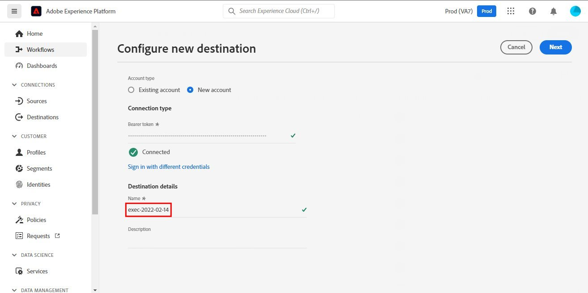

# Connessione [!DNL SendGrid]

## Panoramica {#overview}

[SendGrid](https://www.sendgrid.com) è una piattaforma di comunicazione con i clienti molto diffusa per le e-mail transazionali e di marketing.

Questa [!DNL Adobe Experience Platform] [destinazione](/help/destinations/home.md) sfrutta [[!DNL SendGrid Marketing Contacts API]](https://api.sendgrid.com/v3/marketing/contacts), che ti consente di esportare i profili e-mail di prime parti e di attivarli all&#39;interno di un nuovo pubblico SendGrid per le tue esigenze aziendali.

SendGrid utilizza token API bearer come meccanismo di autenticazione per comunicare con l’API SendGrid.

## Prerequisiti {#prerequisites}

Prima di iniziare a configurare la destinazione sono necessari i seguenti elementi.

1. È necessario disporre di un account SendGrid.
   * Passare alla pagina [abbonamento](https://signup.sendgrid.com/) di SendGrid per registrarsi e creare un account SendGrid, se non ne è già disponibile uno.
1. Dopo aver effettuato l’accesso al portale SendGrid, è necessario generare anche un token API.
1. Passare al sito Web SendGrid e accedere alla pagina **[!DNL Settings]** > **[!DNL API Keys]**. In alternativa, fare riferimento alla [documentazione SendGrid](https://app.sendgrid.com/settings/api_keys) per accedere alla sezione appropriata nell&#39;app SendGrid.
1. Infine, selezionare il pulsante **[!DNL Create API Key]**.
   * Consulta la [documentazione di SendGrid](https://docs.sendgrid.com/ui/account-and-settings/api-keys#creating-an-api-key), se hai bisogno di istruzioni sulle azioni da eseguire.
   * Se desideri generare la chiave API a livello di programmazione, consulta la [documentazione SendGrid](https://docs.sendgrid.com/api-reference/api-keys/create-api-keys).

Prima di attivare i dati nella destinazione SendGrid, è necessario creare uno [schema](https://experienceleague.adobe.com/docs/experience-platform/xdm/schema/composition.html?lang=it), un [set di dati](https://experienceleague.adobe.com/docs/platform-learn/tutorials/data-ingestion/create-datasets-and-ingest-data.html) e [segmenti](https://experienceleague.adobe.com/docs/platform-learn/tutorials/segments/create-segments.html) in [!DNL Experience Platform]. Consulta anche la sezione [limits](#limits) più avanti in questa pagina.

>[!IMPORTANT]
>
>* L’API SendGrid utilizzata per creare la mailing list dai profili e-mail richiede di fornire indirizzi e-mail univoci all’interno di ciascun profilo. Indipendentemente dal fatto che venga utilizzato come valore per *e-mail* o *e-mail alternativa*. Poiché la connessione SendGrid supporta mapping sia per i valori di posta elettronica che per quelli alternativi, verificare che tutti gli indirizzi di posta elettronica utilizzati siano univoci all&#39;interno di ogni profilo del *set di dati*. In caso contrario, quando i profili e-mail vengono inviati a SendGrid, si verifica un errore e il profilo e-mail non è presente nell’esportazione dei dati.
>
>* Attualmente, non è disponibile alcuna funzionalità per rimuovere i profili da SendGrid quando vengono rimossi dai tipi di pubblico in Experience Platform.

## Identità supportate {#supported-identities}

SendGrid supporta l&#39;attivazione delle identità descritte nella tabella seguente. Ulteriori informazioni su [identità](/help/identity-service/features/namespaces.md).

| Identità di destinazione | Descrizione | Considerazioni |
|---|---|---|
| e-mail | Indirizzo e-mail | Nota che gli indirizzi e-mail con hash SHA256 e testo normale sono supportati da [!DNL Adobe Experience Platform]. Se il campo di origine di Experience Platform contiene attributi senza hash, seleziona l&#39;opzione **[!UICONTROL Applica trasformazione]** per impostare [!DNL Platform] per l&#39;hash automatico dei dati all&#39;attivazione.   Si noti che **SendGrid** non supporta indirizzi e-mail con hash, pertanto solo i dati di testo normale senza trasformazione vengono inviati alla destinazione. |

{style="table-layout:auto"}

## Tipo e frequenza di esportazione {#export-type-frequency}

Per informazioni sul tipo e sulla frequenza di esportazione della destinazione, consulta la tabella seguente.

| Elemento | Tipo | Note |
---------|----------|---------|
| Tipo di esportazione | **[!UICONTROL Basato su profilo]** | Stai esportando tutti i membri di un segmento, insieme ai campi dello schema desiderati (ad esempio: indirizzo e-mail, numero di telefono, cognome), come scelto nella schermata seleziona attributi profilo del [flusso di lavoro di attivazione della destinazione](/help/destinations/ui/activate-batch-profile-destinations.md#select-attributes). |
| Frequenza di esportazione | **[!UICONTROL Streaming]** | Le destinazioni di streaming sono connessioni &quot;sempre attive&quot; basate su API. Non appena un profilo viene aggiornato in Experience Platform in base alla valutazione del pubblico, il connettore invia l’aggiornamento a valle alla piattaforma di destinazione. Ulteriori informazioni sulle [destinazioni di streaming](/help/destinations/destination-types.md#streaming-destinations). |

{style="table-layout:auto"}

## Casi d’uso {#use-cases}

Per capire meglio come e quando utilizzare la destinazione SendGrid, ecco alcuni esempi di casi d&#39;uso che i clienti [!DNL Experience Platform] possono risolvere utilizzando questa destinazione.

### Creare un elenco di marketing per più attività di marketing

I team di marketing che utilizzano SendGrid possono creare una mailing list all’interno di SendGrid e compilarla con indirizzi e-mail. La mailing list ora creata in SendGrid può essere successivamente utilizzata per più attività di marketing.

## Connetti alla destinazione {#connect}

>[!IMPORTANT]
> 
>Per connettersi alla destinazione, sono necessarie le **[!UICONTROL Destinazioni visualizzazione]** e le **[!UICONTROL Autorizzazioni di gestione delle destinazioni]** [per il controllo degli accessi](/help/access-control/home.md#permissions). Leggi la [panoramica sul controllo degli accessi](/help/access-control/ui/overview.md) o contatta l&#39;amministratore del prodotto per ottenere le autorizzazioni necessarie.

Per connettersi a questa destinazione, seguire i passaggi descritti nell&#39;esercitazione [sulla configurazione della destinazione](../../ui/connect-destination.md). Nel flusso di lavoro di configurazione della destinazione, compila i campi elencati nelle due sezioni seguenti.

### Autenticarsi nella destinazione {#authenticate}

1. Nella console [!DNL Adobe Experience Platform], passa a **Destinazioni**.

1. Selezionare la scheda **Catalogo** e cercare *InviaGriglia*. Quindi selezionare **Configura**. Dopo aver stabilito una connessione alla destinazione, l&#39;etichetta dell&#39;interfaccia utente diventa **Attiva segmenti**.
   

1. Viene visualizzata una procedura guidata che consente di configurare la destinazione SendGrid. Creare la nuova destinazione selezionando **Configura nuova destinazione**.
   

1. Seleziona l&#39;opzione **Nuovo account** e compila il valore **Bearer Token**. Questo valore è la chiave *API* SendGrid precedentemente menzionata nella [sezione prerequisiti](#prerequisites).
   

1. Selezionare **Connetti alla destinazione**. Se la *Chiave API* SendGrid fornita è valida, nell&#39;interfaccia utente viene visualizzato lo stato **Connesso** con un segno di spunta verde. Sarà quindi possibile procedere al passaggio successivo per compilare i campi delle informazioni aggiuntive.

### Inserire i dettagli della destinazione {#destination-details}

Durante la [configurazione](https://experienceleague.adobe.com/docs/experience-platform/destinations/ui/connect-destination.html) di questa destinazione, è necessario fornire le seguenti informazioni:

* **[!UICONTROL Nome]**: il nome con cui riconoscerai questa destinazione in futuro.
* **[!UICONTROL Descrizione]**: una descrizione facoltativa che ti aiuterà a identificare questa destinazione in futuro.

### Abilita avvisi {#enable-alerts}

Puoi abilitare gli avvisi per ricevere notifiche sullo stato del flusso di dati verso la tua destinazione. Seleziona un avviso dall’elenco per abbonarti e ricevere notifiche sullo stato del flusso di dati. Per ulteriori informazioni sugli avvisi, consulta la guida su [abbonamento a destinazioni avvisi tramite l&#39;interfaccia utente](../../ui/alerts.md).

Dopo aver fornito i dettagli per la connessione di destinazione, seleziona **[!UICONTROL Avanti]**.

## Attivare tipi di pubblico in questa destinazione {#activate}

>[!IMPORTANT]
> 
>* Per attivare i dati, è necessario **[!UICONTROL Visualizza destinazioni]**, **[!UICONTROL Attiva destinazioni]**, **[!UICONTROL Visualizza profili]** e **[!UICONTROL Visualizza segmenti]** [Autorizzazioni di controllo di accesso](/help/access-control/home.md#permissions). Leggi la [panoramica sul controllo degli accessi](/help/access-control/ui/overview.md) o contatta l&#39;amministratore del prodotto per ottenere le autorizzazioni necessarie.
>* Per esportare *identità*, è necessario disporre dell&#39;autorizzazione **[!UICONTROL Visualizza grafo identità]** [Controllo di accesso](/help/access-control/home.md#permissions).   {width="100" zoomable="yes"}

Leggi [Attivare profili e tipi di pubblico nelle destinazioni di esportazione del pubblico di streaming](/help/destinations/ui/activate-segment-streaming-destinations.md) per le istruzioni sull&#39;attivazione dei tipi di pubblico in questa destinazione.

Per informazioni specifiche su questa destinazione, fai riferimento alle immagini seguenti.

1. Seleziona uno o più tipi di pubblico da esportare in SendGrid.
   

1. Nel passaggio **[!UICONTROL Mappatura]**, dopo aver selezionato **[!UICONTROL Aggiungi nuova mappatura]**, viene visualizzata la pagina di mappatura per mappare i campi XDM di origine ai campi di destinazione dell&#39;API SendGrid. Nelle immagini seguenti viene illustrato come mappare gli spazi dei nomi di identità tra Experience Platform e SendGrid. Assicurati che il campo **[!UICONTROL Source]** *E-mail* sia mappato al campo **[!UICONTROL Target]** *external_id* come mostrato di seguito.
   
   
   
   

1. Analogamente, mappare gli attributi [!DNL Adobe Experience Platform] desiderati da esportare nella destinazione SendGrid.
   
   

1. Dopo aver completato i mapping, seleziona **[!UICONTROL Avanti]** per passare alla schermata di revisione.
   

1. Seleziona **[!UICONTROL Fine]** per completare l&#39;installazione.
   

Di seguito è riportato l&#39;elenco completo dei mapping di attributi supportati che è possibile impostare per [SendGrid Marketing Contacts > Add or Update Contact API](https://docs.sendgrid.com/api-reference/contacts/add-or-update-a-contact).

| Campo origine | Campo di destinazione | Tipo | Descrizione | Limiti |
|---|---|---|---|---|
| xdm:  homeAddress.street1 | xdm:  address_line_1 | Stringa | La prima riga dell’indirizzo. | Lunghezza massima:  100 caratteri |
| xdm:  homeAddress.street2 | xdm:  address_line_2 | Stringa | Seconda riga facoltativa per l&#39;indirizzo. | Lunghezza massima:  100 caratteri |
| xdm:  _extconndev.alternate_emails | xdm:  e-mail_alternative | Array di stringa | Altre e-mail associate al contatto. | <ul><li>Max.: 5 elementi</li><li>Min: 0 elementi</li></ul> |
| xdm:  homeAddress.city | xdm:  città | Stringa | La città del contatto. | Lunghezza massima:  60 caratteri |
| xdm:  homeAddress.country | xdm:  paese | Stringa | Il paese del contatto. Può essere un nome completo o un&#39;abbreviazione. | Lunghezza massima:  50 caratteri |
| IdentityMap:  e-mail | Identità:   external_id | Stringa | Indirizzo e-mail principale del contatto. Deve essere un messaggio e-mail valido. | Lunghezza massima:  254 caratteri |
| xdm:  person.name.firstName | xdm:  first_name | Stringa | Nome del contatto | Lunghezza massima:  50 caratteri |
| xdm:  person.name.lastName | xdm:  cognome | Stringa | Cognome del contatto | Lunghezza massima:  50 caratteri |
| xdm:  homeAddress.postalCode | xdm:  postal_code | Stringa | Codice postale del contatto o altro codice postale. | |
| xdm:  homeAddress.stateProvince | xdm:  state_province_region | Stringa | Stato, provincia o regione del contatto. | Lunghezza massima:  50 caratteri |

## Convalidare l’esportazione dei dati in SendGrid {#validate}

Per verificare di aver impostato correttamente la destinazione, segui i passaggi seguenti:

1. Seleziona **[!UICONTROL Destinazioni]** > **[!UICONTROL Sfoglia]** per passare all&#39;elenco delle destinazioni.
   

1. Selezionare la destinazione e verificare che lo stato sia **[!UICONTROL abilitato]**.
   

1. Passa alla scheda **[!DNL Activation data]**, quindi seleziona un nome di pubblico.
   

1. Monitora il riepilogo del pubblico e controlla che il conteggio dei profili corrisponda al conteggio creato all’interno del set di dati.
   

1. L&#39;API [SendGrid Marketing Lists > Create List](https://docs.sendgrid.com/api-reference/lists/create-list) viene utilizzata per creare elenchi di contatti univoci all&#39;interno di SendGrid unendo il valore dell&#39;attributo *list_name* e la marca temporale dell&#39;esportazione dei dati. Passare al sito SendGrid e verificare se è stato creato il nuovo elenco di contatti conforme al modello di nome.
   
   

1. Seleziona l’elenco dei contatti appena creato e verifica se il nuovo record e-mail dal set di dati creato viene popolato all’interno del nuovo elenco dei contatti.

1. Inoltre, controlla anche un paio di e-mail per verificare se la mappatura del campo è corretta.
   
   

## Utilizzo dei dati e governance {#data-usage-governance}

Tutte le destinazioni [!DNL Adobe Experience Platform] sono conformi ai criteri di utilizzo dei dati durante la gestione dei dati. Per informazioni dettagliate su come [!DNL Adobe Experience Platform] applica la governance dei dati, vedi [Panoramica sulla governance dei dati](/help/data-governance/home.md).

## Risorse aggiuntive {#additional-resources}

Questa destinazione SendGrid sfrutta le seguenti API:
* [Elenchi marketing SendGrid > Crea API elenco](https://docs.sendgrid.com/api-reference/lists/create-list)
* [Contatti di marketing SendGrid > Aggiungi o aggiorna API contatto](https://docs.sendgrid.com/api-reference/contacts/add-or-update-a-contact)

### Limiti {#limits}

* L&#39;API [Contatti di marketing SendGrid > Aggiungi o aggiorna contatto](https://api.sendgrid.com/v3/marketing/contacts) può accettare 30.000 contatti o 6 MB di dati, a seconda di quale valore sia inferiore.
