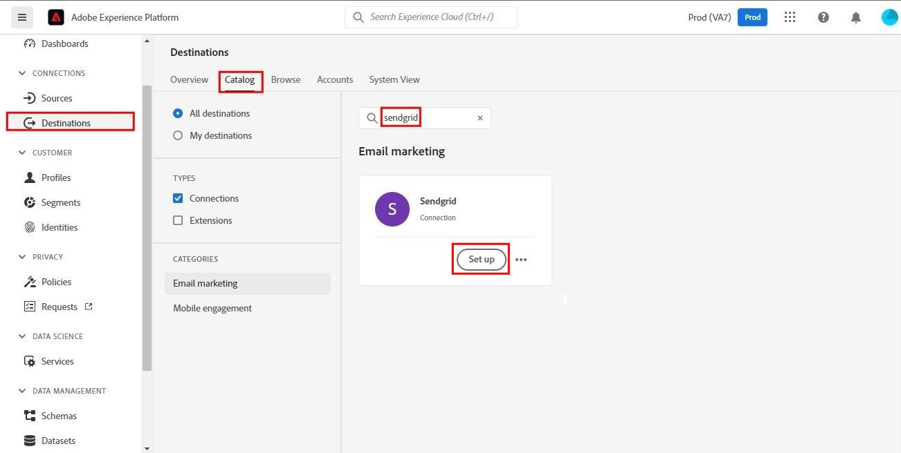
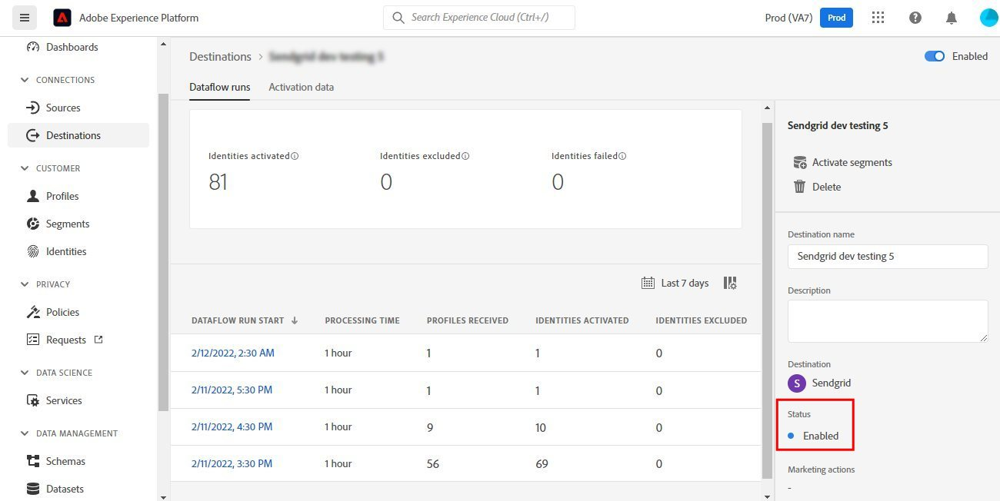

# [!DNL SendGrid] connection

## Panoramica {#overview}

[SendGrid](https://www.sendgrid.com) è una popolare piattaforma di comunicazione per le e-mail transazionali e di marketing.

Questo [!DNL Adobe Experience Platform] [destinazione](/help/destinations/home.md) sfrutta [[!DNL SendGrid Marketing Contacts API]](https://api.sendgrid.com/v3/marketing/contacts), che ti consente di esportare i profili e-mail di prime parti e attivarli all’interno di un nuovo segmento SendGrid per le tue esigenze aziendali.

SendGrid utilizza i token portatori API come meccanismo di autenticazione per comunicare con l’API SendGrid.

## Prerequisiti {#prerequisites}

Gli elementi seguenti sono necessari prima di iniziare a configurare la destinazione.

1. È necessario disporre di un account SendGrid.
   * Vai a SendGrid [iscrizione](https://signup.sendgrid.com/) per registrare e creare un account SendGrid, se non ne hai già uno.
1. Dopo aver effettuato l’accesso al portale SendGrid, è necessario generare anche un token API.
1. Passa al sito web SendGrid e accedi al **[!DNL Settings]** > **[!DNL API Keys]** pagina. In alternativa, fai riferimento alla [Documentazione SendGrid](https://app.sendgrid.com/settings/api_keys) per accedere alla sezione appropriata nell’app SendGrid.
1. Infine, seleziona la **[!DNL Create API Key]** pulsante .
   * Fai riferimento a [Documentazione SendGrid](https://docs.sendgrid.com/ui/account-and-settings/api-keys#creating-an-api-key), se hai bisogno di indicazioni sulle azioni da eseguire.
   * Se desideri generare la chiave API in modo programmatico, consulta la sezione [Documentazione SendGrid](https://docs.sendgrid.com/api-reference/api-keys/create-api-keys).

Prima di attivare i dati alla destinazione SendGrid, è necessario disporre di un [schema](https://experienceleague.adobe.com/docs/experience-platform/xdm/schema/composition.html?lang=it), [set di dati](https://experienceleague.adobe.com/docs/platform-learn/tutorials/data-ingestion/create-datasets-and-ingest-data.html?lang=en)e [segmenti](https://experienceleague.adobe.com/docs/platform-learn/tutorials/segments/create-segments.html?lang=en) creato in [!DNL Experience Platform]. Fai riferimento anche al [limiti](#limits) sezione più avanti in questa pagina.

>[!IMPORTANT]
>
>* L’API SendGrid utilizzata per creare la mailing list dai profili e-mail richiede che in ciascun profilo siano forniti indirizzi e-mail univoci. Indipendentemente dal fatto che venga utilizzato come valore per *email* o *e-mail alternativa*. Poiché la connessione SendGrid supporta le mappature sia per i valori di e-mail che per quelli di e-mail alternative, assicurati che tutti gli indirizzi e-mail utilizzati siano univoci all’interno di ciascun profilo della *Set di dati*. In caso contrario, quando i profili e-mail vengono inviati a SendGrid, si verifica un errore e il profilo e-mail non sarà presente nell’esportazione dei dati.
>
>* Al momento, non è disponibile alcuna funzionalità per rimuovere i profili da SendGrid quando vengono rimossi dai segmenti in Experience Platform.

## Identità supportate {#supported-identities}

SendGrid supporta l&#39;attivazione delle identità descritte nella tabella seguente. Ulteriori informazioni [identità](/help/identity-service/namespaces.md).

| Identità di destinazione | Descrizione | Considerazioni |
|---|---|---|
| e-mail | Indirizzo e-mail | Gli indirizzi e-mail con hash SHA256 e di testo normale sono supportati da [!DNL Adobe Experience Platform]. Se il campo di origine di Experience Platform contiene attributi senza hash, controlla la **[!UICONTROL Applica trasformazione]** opzione, per avere [!DNL Platform] hash automaticamente i dati all’attivazione.   Tieni presente che **SendGrid** non supporta gli indirizzi e-mail con hash, pertanto vengono inviati alla destinazione solo dati di testo normale senza trasformazione. |

{style=&quot;table-layout:auto&quot;}

## Tipo e frequenza di esportazione {#export-type-frequency}

Per informazioni sul tipo e sulla frequenza di esportazione della destinazione, fare riferimento alla tabella seguente.

| Elemento | Tipo | Note |
---------|----------|---------|
| Tipo di esportazione | **[!UICONTROL Basato su profilo]** | Stai esportando tutti i membri di un segmento, insieme ai campi dello schema desiderati (ad esempio: indirizzo e-mail, numero di telefono, cognome), come scelto nella schermata seleziona attributi profilo del [flusso di lavoro di attivazione della destinazione](/help/destinations/ui/activate-batch-profile-destinations.md#select-attributes). |
| Frequenza delle esportazioni | **[!UICONTROL Streaming]** | Le destinazioni di streaming sono connessioni basate su API &quot;sempre attive&quot;. Non appena un profilo viene aggiornato in Experience Platform in base alla valutazione del segmento, il connettore invia l’aggiornamento a valle alla piattaforma di destinazione. Ulteriori informazioni [destinazioni di streaming](/help/destinations/destination-types.md#streaming-destinations). |

{style=&quot;table-layout:auto&quot;}

## Casi d’uso {#use-cases}

Per comprendere meglio come e quando utilizzare la destinazione SendGrid, di seguito sono riportati alcuni esempi di casi di utilizzo che [!DNL Experience Platform] i clienti possono risolvere il problema utilizzando questa destinazione.

### Creare un elenco di marketing per più attività di marketing

I team di marketing che utilizzano SendGrid possono creare una mailing list all’interno di SendGrid e compilarla con indirizzi e-mail. La mailing list ora creata all’interno di SendGrid può essere successivamente utilizzata per più attività di marketing.

## Connetti alla destinazione {#connect}

>[!IMPORTANT]
> 
>Per connettersi alla destinazione, è necessario **[!UICONTROL Gestire le destinazioni]** [autorizzazione controllo accessi](/help/access-control/home.md#permissions). Leggi la sezione [panoramica sul controllo degli accessi](/help/access-control/ui/overview.md) oppure contatta l’amministratore del prodotto per ottenere le autorizzazioni richieste.

Per connettersi a questa destinazione, segui i passaggi descritti in [esercitazione sulla configurazione della destinazione](../../ui/connect-destination.md). I passaggi specifici di questa destinazione sono illustrati in dettaglio di seguito.

1. All&#39;interno di [!DNL Adobe Experience Platform] console, passa a **Destinazioni**.

1. Seleziona la **Catalogo** tabulazione e ricerca *SendGrid*. Quindi seleziona **Configurazione**. Dopo aver stabilito una connessione alla destinazione, l’etichetta dell’interfaccia utente diventa **Attiva segmenti**.
   

1. Viene visualizzata una procedura guidata che consente di configurare la destinazione SendGrid. Crea la nuova destinazione selezionando **Configurare una nuova destinazione**.
   

1. Seleziona la **Nuovo account** e compilare il **Token portatore** valore. Questo valore è SendGrid *Chiave API* precedentemente menzionato nel [sezione prerequisiti](#prerequisites).
   

1. Seleziona **Connetti alla destinazione**. Se la proprietà SendGrid *Chiave API* l’interfaccia utente fornita è valida; viene visualizzata una **Connesso** con un segno di spunta verde, puoi quindi procedere al passaggio successivo per compilare ulteriori campi di informazioni.

### Parametri di connessione {#parameters}

Quando [configurazione](https://experienceleague.adobe.com/docs/experience-platform/destinations/ui/connect-destination.html?lang=en) questa destinazione, devi fornire le seguenti informazioni:

* **[!UICONTROL Nome]**: Nome con cui riconoscerai questa destinazione in futuro.
* **[!UICONTROL Descrizione]**: Una descrizione facoltativa che ti aiuterà a identificare questa destinazione in futuro.

## Attiva i segmenti in questa destinazione {#activate}

>[!IMPORTANT]
> 
>Per attivare i dati, è necessario **[!UICONTROL Gestire le destinazioni]**, **[!UICONTROL Attivare le destinazioni]**, **[!UICONTROL Visualizza profili]** e **[!UICONTROL Visualizzare i segmenti]** [autorizzazioni di controllo accessi](/help/access-control/home.md#permissions). Leggi la sezione [panoramica sul controllo degli accessi](/help/access-control/ui/overview.md) oppure contatta l’amministratore del prodotto per ottenere le autorizzazioni richieste.

Leggi [Attivare profili e segmenti nelle destinazioni di esportazione dei segmenti in streaming](/help/destinations/ui/activate-segment-streaming-destinations.md) per istruzioni su come attivare i segmenti di pubblico a questa destinazione.

Fai riferimento alle immagini seguenti per i dettagli specifici di questa destinazione.

1. Selezionare uno o più segmenti da esportare in SendGrid.
   

1. In **[!UICONTROL Mappatura]** dopo aver selezionato **[!UICONTROL Aggiungi nuova mappatura]**, viene visualizzata la pagina di mappatura per mappare i campi XDM di origine ai campi di destinazione dell’API SendGrid. Le immagini seguenti mostrano come mappare i namespace di identità tra Experience Platform e SendGrid. Assicurati che **[!UICONTROL Campo di origine]** *E-mail* deve essere mappato **[!UICONTROL Campo di destinazione]** *external_id* come mostrato di seguito.
   

   
   
   

1. In modo analogo, mappa il [!DNL Adobe Experience Platform] gli attributi che si desidera esportare nella destinazione SendGrid.
   

   

1. Dopo aver completato le mappature, seleziona **[!UICONTROL Successivo]** per passare alla schermata di revisione.
   

1. Seleziona **[!UICONTROL Fine]** per completare la configurazione.
   

Elenco completo delle mappature degli attributi supportate che possono essere impostate per [InviaGrid Contatti marketing > Aggiungi o aggiorna API contatto](https://docs.sendgrid.com/api-reference/contacts/add-or-update-a-contact) è qui sotto.

| Campo di origine | Campo di destinazione | Tipo | Descrizione | Limiti |
|---|---|---|---|---|
| xdm:  homeAddress.street1 | xdm:  address_line_1 | Stringa | La prima riga dell&#39;indirizzo. | Lunghezza massima:  100 caratteri |
| xdm:  homeAddress.street2 | xdm:  address_line_2 | Stringa | Seconda riga facoltativa per l’indirizzo. | Lunghezza massima:  100 caratteri |
| xdm:  _extconndev.alternate_email | xdm:  email_alternative | Array di stringa | E-mail aggiuntive associate al contatto. | <ul><li>Max 5 elementi</li><li>Min: 0 elementi</li></ul> |
| xdm:  homeAddress.city | xdm:  città | Stringa | La città del contatto. | Lunghezza massima:  60 caratteri |
| xdm:  homeAddress.country | xdm:  paese | Stringa | Il paese del contatto. Può essere un nome completo o un&#39;abbreviazione. | Lunghezza massima:  50 caratteri |
| identityMap:  E-mail | Identità:  external_id | Stringa | L&#39;e-mail principale del contatto. Questa deve essere un&#39;e-mail valida. | Lunghezza massima:  254 caratteri |
| xdm:  person.name.firstName | xdm:  nome_primo | Stringa | Nome del contatto | Lunghezza massima:  50 caratteri |
| xdm:  person.name.lastName | xdm:  cognome | Stringa | Il cognome del contatto | Lunghezza massima:  50 caratteri |
| xdm:  homeAddress.postalCode | xdm:  CAP | Stringa | Codice postale del contatto o altro codice postale. |  |
| xdm:  homeAddress.stateProvince | xdm:  stato_provincia_regione | Stringa | Stato, provincia o regione del contatto. | Lunghezza massima:  50 caratteri |

## Convalida l’esportazione dei dati in SendGrid {#validate}

Per verificare di aver configurato correttamente la destinazione, effettua le seguenti operazioni:

1. Seleziona **[!UICONTROL Destinazioni]** > **[!UICONTROL Sfoglia]** per passare all’elenco delle destinazioni.
   

1. Selezionare la destinazione e verificare che lo stato sia **[!UICONTROL abilitato]**.
   

1. Passa alla **[!DNL Activation data]** , quindi seleziona un nome di segmento.
   

1. Monitora il riepilogo dei segmenti e controlla il conteggio dei profili corrispondente al conteggio creato all’interno del set di dati.
   

1. La [SendGrid Marketing Lists > Crea API elenco](https://docs.sendgrid.com/api-reference/lists/create-list) viene utilizzato per creare elenchi di contatti univoci all&#39;interno di SendGrid unendo il valore del *nome_elenco* e la marca temporale dell’esportazione dei dati. Passare al sito SendGrid e verificare se viene creato il nuovo elenco di contatti conforme al pattern di nome.
   

   

1. Seleziona l’elenco dei contatti appena creato e controlla se il nuovo record e-mail dal set di dati creato viene popolato all’interno del nuovo elenco di contatti.

1. Inoltre, controlla anche un paio di e-mail per convalidare se la mappatura del campo è corretta.
   

   

## Utilizzo e governance dei dati {#data-usage-governance}

Tutto [!DNL Adobe Experience Platform] le destinazioni sono conformi ai criteri di utilizzo dei dati durante la gestione dei dati. Per informazioni dettagliate su come [!DNL Adobe Experience Platform] applica la governance dei dati, vedi [Panoramica sulla governance dei dati](/help/data-governance/home.md).

## Risorse aggiuntive {#additional-resources}

Questa destinazione SendGrid sfrutta le API seguenti:
* [SendGrid Marketing Lists > Crea API elenco](https://docs.sendgrid.com/api-reference/lists/create-list)
* [InviaGrid Contatti marketing > Aggiungi o aggiorna API contatto](https://docs.sendgrid.com/api-reference/contacts/add-or-update-a-contact)

### Limiti {#limits}

* La [InviaGrid Contatti marketing > Aggiungi o aggiorna API contatto](https://api.sendgrid.com/v3/marketing/contacts) può accettare 30.000 contatti, o 6 MB di dati, a seconda di quale dei due è inferiore.
