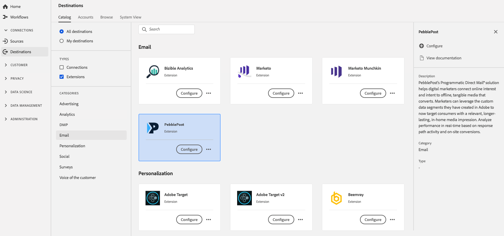

# Estensione [!DNL PebblePost] {#pebblepost-extension}

## Panoramica {#overview}

La soluzione [!DNL PebblePost's Programmatic Direct Mail] consente agli addetti al marketing digitale di collegare l&#39;interesse online e l&#39;intento a supporti tangibili offline per la conversione. Gli addetti al marketing possono sfruttare i tipi di pubblico di dati personalizzati creati in Adobe per indirizzare ora i consumatori con un’impressione rilevante, di più lunga durata, dei contenuti multimediali a casa. Analizza le prestazioni in tempo reale in base all’attività del percorso di risposta e alle conversioni nel sito.

[!DNL PebblePost] è un&#39;estensione e-mail in Adobe Experience Platform.

Questa destinazione è un’estensione tag. Per ulteriori informazioni sul funzionamento delle estensioni tag in Platform, consulta la [panoramica sulle estensioni tag](../launch-extensions/overview.md).

## Prerequisiti {#prerequisites}

Questa estensione è disponibile nel catalogo [!DNL Destinations] per tutti i clienti che hanno acquistato Platform.

Per utilizzare questa estensione, è necessario accedere ai tag in Adobe Experience Platform. I tag sono offerti ai clienti di Adobe Experience Cloud come funzionalità inclusa a valore aggiunto. Contatta l&#39;amministratore dell&#39;organizzazione per ottenere l&#39;accesso ai tag e chiedi loro di concederti l&#39;autorizzazione **[!UICONTROL manage_properties]** in modo da poter installare le estensioni.

## Installa estensione {#install-extension}

Per installare l&#39;estensione [!DNL PebblePost]:

Nell&#39;interfaccia [Platform](https://platform.adobe.com/), vai a **[!UICONTROL Destinazioni]** > **[!UICONTROL Catalogo]**.

Seleziona l’estensione dal catalogo o utilizza la barra di ricerca.

Fai clic sulla destinazione per evidenziarla, quindi seleziona **[!UICONTROL Configura]** nella barra a destra. Se il controllo **[!UICONTROL Configure]** è disattivato, manca l&#39;autorizzazione **[!UICONTROL manage_properties]**. Consulta [Prerequisiti](#prerequisites).

Seleziona la proprietà in cui desideri installare l’estensione. Puoi anche creare una nuova proprietà. Una proprietà è una raccolta di regole, elementi di dati, estensioni configurate, ambienti e librerie. Scopri le proprietà nella sezione [Proprietà](../../../tags/ui/administration/companies-and-properties.md#properties-page) della documentazione dei tag.

Il flusso di lavoro illustra i passaggi necessari per completare l’installazione.

Puoi anche installare l&#39;estensione direttamente nell&#39;[interfaccia utente di Data Collection](https://experience.adobe.com/it#/data-collection/). Per ulteriori informazioni, vedere la sezione relativa all&#39;[aggiunta di una nuova estensione](../../../tags/ui/managing-resources/extensions/overview.md#add-a-new-extension) nella documentazione dei tag.

## Come utilizzare l’estensione {#how-to-use}

Dopo aver installato l&#39;estensione, puoi avviare la configurazione delle regole.

Puoi impostare regole per le estensioni installate in modo da inviare dati evento alla destinazione dell&#39;estensione solo in determinate situazioni. Per ulteriori informazioni sulla configurazione delle regole per le estensioni, consulta la [documentazione sui tag](../../../tags/ui/managing-resources/rules.md).

## Configurare, aggiornare ed eliminare l’estensione {#configure-upgrade-delete}

Puoi configurare, aggiornare ed eliminare le estensioni nell’interfaccia utente di Data Collection.

>[!TIP]
>
>Se l&#39;estensione è già installata in una delle tue proprietà, nell&#39;interfaccia utente di Platform verrà comunque visualizzato **[!UICONTROL Installa]** per l&#39;estensione. Avvia il flusso di lavoro di installazione come descritto in [Installa estensione](#install-extension) per configurare o eliminare l&#39;estensione.

Per aggiornare l&#39;estensione, consulta la guida al [processo di aggiornamento dell&#39;estensione](../../../tags/ui/managing-resources/extensions/extension-upgrade.md) nella documentazione dei tag.
