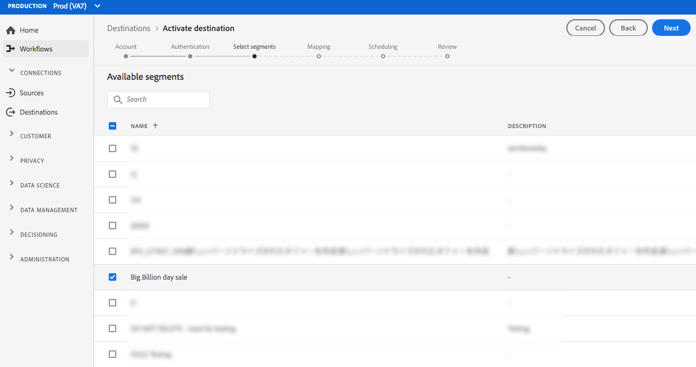

# (Beta) Connessione [!DNL Airship Attributes] {#airship-attributes-destination}

>[!IMPORTANT]
>
>La destinazione [!DNL Airship Attributes] in Adobe Experience Platform è attualmente in versione beta. La documentazione e le funzionalità sono soggette a modifiche.

[!DNL Airship] è la principale piattaforma di coinvolgimento dei clienti, che ti consente di distribuire messaggi omnicanale significativi e personalizzati agli utenti in ogni fase del ciclo di vita del cliente.

Questa integrazione trasmette  dati del profilo di Adobe in [!DNL Airship] come [Attributes](https://docs.airship.com/guides/audience/attributes/) per il targeting o l&#39;attivazione.

Per ulteriori informazioni su [!DNL Airship], vedere la [Airship Docs](https://docs.airship.com).

>[!TIP]
>
>Questa pagina della documentazione è stata creata dal team [!DNL Airship]. Per qualsiasi richiesta di informazioni o di aggiornamento, contattateli direttamente all&#39;indirizzo [support.airship.com](https://support.airship.com/).

## Prerequisiti {#prerequisites}

Prima di inviare i segmenti di pubblico a [!DNL Airship], devi:

* Abilitare gli attributi nel progetto [!DNL Airship].
* Generare un token al portatore per l&#39;autenticazione.

>[!TIP]
>
>Crea un account [!DNL Airship] tramite [questo collegamento di registrazione](https://go.airship.eu/accounts/register/plan/starter/), se non lo hai già fatto.

### Abilitare gli attributi {#enable-attributes}

Gli attributi di profilo Adobe Experience Platform sono simili agli attributi [!DNL Airship] e possono essere facilmente mappati l&#39;uno sull&#39;altro in Piattaforma utilizzando lo strumento di mappatura illustrato più avanti in questa pagina.

[!DNL Airship] i progetti hanno diversi attributi predefiniti e predefiniti. Se disponete di un attributo personalizzato, dovete definirlo prima in [!DNL Airship]. Per ulteriori informazioni, vedere [Configurare e gestire gli attributi](https://docs.airship.com/tutorials/audience/attributes/).

### Token portatore {#bearer-token}

Passare a **[!UICONTROL Settings]**&quot; **[!UICONTROL APIs & Integrations]** nel [Pannello di navigazione](https://go.airship.com) e selezionare **[!UICONTROL Tokens]** nel menu a sinistra.

Fai clic su **[!UICONTROL Create Token]**.

Immettete un nome di facile utilizzo per il token, ad esempio &quot;Destinazione attributi di Adobe&quot;, e selezionate &quot;Accesso completo&quot; per il ruolo.

Fare clic su **[!UICONTROL Create Token]** e salvare i dettagli come riservati.

## Casi d’uso {#use-cases}

Per comprendere meglio come e quando utilizzare la destinazione [!DNL Airship Attributes], di seguito sono riportati alcuni esempi di casi di utilizzo che i clienti Adobe Experience Platform possono risolvere utilizzando questa destinazione.

### Caso di utilizzo n. 1

Utilizza i dati del profilo raccolti in Adobe Experience Platform per personalizzare il messaggio e i contenuti avanzati all&#39;interno di uno dei canali [!DNL Airship]. Ad esempio, utilizzare i dati di profilo [!DNL Experience Platform] per impostare gli attributi di posizione all&#39;interno di [!DNL Airship]. In questo modo un marchio alberghiero potrà visualizzare un&#39;immagine per la posizione più vicina dell&#39;hotel per ogni utente.

### Caso di utilizzo n. 2

Utilizzate gli attributi di Adobe Experience Platform per arricchire ulteriormente i profili [!DNL Airship] e combinarli con dati SDK o [!DNL Airship] predittivi. Ad esempio, un rivenditore può creare un segmento con dati relativi allo stato di fedeltà e alla posizione (attributi dalla piattaforma) e [!DNL Airship] che prevede di inviare dati altamente mirati agli utenti che vivono a Las Vegas, NV e che hanno un&#39;alta probabilità di esecuzione.

## Connetti a [!DNL Airship Attributes] {#connect-airship-attributes}

In **[!UICONTROL Destinations]** > **[!UICONTROL Catalog]**, scorrere fino alla categoria **[!UICONTROL Mobile Engagement]**. Selezionare **[!DNL Airship Attributes]**, quindi selezionare **[!UICONTROL Configure]**.

>[!NOTE]
>
>Se esiste già una connessione con questa destinazione, è possibile visualizzare un pulsante **[!UICONTROL Activate]** sulla scheda di destinazione. Per ulteriori informazioni sulla differenza tra **[!UICONTROL Activate]** e **[!UICONTROL Configure]**, fare riferimento alla sezione [Catalog](../../ui/destinations-workspace.md#catalog) della documentazione relativa all&#39;area di lavoro di destinazione.

Nel passaggio **Account**, se in precedenza è stata impostata una connessione alla destinazione [!DNL Airship Attributes], selezionare **[!UICONTROL Existing Account]** e selezionare la connessione esistente. In alternativa, è possibile selezionare **[!UICONTROL New Account]** per impostare una nuova connessione a [!DNL Airship Attributes]. Selezionare **[!UICONTROL Connect to destination]** per collegare Adobe Experience Platform al progetto [!DNL Airship] utilizzando il token del portatore generato dal dashboard [!DNL Airship].

>[!NOTE]
>
>Adobe Experience Platform supporta la convalida delle credenziali nel processo di autenticazione e visualizza un messaggio di errore se vengono immesse credenziali non corrette nell&#39;account [!DNL Airship]. In questo modo si evita di completare il flusso di lavoro con credenziali non corrette.

Una volta confermate le credenziali e che Adobe Experience Platform è connesso al progetto [!DNL Airship], puoi selezionare **[!UICONTROL Next]** per passare al passaggio **[!UICONTROL Setup]**.

Nel passaggio **[!UICONTROL Authentication]**, immettete un **[!UICONTROL Name]** e un **[!UICONTROL Description]** per il flusso di attivazione.

Inoltre, in questo passaggio è possibile selezionare un centro dati USA o UE, a seconda del centro dati [!DNL Airship] applicato a questa destinazione. Infine, selezionare uno o più casi di utilizzo del marketing per i quali i dati verranno esportati nella destinazione. Puoi scegliere tra  casi di utilizzo di marketing definiti dal Adobe o creare un tuo. Per ulteriori informazioni sui casi di utilizzo del marketing, vedere la [panoramica dei criteri di utilizzo dei dati](../../../data-governance/policies/overview.md).

Selezionare **[!UICONTROL Create Destination]** dopo aver compilato i campi riportati sopra.

La destinazione è stata creata. È possibile selezionare **[!UICONTROL Save & Exit]** se si desidera attivare i segmenti in un secondo momento oppure selezionare **[!UICONTROL Next]** per continuare il flusso di lavoro e selezionare i segmenti da attivare. In entrambi i casi, vedere la sezione successiva, [Attivare i segmenti](#activate-segments), per il resto del flusso di lavoro.

## Attivare i segmenti {#activate-segments}

Per attivare i segmenti in [!DNL Airship Attributes], segui i passaggi seguenti:

In **[!UICONTROL Destinations > Browse]**, selezionare la destinazione [!DNL Airship Attributes] in cui si desidera attivare i segmenti.

Fare clic sul nome della destinazione. Viene quindi visualizzato il flusso Activate (Attiva).

Se esiste già un flusso di attivazione per una destinazione, puoi vedere i segmenti attualmente inviati alla destinazione. Selezionate **[!UICONTROL Edit activation]** nella barra a destra e seguite i passaggi indicati di seguito per modificare i dettagli di attivazione.

Seleziona **[!UICONTROL Activate]**. Nel flusso di lavoro **[!UICONTROL Activate destination]**, nella pagina **[!UICONTROL Select Segments]**, selezionare i segmenti da inviare a [!DNL Airship Attributes].

Nel passaggio **[!UICONTROL Mapping]**, selezionare gli attributi e le identità dallo schema [XDM](../../../xdm/home.md) da mappare allo schema di destinazione. Selezionare **[!UICONTROL Add new mapping]** per esplorare lo schema e mapparlo sull&#39;identità di destinazione corrispondente.

[!DNL Airship] gli attributi possono essere impostati su un canale, che rappresenta l&#39;istanza del dispositivo, ad esempio l&#39;iPhone, o un utente con nome, che mappa tutti i dispositivi di un utente con un identificatore comune, ad esempio un ID cliente. Se nello schema sono presenti indirizzi e-mail di testo normale (senza hash) come identità principale, selezionare il campo e-mail in **[!UICONTROL Source Attributes]** e mappare l&#39;utente [!DNL Airship] denominato nella colonna destra sotto **[!UICONTROL Target Identities]**, come mostrato di seguito.

Per gli identificatori che devono essere mappati su un canale, ad esempio un dispositivo, mappati sul canale appropriato in base all&#39;origine. Le immagini seguenti mostrano come vengono create due mappature:

* ID pubblicitario iOS IDFA su un canale [!DNL Airship] iOS
*  l&#39;attributo `fullName` dell&#39;Adobe all&#39;attributo [!DNL Airship] &quot;Full Name&quot;

>[!NOTE]
>
>Per selezionare il campo di destinazione per la mappatura degli attributi, usate il nome descrittivo visualizzato nel dashboard [!DNL Airship].

**Identità mappa**

Selezionare il campo di origine:

Selezionare il campo di destinazione:

**Attributi mappa**

Seleziona attributo di origine:

Seleziona attributo di destinazione:

Verifica mappatura:

Nella pagina **[!UICONTROL Segment schedule]**, la pianificazione è attualmente disattivata. Fare clic su **[!UICONTROL Next]** per continuare con il passaggio di revisione.

Nella pagina **[!UICONTROL Review]** è possibile visualizzare un riepilogo della selezione. Selezionare **[!UICONTROL Cancel]** per interrompere il flusso, **[!UICONTROL Back]** per modificare le impostazioni, oppure **[!UICONTROL Finish]** per confermare la selezione e iniziare a inviare i dati alla destinazione.

>[!IMPORTANT]
>
>In questo passaggio, Adobe Experience Platform verifica la presenza di violazioni dei criteri di utilizzo dei dati. Di seguito è riportato un esempio di violazione di un criterio. Non puoi completare il flusso di lavoro di attivazione del segmento finché non hai risolto la violazione. Per informazioni su come risolvere le violazioni dei criteri, vedere [Applicazione dei criteri](../../../data-governance/enforcement/auto-enforcement.md) nella sezione della documentazione sulla governance dei dati.

Se non sono state rilevate violazioni dei criteri, selezionare **[!UICONTROL Finish]** per confermare la selezione e iniziare a inviare i dati alla destinazione.

## Utilizzo e governance dei dati {#data-usage-governance}

Tutte le destinazioni [!DNL Adobe Experience Platform] sono conformi ai criteri di utilizzo dei dati durante la gestione dei dati. Per informazioni dettagliate su come [!DNL Adobe Experience Platform] applica la governance dei dati, vedere la [Panoramica sulla governance dei dati](../../../data-governance/home.md).
