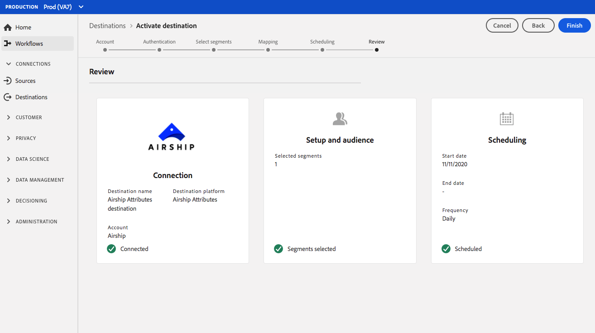

# (Beta) [!DNL Airship Attributes] destinazione {#airship-attributes-destination}

>[!IMPORTANT]
>
>La [!DNL Airship Attributes] destinazione in Adobe Experience Platform è attualmente in versione beta. La documentazione e le funzionalità sono soggette a modifiche.

## Panoramica {#overview}

[!DNL Airship] è la principale piattaforma di coinvolgimento dei clienti, che ti consente di distribuire messaggi omnicanale significativi e personalizzati agli utenti in ogni fase del ciclo di vita del cliente.

Questa integrazione trasmette  dati del profilo di Adobe [!DNL Airship] come [attributi](https://docs.airship.com/guides/audience/attributes/) per il targeting o l&#39;attivazione.

Per ulteriori informazioni [!DNL Airship], vedere i [Documenti](https://docs.airship.com)di volo.

>[!TIP]
>
>Questa pagina della documentazione è stata creata dal [!DNL Airship] team. Per qualsiasi richiesta di informazioni o di aggiornamento, contattateli direttamente su [support.airship.com](https://support.airship.com/).

## Prerequisiti   {#prerequisites}

Prima di inviare i segmenti di pubblico a [!DNL Airship], devi:

* Abilitare gli attributi nel [!DNL Airship] progetto.
* Generare un token al portatore per l&#39;autenticazione.

>[!TIP]
>
>Se non avete ancora creato un [!DNL Airship] account tramite [questo collegamento](https://go.airship.eu/accounts/register/plan/starter/) di registrazione.

### Abilitare gli attributi {#enable-attributes}

Gli attributi del profilo Adobe Experience Platform sono simili agli [!DNL Airship] attributi e possono essere facilmente mappati l&#39;uno sull&#39;altro in Piattaforma utilizzando lo strumento di mappatura illustrato più avanti in questa pagina.

[!DNL Airship] i progetti hanno diversi attributi predefiniti e predefiniti. Se disponete di un attributo personalizzato, dovete definirlo [!DNL Airship] prima. Per informazioni dettagliate, consultate [Configurare e gestire gli attributi](https://docs.airship.com/tutorials/audience/attributes/) .

### Token portatore {#bearer-token}

Vai a **[!UICONTROL Settings]** &quot; **[!UICONTROL APIs & Integrations]** nel [Pannello](https://go.airship.com) di controllo **[!UICONTROL Tokens]** e selezionanel menu a sinistra.

Fai clic su **[!UICONTROL Create Token]**.

Immettete un nome di facile utilizzo per il token, ad esempio &quot;Destinazione attributi di Adobe&quot;, e selezionate &quot;Accesso completo&quot; per il ruolo.

Fai clic su **[!UICONTROL Create Token]** e salva i dettagli come confidenziali.

## Casi d’uso {#use-cases}

Per comprendere meglio come e quando utilizzare la [!DNL Airship Attributes] destinazione, ecco alcuni esempi di casi di utilizzo che i clienti Adobe Experience Platform possono risolvere utilizzando questa destinazione.

### Caso di utilizzo n. 1

Utilizza i dati del profilo raccolti in Adobe Experience Platform per personalizzare il messaggio e i contenuti avanzati all&#39;interno dei canali [!DNL Airship]di. Ad esempio, utilizzate i dati del [!DNL Experience Platform] profilo per impostare gli attributi di posizione all&#39;interno [!DNL Airship]. In questo modo un marchio alberghiero potrà visualizzare un&#39;immagine per la posizione più vicina dell&#39;hotel per ogni utente.

### Caso di utilizzo n. 2

Utilizzate gli attributi di Adobe Experience Platform per arricchire ulteriormente [!DNL Airship] i profili e combinarli con dati SDK o [!DNL Airship] predittivi. Ad esempio, un rivenditore può creare un segmento con dati relativi allo stato di fedeltà e alla posizione (attributi della piattaforma) e [!DNL Airship] prevedere l&#39;invio di dati mirati agli utenti che vivono a Las Vegas, NV, con un&#39;elevata probabilità di esecuzione.

## Connetti a [!DNL Airship Attributes] {#connect-airship-attributes}

In **[!UICONTROL Destinations]** > **[!UICONTROL Catalog]**, scorrete fino alla **[!UICONTROL Mobile Engagement]** categoria. Selezionate **[!DNL Airship Attributes]**, quindi **[!UICONTROL Configure]**.

>[!NOTE]
>
>Se esiste già una connessione con questa destinazione, è possibile visualizzare un **[!UICONTROL Activate]** pulsante sulla scheda di destinazione. Per ulteriori informazioni sulla differenza tra **[!UICONTROL Activate]** e **[!UICONTROL Configure]**, consultate la sezione [Catalogo](../../ui/destinations-workspace.md#catalog) della documentazione dell&#39;area di lavoro di destinazione.

Nel passaggio **Account** , se in precedenza avete impostato una connessione alla [!DNL Airship Attributes] destinazione, selezionate **[!UICONTROL Existing Account]** e selezionate la connessione esistente. In alternativa, potete selezionare **[!UICONTROL New Account]** di impostare una nuova connessione a [!DNL Airship Attributes]. Selezionate **[!UICONTROL Connect to destination]** per collegare Adobe Experience Platform al [!DNL Airship] progetto utilizzando il token del portatore generato dal [!DNL Airship] dashboard.

>[!NOTE]
>
>Adobe Experience Platform supporta la convalida delle credenziali nel processo di autenticazione e visualizza un messaggio di errore se vengono immesse credenziali non corrette nel [!DNL Airship] proprio account. In questo modo si evita di completare il flusso di lavoro con credenziali non corrette.

Una volta confermate le credenziali e che Adobe Experience Platform è connesso al [!DNL Airship] progetto, potete scegliere **[!UICONTROL Next]** di procedere al **[!UICONTROL Setup]** passaggio.

Nel **[!UICONTROL Authentication]** passaggio, immettete un **[!UICONTROL Name]** e un **[!UICONTROL Description]** per il flusso di attivazione.

Inoltre, in questo passaggio è possibile selezionare un centro dati USA o UE, a seconda del centro [!DNL Airship] dati applicato a questa destinazione. Infine, selezionare uno o più casi di utilizzo del marketing per i quali i dati verranno esportati nella destinazione. Puoi scegliere tra  casi di utilizzo di marketing definiti dal Adobe o creare un tuo. Per ulteriori informazioni sui casi di utilizzo del marketing, consulta la pagina [Governance dei dati in CDP](../../../rtcdp/privacy/data-governance-overview.md#destinations) in tempo reale. Per informazioni sui singoli casi di utilizzo marketing definiti dal Adobe , consulta la panoramica [sui criteri di utilizzo dei](../../../data-governance/policies/overview.md#core-actions)dati.

Selezionate **[!UICONTROL Create Destination]** dopo aver compilato i campi riportati sopra.

La destinazione è stata creata. Puoi scegliere **[!UICONTROL Save & Exit]** se attivare i segmenti in un secondo momento oppure puoi selezionare **[!UICONTROL Next]** per continuare il flusso di lavoro e selezionare i segmenti da attivare. In entrambi i casi, consulta la sezione successiva, [Attivare i segmenti](#activate-segments), per il resto del flusso di lavoro.

## Attivare i segmenti {#activate-segments}

Per attivare i segmenti in [!DNL Airship Attributes], attenetevi alla procedura seguente:

In **[!UICONTROL Destinations > Browse]**, seleziona la [!DNL Airship Attributes] destinazione in cui vuoi attivare i segmenti.

Fare clic sul nome della destinazione. Viene quindi visualizzato il flusso Activate (Attiva).

Se esiste già un flusso di attivazione per una destinazione, puoi vedere i segmenti attualmente inviati alla destinazione. Selezionate **[!UICONTROL Edit activation]** nella barra a destra e seguite i passaggi descritti di seguito per modificare i dettagli di attivazione.

Seleziona **[!UICONTROL Activate]**. Nel **[!UICONTROL Activate destination]** flusso di lavoro, nella **[!UICONTROL Select Segments]** pagina, seleziona i segmenti a cui inviare [!DNL Airship Attributes].

Nel **[!UICONTROL Mapping]** passaggio, selezionare gli attributi e le identità dallo schema [XDM](../../../xdm/home.md) da associare allo schema di destinazione. Selezionare **[!UICONTROL Add new mapping]** per esplorare lo schema e mapparlo sull&#39;identità di destinazione corrispondente.

[!DNL Airship] gli attributi possono essere impostati su un canale, che rappresenta l&#39;istanza del dispositivo, ad esempio l&#39;iPhone, o un utente con nome, che mappa tutti i dispositivi di un utente con un identificatore comune, ad esempio un ID cliente. Se nello schema sono presenti indirizzi e-mail di testo normale (senza hash) come identità principale, selezionare il campo e-mail **[!UICONTROL Source Attributes]** e mappare l&#39;utente [!DNL Airship] denominato nella colonna destra sotto **[!UICONTROL Target Identities]**, come mostrato di seguito.

Per gli identificatori che devono essere mappati su un canale, ad esempio un dispositivo, mappati sul canale appropriato in base all&#39;origine. Le immagini seguenti mostrano come vengono create due mappature:

* ID pubblicitario iOS IDFA per un canale [!DNL Airship] iOS
*  attributo Adobe `fullName` all&#39;attributo [!DNL Airship] &quot;Nome completo&quot;

>[!NOTE]
>
>Utilizzate il nome intuitivo visualizzato nel [!DNL Airship] dashboard quando selezionate il campo di destinazione per la mappatura degli attributi.

**Identità mappa**

Selezionare il campo di origine:

Selezionare il campo di destinazione:

**Attributi mappa**

Seleziona attributo di origine:

Seleziona attributo di destinazione:

Verifica mappatura:

Sulla **[!UICONTROL Segment schedule]** pagina, la pianificazione è attualmente disattivata. Fare clic **[!UICONTROL Next]** per continuare il passaggio di revisione.

Nella **[!UICONTROL Review]** pagina viene visualizzato un riepilogo della selezione. Selezionare **[!UICONTROL Cancel]** per interrompere il flusso, **[!UICONTROL Back]** modificare le impostazioni o **[!UICONTROL Finish]** per confermare la selezione e iniziare a inviare i dati alla destinazione.

>[!IMPORTANT]
>
>In questo passaggio, Adobe Experience Platform verifica la presenza di violazioni dei criteri di utilizzo dei dati. Di seguito è riportato un esempio di violazione di un criterio. Non puoi completare il flusso di lavoro di attivazione del segmento finché non hai risolto la violazione. Per informazioni su come risolvere le violazioni dei criteri, consulta [Applicazione](../../../rtcdp/privacy/data-governance-overview.md#enforcement) dei criteri nella sezione relativa alla governance dei dati.

Se non sono state rilevate violazioni dei criteri, selezionate **[!UICONTROL Finish]** per confermare la selezione e iniziare a inviare i dati alla destinazione.

## Utilizzo e governance dei dati {#data-usage-governance}

Tutte [!DNL Adobe Experience Platform] le destinazioni sono conformi ai criteri di utilizzo dei dati durante la gestione dei dati. Per informazioni dettagliate su come [!DNL Adobe Experience Platform] applicare la governance dei dati, vedi [Governance dei dati in CDP](../../../rtcdp/privacy/data-governance-overview.md)in tempo reale.
