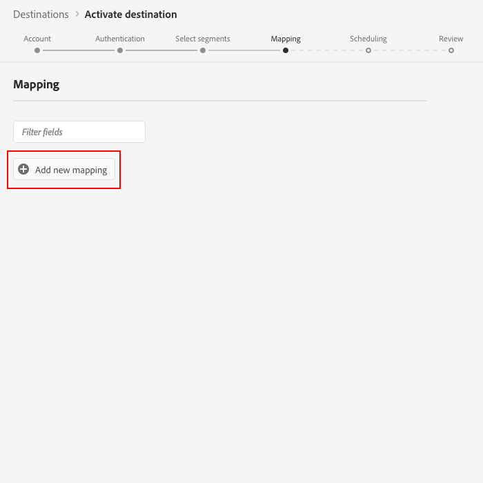

# [!DNL Braze] connessione

## Panoramica {#overview}

Il [!DNL Braze] destination ti consente di inviare i dati del profilo a [!DNL Braze].

[!DNL Braze] è una piattaforma completa per il coinvolgimento dei clienti che offre esperienze pertinenti e memorabili tra i clienti e i marchi che amano.

Per inviare i dati del profilo a [!DNL Braze], devi prima connetterti alla destinazione.

## Specifiche della destinazione {#specifics}

Tieni presente i seguenti dettagli specifici per [!DNL Braze] destinazione:

* [!DNL Adobe Experience Platform] i segmenti vengono esportati in [!DNL Braze] sotto `AdobeExperiencePlatformSegments` attributo.

>[!NOTE]
>
>Tieni presente che inviare attributi personalizzati aggiuntivi a [!DNL Braze] può causare un aumento della [!DNL Braze] consumo dei punti dati. Consulta il tuo [!DNL Braze] account manager prima di inviare attributi personalizzati aggiuntivi.

## Casi d’uso {#use-cases}

In qualità di addetto al marketing, voglio indirizzare l’attività agli utenti in una destinazione di coinvolgimento mobile, con i segmenti incorporati [!DNL Adobe Experience Platform]. Inoltre, voglio fornire loro esperienze personalizzate, in base agli attributi del loro [!DNL Adobe Experience Platform] non appena segmenti e profili vengono aggiornati in [!DNL Adobe Experience Platform].

## Identità supportate {#supported-identities}

[!DNL Braze] supporta l’attivazione delle identità descritte nella tabella seguente.

| Identità di destinazione | Descrizione | Considerazioni |
|---|---|---|
| external_id | Personalizzato [!DNL Braze] identificatore che supporta la mappatura di qualsiasi identità. | Puoi inviare qualsiasi [identità](../../../identity-service/namespaces.md) al [!DNL Braze] destinazione, purché mappata sulla destinazione [!DNL Braze] [`external_id`](https://www.braze.com/docs/api/basics/#external-user-id-explanation). |

{style="table-layout:auto"}

## Tipo e frequenza di esportazione {#export-type-frequency}

Per informazioni sul tipo e sulla frequenza di esportazione della destinazione, consulta la tabella seguente.

| Elemento | Tipo | Note |
---------|----------|---------|
| Tipo di esportazione | **[!UICONTROL Basato su profilo]** | Stai esportando tutti i membri di un segmento, insieme ai campi dello schema desiderati (ad esempio: indirizzo e-mail, numero di telefono, cognome) e/o identità, in base alla mappatura dei campi.[!DNL Adobe Experience Platform] i segmenti vengono esportati in [!DNL Braze] sotto `AdobeExperiencePlatformSegments` attributo. |
| Frequenza di esportazione | **[!UICONTROL Streaming]** | Le destinazioni di streaming sono connessioni &quot;sempre attive&quot; basate su API. Non appena un profilo viene aggiornato in Experience Platform in base alla valutazione dei segmenti, il connettore invia l’aggiornamento a valle alla piattaforma di destinazione. Ulteriori informazioni su [destinazioni di streaming](/help/destinations/destination-types.md#streaming-destinations). |

{style="table-layout:auto"}

## Connetti alla destinazione {#connect}

>[!IMPORTANT]
> 
>Per connettersi alla destinazione, è necessario **[!UICONTROL Gestire le destinazioni]** [autorizzazione per il controllo degli accessi](/help/access-control/home.md#permissions). Leggi le [panoramica sul controllo degli accessi](/help/access-control/ui/overview.md) oppure contatta l’amministratore del prodotto per ottenere le autorizzazioni necessarie.

Per connettersi a questa destinazione, seguire i passaggi descritti in [esercitazione sulla configurazione della destinazione](../../ui/connect-destination.md). Nel flusso di lavoro di configurazione della destinazione, compila i campi elencati nelle due sezioni seguenti.

### Autentica nella destinazione {#authenticate}

Per autenticare nella destinazione, compila i campi obbligatori e seleziona **[!UICONTROL Connetti alla destinazione]**.

* **[!UICONTROL Token account Braze]**: questo è il [!DNL Braze] [!DNL API] chiave. Istruzioni dettagliate su come ottenere [!DNL API] qui: [Panoramica chiave REST API](https://www.braze.com/docs/api/api_key/).

### Inserisci i dettagli della destinazione {#destination-details}

Per configurare i dettagli per la destinazione, compila i campi obbligatori e facoltativi seguenti. Un asterisco accanto a un campo nell’interfaccia utente indica che il campo è obbligatorio.

* **[!UICONTROL Nome]**: immetti un nome con cui riconoscerai questa destinazione in futuro.
* **[!UICONTROL Descrizione]**: inserisci una descrizione che ti aiuterà a identificare questa destinazione in futuro.
* **[!UICONTROL Istanza endpoint]**: chiedi al [!DNL Braze] rappresenta l’istanza dell’endpoint da utilizzare.

### Abilita avvisi {#enable-alerts}

Puoi abilitare gli avvisi per ricevere notifiche sullo stato del flusso di dati verso la tua destinazione. Seleziona un avviso dall’elenco per abbonarti e ricevere notifiche sullo stato del flusso di dati. Per ulteriori informazioni sugli avvisi, consulta la guida su [abbonamento agli avvisi sulle destinazioni tramite l’interfaccia utente](../../ui/alerts.md).

Una volta completate le informazioni sulla connessione di destinazione, seleziona **[!UICONTROL Successivo]**.

## Attiva i segmenti in questa destinazione {#activate}

>[!IMPORTANT]
> 
>Per attivare i dati, è necessario **[!UICONTROL Gestire le destinazioni]**, **[!UICONTROL Attivare le destinazioni]**, **[!UICONTROL Visualizza profili]**, e **[!UICONTROL Visualizzare segmenti]** [autorizzazioni di controllo degli accessi](/help/access-control/home.md#permissions). Leggi le [panoramica sul controllo degli accessi](/help/access-control/ui/overview.md) oppure contatta l’amministratore del prodotto per ottenere le autorizzazioni necessarie.

Consulta [Attiva i dati del pubblico nelle destinazioni di esportazione di segmenti di streaming](../../ui/activate-segment-streaming-destinations.md) per istruzioni sull’attivazione dei segmenti di pubblico in questa destinazione.

## Considerazioni sulla mappatura {#mapping-considerations}

Per inviare correttamente i dati sul pubblico da [!DNL Adobe Experience Platform] al [!DNL Braze] destinazione, devi passare attraverso il passaggio di mappatura dei campi.

La mappatura consiste nella creazione di un collegamento tra [!DNL Experience Data Model] (XDM) campi schema nel tuo [!DNL Platform] e i corrispondenti equivalenti dalla destinazione di destinazione.

Per mappare correttamente i campi XDM su [!DNL Braze] campi di destinazione, effettua le seguenti operazioni:

In [!UICONTROL Mappatura] passaggio, fai clic su **[!UICONTROL Aggiungi nuova mappatura]**.

In [!UICONTROL Campo di origine] , fare clic sul pulsante freccia accanto al campo vuoto.

In [!UICONTROL Seleziona campo di origine] è possibile scegliere tra due categorie di campi XDM:
* [!UICONTROL Seleziona attributi]: utilizza questa opzione per mappare un campo specifico dallo schema XDM a un [!DNL Braze] attributo.

* [!UICONTROL Seleziona lo spazio dei nomi dell’identità]: utilizza questa opzione per mappare una [!DNL Platform] spazio dei nomi delle identità in un [!DNL Braze] spazio dei nomi.

Scegli il campo di origine, quindi fai clic su **[!UICONTROL Seleziona]**.

In [!UICONTROL Campo di destinazione] , fai clic sull’icona di mappatura a destra del campo.

In [!UICONTROL Seleziona campo di destinazione] è possibile scegliere tra due categorie di campi di destinazione:
* [!UICONTROL Seleziona lo spazio dei nomi dell’identità]: utilizza questa opzione per mappare [!DNL Platform] spazi dei nomi di identità da [!DNL Braze] spazi dei nomi di identità.
* [!UICONTROL Seleziona attributi personalizzati]: utilizza questa opzione per mappare gli attributi XDM su personalizzati [!DNL Braze] attributi definiti in [!DNL Braze] account.   Puoi anche utilizzare questa opzione per rinominare gli attributi XDM esistenti in [!DNL Braze]. Ad esempio, la mappatura di un `lastName` Attributo XDM a un attributo personalizzato `Last_Name` attributo in [!DNL Braze], creerà il `Last_Name` attributo in [!DNL Braze], se non esiste già, e mappa `lastName` Attributo XDM.

Scegli il campo di destinazione, quindi fai clic su **[!UICONTROL Seleziona]**.

Ora dovresti visualizzare la mappatura dei campi nell’elenco.

Per aggiungere altre mappature, ripeti i passaggi precedenti.

## Esempio di mappatura {#mapping-example}

Supponiamo che lo schema del profilo XDM e il [!DNL Braze] L’istanza contiene i seguenti attributi e identità:

|  | Schema profilo XDM | [!DNL Braze] Istanza |
|---|---|---|
| Attributi | <ul><li>person.name.firstName</code></li><li>person.name.lastName</code></li><li>mobilePhone.number</code></li></ul> | <ul><li>FirstName</code></li><li>Cognome</code></li><li>NumeroTelefono</code></li></ul> |
| Identità | <ul><li>E-mail</code></li><li>Google Ad ID (GAID)</code></li><li>Apple ID per inserzionisti (IDFA)</code></li></ul> | <ul><li>external_id</code></li></ul> |

La mappatura corretta sarà simile alla seguente:

## Dati esportati {#exported-data}

Per verificare se i dati sono stati esportati correttamente in [!DNL Braze] destinazione, controlla il tuo [!DNL Braze] account. [!DNL Adobe Experience Platform] i segmenti vengono esportati in [!DNL Braze] sotto `AdobeExperiencePlatformSegments` attributo.

## Utilizzo dei dati e governance {#data-usage-governance}

Tutti [!DNL Adobe Experience Platform] le destinazioni sono conformi ai criteri di utilizzo dei dati durante la gestione dei dati. Per informazioni dettagliate su come [!DNL Adobe Experience Platform] applica la governance dei dati, vedi [Panoramica sulla governance dei dati](../../../data-governance/home.md).
