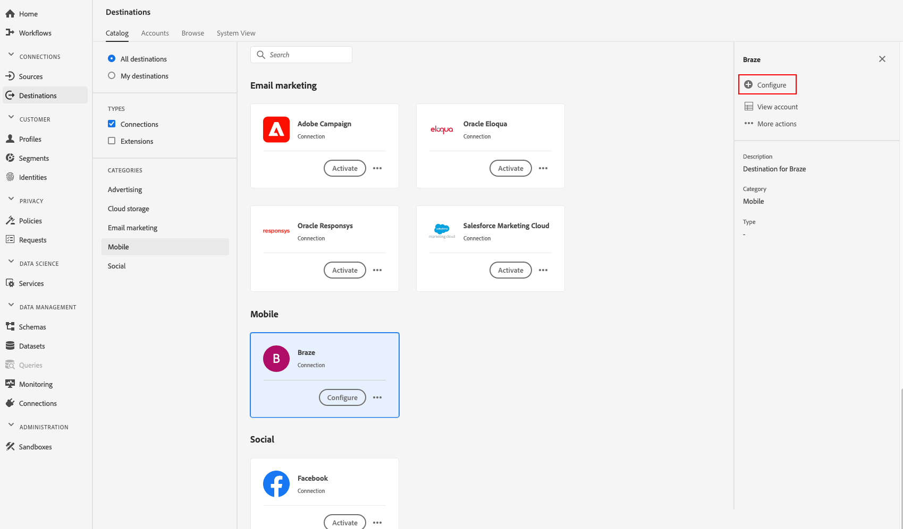

# (Beta) [!DNL Braze] destinazione

>[!IMPORTANT]
>
>La destinazione Braze in Adobe Experience Platform è attualmente in versione Beta. La documentazione e le funzionalità sono soggette a modifiche.

## Panoramica {#overview}

La [!DNL Braze] destinazione consente di inviare i dati del profilo a [!DNL Braze].

[!DNL Braze] è una piattaforma completa per il coinvolgimento dei clienti che offre esperienze rilevanti e memorabili tra i clienti e i marchi che amano.

Per inviare i dati del profilo a [!DNL Braze], è innanzitutto necessario connettersi alla destinazione.

## Specifiche di destinazione {#destination-specs}

Notate i seguenti dettagli specifici per la [!DNL Braze] destinazione:

* Puoi inviare qualsiasi [identità](../../../identity-service/namespaces.md) alla [!DNL Braze] destinazione, purché sia mappata sulla [!DNL Braze] destinazione [`external_id`](https://www.braze.com/docs/api/basics/#external-user-id-explanation).
* [!DNL Adobe Experience Platform] i segmenti vengono esportati in [!DNL Braze] base all’ `AdobeExperiencePlatformSegments` attributo .

## Casi d’uso {#use-cases}

Come esperto di marketing, voglio indirizzare gli utenti verso una destinazione di coinvolgimento mobile, con i segmenti incorporati [!DNL Adobe Experience Platform]. Inoltre, voglio fornire loro esperienze personalizzate, basate sugli attributi dei loro [!DNL Adobe Experience Platform] profili, non appena segmenti e profili vengono aggiornati in [!DNL Adobe Experience Platform].

## Tipo di esportazione {#export-type}

**[!DNL Profile-based]** - si esportano tutti i membri di un segmento, insieme ai campi dello schema desiderati (ad esempio: indirizzo e-mail, numero di telefono, cognome) e/o identità, in base alla mappatura del campo.
[!DNL Adobe Experience Platform] i segmenti vengono esportati in [!DNL Braze] base all’ `AdobeExperiencePlatformSegments` attributo .

## Connetti alla destinazione {#connect-destination}

In **[!UICONTROL Connections]** > **[!UICONTROL Destinations]**, selezionare [!DNL Braze], quindi **[!UICONTROL Configure]**.

>[!NOTE]
>
>Se esiste già una connessione con questa destinazione, è possibile visualizzare un **[!UICONTROL Activate]** pulsante sulla scheda di destinazione. Per ulteriori informazioni sulla differenza tra **[!UICONTROL Activate]** e **[!UICONTROL Configure]**, consultate la sezione [Catalogo](../../ui/destinations-workspace.md#catalog) della documentazione dell&#39;area di lavoro di destinazione.
>
>

Nel [!UICONTROL Account] passaggio, dovete fornire il token [!DNL Braze] dell&#39;account. Questa è la sua [!DNL Braze][!DNL API] chiave. Per istruzioni dettagliate su come ottenere la [!DNL API] chiave, consultate: [Panoramica](https://www.braze.com/docs/api/api_key/)della chiave API REST. Immettete il token e fate clic **[!UICONTROL Connect to destination]**.

Fai clic su **[!UICONTROL Next]**. Nel [!UICONTROL Authentication] passaggio, è necessario inserire i dettagli della [!DNL Braze] connessione:
* **[!UICONTROL Name]**: immettete un nome in base al quale riconoscerete questa destinazione in futuro.
* **[!UICONTROL Description]**: immettete una descrizione che vi aiuterà a identificare questa destinazione in futuro.
* **[!UICONTROL Endpoint Instance]**: chiedete al vostro [!DNL Braze] rappresentante quale istanza di endpoint utilizzare.
* **[!UICONTROL Marketing use case]**: i casi di utilizzo marketing indicano l&#39;intento per il quale i dati verranno esportati nella destinazione. Puoi scegliere tra  casi di utilizzo di marketing definiti dal Adobe o creare un caso di utilizzo di marketing personale. Per ulteriori informazioni sui casi di utilizzo del marketing, consulta la pagina [Governance dei dati in Adobe Experience Platform](../../../rtcdp/privacy/data-governance-overview.md#destinations) . Per informazioni sui singoli casi di utilizzo marketing definiti dal Adobe , consulta la panoramica [sui criteri di utilizzo dei](../../../data-governance/policies/overview.md#core-actions)dati.

Fai clic su **[!UICONTROL Create destination]**. La destinazione è stata creata. Puoi fare clic su **[!UICONTROL Save & Exit]** se vuoi attivare i segmenti in un secondo momento, oppure puoi selezionare **[!UICONTROL Next]** per continuare il flusso di lavoro e selezionare i segmenti da attivare. In entrambi i casi, consulta la sezione successiva, [Attiva segmenti](#activate-segments), per il resto del flusso di lavoro.

## Attivare i segmenti {#activate-segments}

Consulta [Attivare profili e segmenti su una destinazione](../../ui/activate-destinations.md#select-attributes) per informazioni sul flusso di lavoro di attivazione dei segmenti.

## Mappatura campi {#field-mapping}

Per inviare correttamente i dati del pubblico dalla [!DNL Adobe Experience Platform] destinazione alla [!DNL Braze] destinazione, devi passare attraverso il passaggio di mappatura del campo.

Il mapping consiste nella creazione di un collegamento tra i campi dello schema [!DNL Experience Data Model] (XDM) nell&#39; [!DNL Platform] account e i corrispondenti equivalenti dalla destinazione.

Per mappare correttamente i campi XDM sui campi di [!DNL Braze] destinazione, procedere come segue:

In the [!UICONTROL Mapping] step, click **[!UICONTROL Add new mapping]**.

Nella [!UICONTROL Source Field] sezione fare clic sul pulsante freccia accanto al campo vuoto.

Nella [!UICONTROL Select source field] finestra è possibile scegliere tra due categorie di campi XDM:
* [!UICONTROL Select attributes]: utilizzare questa opzione per mappare un campo specifico dallo schema XDM a un [!DNL Braze] attributo.

* [!UICONTROL Select identity namespace]: Utilizzare questa opzione per mappare uno spazio nomi [!DNL Platform] identità a uno [!DNL Braze] spazio nomi.

Scegliete il campo di origine, quindi fate clic **[!UICONTROL Select]**.

Nella [!UICONTROL Target Field] sezione fare clic sull&#39;icona di mappatura a destra del campo.

Nella [!UICONTROL Select target field] finestra, potete scegliere tra tre categorie di campi di destinazione:
* [!UICONTROL Select attributes]: Utilizzate questa opzione per mappare gli attributi XDM su [!DNL Braze] attributi standard.
* [!UICONTROL Select identity namespace]: Utilizzare questa opzione per mappare [!DNL Platform] gli spazi dei nomi identità agli spazi dei nomi [!DNL Braze] di identità.
* [!UICONTROL Select custom attributes]: Utilizzate questa opzione per mappare gli attributi XDM agli [!DNL Braze] attributi personalizzati definiti nel vostro [!DNL Braze] account.
* È inoltre possibile utilizzare questa opzione per rinominare gli attributi XDM esistenti in [!DNL Braze]. Ad esempio, mappando un attributo `lastName` XDM su un `Last_Name` attributo personalizzato in [!DNL Braze], verrà creato l&#39; `Last_Name` attributo in [!DNL Braze], se non esiste già, e vi verrà mappato l&#39;attributo `lastName` XDM.

Scegliete il campo di destinazione, quindi fate clic **[!UICONTROL Select]**.

È ora necessario visualizzare la mappatura dei campi nell&#39;elenco.

Per aggiungere altre mappature, ripetere i passaggi precedenti.

### Esempio {#mapping-example}

Supponiamo che lo schema di profilo XDM e l&#39; [!DNL Braze] istanza contengano i seguenti attributi ed identità:

|  | Schema profilo XDM | [!DNL Braze] Istanza |
|---|---|---|
| Attributi | <ul><li>person.name.firstName</code></li><li>person.name.lastName</code></li><li>mobilePhone.number</code></li></ul> | <ul><li>Nome</code></li><li>LastName</code></li><li>PhoneNumber</code></li></ul> |
| Identità | <ul><li>E-mail</code></li><li>Google Ad ID (GAID)</code></li><li>ID Apple per inserzionisti (IDFA)</code></li></ul> | <ul><li>external_id</code></li></ul> |

La mappatura corretta sarà simile alla seguente:

## Dati esportati {#exported-data}

Per verificare se i dati sono stati esportati correttamente nella [!DNL Braze] destinazione, controlla il tuo [!DNL Braze] account. [!DNL Adobe Experience Platform] i segmenti vengono esportati in [!DNL Braze] base all’ `AdobeExperiencePlatformSegments` attributo .

## Utilizzo e governance dei dati {#data-usage-governance}

Tutte [!DNL Adobe Experience Platform] le destinazioni sono conformi ai criteri di utilizzo dei dati durante la gestione dei dati. Per informazioni dettagliate su come [!DNL Adobe Experience Platform] applicare la governance dei dati, vedi [Governance dei dati in CDP](../../../rtcdp/privacy/data-governance-overview.md)in tempo reale.

