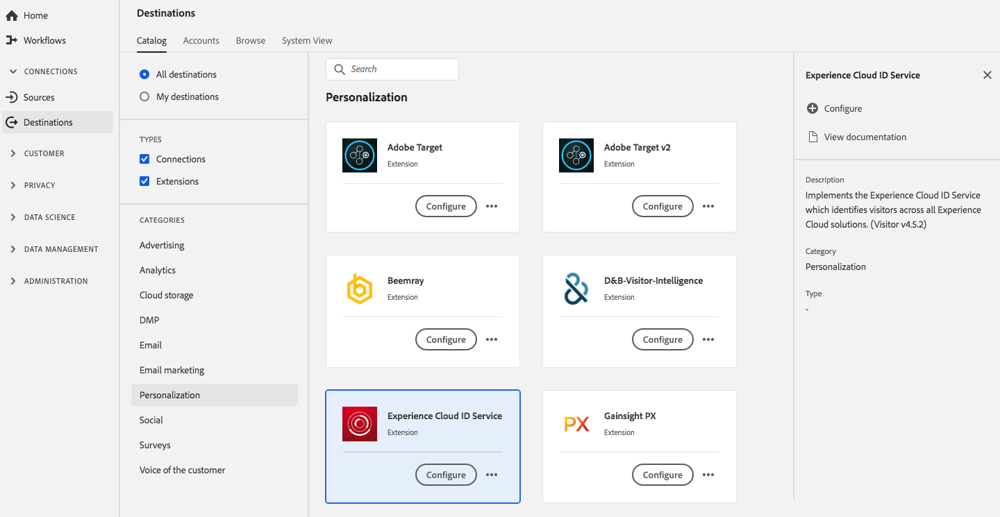

# [!DNL Experience Cloud] Estensione del servizio ID {#adobe-ecid-extension}

## Panoramica {#overview}

Questa estensione implementa [!DNL Experience Cloud] Servizio ID, che identifica i visitatori in tutti [!DNL Experience Cloud] soluzioni.

[!DNL Experience Cloud] Il servizio ID è un&#39;estensione di personalizzazione in Adobe Experience Platform. Per ulteriori informazioni sulla funzionalità dell&#39;estensione, vedi [Pagina dell’estensione del servizio ID Experience Cloud](../../../tags/extensions/client/id-service/overview.md) nella documentazione sui tag.

Questa destinazione è un’estensione tag. Per ulteriori informazioni sul funzionamento delle estensioni dei tag in Platform, consulta [panoramica delle estensioni tag](../launch-extensions/overview.md).

## Prerequisiti {#prerequisites}

Questa estensione è disponibile nel catalogo Destinazioni per tutti i clienti che hanno acquistato Platform.

Per utilizzare questa estensione, devi accedere ai tag in Platform. I tag sono offerti ai clienti di Adobe Experience Cloud come funzionalità inclusa a valore aggiunto. Contatta l’amministratore dell’organizzazione per accedere all’interfaccia utente di Data Collection e chiedere di concederti **[!UICONTROL manage_properties]** in modo da poter installare estensioni.

## Installa estensione {#install-extension}

Per installare [!DNL Experience Cloud] Estensione del servizio ID:

In [Interfaccia della piattaforma](https://platform.adobe.com/), vai a **[!UICONTROL Destinazioni]** > **[!UICONTROL Catalogo]**.

Seleziona l’estensione dal catalogo o utilizza la barra di ricerca.

Fai clic sulla destinazione per evidenziarla, quindi seleziona **[!UICONTROL Configura]** nella barra a destra. Se il **[!UICONTROL Configura]** il controllo è disattivato, manca il **[!UICONTROL manage_properties]** autorizzazione. Consulta [Prerequisiti](#prerequisites).

Seleziona la proprietà tag in cui desideri installare l’estensione. Puoi anche creare una nuova proprietà. Una proprietà è una raccolta di regole, elementi di dati, estensioni configurate, ambienti e librerie. Scopri le proprietà in [documentazione sui tag](../../../tags/ui/administration/companies-and-properties.md).

Il flusso di lavoro ti porta all’interfaccia utente di Data Collection per completare l’installazione.

Per informazioni sulle opzioni di configurazione dell’estensione e sul supporto per l’installazione, consulta [Pagina dell’estensione del servizio ID Experience Cloud](../../../tags/extensions/client/id-service/overview.md) nella documentazione sui tag.

Puoi anche installare l’estensione direttamente nel [Interfaccia utente di Data Collection](https://experience.adobe.com/#/data-collection/). Consulta la guida su [aggiunta di una nuova estensione](../../../tags/ui/managing-resources/extensions/overview.md#add-a-new-extension) per ulteriori informazioni.

## Come utilizzare l’estensione {#how-to-use}

Dopo aver installato l&#39;estensione, puoi avviare la configurazione delle regole. Nell’interfaccia utente di Data Collection, puoi impostare regole per le estensioni installate in modo da inviare dati evento alla destinazione dell’estensione solo in determinate situazioni. Per ulteriori informazioni sulla configurazione delle regole per le estensioni, consulta la panoramica su [regole](../../../tags/ui/managing-resources/rules.md) nella documentazione sui tag.

## Configurare, aggiornare ed eliminare l’estensione {#configure-upgrade-delete}

Puoi configurare, aggiornare ed eliminare le estensioni nell’interfaccia utente di Data Collection.

>[!TIP]
>
>Se l&#39;estensione è già installata in una delle tue proprietà, l&#39;interfaccia utente viene comunque visualizzata **[!UICONTROL Installa]** per l’estensione. Avvia il flusso di lavoro di installazione come descritto in [Installa estensione](#install-extension) per configurare o eliminare l’estensione.

Per aggiornare l’estensione, consulta la guida sulla [processo di aggiornamento delle estensioni](../../../tags/ui/managing-resources/extensions/extension-upgrade.md) nella documentazione sui tag.
