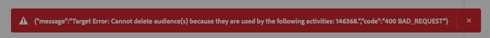

# Connessione [!DNL Adobe Target] {#adobe-target-connection}

## Registro modifiche destinazione {#changelog}

| Mese di rilascio | Tipo di aggiornamento | Descrizione |
|---|---|---|
| Aprile 2024 | Aggiornamento della funzionalità e della documentazione | Quando ti connetti alla destinazione Target e utilizzi un flusso di dati, ora *non hai bisogno* di abilitare necessariamente il flusso di dati per la segmentazione Edge. Ciò significa che la destinazione di Target funzionerà con i tipi di pubblico in batch e in streaming, anche se i casi d’uso che puoi eseguire sono diversi. Per ulteriori informazioni, vedere la tabella nella sezione [parametri di connessione](#parameters). |
| Gennaio 2024 | Aggiornamento della funzionalità e della documentazione | È ora possibile condividere i tipi di pubblico e gli attributi del profilo con la connessione [!DNL Adobe Target] per la sandbox di produzione predefinita e altre sandbox non predefinite. |
| Giugno 2023 | Aggiornamento della funzionalità e della documentazione | A partire da giugno 2023, è possibile selezionare l&#39;area di lavoro [!DNL Adobe Target] a cui si desidera condividere i tipi di pubblico durante la configurazione di una nuova connessione di destinazione [!DNL Adobe Target]. Consulta la sezione [parametri di connessione](#parameters) per ulteriori informazioni. Per ulteriori informazioni sulle aree di lavoro, vedere l&#39;esercitazione sulla [configurazione delle aree di lavoro](https://experienceleague.adobe.com/docs/target-learn/tutorials/administration/set-up-workspaces.html?lang=it) in [!DNL Adobe Target]. |
| Maggio 2023 | Aggiornamento della funzionalità e della documentazione | A maggio 2023, la connessione **[!UICONTROL Adobe Target]** supporta la personalizzazione [basata su attributi](../../ui/activate-edge-personalization-destinations.md#map-attributes) ed è generalmente disponibile per tutti i clienti. |

{style="table-layout:auto"}

## Panoramica {#overview}

[!DNL Adobe Target] è un&#39;applicazione che fornisce funzionalità di personalizzazione e sperimentazione basate sull&#39;intelligenza artificiale in tempo reale in tutte le interazioni dei clienti in entrata tramite siti Web, app mobili e altro ancora.

[!DNL Adobe Target] è una connessione di personalizzazione nel catalogo delle destinazioni [!DNL Adobe Experience Platform].

## Panoramica video {#video-overview}

Per una breve panoramica su come configurare la connessione [!DNL Adobe Target] in Experience Platform, guarda il video seguente.

>[!VIDEO](https://video.tv.adobe.com/v/3449801/?captions=ita&quality=12&learn=on)

## Casi d’uso supportati in base al tipo di implementazione {#supported-use-cases}

La tabella seguente mostra i casi d&#39;uso supportati per la destinazione [!DNL Adobe Target], in base al tipo di implementazione, con o senza Web SDK e con o senza [segmentazione Edge](/help/segmentation/home.md#edge) abilitata.

| Implementazione [!DNL Adobe Target] *senza* Web SDK | Implementazione [!DNL Adobe Target] *con* Web SDK | Implementazione [!DNL Adobe Target] *con* segmentazione Edge *e* di Web SDK disattivata |
|---|---|---|
| <ul><li>Non è necessario uno stream di dati. [!DNL Adobe Target] può essere distribuito tramite [at.js](https://experienceleague.adobe.com/docs/target-dev/developer/client-side/at-js-implementation/overview.html?lang=it), [lato server](https://experienceleague.adobe.com/docs/target-dev/developer/overview.html?lang=it#server-side-implementation) o [metodi di implementazione ibridi](https://experienceleague.adobe.com/docs/target-dev/developer/overview.html?lang=it#hybrid-implementation).</li><li>[Segmentazione Edge](../../../segmentation/methods/edge-segmentation.md) non supportata.</li><li>[La personalizzazione della stessa pagina e della pagina successiva](../../ui/activate-edge-personalization-destinations.md) non è supportata.</li><li>È possibile condividere i tipi di pubblico e gli attributi del profilo con la connessione [!DNL Adobe Target] per la *sandbox di produzione predefinita* e le sandbox non predefinite.</li><li>Per configurare la personalizzazione della sessione successiva senza utilizzare uno stream di dati, utilizza [at.js](https://experienceleague.adobe.com/docs/target/using/implement-target/client-side/at-js-implementation/at-js/how-atjs-works.html?lang=it).</li></ul> | <ul><li>È necessario uno stream di dati con [!DNL Adobe Target] e Experience Platform configurati come servizi.</li><li>La segmentazione di Edge funziona come previsto.</li><li>[Sono supportate la personalizzazione della stessa pagina e della pagina successiva](../../ui/activate-edge-personalization-destinations.md#use-cases).</li><li>È supportata la condivisione di tipi di pubblico e attributi di profilo da altre sandbox.</li></ul> | <ul><li>È necessario uno stream di dati con [!DNL Adobe Target] e Experience Platform configurati come servizi.</li><li>Durante la [configurazione dello stream di dati](/help/destinations/ui/activate-edge-personalization-destinations.md#configure-datastream), non selezionare la casella di controllo **Segmentazione Edge**.</li><li>[È supportata la personalizzazione della sessione successiva](../../ui/activate-edge-personalization-destinations.md#next-session).</li><li>È supportata la condivisione di tipi di pubblico e attributi di profilo da altre sandbox.</li></ul> |

## Prerequisiti {#prerequisites}

### Stream di dati {#datastream}

Durante la configurazione della connessione [!DNL Adobe Target] a [utilizzare uno stream di dati](#parameters), è necessario che [Raccolta dati di Adobe Experience Platform](/help/collection/home.md) sia implementato.

Per configurare la connessione [!DNL Adobe Target] senza utilizzare uno stream di dati non è necessario implementare il Web SDK.

>[!IMPORTANT]
>
>Prima di creare una connessione [!DNL Adobe Target], leggere la guida su come [configurare le destinazioni di personalizzazione per la personalizzazione della stessa pagina e della pagina successiva](../../ui/activate-edge-personalization-destinations.md). Questa guida illustra i passaggi di configurazione necessari per i casi di utilizzo della personalizzazione della stessa pagina e della pagina successiva, su più componenti di Experience Platform. Per ottenere casi di utilizzo di personalizzazione della stessa pagina e della pagina successiva, è necessario utilizzare uno stream di dati durante la configurazione della connessione [!DNL Adobe Target].

### Prerequisiti in [!DNL Adobe Target] {#prerequisites-in-adobe-target}

In [!DNL Adobe Target], assicurati che l&#39;utente abbia:

* Accesso all&#39;[area di lavoro predefinita](https://experienceleague.adobe.com/docs/target/using/administer/manage-users/enterprise/property-channel.html?lang=it#default-workspace);
* L&#39;**Approvatore** [mansione](https://experienceleague.adobe.com/docs/target/using/administer/manage-users/enterprise/property-channel.html?lang=it#roles-and-permissions).

Ulteriori informazioni sulla concessione delle autorizzazioni per [Target Premium](https://experienceleague.adobe.com/docs/target/using/administer/manage-users/enterprise/properties-overview.html?lang=it#section_8C425E43E5DD4111BBFC734A2B7ABC80) e per [Target Standard](https://experienceleague.adobe.com/docs/target/using/administer/manage-users/users/user-management.html?lang=it#roles-permissions).

## Tipi di pubblico supportati {#supported-audiences}

Questa sezione descrive quali tipi di pubblico puoi esportare in questa destinazione.

>[!IMPORTANT]
>
>Quando si attivano *tipi di pubblico edge per casi di utilizzo di personalizzazione della stessa pagina e della pagina successiva*, i tipi di pubblico *devono* utilizzare un [criterio di unione attivo-su-edge](../../../segmentation/ui/segment-builder.md#merge-policies). Il criterio di unione [!DNL active-on-edge] garantisce che i tipi di pubblico vengano valutati costantemente [al limite](../../../segmentation/methods/edge-segmentation.md) e siano disponibili per i casi di utilizzo di personalizzazione in tempo reale e nella pagina successiva.  Leggi di [tutti i casi d&#39;uso disponibili](#parameter), in base al tipo di implementazione.
>Se si mappano tipi di pubblico edge che utilizzano un criterio di unione diverso su [!DNL Adobe Target] destinazioni, tali tipi di pubblico non verranno valutati per i casi di utilizzo in tempo reale e nella pagina successiva.
>Segui le istruzioni relative alla [creazione di un criterio di unione](../../../profile/merge-policies/ui-guide.md#create-a-merge-policy) e assicurati di attivare/disattivare **[!UICONTROL Active-On-Edge Merge Policy]**.

| Origine pubblico | Supportato | Descrizione |
|---------|----------|----------|
| [!DNL Segmentation Service] | Sì | Tipi di pubblico generati tramite Experience Platform [Segmentation Service](../../../segmentation/home.md). |
| Tutte le altre origini del pubblico | Sì | Questa categoria include tutte le origini del pubblico al di fuori dei tipi di pubblico generati tramite [!DNL Segmentation Service]. Leggi informazioni sulle [diverse origini del pubblico](/help/segmentation/ui/audience-portal.md#customize). Alcuni esempi includono: <ul><li> i tipi di pubblico per caricamento personalizzati [importati](../../../segmentation/ui/audience-portal.md#import-audience) in Experience Platform da file CSV,</li><li> pubblico simile, </li><li> pubblico federato, </li><li> tipi di pubblico generati in altre app Experience Platform come [!DNL Adobe Journey Optimizer], </li><li> e altro ancora. </li></ul> |

{style="table-layout:auto"}

Tipi di pubblico supportati per tipo di dati sul pubblico:

| Tipo di dati del pubblico | Supportato | Descrizione | Casi d’uso |
|--------------------|-----------|-------------|-----------|
| [Tipi di pubblico per persone](/help/segmentation/types/people-audiences.md) | Sì | In base ai profili dei clienti, consente di eseguire il targeting di gruppi specifici di persone per campagne di marketing. | Acquirenti frequenti, abbandoni del carrello |
| [Pubblico dell&#39;account](/help/segmentation/types/account-audiences.md) | No | Puoi indirizzare l’attività a singoli utenti all’interno di organizzazioni specifiche per strategie di marketing basate sull’account. | Marketing B2B |
| [Pubblico potenziale](/help/segmentation/types/prospect-audiences.md) | No | Puoi indirizzare l’attività a singoli utenti che non sono ancora clienti, ma che condividono alcune caratteristiche con il tuo pubblico di destinazione. | Ricerca di dati di terze parti |
| [Esportazioni set di dati](/help/catalog/datasets/overview.md) | No | Raccolte di dati strutturati archiviati nel Data Lake [!DNL Adobe Experience Platform]. | Reporting, flussi di lavoro di data science |

{style="table-layout:auto"}

## Tipo e frequenza di esportazione {#export-type-frequency}

Per informazioni sul tipo e sulla frequenza di esportazione della destinazione, consulta la tabella seguente.

| Elemento | Tipo | Note |
|---------|----------|---------|
| Tipo di esportazione | **[!DNL Profile request]** | Stai richiedendo tutti i tipi di pubblico mappati nella destinazione [!DNL Adobe Target] per un singolo profilo. |
| Frequenza di esportazione | **[!UICONTROL Streaming]** | Le destinazioni di streaming sono connessioni &quot;sempre attive&quot; basate su API. Non appena un profilo viene aggiornato in Experience Platform in base alla valutazione del pubblico, il connettore invia l’aggiornamento a valle alla piattaforma di destinazione. Ulteriori informazioni sulle [destinazioni di streaming](/help/destinations/destination-types.md#streaming-destinations). |

{style="table-layout:auto"}

## Connettersi alla destinazione {#connect}

>[!CONTEXTUALHELP]
>id="platform_destinations_target_datastream"
>title="Informazioni sugli stream di dati"
>abstract="Questa opzione determina in quale stream di dati di raccolta dati verranno inclusi i tipi di pubblico. Il menu a discesa mostra solo gli stream di dati in cui la configurazione Destinazione è abilitata. Per utilizzare la segmentazione Edge, devi selezionare uno stream di dati. Se selezioni Nessuno, tutti i casi d’uso che utilizzano la segmentazione Edge vengono disabilitati."
>additional-url="https://experienceleague.adobe.com/docs/experience-platform/destinations/catalog/personalization/adobe-target-connection.html?lang=it#parameters" text="Ulteriori informazioni sulla selezione degli stream di dati"

>[!IMPORTANT]
>
>Per connettersi alla destinazione, sono necessarie le **[!UICONTROL View Destinations]** e le **[!UICONTROL Manage Destinations]** [autorizzazioni di controllo di accesso](/help/access-control/home.md#permissions). Leggi la [panoramica sul controllo degli accessi](/help/access-control/ui/overview.md) o contatta l&#39;amministratore del prodotto per ottenere le autorizzazioni necessarie.

Per connettersi a questa destinazione, seguire i passaggi descritti nell&#39;esercitazione [sulla configurazione della destinazione](../../ui/connect-destination.md).

[!DNL Adobe Experience Platform] si connette automaticamente all&#39;istanza [!DNL Adobe Target] della tua società. Non è richiesta alcuna autenticazione.

### Parametri di connessione {#parameters}

>[!CONTEXTUALHELP]
>id="platform_destinations_target_workspace"
>title="Informazioni su [!DNL Adobe Target] aree di lavoro"
>abstract="Selezionare l&#39;area di lavoro [!DNL Adobe Target] in cui verranno condivisi i tipi di pubblico. È possibile selezionare una singola area di lavoro per ogni connessione [!DNL Adobe Target]. Al momento dell’attivazione, i tipi di pubblico vengono indirizzati all’area di lavoro selezionata seguendo le etichette di utilizzo dei dati di Experience Platform applicabili."
>additional-url="https://experienceleague.adobe.com/docs/target-learn/tutorials/administration/set-up-workspaces.html?lang=it" text="Ulteriori informazioni sulle [!DNL Adobe Target] aree di lavoro"

Durante la [configurazione](../../ui/connect-destination.md) di questa destinazione, è necessario fornire le seguenti informazioni:

* **Nome**: immettere il nome preferito per la destinazione.
* **Descrizione**: immetti una descrizione per la destinazione. Ad esempio, puoi indicare per quale campagna stai utilizzando questa destinazione. Questo campo è facoltativo.
* **Stream di dati**: determina in quale flusso di dati della raccolta dati verranno inclusi i tipi di pubblico. Il menu a discesa mostra solo gli stream di dati in cui sono abilitati i servizi Target e [!DNL Adobe Experience Platform]. Per informazioni dettagliate su come configurare uno stream di dati per [&#x200B; e &#x200B;](../../../datastreams/configure.md#aep), vedere [!DNL Adobe Experience Platform]configurazione di uno stream di dati[!DNL Adobe Target].

  >[!IMPORTANT]
  >
  >**Unicità dello stream di dati in tutta l&#39;organizzazione**: la combinazione di ID dello stream di dati e nome della sandbox deve essere univoca per [!DNL Adobe Target] connessioni di destinazione all&#39;interno di un&#39;organizzazione IMS. Ciò significa che:
  >
  >* La stessa combinazione di ID dello stream di dati + nome della sandbox non può essere utilizzata per più connessioni di destinazione [!DNL Adobe Target] in tutta l&#39;organizzazione
  >* Puoi utilizzare lo stesso ID dello stream di dati per connessioni di destinazione diverse, purché le connessioni si trovino in sandbox diverse
  >* Questa regola si applica a tutte le selezioni dello stream di dati, incluso quando si seleziona **[!UICONTROL None]**

   * **[!UICONTROL None]**: selezionare questa opzione se è necessario configurare la personalizzazione [!DNL Adobe Target] ma non è possibile implementare il Web SDK [!DNL Adobe Experience Platform]. Quando si utilizza questa opzione, i tipi di pubblico esportati da Experience Platform a Target supportano solo la personalizzazione della sessione successiva e la segmentazione Edge è disabilitata. Fai riferimento alla tabella nella sezione [casi d&#39;uso supportati](#supported-use-cases) per un confronto dei casi d&#39;uso disponibili per tipo di implementazione.

  | Implementazione [!DNL Adobe Target] *senza* Web SDK | Implementazione [!DNL Adobe Target] *con* Web SDK | Implementazione [!DNL Adobe Target] *con* segmentazione Edge *e* di Web SDK disattivata |
  |---|---|---|
  | <ul><li>Non è necessario uno stream di dati. [!DNL Adobe Target] può essere distribuito tramite [at.js](https://experienceleague.adobe.com/docs/target-dev/developer/client-side/at-js-implementation/overview.html?lang=it), [lato server](https://experienceleague.adobe.com/docs/target-dev/developer/overview.html?lang=it#server-side-implementation) o [metodi di implementazione ibridi](https://experienceleague.adobe.com/docs/target-dev/developer/overview.html?lang=it#hybrid-implementation).</li><li>[Segmentazione Edge](../../../segmentation/methods/edge-segmentation.md) non supportata.</li><li>[La personalizzazione della stessa pagina e della pagina successiva](../../ui/activate-edge-personalization-destinations.md) non è supportata.</li><li>È possibile condividere i tipi di pubblico e gli attributi del profilo con la connessione [!DNL Adobe Target] per la *sandbox di produzione predefinita* e le sandbox non predefinite.</li><li>Per configurare la personalizzazione della sessione successiva senza utilizzare uno stream di dati, utilizza [at.js](https://experienceleague.adobe.com/docs/target/using/implement-target/client-side/at-js-implementation/at-js/how-atjs-works.html?lang=it).</li></ul> | <ul><li>È necessario uno stream di dati con [!DNL Adobe Target] e Experience Platform configurati come servizi.</li><li>La segmentazione di Edge funziona come previsto.</li><li>[Sono supportate la personalizzazione della stessa pagina e della pagina successiva](../../ui/activate-edge-personalization-destinations.md#use-cases).</li><li>È supportata la condivisione di tipi di pubblico e attributi di profilo da altre sandbox.</li></ul> | <ul><li>È necessario uno stream di dati con [!DNL Adobe Target] e Experience Platform configurati come servizi.</li><li>Durante la [configurazione dello stream di dati](/help/destinations/ui/activate-edge-personalization-destinations.md#configure-datastream), non selezionare la casella di controllo **Segmentazione Edge**.</li><li>[È supportata la personalizzazione della sessione successiva](../../ui/activate-edge-personalization-destinations.md#next-session).</li><li>È supportata la condivisione di tipi di pubblico e attributi di profilo da altre sandbox.</li></ul> |

* **Workspace**: seleziona l&#39;[!DNL Adobe Target] [area di lavoro](https://experienceleague.adobe.com/docs/target-learn/tutorials/administration/set-up-workspaces.html?lang=it) in cui verranno condivisi i tipi di pubblico. È possibile selezionare una singola area di lavoro per ogni connessione [!DNL Adobe Target]. Al momento dell&#39;attivazione, i tipi di pubblico vengono instradati all&#39;area di lavoro selezionata seguendo le [etichette di utilizzo dei dati di Experience Platform](../../../data-governance/labels/overview.md) applicabili.

>[!NOTE]
>
>Quando si utilizza un&#39;area di lavoro di Target personalizzata per [la personalizzazione della stessa pagina e della pagina successiva con attributi](../../ui/activate-edge-personalization-destinations.md), solo i [tipi di pubblico selezionati](../../ui/activate-edge-personalization-destinations.md#select-audiences) vengono inviati all&#39;area di lavoro di Target selezionata. I [attributi mappati](../../ui/activate-edge-personalization-destinations.md#mapping) vengono inviati all&#39;area di lavoro predefinita di Target.
> 
>Questo comportamento cambierà in un aggiornamento futuro.

### Abilita avvisi {#enable-alerts}

Puoi abilitare gli avvisi per ricevere notifiche sullo stato del flusso di dati verso la tua destinazione. Seleziona un avviso dall’elenco per abbonarti e ricevere notifiche sullo stato del flusso di dati. Per ulteriori informazioni sugli avvisi, consulta la guida su [abbonamento a destinazioni avvisi tramite l&#39;interfaccia utente](../../ui/alerts.md).

Dopo aver fornito i dettagli della connessione di destinazione, selezionare **[!UICONTROL Next]**.

## Attivare tipi di pubblico in questa destinazione {#activate}

>[!IMPORTANT]
>
>Per attivare i dati, sono necessarie le **[!UICONTROL View Destinations]**, **[!UICONTROL Activate Destinations]**, **[!UICONTROL View Profiles]** e **[!UICONTROL View Segments]** [autorizzazioni di controllo di accesso](/help/access-control/home.md#permissions). Leggi la [panoramica sul controllo degli accessi](/help/access-control/ui/overview.md) o contatta l&#39;amministratore del prodotto per ottenere le autorizzazioni necessarie.

Leggi [Attiva tipi di pubblico nelle destinazioni di personalizzazione Edge](../../ui/activate-edge-personalization-destinations.md) per le istruzioni sull&#39;attivazione dei tipi di pubblico in questa destinazione.

## Rimuovere tipi di pubblico da una destinazione {#remove}

Sono necessari passaggi aggiuntivi per rimuovere un pubblico da una connessione [!DNL Adobe Target] esistente quando tale pubblico è già utilizzato in una [!DNL Adobe Target] [attività](https://experienceleague.adobe.com/it/docs/target/using/activities/activities). Se si tenta di rimuovere un pubblico da una connessione [!DNL Adobe Target], si verifica un errore se il pubblico è utilizzato da un&#39;attività [!DNL Adobe Target].

Per rimuovere un pubblico da una destinazione Target quando il pubblico viene utilizzato in un’attività, devi innanzitutto rimuovere il pubblico dall’attività Target che lo utilizza oppure eliminare completamente l’attività. Quindi, puoi rimuovere il pubblico dalla connessione Target.

Se il pubblico non è utilizzato in un&#39;attività, passa a **[!UICONTROL Destinations]** > **[!UICONTROL Browse]** > **[!UICONTROL Select destination dataflow]** > **[!UICONTROL Activation data]**, seleziona i tipi di pubblico da rimuovere, quindi seleziona **[!UICONTROL Remove audiences]**.

## Dati esportati {#exported-data}

[!DNL Adobe Target] *legge* i dati del profilo da [!DNL Adobe Experience Platform] Edge Network, quindi non viene esportato alcun dato.

## Utilizzo dei dati e governance {#data-usage-governance}

Tutte le destinazioni [!DNL Adobe Experience Platform] sono conformi ai criteri di utilizzo dei dati durante la gestione dei dati. Per informazioni dettagliate su come [!DNL Adobe Experience Platform] applica la governance dei dati, leggere la [Panoramica sulla governance dei dati](https://experienceleague.adobe.com/docs/experience-platform/data-governance/home.html?lang=it).
