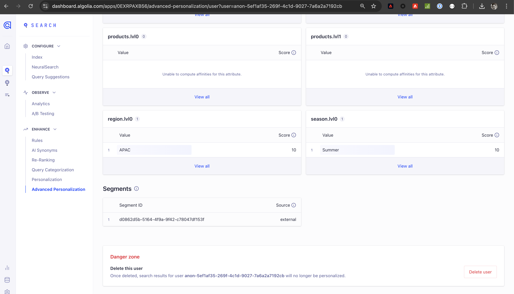

# Connessione [!DNL Algolia]

## Panoramica {#overview}

>[!IMPORTANT]
>
>Il connettore di destinazione [!DNL Algolia] e la pagina della documentazione vengono creati e gestiti dal team di Algolia Integration Services. Per richieste di informazioni o richieste di aggiornamento, contattale all&#39;indirizzo [adobe-algolia-solutions@algolia.com](mailto:adobe-algolia-solutions@algolia.com).

Utilizza la connessione di destinazione [!DNL Algolia] per inviare il pubblico di Adobe Experience Platform in Algolia per ricerche personalizzate e consigli. Prima di poter utilizzare il connettore di destinazione [!DNL Algolia], è necessario configurare il connettore di origine [[!DNL Algolia User Profiles]](/help/sources/connectors/data-partners/algolia-user-profiles.md). Durante l’esercitazione di configurazione del connettore di origine, verrà creata l’identità Token utente Algolia. Questa identità è necessaria per la mappatura quando configuri il connettore di destinazione.

Questa esercitazione fornisce i passaggi per creare una connessione di destinazione [!DNL Algolia] e un flusso di dati utilizzando l&#39;interfaccia utente di Adobe Experience Platform.

## Casi d’uso {#use-cases}

Per capire meglio come e quando utilizzare la destinazione [!DNL Algolia], ecco alcuni esempi di casi d&#39;uso che i clienti Adobe Experience Platform possono risolvere utilizzando questa destinazione.

### Coerenza Personalization {#personalization-consistency}

Utilizza questo connettore di destinazione per distribuire una personalizzazione coerente nel sito dalla pagina Home alla ricerca.

Ad esempio, in qualità di addetto al marketing, potresti voler creare tipi di pubblico avanzati in Adobe Experience Platform da più origini di dati utente, inclusa l’Algolia. Puoi utilizzare il connettore di destinazione [!DNL Algolia] per condividere i tipi di pubblico per le strategie di targeting, con conseguente aumento della personalizzazione e della conversione delle campagne.

Per implementare questo caso d&#39;uso, è necessario utilizzare i connettori di origine [[!DNL Algolia User Profiles]](/help/sources/connectors/data-partners/algolia-user-profiles.md) e di destinazione [!DNL Algolia].

Inizierai importando i profili utente [!DNL Algolia] esistenti in Adobe Experience Platform Real-Time CDP e altre origini per iniziare a creare tipi di pubblico avanzati con il connettore di origine. Gli addetti al marketing creano tipi di pubblico utilizzando i dati del profilo che possono essere inviati in Algolia per la personalizzazione di ricerche e consigli.

Quindi, utilizza il connettore di origine [[!DNL Algolia User Profiles]](/help/sources/connectors/data-partners/algolia-user-profiles.md) corrispondente per acquisire e integrare nuovamente i profili cliente in Real-Time CDP.

## Prerequisiti {#prerequisites}

>[!IMPORTANT]
>
>* Per connettersi alla destinazione, è necessario **[!UICONTROL Visualizzare le destinazioni]** e **[!UICONTROL Gestire le destinazioni]**, **[!UICONTROL Attivare le destinazioni]**, **[!UICONTROL Visualizzare i profili]** e **[!UICONTROL Visualizzare i segmenti]** [accedere alle autorizzazioni di controllo](/help/access-control/home.md#permissions). Leggi la [panoramica sul controllo degli accessi](/help/access-control/ui/overview.md) o contatta l&#39;amministratore del prodotto per ottenere le autorizzazioni necessarie.
>* Per esportare *identità*, è necessario disporre dell&#39;autorizzazione **[!UICONTROL Visualizza grafo identità]** [Controllo di accesso](/help/access-control/home.md#permissions).   {width="100" zoomable="yes"}

## Identità supportate {#supported-identities}

[!DNL Algolia] supporta l&#39;attivazione delle identità descritte nella tabella seguente. Ulteriori informazioni su [identità](https://experienceleague.adobe.com/it/docs/experience-platform/identity/features/namespaces).

| Identità di destinazione | Descrizione | Considerazioni |
|---------|---------|----------|
| userId | Token utente [!DNL Algolia] | Selezionare questa identità di destinazione per mappare l&#39;identità di origine `AlgoliaUserToken` a `userToken` nella piattaforma [!DNL Algolia]. |

{style="table-layout:auto"}

## Tipi di pubblico supportati {#supported-audiences}

Questa sezione descrive il tipo di pubblico che puoi esportare in questa destinazione.

| Origine pubblico | Supportato | Descrizione |
|---------|---------|----------|
| [!DNL Segmentation Service] | ✓ | Tipi di pubblico generati tramite Experience Platform [Segmentation Service](../../../segmentation/home.md). |
| Caricamenti personalizzati | ✓ | Tipi di pubblico [importati](../../../segmentation/ui/audience-portal.md#import-audience) in Experience Platform da file CSV. |

{style="table-layout:auto"}

## Tipo e frequenza di esportazione {#export-type-frequency}

Per informazioni sul tipo e sulla frequenza di esportazione della destinazione, consulta la tabella seguente.

| Elemento | Tipo | Note |
|---------|----------|---------|
| Tipo di esportazione | **[!DNL Audience export]** | Stai esportando tutti i membri di un pubblico con gli identificatori (nome, numero di telefono o altri) utilizzati nella destinazione [!DNL Algolia]. |
| Frequenza di esportazione | **[!UICONTROL Streaming]** | Le destinazioni di streaming sono connessioni &quot;sempre attive&quot; basate su API. Non appena un profilo viene aggiornato in Experience Platform in base alla valutazione del pubblico, il connettore invia l’aggiornamento a valle alla piattaforma di destinazione. Ulteriori informazioni sulle [destinazioni di streaming](/help/destinations/destination-types.md#streaming-destinations). |

{style="table-layout:auto"}

## Connettersi alla destinazione {#connect}

>[!IMPORTANT]
>
>Per connettersi alla destinazione, sono necessarie le **[!UICONTROL Destinazioni visualizzazione]** e le **[!UICONTROL Autorizzazioni per gestire e attivare le destinazioni del set di dati]** [Controllo di accesso](/help/access-control/home.md#permissions). Leggi la [panoramica sul controllo degli accessi](/help/access-control/ui/overview.md) o contatta l&#39;amministratore del prodotto per ottenere le autorizzazioni necessarie.

Per connettersi a questa destinazione, seguire i passaggi descritti nell&#39;esercitazione [sulla configurazione della destinazione](../../ui/connect-destination.md). Nel flusso di lavoro di configurazione della destinazione, compila i campi elencati nelle due sezioni seguenti.

### Autenticarsi nella destinazione {#authenticate}

Per eseguire l&#39;autenticazione nella destinazione, compilare i campi obbligatori e selezionare **[!UICONTROL Connetti alla destinazione]**.

* **[!UICONTROL ID applicazione]**: l&#39;ID applicazione [!DNL Algolia] è un identificatore univoco assegnato al tuo account [!DNL Algolia].
* **[!UICONTROL Chiave API]**: la chiave API [!DNL Algolia] è una credenziale utilizzata per autenticare e autorizzare le richieste API ai servizi di ricerca e indicizzazione di [!DNL Algolia].

Per ulteriori informazioni su queste credenziali, vedere la [!DNL Algolia] [documentazione sull&#39;autenticazione](https://www.algolia.com/doc/tools/cli/get-started/authentication/).

### Inserire i dettagli della destinazione

Per configurare i dettagli per la destinazione, compila i campi obbligatori e facoltativi seguenti. Un asterisco accanto a un campo nell’interfaccia utente indica che il campo è obbligatorio.

* **[!UICONTROL Nome]**: immettere il nome preferito per la destinazione.
* **[!UICONTROL Descrizione]**: breve spiegazione dello scopo della destinazione.
* **[!UICONTROL Regione]**: opzioni **US** o **EU**. Selezionare l&#39;area in cui vengono memorizzati i dati del cliente.

### Abilita avvisi {#enable-alerts}

Puoi abilitare gli avvisi per ricevere notifiche sullo stato del flusso di dati verso la tua destinazione. Seleziona un avviso dall’elenco per abbonarti e ricevere notifiche sullo stato del flusso di dati. Per ulteriori informazioni sugli avvisi, consulta la guida su [abbonamento a destinazioni avvisi tramite l&#39;interfaccia utente](../../ui/alerts.md).

Dopo aver fornito i dettagli per la connessione di destinazione, seleziona **[!UICONTROL Avanti]**.

## Attivare tipi di pubblico in questa destinazione {#activate}

>[!IMPORTANT]
> 
>* Per attivare i dati, è necessario **[!UICONTROL Visualizza destinazioni]**, **[!UICONTROL Attiva destinazioni]**, **[!UICONTROL Visualizza profili]** e **[!UICONTROL Visualizza segmenti]** [Autorizzazioni di controllo di accesso](/help/access-control/home.md#permissions). Leggi la [panoramica sul controllo degli accessi](/help/access-control/ui/overview.md) o contatta l&#39;amministratore del prodotto per ottenere le autorizzazioni necessarie.
>* Per esportare le identità, è necessario disporre dell&#39;autorizzazione di controllo di accesso [Visualizza grafico identità](https://experienceleague.adobe.com/it/docs/experience-platform/access-control/home#permissions).

Leggi [Attivare profili e tipi di pubblico nelle destinazioni di esportazione del pubblico di streaming](https://experienceleague.adobe.com/it/docs/experience-platform/destinations/ui/activate/activate-segment-streaming-destinations) per le istruzioni sull&#39;attivazione dei tipi di pubblico in questa destinazione.

### Mappare attributi e identità {#mapping-attributes-identities}

Durante il [!UICONTROL passaggio di mappatura], è necessario mappare l&#39;identità di origine AlgoliaUserToken all&#39;identità di destinazione userId.

## Convalidare l’esportazione dei dati {#exported-data}

Per verificare se i tipi di pubblico sono stati esportati correttamente nei profili utente, controlla il dashboard di [!DNL Algolia], passa a **[!UICONTROL Advanced Personalization]** e fai clic su **[!UICONTROL Ispettore utente]**. Trova un profilo utente associato al pubblico Adobe Experience Platform esportato e cercalo nel Controllo utente. L’ID del pubblico viene visualizzato nella sezione del segmento.

## Utilizzo dei dati e governance {#data-usage-governance}

Tutte le destinazioni [!DNL Adobe Experience Platform] sono conformi ai criteri di utilizzo dei dati durante la gestione dei dati. Per informazioni dettagliate su come [!DNL Adobe Experience Platform] applica la governance dei dati, leggere la [Panoramica sulla governance dei dati](https://experienceleague.adobe.com/docs/experience-platform/data-governance/home.html?lang=it).

## Risorse aggiuntive {#additional-resources}

Per ulteriori informazioni, fare riferimento alla seguente documentazione di [!DNL Algolia]:

* [Che cos&#39;è Advanced Personalization?](https://www.algolia.com/doc/guides/personalization/advanced-personalization/what-is-advanced-personalization/)
* [Profili utente](https://www.algolia.com/doc/guides/personalization/advanced-personalization/what-is-advanced-personalization/concepts/user-profiles/)
* [Segmentare gli utenti con contesti di regola](https://www.algolia.com/doc/guides/personalization/advanced-personalization/implement/guides/segment-users-with-rule-contexts/#assign-a-segment-context-at-query-time)

## Passaggi successivi {#next-steps}

Seguendo questa esercitazione, è stato creato un flusso di dati per esportare i tipi di pubblico da Experience Platform nell&#39;applicazione [!DNL Algolia]. Per ulteriori informazioni sulla piattaforma [!DNL Algolia], consulta la [documentazione Algolia](https://www.algolia.com/doc/).