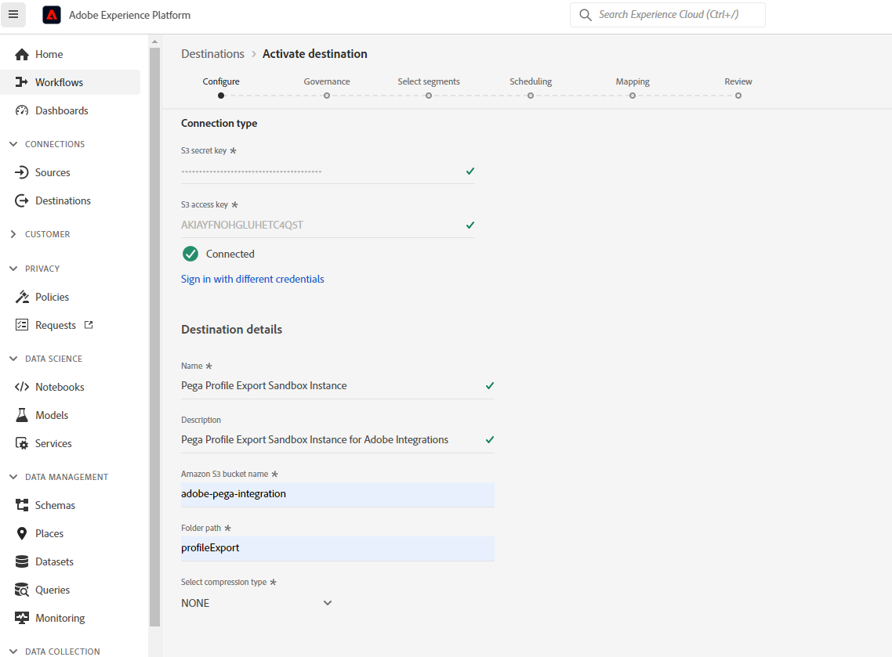

# Connettore profilo Pega

## Panoramica {#overview}

Utilizza il [!DNL Pega Profile Connector] in Adobe Experience Platform per creare una connessione in uscita al tuo [!DNL Amazon Web Services] (AWS) Archiviazione S3 per esportare periodicamente i dati del profilo in file CSV da Adobe Experience Platform nei propri bucket S3. In entrata [!DNL Pega Customer Decision Hub], è possibile pianificare processi di dati per importare questi dati profilo dall’archiviazione S3 per aggiornare [!DNL Pega Customer Decision Hub] profilo.

Questo connettore consente di configurare l’esportazione iniziale dei dati del profilo e di sincronizzare periodicamente nuovi profili in [!DNL Pega Customer Decision Hub].  La disponibilità di dati aggiornati nell’hub decisionale del cliente fornisce una visualizzazione migliore e aggiornata della base clienti per le decisioni ottimali successive.

>[!IMPORTANT]
>
>Questa pagina della documentazione è stata creata da Pegasystems. Per eventuali richieste di informazioni o aggiornamenti, contatta direttamente Pega [qui](mailto:support@pega.com).

## Casi d’uso

Per aiutarti a capire meglio come e quando utilizzare il [!DNL Pega Profile Connector] destinazione: di seguito sono riportati alcuni casi di utilizzo esemplificativi che i clienti di Adobe Experience Platform possono risolvere utilizzando questa destinazione.

### Caso d’uso 1

Un addetto al marketing vuole impostare inizialmente [!DNL Pega Customer Decision Hub] con i dati del profilo caricati da Adobe Experience Platform. Si tratta di un carico completo iniziale seguito da carichi delta su base pianificata.

### Caso d’uso 2

Un addetto al marketing desidera che i dati di profilo aggiornati di Adobe Experience Platform siano disponibili in [!DNL Pega Customer Decision Hub] che migliora continuamente le informazioni Pega sui profili dei clienti.

## Prerequisiti {#prerequisites}

Prima di poter utilizzare questa destinazione per esportare i dati da Adobe Experience Platform e importare i profili in [!DNL Pega Customer Decision Hub], assicurati di completare i seguenti prerequisiti:

* Configura [!DNL Amazon S3] bucket e percorso della cartella da utilizzare per l’esportazione e l’importazione di file di dati.
* Configurare [!DNL Amazon S3] chiave di accesso e [!DNL Amazon S3] chiave segreta: In [!DNL Amazon S3], genera un `access key - secret access key` coppia per concedere a Platform l’accesso al tuo [!DNL Amazon S3] account.
* Per connettere ed esportare correttamente i dati nel [!DNL Amazon S3] percorso di archiviazione, creare un utente di gestione delle identità e degli accessi (IAM) per [!DNL Platform] in [!DNL Amazon S3] e assegna autorizzazioni quali `s3:DeleteObject`, `s3:GetBucketLocation`, `s3:GetObject`, `s3:ListBucket`, `s3:PutObject`, `s3:ListMultipartUploadParts`
* Assicurati che le [!DNL Pega Customer Decision Hub] l’istanza è stata aggiornata alla versione 8.8 o successiva.

## Identità supportate {#supported-identities}

[!DNL Pega Customer Decision Hub] supporta l’attivazione degli ID utente personalizzati descritti nella tabella seguente. Per ulteriori dettagli, consulta [identità](/help/identity-service/namespaces.md).

| Identità di destinazione | Descrizione |
|---|---|
| *CustomerID* | Identificatore utente comune che identifica in modo univoco un profilo in [!DNL Pega Customer Decision Hub] e ADOBE EXPERIENCE PLATFORM |

{style="table-layout:auto"}

## Tipo e frequenza di esportazione {#export-type-frequency}

Per informazioni sul tipo e sulla frequenza di esportazione della destinazione, consulta la tabella seguente.

| Elemento | Tipo | Note |
|---------|----------|---------|
| Tipo di esportazione | **[!UICONTROL Basato su profilo]** | Stai esportando tutti i membri di un segmento, insieme ai campi dello schema desiderati (ad esempio: indirizzo e-mail, numero di telefono, cognome), come scelto nella schermata seleziona attributi profilo del [flusso di lavoro di attivazione della destinazione](../../ui/activate-batch-profile-destinations.md#select-attributes). |
| Frequenza di esportazione | **[!UICONTROL Batch]** | Le destinazioni batch esportano i file sulle piattaforme a valle con incrementi di tre, sei, otto, dodici o ventiquattro ore. Ulteriori informazioni su [destinazioni basate su file batch](/help/destinations/destination-types.md#file-based). |

{style="table-layout:auto"}

## Connetti alla destinazione {#connect}

>[!IMPORTANT]
> 
>Per connettersi alla destinazione, è necessario **[!UICONTROL Gestire le destinazioni]** [autorizzazione per il controllo degli accessi](/help/access-control/home.md#permissions). Leggi le [panoramica sul controllo degli accessi](/help/access-control/ui/overview.md) oppure contatta l’amministratore del prodotto per ottenere le autorizzazioni necessarie.

Per connettersi a questa destinazione, seguire i passaggi descritti in [esercitazione sulla configurazione della destinazione](../../ui/connect-destination.md). Nel flusso di lavoro di configurazione della destinazione, compila i campi elencati nelle due sezioni seguenti.

### Autentica nella destinazione {#authenticate}

Per autenticare nella destinazione, compila i campi obbligatori e seleziona **[!UICONTROL Connetti alla destinazione]**.

* **[!DNL Amazon S3]chiave di accesso** e **[!DNL Amazon S3]chiave segreta**: In [!DNL Amazon S3], genera un `access key - secret access key` coppia per concedere a Adobe Experience Platform l’accesso al tuo [!DNL Amazon S3] account. Per ulteriori informazioni, consulta [Documentazione di Amazon Web Services](https://docs.aws.amazon.com/IAM/latest/UserGuide/id_credentials_access-keys.html).

### Inserisci i dettagli della destinazione {#destination-details}

Dopo aver stabilito la connessione di autenticazione a [!DNL Amazon S3], forniscono le seguenti informazioni per la destinazione:

Per configurare i dettagli per la destinazione, compila i campi obbligatori e seleziona **[!UICONTROL Successivo]**. Un asterisco accanto a un campo nell’interfaccia utente indica che il campo è obbligatorio.

* **[!UICONTROL Nome]**: inserisci un nome che ti aiuterà a identificare questa destinazione.
* **[!UICONTROL Descrizione]**: inserisci una descrizione di questa destinazione.
* **[!UICONTROL Nome bucket]**: immetti il nome del [!DNL Amazon S3] bucket da utilizzare per questa destinazione.
* **[!UICONTROL Percorso cartella]**: immetti il percorso della cartella di destinazione che ospiterà i file esportati.
* **[!UICONTROL Tipo di compressione]**: seleziona il tipo di compressione GZIP o NONE.

>[!TIP]
>
>Nel flusso di lavoro della destinazione di connessione, puoi creare una cartella personalizzata nell’archiviazione Amazon S3 per file di pubblico esportato. Letto [Utilizzare le macro per creare una cartella nel percorso di archiviazione](/help/destinations/catalog/cloud-storage/overview.md#use-macros) per istruzioni.

### Abilita avvisi {#enable-alerts}

Puoi abilitare gli avvisi per ricevere notifiche sullo stato del flusso di dati verso la tua destinazione. Seleziona un avviso dall’elenco per abbonarti e ricevere notifiche sullo stato del flusso di dati. Per ulteriori informazioni sugli avvisi, consulta la guida su [abbonamento agli avvisi sulle destinazioni tramite l’interfaccia utente](../../ui/alerts.md).

Una volta completate le informazioni sulla connessione di destinazione, seleziona **[!UICONTROL Successivo]**.

## Attiva il pubblico in questa destinazione {#activate}

>[!IMPORTANT]
> 
>Per attivare i dati, è necessario **[!UICONTROL Gestire le destinazioni]**, **[!UICONTROL Attivare le destinazioni]**, **[!UICONTROL Visualizza profili]**, e **[!UICONTROL Visualizzare segmenti]** [autorizzazioni di controllo degli accessi](/help/access-control/home.md#permissions). Leggi le [panoramica sul controllo degli accessi](/help/access-control/ui/overview.md) oppure contatta l’amministratore del prodotto per ottenere le autorizzazioni necessarie.

Consulta [Attivare i dati del pubblico nelle destinazioni di esportazione del profilo batch](../../ui/activate-batch-profile-destinations.md) per istruzioni sull’attivazione dei tipi di pubblico in questa destinazione.

### Mappare attributi e identità {#map}

In **[!UICONTROL Mappatura]** fase, puoi selezionare l’attributo e i campi di identità da esportare per i profili. Puoi anche scegliere di modificare le intestazioni nel file esportato con qualsiasi nome descrittivo. Per ulteriori informazioni, vedere [passaggio di mappatura](/help/destinations/ui/activate-batch-profile-destinations.md#mapping) nell’esercitazione dell’interfaccia utente attiva destinazioni batch.

## Convalidare l’esportazione dei dati {#exported-data}

Per [!DNL Pega Profile Connector] destinazioni, [!DNL Platform] crea un `.csv` nel percorso di archiviazione Amazon S3 fornito. Per ulteriori informazioni sui file, consulta [Attivare i dati del pubblico nelle destinazioni di esportazione del profilo batch](../../ui/activate-batch-profile-destinations.md) nell’esercitazione di audience activation.

In caso di esito positivo, l’importazione dei dati del profilo da S3 inserisce i dati nel [!DNL Pega Customer] archivio dati profilo. I dati importati del profilo cliente possono essere convalidati in [!DNL Pega Customer Profile Designer] , come illustrato nella figura riportata di seguito.

In entrata [!DNL Pega Customer Decision Hub], gli amministratori di dati possono configurare i processi di dati in [!DNL Customer Profile Designer] per importare periodicamente i dati di profilo da S3, come illustrato nella figura riportata di seguito. Consulta la [risorse aggiuntive](#additional-resources) per ulteriori informazioni su come configurare processi di dati per importare dati di profilo da [!DNL Amazon S3].

## Risorse aggiuntive {#additional-resources}

Consulta [Importa processi dati](https://academy.pega.com/topic/import-data-jobs/v1) in [!DNL Pega Customer Decision Hub].

## Utilizzo dei dati e governance {#data-usage-governance}

Tutti [!DNL Adobe Experience Platform] le destinazioni sono conformi ai criteri di utilizzo dei dati durante la gestione dei dati. Per informazioni dettagliate su come [!DNL Adobe Experience Platform] applica la governance dei dati, consulta la sezione [Panoramica sulla governance dei dati](/help/data-governance/home.md).
