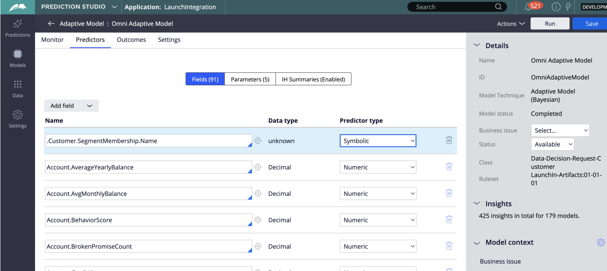

# Connessione Pega Customer Decision Hub

## Panoramica {#overview}

Utilizza il [!DNL Pega Customer Decision Hub] destinazione in Adobe Experience Platform per inviare gli attributi del profilo e i dati di iscrizione del pubblico a [!DNL Pega Customer Decision Hub] per le decisioni sulle azioni migliori successive.

Iscrizione al pubblico di profilo da Adobe Experience Platform, quando caricato in [!DNL Pega Customer Decision Hub], può essere utilizzato come predittore nei modelli adattivi e contribuire a fornire i dati contestuali e comportamentali giusti per le decisioni che richiedono un’azione successiva.

>[!IMPORTANT]
>
>Il connettore di destinazione e la pagina della documentazione vengono creati e gestiti da Pegasystems. Per eventuali richieste di informazioni o aggiornamenti, contatta direttamente Pega [qui](mailto:support@pega.com).

## Casi d’uso

Per aiutarti a capire meglio come e quando utilizzare il [!DNL Customer Decision Hub] destinazione: di seguito sono riportati alcuni casi di utilizzo esemplificativi che i clienti di Adobe Experience Platform possono risolvere utilizzando questa destinazione.

### Telecomunicazioni

Un addetto al marketing vuole sfruttare le informazioni provenienti da azioni ottimali basate su modelli di data science fornite da [!DNL Pega Customer Decision Hub] per il coinvolgimento dei clienti. [!DNL Pega Customer Decision Hub] dipende fortemente dalle intenzioni del cliente, ad esempio &quot;Interested_In_5G&quot;, &quot;Interested_in_Unlimited_Dataplan&quot; o &quot;Interest_in_iPhone_accessories&quot;.

### Servizi finanziari

Un addetto al marketing desidera ottimizzare le offerte per i clienti che hanno effettuato o annullato l’abbonamento alle newsletter del piano pensionistico o del piano pensionistico. Le società di servizi finanziari possono acquisire più ID cliente dai propri CRM in Adobe Experience Platform, creare tipi di pubblico dai propri dati offline e inviare profili che entrano ed escono dai tipi di pubblico a [!DNL Pega Customer Decision Hub] per le decisioni NBA (Next-Best-Action) nei canali in uscita.

## Prerequisiti {#prerequisites}

Prima di poter utilizzare questa destinazione per esportare i dati da Adobe Experience Platform, assicurati di aver soddisfatto i seguenti prerequisiti in [!DNL Pega Customer Decision Hub]:

* Configurare [Componente di integrazione profilo Adobe Experience Platform e appartenenza a pubblico](https://docs.pega.com/component/customer-decision-hub/adobe-experience-platform-profile-and-segment-membership-integration-component) nel tuo [!DNL Pega Customer Decision Hub] dell&#39;istanza.
* Configurare OAuth 2.0 [Registrazione client tramite credenziali client](https://docs.pega.com/security/87/creating-and-configuring-oauth-20-client-registration) tipo di concessione nel tuo [!DNL Pega Customer Decision Hub] dell&#39;istanza.
* Configura [flusso di dati in tempo reale](https://docs.pega.com/decision-management/87/creating-real-time-run-data-flows) ad Adobe il flusso di dati di iscrizione al pubblico nel tuo [!DNL Pega Customer Decision Hub] dell&#39;istanza.

## Identità supportate {#supported-identities}

[!DNL Pega Customer Decision Hub] supporta l’attivazione degli ID utente personalizzati descritti nella tabella seguente. Per ulteriori dettagli, consulta [identità](/help/identity-service/namespaces.md).

| Identità di destinazione | Descrizione |
|---|---|
| *CustomerID* | Identificatore utente comune che identifica in modo univoco un profilo in [!DNL Pega Customer Decision Hub] e ADOBE EXPERIENCE PLATFORM |

{style="table-layout:auto"}

## Tipo e frequenza di esportazione {#export-type-frequency}

Per informazioni sul tipo e sulla frequenza di esportazione della destinazione, consulta la tabella seguente.

| Elemento | Tipo | Note |
---------|----------|---------|
| Tipo di esportazione | **[!UICONTROL Basato su profilo]** | Esporta tutti i membri di un pubblico con l’identificatore (*CustomerID*), attributi (cognome, nome, posizione, ecc.) e i dati di iscrizione al pubblico. |
| Frequenza di esportazione | **[!UICONTROL Streaming]** | Le destinazioni di streaming sono connessioni sempre basate su API. Non appena un profilo viene aggiornato in Experienci Platform, in base alla valutazione del pubblico, il connettore invia l’aggiornamento a valle alla piattaforma di destinazione. Per ulteriori informazioni, consulta [destinazioni di streaming](/help/destinations/destination-types.md#streaming-destinations). |

{style="table-layout:auto"}

## Connettersi alla destinazione {#connect}

Per connettersi a questa destinazione, seguire i passaggi descritti in [esercitazione sulla configurazione della destinazione](../../ui/connect-destination.md). Nel flusso di lavoro di configurazione della destinazione, compila i campi elencati nelle due sezioni seguenti.

### Autenticarsi nella destinazione {#authenticate}

#### Autenticazione credenziali client OAuth 2 {#oauth-2-client-credentials-authentication}

Compila i campi seguenti e seleziona **[!UICONTROL Connetti alla destinazione]**:

* **[!UICONTROL URL token di accesso]**: URL del token di accesso OAuth 2 sul tuo [!DNL Pega Customer Decision Hub] dell&#39;istanza.
* **[!UICONTROL ID client]**: OAuth 2 [!DNL client ID] che hai generato in [!DNL Pega Customer Decision Hub] dell&#39;istanza.
* **[!UICONTROL Segreto client]**: OAuth 2 [!DNL client secret] che hai generato in [!DNL Pega Customer Decision Hub] dell&#39;istanza.

### Inserire i dettagli della destinazione {#destination-details}

Dopo aver stabilito la connessione di autenticazione al [!DNL Pega Customer Decision Hub], forniscono le seguenti informazioni per la destinazione:

Per configurare i dettagli per la destinazione, compila i campi obbligatori e seleziona **[!UICONTROL Successivo]**.

* **[!UICONTROL Nome]**: nome con cui riconoscerai questa destinazione in futuro.
* **[!UICONTROL Descrizione]**: descrizione che ti aiuterà a identificare questa destinazione in futuro.
* **[!UICONTROL Nome host]**: nome host Pega Customer Decision Hub in cui il profilo viene esportato come dati json.

## Attivare tipi di pubblico in questa destinazione {#activate}

>[!IMPORTANT]
> 
>* Per attivare i dati, è necessario **[!UICONTROL Visualizza destinazioni]**, **[!UICONTROL Attivare le destinazioni]**, **[!UICONTROL Visualizza profili]**, e **[!UICONTROL Visualizzare segmenti]** [autorizzazioni di controllo degli accessi](/help/access-control/home.md#permissions). Leggi le [panoramica sul controllo degli accessi](/help/access-control/ui/overview.md) oppure contatta l’amministratore del prodotto per ottenere le autorizzazioni necessarie.
>* Per esportare *identità*, è necessario **[!UICONTROL Visualizza grafico delle identità]** [autorizzazione per il controllo degli accessi](/help/access-control/home.md#permissions).   {width="100" zoomable="yes"}

Consulta [Attivare i dati del pubblico nelle destinazioni di esportazione del profilo di streaming](../../ui/activate-streaming-profile-destinations.md) per istruzioni sull’attivazione dei tipi di pubblico in questa destinazione.

### Attributi di destinazione {#attributes}

In [[!UICONTROL Seleziona attributi]](../../ui/activate-streaming-profile-destinations.md#select-attributes) , l&#39;Adobe consiglia di selezionare un identificatore univoco dal [schema di unione](../../../profile/home.md#profile-fragments-and-union-schemas). Seleziona l’identificatore univoco e tutti gli altri campi XDM da esportare nella destinazione.

### Esempio di mappatura: attivazione degli aggiornamenti del profilo in [!DNL Pega Customer Decision Hub] {#mapping-example}

Di seguito è riportato un esempio di corretta mappatura identità durante l’esportazione di profili in [!DNL Pega Customer Decision Hub].

Selezione dei campi di origine:

* Seleziona un identificatore (ad esempio: CustomerID) come identità di origine che identifica in modo univoco un profilo in Adobe Experience Platform e [!DNL Pega Customer Decision Hub].
* Seleziona le modifiche dell’attributo del profilo di origine XDM da esportare e aggiornare in [!DNL Pega Customer Decision Hub].

Selezione dei campi di destinazione:

* Seleziona la `CustomerID` spazio dei nomi come identità di destinazione.
* Seleziona i nomi degli attributi del profilo di destinazione da mappare agli attributi del profilo di origine XDM corrispondenti.

## Dati esportati / Convalida esportazione dati {#exported-data}

In caso di esito positivo, l’iscrizione al pubblico per un profilo inserirebbe l’identificatore del pubblico, il nome e gli stati nell’archivio dati di iscrizione al pubblico di marketing Pega. I dati di iscrizione sono associati a un cliente che utilizza Customer Profile Designer in [!DNL Pega Customer Decision Hub], come illustrato di seguito.

I dati sull’iscrizione del pubblico vengono utilizzati nei criteri di coinvolgimento di Pega Next-Best-Action Designer per le decisioni sulle migliori azioni successive, come illustrato di seguito.

I campi dati di iscrizione del pubblico del cliente vengono aggiunti come predittori nei modelli adattivi, come mostrato di seguito.

## Risorse aggiuntive {#additional-resources}

Consulta [Configurazione della registrazione client OAuth 2.0](https://docs.pega.com/security/87/creating-and-configuring-oauth-20-client-registration) in [!DNL Pega Customer Decision Hub].

Consulta [Creazione di un’esecuzione in tempo reale per i flussi di dati](https://docs.pega.com/decision-management/87/creating-real-time-run-data-flows) in [!DNL Pega Customer Decision Hub].

Consulta [Gestire i record dei clienti in Progettazione profili cliente](https://docs.pega.com/whats-new-pega-platform/manage-customer-records-customer-profile-designer-86).

## Utilizzo dei dati e governance {#data-usage-governance}

Tutti [!DNL Adobe Experience Platform] le destinazioni sono conformi ai criteri di utilizzo dei dati durante la gestione dei dati. Per informazioni dettagliate su come [!DNL Adobe Experience Platform] applica la governance dei dati, consulta la sezione [Panoramica sulla governance dei dati](/help/data-governance/home.md).
